# Actors Experiments

This is the sole Actors experiment entrypoint and owner of shared track metadata, navigation, dependency overview and conditional research portfolio. Individual EXP records own one question, decision and its necessary evidence; do not create separate track maps or retrospective archives.

| Field | Value |
| --- | --- |
| Track ID | actors |
| Status | Active |
| Scope owner | DEOS Actors physical execution, storage, scheduling, and control topology |
| Depends on tracks | None |

## Scope and Boundary

- `Owns`: Actor Contract and Step representation, hot/cold state, run state, FIFO and temporal topology, detector/fanout geometry, block service, resource allocation, and executor lowering.
- `Excludes`: Normative Actor semantics, adapter-internal execution architecture, Router-internal route selection, open work, and experiment results.

## Governing Invariants

- Preserve deterministic semantics, strict FIFO, one causal hop per block, atomic Step effects, User/System neutrality, bounded state, component-wise Weight, No Ceiling Tax, and production Weight soundness.
- Governing contracts remain in `template/pallets/actors/docs/specification.en.md`, `docs/actors-resource-policy.specification.en.md`, and `docs/actors-performance-assurance.specification.en.md`.

## Accepted Physical Baseline

- Current 0.7.25 physical baseline: [EXP-0025](./EXP-0025.md), Accepted with decision scope physical architecture only; **C1 PHYSICAL GEOMETRY: FROZEN**. Production Weight, bindings, throughput and release Geometry Freeze remain separate gates.
- The 0.7.24 Actors baseline combines [EXP-0016](./EXP-0016.md) C6 Contract geometry, [EXP-0013](./EXP-0013.md) loaded-state reuse through one-Step planning and commit, and [EXP-0010](./EXP-0010.md) compact Observation activation. Complete renewed evidence binds the P32 runtime profile; [EXP-0001](./EXP-0001.md) preserves the rejected 0.7.23 throughput hypothesis as historical evidence.

## 0.7.26 Bounded Comparative Campaign

The 0.7.26 campaign admits one comparative selection decision against sealed C1: whether one bounded **ObservationCrossing materialization** candidate is selected, rejected, or established as a limitation. The release-facing freeze lives in `BACKLOG.md` under Frozen Campaign Scope and Regression Policy; this track owns its experiment realization:

- `First Crossing decision`: [EXP-0105](./EXP-0105.md) owns the admission side of the selection decision — the finite candidate set, its selection order and its finite stopping condition — while each candidate's outcome class is sealed by its own P4 comparison Leaf and primary comparisons stay in their own Leaves.
- `Selection disposition`: [EXP-0110](./EXP-0110.md) seals the first admitted candidate as a selected efficiency improvement with the finite stopping basis named; the remaining frozen candidates stay unadmitted, and a new candidate requires a new explicit scope decision.
- `Convergence disposition`: [EXP-0111](./EXP-0111.md) confirms the selected implementation as the single retained production path with its reach and impact classification sealed; binding regeneration and final validation stay with P5.2/P5.3 and consumer-prose reconciliation with P6.2.
- `Binding disposition`: [EXP-0112](./EXP-0112.md) binds cohort A on the converged tree: the pinned `9ce37ade…` Actors Weight is retained after two fresh full-pallet generations proved environment-dominated and inadmissible, the production Wasm is rebound to the candidate tree, metadata and all other consumer artifacts are verified unchanged, and observation evidence is refreshed for the new Wasm identity; final production-cohort validation stays with P5.3.
- `Ownership disposition`: [EXP-0113](./EXP-0113.md) qualifies the retained binding's Weight-ownership completeness: execution-path containment and no-double-charge stand, while the Crossing admission-selection control flow has no benchmarked owner until BACKLOG P5.4 closes that gap.
- `Selection-owner disposition`: [EXP-0114](./EXP-0114.md) closes the ownership gap with the dedicated `crossing_selection_probe` owner over the extracted `select_crossing_admission` arithmetic, charged exactly once per unit before the arithmetic with fail-closed affordability; the reissued binding adds the conservative focused value `1,467,000 / 0` while all existing owners stay byte-identical, and final production-cohort validation stays with P5.3.
- `Final comparison disposition`: [EXP-0115](./EXP-0115.md) reproduces the sealed released production Wasm bit-exactly from tag `v0.7.25` (no bridge cohort) and measures the same 48-member funded User Crossing-to-Transfer cohort end to end on both exact production bindings: the retained cohort completes at block 14 against released block 16 (completion horizon `12` versus `14`, Trigger→completion p95 `12` versus `14`) with exactly-once materialization, `S = A = 48`, zero censoring and zero faults on both sides. Accepted: the complete declared P5.3 regression set also conforms on the retained binding after the exact-Wasm profiles were rebound from the released artifact to the tree's accepted production identity (`66308dd0…`, test-only), so the end-to-end improvement classification is sealed and P5 closes.
- `Campaign disposition`: [EXP-0116](./EXP-0116.md) terminates the finite campaign as an adopted efficiency improvement on the funded User Crossing workload, separates the frontier into resource-efficiency, service-improvement, explicit-tradeoff and negative-finding results, retains the non-dominated alternatives, and justifies the `0.7.26` checkpoint release; public-truth reconciliation and final-tree assurance stay with P6.2/P6.3.
- `Bounded exploration and measurement allowance`: one causal cost model, one constraint reconciliation, and one candidate set frozen before candidate measurement; at most one shared-hot-path candidate active at a time; the [fixed comparison matrix](#fixed-comparison-matrix-0726-p2) bounds measurement.
- `Acceptable tradeoff dimensions`: component-wise resource shift, persistent state and lifecycle cost, latency and service-gap distribution, specialization/portability boundary, and bounded complexity; semantic guarantees remain non-tradable.
- `Protected comparisons`: [EXP-0025](./EXP-0025.md) C1 physical geometry and the [pinned released-cohort production identity](#pinned-released-cohort-v0725) stay fixed; the primary funded User Crossing-to-Transfer workload with its matched controls compares under one workload, semantic-contract, resource-policy, host/artifact, and measurement identity.
- `Stop conditions`: declared materiality met, obligation satisfied, remaining delta below materiality, bottleneck moved, or candidate set exhausted; candidate-set exhaustion or all-candidate failure closes the campaign as a no-optimization research result.
- `Finding routing`: a correctness blocker returns to its owning specification or pallet; decision-required evidence joins the decision record; independent future research returns to the [Conditional Residual Entry Contracts](#conditional-residual-entry-contracts) or needs a new scope decision.

## Pinned Released Cohort (v0.7.25)

The [0.7.26 campaign](#0726-bounded-comparative-campaign) holds this released production cohort as its fixed reference before any candidate measurement. Each row below binds one comparison dimension; changing one requires an explicitly labelled bridge rather than a silent substitution.

| Dimension | Exact identity | Provenance and reproduction |
| --- | --- | --- |
| Released source | Tag `v0.7.25` = commit `e449d20fd57aff48945663d974d0d4e8f0faffeb` | `git rev-parse v0.7.25^{commit}`; the released tree carries the Weight, metadata and bounds below |
| Actor semantic contract | `template/pallets/actors/docs/specification.en.md` SHA-256 `6282afc762fbeba4f1741cd93e7dc16fd28ff96a157523c0f62f323bbd50705d` | Committed at the released commit; campaign preparation does not touch it |
| Production Actors Weight | `template/runtime/src/weights/pallet_deos_actors.rs` SHA-256 `9ce37ade391a29d4f60779f1887ad242dfeb4919d25cf0047ffba85d18f33901` | Generated by `scripts/benchmarks.sh --min-duration 0 pallet_deos_actors` at 50 steps × 20 repeats; [EXP-0095](./EXP-0095.md) |
| Production runtime Wasm | `deos_runtime.compact.compressed.wasm` SHA-256 `25b9695fd9e900f17ae1f3fb0b815ac1403830264d9c31f7cee54e29f434b700` | Rebuild with `scripts/03-build-runtime.sh` on the pinned toolchain; gap `R1` applies |
| Runtime metadata | `web-client/.papi/metadata/deos.scale` SHA-256 `75868ea75fd85e7b79db12650a7407e89e249f5564b2157d55ac46cd26cb5d12` | Committed at the released commit; export with `scripts/export-papi-metadata.sh` |
| PAPI descriptor manifest | `web-client/.papi/descriptors/generated.json` SHA-256 `84aafcbb7b65f3dc01d307efd94f585e5b5b645ed146e644b7674590320b4505` | Regenerated from the pinned metadata with `npm run papi:generate`; not tracked |
| Toolchain and locked graph | `template/rust-toolchain.toml` Rust `1.94.1` SHA-256 `65c209bb7f6bb23e50e17220955aa8f818e55973436ea7dc93e1cb7ec5afe37e`; `template/Cargo.lock` SHA-256 `b8f1a3665f555071c1fc339a73999f8af2361d7586fa737e409f89939c53c8e9` | Committed at the released commit; campaign preparation moves neither |
| Runtime parameter bounds | `template/runtime/src/configs/actor_config.rs` SHA-256 `a44f7ff60b28bcbd8e86f65e5ed7a52eac51f8928e7c5d0936d457693e15d0cf`; `docs/actors-resource-policy.specification.en.md` at the released commit | The released commit owns every value; the campaign's objective-language change alters no bound |
| Fixture behavior | `scripts/actors-assurance.sh` SHA-256 `3662e2794cb77aeed4301f7bc0d4e47d2e31e691e8a8d8936f3ab76a5d0a48da`; declared heavy/integrated profiles and runtime test sources at the released commit | Campaign preparation edits only the harness help wording in one hunk; no profile behavior changes |
| Current released evidence | [EXP-0025](./EXP-0025.md) frozen C1 and the accepted C1 production-evidence cohort through EXP-0102 on the [EXP-0095](./EXP-0095.md) binding, including the [EXP-0066](./EXP-0066.md) constraint Synthesis | Statuses, scopes and limitations stay in the [experiment index](#experiment-index) and each record's Validity section |
| Released domain constraints | 9,000 User Crossing members per feed; at most 400 of the 10,000 required candidates materialized inside the 100-block window on the released derived mean of four candidates/block, and at most 800 on the executed ceiling of eight; sustained required-population fairness unsupported | [EXP-0087](./EXP-0087.md), [EXP-0091](./EXP-0091.md), [EXP-0101](./EXP-0101.md), [EXP-0102](./EXP-0102.md), [EXP-0103](./EXP-0103.md) |

**Reuse rule.** A released result is reusable only while its recorded workload/outcome semantics, semantic contract, resource policy, host/configuration, artifact identity and measurement method still apply. Campaign preparation changes only campaign-policy prose and harness help wording, so no runtime source, Weight, Wasm, metadata, toolchain, lockfile or profile behavior moved. Invalidated, superseded and historical-scope records stay excluded by their index status; the replaced [EXP-0065](./EXP-0065.md) binding and the explicitly historical EXP-0080 proof scope are examples, not exceptions. Rerun only an absent, inapplicable or comparison-critical witness, and bind the new run to its own exact identity.

**Evidence gaps.** All other dimensions above are exact. These gaps are declared now instead of being discovered during measurement:

- `R1 — baseline binary durability`: the released production Wasm is bound by the recorded hash and a local build output that matches it, but `template/target/` is not a durable release archive. A baseline execution reuses a matching artifact or rebuilds with `scripts/03-build-runtime.sh`; when a rebuild produces different bytes it is identified as a bridge cohort instead of being presented as the released identity.
- `R2 — benchmark-runtime identity`: [EXP-0095](./EXP-0095.md) records the generation command, mode, log hash and generated Weight hash, but no separate benchmark-runtime Wasm hash. The generated Weight file remains the binding artifact; a regeneration is a labelled bridge.
- `R3 — raw run logs`: released heavy and integrated logs were local and are not durable; records retain the normalized numbers, commands and identities. A new comparison reruns its own witness rather than reconstructing old logs.
- `R4 — host fingerprint`: the released cohort carries no durable per-run hardware and cache fingerprint. Deterministic counts and generated/model resource evidence are the comparison basis; any wall-clock claim requires a fresh matched run with recorded host conditions.

## Fixed Comparison Matrix (0.7.26 P2)

The campaign's bounded comparison suite is fixed here before any candidate result: fixture identity, success and typed-failure semantics, eligibility, horizon, and required versus conditional profiles. It is a coverage map, not the Cartesian product of every family. Every run binds the [pinned released cohort](#pinned-released-cohort-v0725) and the BACKLOG comparison and record rules.

**Primary workload.** The funded User Crossing-to-Transfer path is the campaign's primary workload: a prefunded User Crossing occurrence materializes and its scheduled Transfer serves. End-to-end truth is the isolated native ledger plus the W6 exact-Wasm chronology; detector-scale pressure uses the flagged package load profiles; admission capacity uses the capacity regression. The funded User crossing population is exercised end-to-end at witness scale only: no funded-User crossing cohort at legal herd scale exists in the current harness, and the conditional P2.3 item stayed inert because the selected candidate's falsifiers were decided by phase-level yields, reservation containment and the capacity regression ([EXP-0110](./EXP-0110.md)); adding such a fixture now requires a new explicit scope decision.

**Legal population bounds.** At most 9,000 User Crossing members per feed, 10,000 total members per feed, and an executed mean of four Crossing candidates per block (`1`, `3` and `8` across the materialization family rotation cycle, ceiling eight) on the pinned generated Weight; [EXP-0103](./EXP-0103.md) owns the executed rate and its Actor Control root envelope, and [EXP-0104](./EXP-0104.md) owns the reservation/settlement boundaries and rotated grant that decide each executed yield. The historical 10,000-User/100-candidate construction stays refusal evidence rather than a matrix profile; [EXP-0087](./EXP-0087.md) and [EXP-0101](./EXP-0101.md) prove the separate 25× detector and 11.12% member-cap deficits on the released identity.

### Primary Workload Profiles

| Coverage role | Exact fixture identity | Population and horizon | Success and typed-failure semantics | Class |
| --- | --- | --- | --- | --- |
| Funded end-to-end path | `crossing_single_user_fire_binds_executed_detector_latch_control` | One funded User Rising Crossing and its next-block service | Exactly one occurrence, pending signal and ready ticket; exact detector/latch, service Control and Transfer effect; latch and ticket clear | Required |
| Exact-Wasm chronology | `--integrated-w6-mixed-arrival-lifecycle` (`full_executive_w6_mixed_arrival_lifecycle_campaign_replays_exact_production_wasm`, W6 Actor 27) | One generation-replaced User crossing Actor; 16 linked finalized blocks | Generation-2 Crossing materializes exactly once and its Transfer services exactly once; the stale generation performs no Actor work | Required |
| Admission capacity | `crossing_capacity_policy_is_bound_to_measured_minimum_progress_and_explicit_horizons` | 9,000 User and 10,000 total members per feed; 2,250/2,500-block uncontended horizons | Four Crossing candidates per block under component-wise admission; beyond-capacity refusal stays explicit typed behavior | Required |
| Executed materialization rate | `crossing_prepass_materialization_rate_follows_the_materialization_family_rotation` ([EXP-0103](./EXP-0103.md)) | 48 equal-threshold funded User crossings on one feed; 13 linked prepass blocks | Deterministic 1/3/8 rotation cycle repeated four times, exactly-once materialization, per-block yield at or below `MaxCrossingTransitionsPerBlock` | Required |
| Detector-scale pressure | `--exact-heavy-profile crossing_scale_10k_zero_match_small_cohort_and_maximum_herd`; `--exact-heavy-profile crossing_mixed_dense_sparse_directional_lifecycle_profile` | 10,000 detector members with 8 matched; dense/sparse directional lifecycle | The profile's declared deterministic convergence and completion assertions; no dropped wakeups and no stale execution | Required |
| Mixed crossing/fanout boundary | `--exact-heavy-profile breaker_materializes_maximum_mixed_wakeup_crossing_and_broad_fanout_without_execution_loss` | Maximum mixed wakeup Crossing plus broad fanout | Crossing and broad deferral compose without execution loss | Conditional: activate only for a candidate claiming shared cause across both paths |

### Matched Controls and Demand Modes

| Coverage role | Exact fixture identity | Population and horizon | Success and typed-failure semantics | Class |
| --- | --- | --- | --- | --- |
| Manual and Cadenced schedules | `--integrated-w2-schedules` (`full_executive_w2_manual_and_cadenced_only_100_block_campaigns_replay_exact_production_wasm`) | 15 reference identities plus 9,985 workload Actors; 100 linked blocks each | Zero failures; Q1 in every full block; per-schedule counts fixed against the reference horizon | Required |
| Opening and Contract length | `--integrated-w3-opening-matrix` (`full_executive_w3_opening_predicate_mixed_length_campaign_replays_exact_production_wasm`) | 0/2/4 Opening predicates × 1/2/3 Steps, 14 repetitions per cell, to completion | 126 Cycles and 252 ordered Steps across cells; Opening, middle and final Steps attributed separately | Required |
| Actor-only and valid external demand | `--integrated-w0-w1` (preparation), `--integrated-w1-actor-only`, `--integrated-w1-continuous-user`, `--integrated-w9-resource-independence` | 15 reference identities plus 9,985 workload Actors over 100 linked blocks; W9 100-due frontier under Actor-only, proof-saturated valid remarks and RefTime-heavy valid Router demand | Preparation covers actor-only and valid-user demand; equal Actor service and accounting across modes; first inadmissible valid call recorded; W9 fallback explicit | Required |
| Heterogeneous effects | `--integrated-w4-heterogeneous-effects` (Actor-only and continuous valid-user) | 9,485 Transfer, 400 Router SwapOut and 100 StopCycle Actors; 100 linked blocks | Zero non-successful Steps; Q1 in every full block; exact per-effect counts | Required |
| Liquidity-heavy effect | `system_actor_executes_native_staking_lp_donation_task` plus the 100-Actor homogeneous `DonateLiquidity` continuation | One contained donation and its capacity-first stop | Complete effect ownership and component-wise containment; the 12-of-100 frontier and its binding component reported | Required |
| Burn effect | `burn_actor_burns_native_on_address_event`; `router_oracle_burn_success_path_commits_once_without_scheduler_or_reward_residue`; `burn_actor_swaps_foreign_to_native_then_burns_via_updated_plan`; `router_fee_routing_notifies_burn_actor_via_runtime_ingress_adapter`; `Task::Burn` funding and weight unit witnesses | Unit and integration boundary | Exact burn effect, funding precedence and independent weight class | Required coverage; a heavy 100-block Burn Actor workload is not constructible from the current harness and stays a declared gap |

### Guards

| Coverage role | Exact fixture identity | Population and horizon | Success and typed-failure semantics | Class |
| --- | --- | --- | --- | --- |
| Lifecycle, retry and cleanup | `--integrated-w5-lifecycle-retry-cleanup` (native and exact-Wasm) | Five-Actor Manual matrix over 10 blocks | Zero-Step, Opening/middle/final Running, retry exhaustion, productive cleanup, minimal apoptosis and uncompensated committed prefix stay exact | Required |
| Continuation and due frontier | `--integrated-w7-due-only-active-frontier` | 100 due Actors among 10,000 identities (4,943 future, 4,942 unsignaled, 15 reference); 10 blocks | Exact FIFO/Q1 throughput and complete-attempt Control frontier independent of the non-due population | Required |
| Churn and tombstone prefix | `--integrated-w8-tombstone-prefix-chunk-pressure` | Closed-Actor prefixes 1/4/8/16/32/64/128 ahead of 100 due Manual Actors | Each block reclaims the exact prefix, preserves the live committed prefix and stops only at the Actor Control frontier | Required |
| Phase attribution | `--integrated-control-attribution` | Matched 100-Actor Manual and cadence-one fixtures over nine linked blocks | Mandatory Prepass versus final Control stays separate; temporal materialization cannot service work past the captured FIFO cutoff | Required |
| Funded fee path | `--integrated-funded-user-action` | Funded User Action monetary and resource pair | Fee mapping occurs exactly once at its declared owner | Required |
| Production identity | `--production-reference-replay` (`reference_full_block_replays_in_production_wasm_with_verified_storage_proof`) | One production reference block | Exact production-Wasm replay with verified storage proof | Required |
| Underfunded crossing refusal | `underfunded_crossing_fire_advances_without_readiness_or_peer_cursor_loss` | One insolvent User beside a funded peer | Underfunded fire advances without readiness or peer cursor loss; refusal stays typed and non-blocking | Required |
| Queue stress and fairness matrices | `--exact-heavy-profile stress_10k_actors_queue_scheduler`; `scheduler_stress_fifo_over_capacity_fairness_matrix`; `scheduler_stress_fifo_dense_vs_sparse_topology_matrix`; `scheduler_stress_fifo_sparse_topology_long_run_liveness`; `checkpoint_a_s6_dense_10k_wakeups_converge_without_drops` | As declared by each heavy profile | Each profile's declared FIFO/fairness/convergence assertions | Conditional: activate only when the candidate changes scheduler, detector or occupancy topology |
| First-traversal load profiles | `--exact-heavy-profile control_only_10k_manual_and_reactive_first_traversal`; `transfer_10k_*`; `swapout_10k_*`; `mixed_9500_transfer_400_swapout_100_control_first_traversal`; `next_block_*_herd_*` | As declared by each runtime heavy profile | Each profile's declared attribution and convergence assertions | Conditional: activate only for a candidate whose ownership change maps to that family |
| State-footprint profiles | `--exact-heavy-profile maximum_dormant_identity_population_adds_no_idle_scan`; `profile_contract_geometry_state_footprint` | Declared dormant population and Contract geometry | No idle scan from dormant identities; declared geometry footprint | Conditional: activate when the candidate changes persistent state geometry |

**Matrix rules.**

- A matrix run uses its owning project entrypoint: integrated cohorts through `scripts/actors-assurance.sh --integrated-*`, heavy profiles through `--exact-heavy-profile` or the full gate, and isolated witnesses through their owning `deos-runtime` test name. Raw ad-hoc commands are not matrix identities.
- Required profiles are in scope for a candidate comparison; P4.3 selects the minimum decision-bearing subset inside the required set, and a row whose owning domain the candidate does not touch stays reusable under the [reuse rule](#pinned-released-cohort-v0725).
- Success is the profile's deterministic assertion set. Reported counts and resource numbers keep `S` and `A` separate, keep reservation, settlement and proof distinct, and never substitute for a failed assertion.
- The retired `10,000`/`100` horizon is reported for continuity and never gates a candidate; capacity, funding and stale-generation refusals are expected typed semantics, not failures.
- Occupancy (`--exact-heavy-profile profile_scheduler_queue_wakeup_occupancy_10k`) stays a repository assurance gate outside the matrix; `profile_scheduler_wallclock_matrix` stays diagnostic and is never a comparison.

## 0.7.26 Phase 2 — Actor Resource Anatomy Campaign

Phase 2 reopens `0.7.26` for one additional bounded campaign authorized by the user: complete the Actor resource anatomy from Checkpoint A, rank the measured bottlenecks, and select exactly one evidence-backed physical redesign. It does not reopen the completed Crossing candidate search and does not authorize repeated anatomy→optimize loops inside the release.

- `Owned sequence`: `BACKLOG.md` P7 anatomy (`P7.1`–`P7.10`) → P8 bottleneck synthesis and single-redesign selection → P9 the one redesign → P10 final binding, end-to-end comparison and release.
- `Diagnostic ownership`: one distinct causal resource claim per Leaf, one broad cost model per Synthesis; the P7.10 Resource Anatomy Synthesis owns no primary measurement, and every diagnostic number stays in its owning Leaf.
- `Measurement method`: prefer existing evidence surfaces — generated production Weight owners, per-block Actor Control/effect settlement telemetry, `ProductionThroughputDiagnostics`, the [control-attribution](#fixed-comparison-matrix-0726-p2) production-selector ledger, and recorder-backed read/proof sets — before new instrumentation; harness-only diagnostic tooling never activates Local Causal Introspection, and new runtime instrumentation requires an existing surface proven unable to answer the decision.
- `Anatomy frame`: P7.2's [Actor Machine Cost Taxonomy](#actor-machine-cost-taxonomy-0726-phase-2) is the analytical ownership surface for every P7.3–P7.10 ledger row; one production owner has exactly one class, and the frame introduces no runtime instrumentation.
- `Single-selection rule`: P8.4 freezes a finite candidate set for exactly one selected bottleneck; P9 implements only that set; set exhaustion closes the campaign as a research result, and a second redesign requires a new explicit user scope decision.
- `Protected comparisons`: frozen C1 geometry ([EXP-0025](./EXP-0025.md)), the [Checkpoint A cohort](#pinned-checkpoint-a-cohort-0726-phase-2) and the [frozen workload set](#frozen-representative-workload-set-0726-phase-2) are fixed; semantic guarantees remain non-tradable, and any changed consensus semantics leaves ordinary optimization scope and requires specification reopening.
- `Accepted evidence owners`: [EXP-0076](./EXP-0076.md) owns Ready tombstone-prefix pressure; [EXP-0078](./EXP-0078.md) and [EXP-0079](./EXP-0079.md) own temporal materialization phase and generated charge ownership; [EXP-0090](./EXP-0090.md) and [EXP-0093](./EXP-0093.md) own the open liquidity-heavy and longer-retry coverage obligations; [EXP-0016](./EXP-0016.md), [EXP-0027](./EXP-0027.md) and [EXP-0061](./EXP-0061.md) own Contract/control-cell state geometry and the rejected tail-rescan alternative.
- `Stop conditions`: declared materiality met, obligation satisfied, remaining delta below materiality, bottleneck moved, or the frozen candidate set exhausted; discovery alone never activates a redesign.

## Pinned Checkpoint A Cohort (0.7.26 Phase 2)

Phase 2 compares against **Efficiency Checkpoint A** — the sealed release-ready `0.7.26` candidate — and keeps the [released v0.7.25 cohort](#pinned-released-cohort-v0725) as historical external context only. Each row binds one comparison dimension; changing one requires an explicitly labelled bridge rather than a silent substitution.

| Dimension | Exact identity | Provenance and reproduction |
| --- | --- | --- |
| Checkpoint A evidence | Commit `e7b41c19beccf932627e94a7c565375289f69119`; reproduced by branch tip `411f2a58658c883a099d6efc26ab744ca4d7d2ce` | P6.3 candidate attestation; the tip adds documentation only above the artifact-bearing checkpoint |
| Artifact-bearing checkpoint | Commit `fb1a8b230cd4b14fd76581d363992ce3952a0bdd`, tree `66779072e0ab665dfbe2010f3595db1a3523f3b4` | Every artifact identity below holds at this tree |
| Production Actors Weight | `template/runtime/src/weights/pallet_deos_actors.rs` SHA-256 `46a89aa48b6814b0d02b3b423b99a134cc6b84f08cbb1c3dfaf4bf4074c18346` | Reissued by [EXP-0114](./EXP-0114.md); verified present when this cohort was frozen |
| Production runtime Wasm | `deos_runtime.compact.compressed.wasm` SHA-256 `77eaf5295c5bbe0713a790c36409ef0fe1d0586473b276d7ec7626a79e17ce10` | Candidate attestation; `template/target/` carries no durable archive, so an exact-Wasm row rebuilds through `scripts/03-build-runtime.sh` and labels different bytes as a bridge cohort |
| Runtime metadata | `web-client/.papi/metadata/deos.scale` SHA-256 `75868ea75fd85e7b79db12650a7407e89e249f5564b2157d55ac46cd26cb5d12` | Candidate attestation; verified present when this cohort was frozen |
| Toolchain and locked graph | Rust `1.94.1`; `template/rust-toolchain.toml` SHA-256 `65c209bb7f6bb23e50e17220955aa8f818e55973436ea7dc93e1cb7ec5afe37e`; `template/Cargo.lock` SHA-256 `b8f1a3665f555071c1fc339a73999f8af2361d7586fa737e409f89939c53c8e9` | Unchanged from the released cohort |
| Runtime parameter bounds | `template/runtime/src/configs/actor_config.rs` SHA-256 `a44f7ff60b28bcbd8e86f65e5ed7a52eac51f8928e7c5d0936d457693e15d0cf`; `docs/actors-resource-policy.specification.en.md` SHA-256 `45e79edd53bfaa41952812661b3c2577c3d5f4c023c50cd829902454034a33ba` | The tree owns every value; the freeze changes none |
| Semantic contract | `template/pallets/actors/docs/specification.en.md` SHA-256 `6282afc762fbeba4f1741cd93e7dc16fd28ff96a157523c0f62f323bbd50705d` | Unchanged from the released cohort |
| Performance contract | `docs/actors-performance-assurance.specification.en.md` SHA-256 `57d25a99a5343db881c894bb6db8d9768d99c93725953aaa4d5c604d5be81375` | Owns two-axis reporting and comparative classification |
| Harness | `scripts/actors-assurance.sh` SHA-256 `53086cfb22b87abdc78ec8bbf9430c9c4b1ff2af201a9e46bffa6d6167c301ff` | Frozen with this section; a moved harness is a labelled bridge |

## Frozen Representative Workload Set (0.7.26 Phase 2)

`BACKLOG.md` P7.1 freezes this finite set before any resource decomposition. Every row binds the [Checkpoint A cohort](#pinned-checkpoint-a-cohort-0726-phase-2) identity; the declared fixture identity is the row's only entrypoint, and its population, horizon, Contract, Trigger, funding, effect and success semantics are part of the freeze.

| ID | Workload | Exact fixture identity | Population and horizon | Contract, Trigger, funding, effect | Success semantics |
| --- | --- | --- | --- | --- | --- |
| A | Manual → Transfer | `--integrated-w2-schedules` → `full_executive_w2_manual_and_cadenced_only_100_block_campaigns_replay_exact_production_wasm`, Manual-only arm | 15 reference System identities (3 active) plus 9,985 one-Step workload Actors; 100 linked blocks; Actor-only demand | Manual schedule and manual trigger; 1,000 ED per System Actor; one-Step native Transfer of 1 ED to BOB | Q1 in every full block, saturated queue, zero non-successful Steps, all Transfer outcomes successful, terminal state asserted |
| B | ObservationCrossing → Transfer | `p53_funded_crossing_cohort_fixture_completes_with_per_actor_lifecycle` and `p53_funded_crossing_cohort_replays_exact_production_wasm` | 48 funded User Crossing Actors on one feed (`8_200` registry); publication at block 2; 64-block window | Rising crossing threshold `1_500_000_000_000`, rearm `800_000_000_000`, published sample `100_000_000_000_000`; one-Step native Transfer | Exactly-once materialization, `S = A = 48`, 48 successful Transfers, 48 completed Cycles, zero censoring and faults, staged order green |
| C | Cadenced → Transfer | `--integrated-w2-schedules`, Cadenced-only arm, plus `full_executive_w6_mixed_arrival_lifecycle_fixture_handles_stale_generations` and `full_executive_w6_mixed_arrival_lifecycle_campaign_replays_exact_production_wasm` | Same 9,985-Actor population and 100 linked blocks; W6 adds 16 linked blocks | Cadenced schedule at period one; W6 adds AtTime tick deadlines, pause/resume, close-created tombstones and Crossing generation rotation | Same W2 assertion set; W6 requires generation-2 Crossing materialization exactly once, one Transfer service and no stale-generation Actor work |
| D | Retry / suspension → eventual successful Step | `temporary_oracle_capacity_failure_rolls_back_economics_and_has_one_retry_owner` | One funded User Actor per arm (`SwapOut` exact-output and `SwapIn` exact-input); blocks 2–22; Oracle capacity failure then recovery | `SwapOut` with `RetryLater { max_attempts: 3 }`, funded `1_000 * PRECISION`; Temporary suspension with complete economic rollback, then one committed Swap and observation revision 1 | Full rollback at failure (no partial pool, balance, fee, Burn Actor or reward movement), exactly one retry owner, one `SwapExecuted`, run state cleared, no duplicate effect |
| E | Ready tombstone/churn → live Manual Step | `full_executive_w8_tombstone_prefix_chunk_pressure_fixture_preserves_fifo` and `full_executive_w8_tombstone_prefix_chunk_pressure_campaign_replays_exact_production_wasm` | Legal closed-Actor prefixes `1/4/8/16/32/64/128` ahead of 100 due Manual Actors; one linked service block per prefix | One-Step native Transfer Manual Actors; tombstones created by owner close before the due population is enqueued | Exact prefix reclaim, exact live FIFO prefix service, Q1, exact queue head/tail accounting, zero non-successful Steps, live capacity retained |
| F | Representative heavy economic Task | `swapout_10k_manual_and_reactive_first_traversal` (market action) and `system_actor_executes_native_staking_lp_donation_task` (liquidity-heavy action) | F1: 10,000 Router-backed SwapOut System Actors, completion-bounded first traversal of at most 1,300 blocks. F2: 100-Actor homogeneous `DonateLiquidity` cohort in one block with its `12/100` admission frontier | F1: one-Step `SwapOut` of 1 ED through DEOS Router, 10,000 ED funded. F2: NTVE/stNTVE balanced donation with component-wise admission stop and containment | F1: complete first traversal with the declared attribution summary. F2: exact donation effect, LP supply unchanged, 12-of-100 FIFO prefix with Control and Shared Economic containment |

Support fixtures extend a workload's falsifiers without becoming independent workloads:

| Workload | Support fixture | Role |
| --- | --- | --- |
| A | `full_executive_w7_due_only_active_frontier_fixture_scales_independently` and `full_executive_w7_due_only_active_frontier_campaign_replays_exact_production_wasm` | 100 due Manual Actors among 10,000 identities; isolates due-frontier service from the non-due population |
| A, F | `control_only_10k_manual_and_reactive_first_traversal`; `transfer_10k_homogeneous_predicate_attribution` | Zero-effect control path and homogeneous 10k Transfer predicate attribution for Actor-machine versus Task-effect separation |
| B | `crossing_prepass_materialization_rate_follows_the_materialization_family_rotation`; `crossing_single_user_fire_binds_executed_detector_latch_control`; `underfunded_crossing_fire_advances_without_readiness_or_peer_cursor_loss` | Executed rotation and exactly-once materialization; single-occurrence latch binding; typed underfunded refusal |
| B | `--exact-heavy-profile crossing_scale_10k_zero_match_small_cohort_and_maximum_herd`; `--exact-heavy-profile crossing_mixed_dense_sparse_directional_lifecycle_profile` | Detector-scale pressure, activated only for a detector or materialization candidate |
| C | `full_executive_control_phase_attribution_fixture_isolates_materialization` and `full_executive_control_phase_attribution_replays_exact_production_wasm` | Matched Manual and cadence-one phase attribution and captured-cutoff deferral |
| C | `--exact-heavy-profile checkpoint_a_s6_dense_10k_wakeups_converge_without_drops` | Dense 10,000-wakeup drain convergence for temporal topology pressure |
| D | `swapout_temporary_failure_and_retry_matrix_reports_predicate_cost`; `funding_unavailable_and_retry_complete_paths_are_exact`; `full_executive_w5_lifecycle_retry_cleanup_fixture_preserves_prefixes` and its exact-Wasm counterpart; `pallet-deos-actors` `retry_later_resumes_same_cursor_without_replaying_committed_prefix` | Per-phase Temporary and Retry settlement over `0/2/4` predicates, System/User and funded/unfunded; funding-unavailable suspension; integrated retry-exhaustion, cleanup and apoptosis matrix; committed-prefix resumption |
| E | `full_executive_w6_mixed_arrival_lifecycle_fixture_handles_stale_generations`; [EXP-0076](./EXP-0076.md) | Close-created tombstones and generation churn; accepted bounded tombstone-prefix pressure evidence |
| F | `--integrated-w4-heterogeneous-effects`; `--integrated-w3-opening-matrix` | Controlled per-effect composition and Contract-length/Opening-predicate geometry for the current-Step and Contract-load map |

The set discriminates the required cost classes as follows:

| Cost class | Owning frozen workloads | Accepted evidence owner |
| --- | --- | --- |
| Source / Trigger | B, C | [EXP-0102](./EXP-0102.md), [EXP-0103](./EXP-0103.md) |
| Placement / Scheduler | A, E | [EXP-0075](./EXP-0075.md), [EXP-0076](./EXP-0076.md) |
| Actor state | A, C, D | [EXP-0016](./EXP-0016.md), [EXP-0061](./EXP-0061.md) |
| Step preparation | A, D | [EXP-0079](./EXP-0079.md) |
| Task effect | F | [EXP-0090](./EXP-0090.md) |
| Continuation | D | [EXP-0093](./EXP-0093.md) |
| Completion / lifecycle | C, D, E | [EXP-0073](./EXP-0073.md), [EXP-0086](./EXP-0086.md) |

Freeze rules:

- Every declared fixture identity resolves to exactly one test through its owning entrypoint; the assurance gate verifies resolution before execution, and raw ad-hoc commands are not workload identities.
- A run binds the Checkpoint A cohort; a fixture asserting another Wasm identity requires the rebuilt Checkpoint A artifact or becomes a labelled bridge.
- Success is the fixture's deterministic assertion set; reported counts keep RefTime, ProofSize, reads/writes, reservation and settlement distinct and never substitute for a failed assertion.
- Substituting a fixture, population, horizon or success semantics is a workload-set change that requires a labelled bridge preserving the workload class or a new explicit scope decision, recorded here before measurement.
- Workloads A–F are the required set; support fixtures are activated by the diagnostic Leaf that needs them and are not independent campaign workloads, while unlisted [matrix](#fixed-comparison-matrix-0726-p2) rows stay reusable under the existing reuse rule.
- The freeze binds identities and semantics from the sealed Checkpoint A tree; it does not claim every row was re-executed after P6.3, and a row's first Phase-2 execution establishes its run status before any ledger relies on it.

## Actor Machine Cost Taxonomy (0.7.26 Phase 2)

`BACKLOG.md` P7.2 builds one canonical analytical taxonomy for Actor-machine work so that every measured production owner enters a P7.3 frequency-weighted ledger under exactly one cost class. It is analytical ownership, not a consensus subsystem: it adds no runtime state, no Weight owner and no instrumentation. Owners are classified from their benchmarked physical scope and call-site authority, and the taxonomy never substitutes for the measured production Weight, the per-block Control/effect settlement telemetry, the control-attribution selector ledger or the recorder read/proof sets.

- `Owner universe`: the 161 methods of the `pallet_deos_actors::WeightInfo` contract declared in `template/pallets/actors/src/weights.rs` and bound by the production implementation in `template/runtime/src/weights/pallet_deos_actors.rs`; each method maps to exactly one class and appears exactly once below.
- `Completeness check`: `awk '/^pub trait WeightInfo/,/^}/' template/pallets/actors/src/weights.rs | grep -oP 'fn \K[a-z0-9_]+'` enumerates the universe; at P7.2 close the mapping carried 161 distinct owners against the same 161 production implementations.
- `Composite owners`: the attempt-envelope and service-pass rows aggregate several leaf classes. A ledger decomposes them through their leaf owners and production selector segments and never re-sums a composite together with its leaves.
- `Production selectors`: `RuntimeStepControlWeight` in `template/runtime/src/configs/actor_config.rs` composes these owners into the production maximum/actual control segments under the `DEOS_ACTOR_STEP_CONTROL_WEIGHT` / `DEOS_ACTOR_CONTROL_ACTUAL_V10` identity; a selector segment is attributed to the class of the owners it selects, never to a class of its own.
- `Weight domain`: Task/effect owners are the `UsefulActionWeight` side; every other service-path owner is `ActorMachineWeight` candidate work. The exact `BlockResourceDomain` settlement of dispatch, ingress and envelope owners is a P7.3/P7.4 ledger question resolved per invocation context, not a static claim here.
- `Run-state split`: Run-state load belongs to the control-cell/service-state probe (Actor State); Run-state persistence commits are the Continuation sub-classes.
- `Role-only sub-classes`: amount resolution, retry state and successor publication have no dedicated owner in the sealed binding; their work is embedded in the named neighboring owners and P7.3 attributes it only through those owners' measured interiors.
- `Repair rule`: a new or renamed production owner enters this taxonomy in the same change that binds it, with exactly one class chosen by physical work; an owner that cannot be placed is an explicit anatomy question, never an inferred class.

### Cost Classes and Owner Mapping

| Class | Sub-class | Physical ownership | Production owners |
| --- | --- | --- | --- |
| Source / Trigger | source ingress | Producer and direct-trigger entries that admit one event, apply funding and latch readiness before any detector traversal. | `address_event_trigger_occurrence`, `manual_trigger`, `observation_change_ingress`, `transaction_extension_ingress_base`, `transaction_extension_ingress_notify` |
| Source / Trigger | source frontier | Deferred observation fanout over dirty feeds: subscriber-page traversal and queue/wakeup placement of affected members. | `observation_fanout_base`, `observation_fanout_blocked_page`, `observation_fanout_branch_probe`, `observation_fanout_coalesced_page`, `observation_fanout_page`, `observation_fanout_terminal`, `observation_fanout_wakeup_page` |
| Source / Trigger | detector traversal | Bounded read-only Crossing indexing that advances the pending-feed cursor and seeks transition and page positions. | `crossing_search_probe`, `crossing_transition_unit`, `crossing_worker_base`, `crossing_work_probe` |
| Source / Trigger | candidate discovery | Member location and ordinary advance on a matched leaf/page before any branch decision. | `crossing_leaf_unit`, `crossing_page_unit` |
| Source / Trigger | candidate classification | Branch classification, cohort preflight and admission selection over located candidates. | `crossing_coalesced_cohort_preflight(c)`, `crossing_fire_cohort_preflight(c)`, `crossing_fire_pair_probe`, `crossing_fire_probe`, `crossing_rearm_cohort_preflight(c)`, `crossing_rearm_pair_probe`, `crossing_selection_probe`, `crossing_skip_cohort_preflight(c)`, `crossing_skip_pair_probe`, `crossing_tail_refill_probe`, `crossing_terminal_cohort_preflight(c)` |
| Source / Trigger | occurrence materialization | Family-specific occurrence consumption and source-state progression: temporal consumption, Crossing rearm/skip/fire placement and batch mutation. | `at_time_trigger_occurrence`, `cadenced_trigger_occurrence`, `crossing_coalesced_pair_unit`, `crossing_coalesced_unit`, `crossing_placed_maximum_unit`, `crossing_placed_non_tail_emptied_unit`, `crossing_placed_non_tail_trimmed_unit`, `crossing_placed_pair_unit`, `crossing_placed_unit`, `crossing_rearm_pair_unit`, `crossing_rearm_unit`, `crossing_skip_pair_unit`, `crossing_skip_unit`, `observation_change_trigger_occurrence`, `observation_crossing_trigger_occurrence` |
| Source / Trigger | worker fault | Current Crossing or fanout worker fault record and clear. | `clear_crossing_worker_fault`, `clear_observation_fanout_worker_fault`, `record_crossing_worker_fault`, `record_observation_fanout_worker_fault` |
| Placement / Scheduler | Ready publication | Canonical Ready FIFO cell append on an existing or new page; also serves successor publication. | `scheduler_paged_append_existing_page`, `scheduler_paged_append_new_page` |
| Placement / Scheduler | Waiting publication | Exact Waiting/wakeup reference registration, replacement and middle-page invalidation. | `scheduler_wakeup_append_existing_page`, `scheduler_wakeup_append_new_page`, `scheduler_wakeup_invalidate_middle_page`, `scheduler_wakeup_replace_exact` |
| Placement / Scheduler | wakeup/deadline operations | Due-deadline Waiting page drain and paged cursor min-heap operations. | `scheduler_wakeup_cursor_insert`, `scheduler_wakeup_cursor_pop_min`, `scheduler_wakeup_cursor_remove_exact`, `scheduler_wakeup_cursor_worker_future`, `scheduler_wakeup_cursor_worker_partial`, `scheduler_wakeup_cursor_worker_remove`, `scheduler_wakeup_drain_dense_boundary`, `scheduler_wakeup_drain_full_page`, `scheduler_wakeup_drain_partial_page`, `scheduler_wakeup_drain_stale_page` |
| Placement / Scheduler | queue/ticket lookup | Mixed live/tombstone queue chunk scan. | `scheduler_paged_mixed_scan(entries)` |
| Placement / Scheduler | tombstone reclamation | Bounded tombstone-prefix reclaim and head advancement. | `scheduler_paged_tombstone_drain(entries)` |
| Placement / Scheduler | FIFO-head acquisition | Exact live FIFO head consumption, preserving or deleting its page. | `scheduler_paged_consume_delete_page`, `scheduler_paged_consume_preserve_page` |
| Placement / Scheduler | cutoff handling | Block-start execution cutoff capture. | `scheduler_on_initialize_cutoff` |
| Placement / Scheduler | drain base | Fixed on_idle scheduler entry envelope. | `scheduler_on_idle_base` |
| Placement / Scheduler | materialization coordination | Per-block materialization family-rotation classification. | `materialization_coordinator_base` |
| Placement / Scheduler | service pass | Complete bounded FIFO service pass envelope (scan, admission, execution, consumption). | `scheduler_paged_execute_cheap(executions)`, `scheduler_paged_execute_cheap_mixed(executions)` |
| Placement / Scheduler | worker fault | Wakeup worker fault record and clear. | `clear_wakeup_worker_fault`, `record_wakeup_worker_fault` |
| Actor State | control-cell load | Actor control-cell and current-Step service-state probe; owns Run-state load. | `scheduler_actor_state_probe` |
| Actor State | Contract-head load | Contract head and inline Step 0 load. | `current_step_load_head` |
| Actor State | Contract-fragment load | Contract tail fragment create, load/reconstruct and close geometry. | `contract_geometry_close(chunks)`, `contract_geometry_create(chunks)`, `contract_geometry_reconstruct(chunks)`, `current_step_load_tail(steps_in_chunk)` |
| Actor State | lifecycle state | Create, activate, deactivate, pause, resume and plan-replacement lifecycle mutation. | `activate_actor`, `create_dormant_system_actor`, `create_system_actor`, `create_system_actor_at_sovereign_id`, `create_user_actor`, `create_user_actor_at_slot`, `create_user_actor_crossing_new_page`, `deactivate_actor`, `pause_actor`, `resume_actor`, `update_contract` |
| Step Preparation | Opening | Opening-time capture and traversal of snapshot, predicate-result, amount and funding facts. | `opening_max_encoded_balance_capture(predicates)`, `opening_observation_heavy_capture(observations)`, `opening_predicate_capture(predicates)`, `opening_predicate_traversal`, `opening_share_mixed_capture(entries)`, `opening_snapshot_capture(entries)`, `opening_snapshot_traversal`, `opening_target_snapshot_capture(entries)` |
| Step Preparation | step plan | Current-Step plan/authority evaluation for opening, suspended and running cursor forms. | `current_step_plan_opening_head`, `current_step_plan_running_tail(steps_in_chunk)`, `current_step_plan_suspended_head` |
| Step Preparation | predicate evaluation | Precondition evaluation component owners. | `predicate_asset_evaluation(predicates)`, `predicate_observation_heavy_evaluation(observations)`, `predicate_set_evaluation(predicates)` |
| Step Preparation | amount resolution | Embedded in Opening capture and attempt envelopes; no dedicated owner in the sealed binding. | _(none — embedded role work)_ |
| Step Preparation | funding snapshot/use | Frozen funding snapshot opening and use. | `funding_snapshot_open(assets)` |
| Step Preparation | fee preparation/collection | Ledger-only User Step fee collection and Action invocation receipt bookkeeping. | `action_invocation_receipt`, `fee_collection` |
| Step Preparation | attempt envelope | Complete Opening/Running/Suspended/refusal attempt pipelines used as atomic production-selector control segments; decomposed through their leaf owners, never re-summed with them. | `scheduler_inner_opening_complete_max(tail_chunks)`, `scheduler_inner_opening_complete_min(tail_chunks)`, `scheduler_inner_opening_failed_max(tail_chunks)`, `scheduler_inner_opening_failed_min(tail_chunks)`, `scheduler_inner_opening_progress_max(tail_chunks)`, `scheduler_inner_opening_progress_min(tail_chunks)`, `scheduler_inner_opening_retry_max(tail_chunks)`, `scheduler_inner_opening_retry_min(tail_chunks)`, `scheduler_inner_opening_user_complete_header_max`, `scheduler_inner_opening_user_complete_header_max_tail(tail_chunks)`, `scheduler_inner_running_complete(steps_in_fragment, predicates)`, `scheduler_inner_running_progress(steps_in_fragment, predicates)`, `scheduler_inner_suspended_head_complete(current_predicates)`, `scheduler_inner_suspended_head_opening_complete(current_predicates)`, `scheduler_inner_suspended_head_opening_progress(tail_opening_amount_entries, current_predicates)`, `scheduler_inner_suspended_head_opening_retry(tail_opening_amount_entries, current_predicates)`, `scheduler_inner_suspended_head_progress(tail_opening_amount_entries, current_predicates)`, `scheduler_inner_suspended_head_retry(tail_opening_amount_entries, current_predicates)`, `scheduler_inner_suspended_tail_complete(steps_in_fragment, predicates)`, `scheduler_inner_suspended_tail_progress(steps_in_fragment, predicates)`, `scheduler_inner_suspended_tail_retry(steps_in_fragment, predicates)`, `scheduler_paged_execute_opening_max`, `scheduler_paged_zero_step_user_crossing_unavailable` |
| Task | canonical economic effect | Canonical Task effect including XCM deposit; the UsefulActionWeight side of the machine/effect split. | `task_add_liquidity`, `task_burn`, `task_dex_exact_in`, `task_dex_exact_out`, `task_donate_liquidity`, `task_mint`, `task_remove_liquidity`, `task_split_transfer(legs)`, `task_stake`, `task_transfer`, `task_unstake`, `xcm_asset_deposit` |
| Task | cheap control effect | Zero-effect control Step (StopCycle). | `task_stop_cycle` |
| Continuation | cursor update | Run cursor commit and progress persistence. | `run_progress` |
| Continuation | retry state | Embedded in suspension persistence and retry attempt envelopes; no dedicated owner in the sealed binding. | _(none — embedded role work)_ |
| Continuation | suspension | Run suspension persistence. | `run_suspend` |
| Continuation | successor publication | Served by the Ready/Waiting publication owners; no dedicated owner in the sealed binding. | _(none — embedded role work)_ |
| Continuation | run completion | Run completion persistence. | `run_complete` |
| Continuation | cancellation | Run cancellation persistence. | `run_cancel` |
| Completion | Cycle finalization | Zero-Step Cycle opening/completion control cycle. | `scheduler_inner_zero_step_complete` |
| Completion | cleanup | Public close, terminal Crossing feed close and permissionless sweep cleanup. | `close_actor`, `crossing_actor_unit`, `permissionless_sweep`, `permissionless_sweep_many(batch)` |
| Completion | close/apoptosis | Custody-neutral minimal Pipeline-admission apoptosis. | `pipeline_admission_apoptosis` |
| Block Envelope | fixed context | Maximum inherent context-processing envelope. | `maximum_context_inherent` |
| Block Envelope | XCM discovery | XCM version-discovery fixed envelope. | `maximum_xcm_version_discovery` |
| Block Envelope | meter extension | Block resource meter transaction extension. | `block_resource_meter_extension` |
| Block Envelope | block finalization | Block resource finalization at block end. | `block_resource_finalize` |
| Administration | policy | Governance policy setters (global circuit breaker, active actor limit). | `set_active_actor_limit`, `set_global_circuit_breaker` |

## P7.3 Frequency-Weighted Resource Ledgers (0.7.26 Phase 2)

`BACKLOG.md` P7.3 attributes each required workload's dominant cost to production owners with measured invocation counts. This section freezes the ledger method and records the measured workload ledgers for all six frozen workloads. It is analytical evidence over the [Actor Machine Cost Taxonomy](#actor-machine-cost-taxonomy-0726-phase-2); it adds no runtime instrumentation and no new owner.

### Ledger Method

- `Evidence sources`: generated production owners in `template/runtime/src/weights/pallet_deos_actors.rs`; per-block Control/effect telemetry and proof sets from the campaign emitters; the reconciled component ledgers `ACTOR_TRANSFER_RESOURCE_LEDGER_V1`, `ACTOR_LIFECYCLE_RESOURCE_LEDGER_V1` and `EXP_0066_CONTROL_IO_LEDGER_V3`; and the production selectors `RuntimeStepControlWeight`, `wakeup_cursor_drain_branch_weight` and `materialization_coordinator_base`.
- `Reserved column`: the full generated owner weight including `T::DbWeight` reads/writes; for example `scheduler_wakeup_cursor_worker_remove` = 806_400_000 ps base + 65 reads + 35 writes = 5_931_400_000 ps with 55_857 proof, and `cadenced_trigger_occurrence` = 536_041_000 ps + 27 reads + 16 writes = 2_811_041_000 ps with 8_450 proof.
- `Settled column`: measured per-block telemetry where the production selector resolves to a single owner or a reconciled component identity; the production selector segment where the selection is a max composition; never an additive sum of a composite together with its leaves.
- `Times column`: a measured run counter (`committedSteps`, `TriggerOccurrenceProcessed`, per-block steps, coordinator blocks) or a deterministic event identity. An interior count that no existing emitter exposes stays attributed through its selecting composite with an explicit bound instead of an invented count.
- `Phase`: Prepass is the mandatory block phase, Final is settled Control after optional work; effect owners stay separate from Control owners and no ledger sums them into one score.
- `Workload binding`: every ledger run binds the [Checkpoint A cohort](#pinned-checkpoint-a-cohort-0726-phase-2) identities and the frozen workload identity; a run of other bytes is a labelled bridge, and the P7.3 evidence does not rest on a re-executed row until that row's run status is recorded.

### Workload C — Temporal Materialization Ledger (measured)

Command `DEOS_VERBOSE=1 ./scripts/actors-assurance.sh --integrated-control-attribution`; run log SHA-256 `d8a266e4f9a1760dd86b48288cfae8c0cf49f4e0dc75e7c6df9a12c42e643d48`; recorded identities source `25382b801e6686e8298b6c6b96fe4cfcc162a9edac982e5538bf9d6f4d425eac`, Wasm `77eaf5295c5bbe0713a790c36409ef0fe1d0586473b276d7ec7626a79e17ce10`, Weight `46a89aa48b6814b0d02b3b423b99a134cc6b84f08cbb1c3dfaf4bf4074c18346`, metadata `75868ea75fd85e7b79db12650a7407e89e249f5564b2157d55ac46cd26cb5d12`. Native fixture 6 s, exact-Wasm replay 88 s, gate 104 s, status 0; 100 Actors, 9 linked blocks per arm.

Measured counts, all nine blocks:

| Arm | Committed Steps | Trigger occurrences | Coordinator blocks | Final Control (ps) | Prepass share | Final proof | Execution storage proof | Compact proof | Recorded keys |
| --- | ---: | ---: | ---: | ---: | ---: | ---: | ---: | ---: | ---: |
| Manual | 100 | 0 | 9 | 246_927_527_514 | 95.78% | 3_689_904 | 236_428 | 208_278 | 1_293 |
| Cadenced | 28 | 122 | 9 | 797_071_678_868 | 98.62% | 5_494_140 | 345_164 | 316_490 | 1_776 |

Owner rows:

| Workload | Owner / selector segment | Times | Reserved (ps / proof) | Settled evidence | Phase |
| --- | --- | ---: | ---: | --- | --- |
| Manual | successful one-Step service composition (`scheduler_paged_tombstone_drain(1)`, `scheduler_actor_state_probe`, `scheduler_paged_consume_preserve_page`, `scheduler_inner_opening_user_complete_header_max`, `action_invocation_receipt`) | 100 Steps | 2_127_545_374 / 31_325 per Step | composed identity matches the measured single-Step block delta 4_528_011_122 - 2_400_465_748 = 2_127_545_374 exactly; net 225.323 B ps over the 9-block empty baseline; per-Step run average 2_253_233_358 ps | Prepass, Final delta 10.418 B ps |
| Cadenced | `scheduler_wakeup_cursor_worker_remove` + `max(at_time_trigger_occurrence, cadenced_trigger_occurrence)` (production `wakeup_cursor_drain_branch_weight`, Remove) | ≤ 122 units | 8_742_441_000 / 64_308 per Remove unit | production per-unit branch charge, upper disposition | Prepass |
| Cadenced | `scheduler_wakeup_cursor_worker_partial` + `max(at_time_trigger_occurrence, cadenced_trigger_occurrence)` (production `wakeup_cursor_drain_branch_weight`, Retain) | ≤ 122 units | 4_872_038_000 / 16_410 per Retain unit | production per-unit branch charge, lower disposition | Prepass |
| Cadenced | `materialization_coordinator_base` | 9 blocks | 375_842_000 / 5_982 per block | once per block by production selector | Prepass |
| Cadenced | temporal materialization total, 122 occurrences after the 28 service Steps | 122 | bounded by the drain-branch rows above | measured net 775.467 B ps minus 28 × 2_253_233_358 ps ≈ 712.377 B ps, i.e. ≈ 5.839 B ps per occurrence and ≈ 7.124 B ps per materialized Actor | Prepass |

Derived quantities:

| Quantity | Manual arm | Cadenced arm |
| --- | ---: | ---: |
| Control per committed Step | 2_469_275_275 ps gross; 2_253_233_358 ps net of the empty baseline; 2_127_545_374 ps exact composed service identity | 28_466_845_674 ps gross (includes temporal materialization) |
| Control per completed Cycle | 2_469_275_275 ps gross over 100 one-Step completed Cycles | not emitted by this fixture; completion identity belongs to the W2/W5/W6 fixtures |
| Control per materialized Actor | not applicable | ≈ 7_124_000_000 ps for 100 materialized Actors |
| Proof per block (final selector) | 409_989 avg | 610_460 avg |
| Recorded keys per block | 143.7 avg | 197.3 avg |

Finding for P8 consumption: on the matched 100-Actor fixture the cadenced arm spends 775.467 B ps of net Control to materialize 122 occurrences while the manual arm spends 225.323 B ps to commit 100 service Steps, and 98.62% of the cadenced charge is mandatory Prepass. The temporal drain branch is therefore the dominant measured owner family for workload C; its per-unit charge is bracketed between the Retain and Remove production branch weights. The exact Retain/Remove disposition mix is not emitted (`WakeupDrainStats` stays interior), so the ledger reports the bracket; a disposition counter is earned only if that mix changes the P8 ranking.

### Workload D — Retry / Suspension Ledger (measured)

Declared fixture `temporary_oracle_capacity_failure_rolls_back_economics_and_has_one_retry_owner` plus support fixtures `swapout_temporary_failure_and_retry_matrix_reports_predicate_cost` and `funding_unavailable_and_retry_complete_paths_are_exact`; all native, status 0; log SHA-256 `2a2ffa9bebe05021085558c6d12cd9daecdf2caf6a5a12ac4b1a60de5b3a663d`, `af28ea7fcc614547523508b82ad1959fb858854424c9989bbef7f7674811a03c`, `67f3e47604c87bba070f4865654154ae6dfd8276842b84094af98de76c5127ea`. Every cell decomposes as the `2_400_465_748 / 33_188` fixed envelope plus the `1_222_840_374 / 23_335` service scaffold (`scheduler_paged_tombstone_drain(1)` 335_663_374 / 3_111 plus `scheduler_actor_state_probe` 289_890_000 / 15_106 plus `scheduler_paged_consume_preserve_page` 597_287_000 / 5_118) plus the production selector attempt.

Measured settlement cells (System; the fixture asserts funded/unfunded control equality per Actor type, funded User resumes add exactly `fee_collection` 300_007_000 / 6_196, and every cell carries effect `task_dex_exact_out` 3_414_697_000 / 19_253):

| Predicates | Opening suspension (ps / proof) | Resumed suspension (ps / proof) |
| ---: | ---: | ---: |
| 0 | 6_162_347_980 / 88_339 | 6_526_601_980 / 90_386 |
| 2 | 6_538_208_661 / 110_565 | 6_902_462_661 / 112_612 |
| 4 | 6_656_773_584 / 115_911 | 7_021_027_584 / 117_958 |

Owner rows:

| Workload | Owner / selector segment | Times | Reserved (ps / proof) | Settled evidence | Phase |
| --- | --- | ---: | ---: | --- | --- |
| D | Opening suspension segment: `current_step_plan_opening_head` 206_297_000 / 4_968, `opening_snapshot_traversal(0)` 1_397_000, `opening_predicate_traversal(0)` 1_466_000, `funding_snapshot_open(40)` 154_473_858 / 4_531, `run_suspend` 1_511_075_000 / 5_871, `scheduler_paged_append_new_page` 659_653_000 / 16_446, `action_invocation_receipt` 4_680_000 | 1 per attempt | 2_539_041_858 / 31_816 | exact leaf sum equals `6_162_347_980 - 2_400_465_748 - 1_222_840_374`; production selector resolves `Opening/Suspended/Queue` minimal-opening | Total |
| D | Resumed suspension segment, admitted complete envelope: `current_step_plan_suspended_head` 273_132_000 / 5_707, traversals as above, `funding_snapshot_open(40)`, `run_progress` 1_529_510_000 / 6_456, `scheduler_wakeup_append_new_page` 938_637_000 / 17_169, receipt | 1 per resumed attempt | 2_903_295_858 / 33_863 | exact leaf sum equals `6_526_601_980 - 2_400_465_748 - 1_222_840_374`; identical to the EXP-0093 second-attempt settlement; selector refunds only to the admitted envelope for coupled retained sources | Total |
| D | predicate geometry: `opening_predicate_weight(2)` 125_670_136 / 9_530 then `(4)` 244_235_059 / 14_876, plus `current_predicate_weight(4)` 251_656_545 / 12_696 | per profile | as listed | measured deltas 0→2 = 375_860_681 / 22_226 and 2→4 = 118_564_923 / 5_346 close exactly; `ActorMaxPredicatesPerStep = 4` caps 8 units so the 2→4 delta carries no current-predicate term | Total |
| D | `task_dex_exact_out` | 1 per invoked attempt | 3_414_697_000 / 19_253 | equals measured effect in every cell and both Actor types; funding-unavailable suspension settles effect zero | Task effect |
| D | `fee_collection` | 1 per funded User resume | 300_007_000 / 6_196 | funded User resume = unfunded User resume plus this owner exactly | Total |

Lifecycle and read truth from the declared fixture: full economic rollback at the Temporary failure (pool, balances, Burn Actor and reward accounting unchanged), exactly one suspension, one retry owner, one committed `SwapExecuted`, cleared run state and no duplicate effect across `SwapOut` exact-output and `SwapIn` exact-input arms. Recorder read sets at resume: System 44 keys / 5_527 proof bytes, unfunded System 39 / 4_785, User 50 / 6_178, unfunded User 43 / 5_012; five System and seven User keys are invoked-only.

Finding for P8 consumption: the resumed suspension segment is exactly 364_254_000 ps above the Opening suspension segment in every predicate profile, and the whole two-attempt lattice closes leaf-exactly on generated owners; a P8 candidate touching retry persistence or attempt envelopes may rank these segments but must not invent an interior split of the admitted envelope.

### Workload E — Ready Tombstone / Churn Ledger (measured)

Command `DEOS_VERBOSE=1 ./scripts/actors-assurance.sh --integrated-w8-tombstone-prefix-chunk-pressure`; native 11 s, exact-Wasm 72 s, gate 101 s, status 0; log SHA-256 `ed7b4164a0958b46269bed0aed68ca6c27fb9e0ed78c9140049b5e04601ba9b5`; recorded identities source `25382b801e6686e8298b6c6b96fe4cfcc162a9edac982e5538bf9d6f4d425eac`, Wasm `77eaf5295c5bbe0713a790c36409ef0fe1d0586473b276d7ec7626a79e17ce10`, Weight `46a89aa48b6814b0d02b3b423b99a134cc6b84f08cbb1c3dfaf4bf4074c18346`, metadata `75868ea75fd85e7b79db12650a7407e89e249f5564b2157d55ac46cd26cb5d12`. Native and exact-Wasm rows agree in every prefix.

Exact model over all seven rows (`P` tombstone prefix, `N` serviced live one-Step Transfer Steps): control `= 12_071_296_748 + P × 335_663_374 + N × 2_127_545_374`; control proof `= 140_840 + P × 3_111 + N × 31_325`; effect `= N × 2_293_433_000` with proof `N × 29_222`.

| P | N | Control (ps / proof) | Effect (ps / proof) | Chunks touched / reclaimed | Head / tail |
| ---: | ---: | ---: | ---: | ---: | ---: |
| 1 | 14 | 42_192_595_358 / 582_501 | 32_108_062_000 / 409_108 | 1 / 0 | 15 / 101 |
| 4 | 14 | 43_199_585_480 / 591_834 | 32_108_062_000 / 409_108 | 1 / 0 | 18 / 104 |
| 8 | 13 | 42_414_693_602 / 572_953 | 29_814_629_000 / 379_886 | 1 / 0 | 21 / 108 |
| 16 | 13 | 45_100_000_594 / 597_841 | 29_814_629_000 / 379_886 | 1 / 0 | 29 / 116 |
| 32 | 11 | 46_215_523_830 / 584_967 | 25_227_763_000 / 321_442 | 1 / 1 | 43 / 132 |
| 64 | 8 | 50_574_115_676 / 590_544 | 18_347_464_000 / 233_776 | 2 / 2 | 72 / 164 |
| 128 | 1 | 57_163_753_994 / 570_373 | 2_293_433_000 / 29_222 | 4 / 4 | 129 / 228 |

Owner rows (W8 emits block totals, so rows carry the Total phase; the identical service composition resolved in Prepass in the workload C attribution):

| Workload | Owner / selector segment | Times | Reserved (ps / proof) | Settled evidence | Phase |
| --- | --- | ---: | ---: | --- | --- |
| E | `scheduler_paged_tombstone_drain(1)` | P scan units, 1..128 | 335_663_374 / 3_111 | prefix 1→4 = exactly 3 units; 8 against 4 = four units minus one Step; the seven-row model closes exactly | Total |
| E | one-Step Transfer service composition: `scheduler_paged_tombstone_drain(1)`, `scheduler_actor_state_probe`, `scheduler_paged_consume_preserve_page`, `scheduler_inner_opening_user_complete_header_max`, `action_invocation_receipt` | N Steps, 1..14 | 2_127_545_374 / 31_325 | same exact composition as the workload C manual arm; the seven-row model closes exactly | Total |
| E | fixed block work (block envelope plus reference-cohort service) | 1 block | 12_071_296_748 / 140_840 | identical residual in all seven rows; not split further at P7.3 | Total |
| E | `task_transfer` | N Steps | 2_293_433_000 / 29_222 | equals measured effect in every row | Task effect |

Queue truth: every row asserts exact live FIFO prefix service, `queue_head = P + N`, `queue_tail = P + 100`, Q1, zero non-successful Steps, tombstone chunks touched `ceil(P/32)` and fully reclaimed `floor(P/32)`, and a next-Control maximum 12_924_472_858 / 127_063 exceeding remaining capacity.

Finding for P8 consumption: tombstone-prefix reclaim is priced per scanned entry and never changes live FIFO order; at prefix 128 the scan charge (128 × 335.663 M ≈ 42.96 B ps) is about 20 times the single live Step (2.13 B ps), so a P8 candidate touching queue-prefix handling must preserve exact live-prefix accounting before rank claims.

### Workload B — ObservationCrossing / Transfer Ledger (measured)

Declared fixtures `p53_funded_crossing_cohort_fixture_completes_with_per_actor_lifecycle` (native) and `p53_funded_crossing_cohort_replays_exact_production_wasm` (exact-Wasm with `DEOS_PRODUCTION_WASM` set to the Checkpoint A snapshot); both status 0. Native log SHA-256 `6a56ea93c6cd852cfd4f8b569d58690ec3276942cf0ec6a0a840e30993a9145a`, 0.57 s; exact-Wasm log SHA-256 `a8751fa3ba685c27fefae8e476d1baaa9f5d33515f0fd1a90ee15b5963ab60c3`, 160.22 s. Recorded identities source `25382b801e6686e8298b6c6b96fe4cfcc162a9edac982e5538bf9d6f4d425eac`, Wasm `77eaf5295c5bbe0713a790c36409ef0fe1d0586473b276d7ec7626a79e17ce10` (asserted in-fixture), Weight `46a89aa48b6814b0d02b3b423b99a134cc6b84f08cbb1c3dfaf4bf4074c18346`, metadata `75868ea75fd85e7b79db12650a7407e89e249f5564b2157d55ac46cd26cb5d12`. Native and exact-Wasm agree in every counter, depth metric and block row.

Frozen success semantics all hold: exactly-once materialization, `S = A = 48`, 48 completed Cycles, zero censoring, zero faults, zero non-successful Steps, staged FIFO order green; materialization horizon 10, completion horizon 12; mean latencies 4.94 / 8.67 / 8.67 blocks with p95 9 / 12 / 12; max queue span 29. Totals: control 859_950_912_946 / 9_759_442, effect 128_886_315_678 / 1_634_940; Prepass 834_606_523_010 (97.05% ref, 94.83% proof), Final 25_344_389_936 (2.95% ref, 5.17% proof).

Exact control model closing the 64-block window: `64 × 2_400_465_748 + 48 × (2_127_545_374 + 300_007_000) + 14 × 289_890_000 + 4 × 56_984_000 + 505_907_445_000 + 7 × 9_091_051_000 + 6 × 2_661_232_187`, where 505_907_445_000 is the counted crossing-unit term in the table below and 4 × 56_984_000 is the extra crossing-worker base on blocks 3, 6, 9 and 12 that ran two discovery passes. Exact effect model: `48 × 2_293_433_000 + 6 × 3_133_588_613`.

Owner rows (native ≡ exact-Wasm; phase measured from the final-proof residual, one `scheduler_actor_state_probe` of each head-probe pair resolving in each phase):

| Workload | Owner / selector segment | Times | Reserved (ps / proof) | Settled evidence | Phase |
| --- | --- | ---: | ---: | --- | --- |
| B | `crossing_work_probe` | 25 (18 admitted units + 7 refused attempts) | 355_668_000 / 15_106 | refused attempts consume the probe then break at the fire/selection admission without a branch charge | Prepass |
| B | `crossing_selection_probe` | 24 (18 admitted + 6 refused reaching selection) | 1_467_000 / 0 | charged once per unit before `select_crossing_admission`; EXP-0114 owner | Prepass |
| B | `crossing_fire_pair_probe` | 19 (14 admitted placed batches + 5 refused attempts) | 1_000_888_000 / 15_106 | pair-pending classification probe; the block 11 downgrade charges `crossing_fire_probe` instead | Prepass |
| B | `crossing_fire_probe` | 2 (1 admitted single placed + 1 downgraded refused attempt) | 414_119_000 / 11_729 | block 11 refused attempt = work + fire + selection = 771_254_000 exactly | Prepass |
| B | `crossing_search_probe` | 2 | 959_168_000 / 81_886 | block 12 transition completion units | Prepass |
| B | `crossing_placed_maximum_unit` | 3 (blocks 4, 7, 10) | 107_341_635_000 / 608_478 | 8-candidate maximum batches, 24 Actors, at the per-block ceiling | Prepass |
| B | `crossing_placed_pair_unit` | 11 | 11_844_527_000 / 162_782 | 22 placed pairs admitted on the retained pair branch | Prepass |
| B | `crossing_placed_unit` | 1 | 11_068_679_000 / 162_782 | final single placement at block 12 | Prepass |
| B | `crossing_leaf_unit` | 1 | 11_091_098_000 / 162_782 | `OpenLeaf` unit at block 3, 5 Actors | Prepass |
| B | `crossing_transition_unit` | 2 | 371_306_000 / 6_636 | `SeekMiss` and `CompleteTransition` at block 12 | Prepass |
| B | `crossing_worker_base` | 14 invocations over 10 blocks | 56_984_000 / 1_543 | one base sits in the empty-block baseline; 4 extra bases on the double-discovery blocks | Prepass |
| B | funded User one-Step service composition: `scheduler_paged_tombstone_drain(1)`, `scheduler_actor_state_probe`, `scheduler_paged_consume_preserve_page`, `scheduler_inner_opening_user_complete_header_max`, `action_invocation_receipt`, plus `fee_collection` | 48 Steps | 2_127_545_374 / 31_325 plus 300_007_000 / 6_196 | blocks 13 and 14 close exactly on `14 × 2_427_552_374 + 2 probes` and `9 × 2_427_552_374 + Fee Sink service`; funded-User delta established by workload D | Prepass |
| B | `scheduler_actor_state_probe` head probes | 14 (7 due-head blocks × 2) | 289_890_000 / 15_106 | +579_780_000 ref time in blocks 5, 6, 8, 9, 11, 12, 13; final proof residual is 6_231 + 15_106 in exactly those blocks | Prepass + Final |
| B | reference idle envelope: `scheduler_on_idle_base`, `block_resource_finalize`, `scheduler_paged_tombstone_drain(1)` | 64 blocks | 364_299_374 / 6_231 | measured final-phase residual; identity from `ACTOR_BASELINE_CONTROL_LEDGER_V1` | Final |
| B | empty-block baseline (block envelope plus reference-cohort service, including one crossing worker base) | 64 blocks | 2_400_465_748 / 33_188 | constant in all quiet blocks; not split further at P7.3 | Total |
| B | Fee Sink cycle wakeup branch: `scheduler_wakeup_cursor_worker_remove` + `max(at_time_trigger_occurrence, cadenced_trigger_occurrence)` + 2 × `scheduler_wakeup_cursor_worker_future` | 7 (initialization at block 2 plus six 120-tick fires) | 9_091_051_000 | 5_931_400_000 + 2_811_041_000 + 2 × 174_305_000; identity re-measured from `ACTOR_BASELINE_CONTROL_LEDGER_V1` | Prepass |
| B | Fee Sink one-Step `SplitTransfer` service envelope | 6 | 2_661_232_187 | exact service-block residual at blocks 14, 23, 33, 43, 53, 63; interior selector composition not split at P7.3 | Prepass |
| B | `task_transfer` | 48 | 2_293_433_000 / 29_222 | equals the measured effect over the window exactly | Task effect |
| B | `task_split_transfer(2)` | 6 | 3_133_588_613 / 38_714 | 163_392_331 + 2 × 310_098_141 + DbWeight(34 reads, 15 writes); equals the Fee Sink effect exactly | Task effect |

Derived quantities:

| Quantity | Measured |
| --- | ---: |
| Workload-attributable control (crossing + service + head probes + extra bases) | 626_716_354_952 (72.88%) |
| Shared reference background (baseline + Fee Sink initialization/fires/services) | 233_234_557_994 (27.12%) |
| Crossing placement units (3 maximum + 11 pair) | 452_314_702_000 (52.60% of window; 89.36% of crossing charge) |
| Control per materialized Actor (crossing charge / 48) | ≈ 10_544_487_104 ps |
| Control per completed Cycle (workload-attributable / 48) | ≈ 13_056_590_728 ps |
| Refused trailing admission attempts | 7_917_037_000 ps across 7 attempts |
| Extra double-discovery bases | 227_936_000 ps |
| Prepass share | 97.05% ref; 94.83% proof |

Queue truth from the block emitter: every service block consumes an exact live FIFO prefix with monotone `queue_head`/`queue_tail`, 48 exactly-once materialization/eligibility/Step/completion tuples, ticket-ordered materialization, eligibility, service and completion, zero non-successful Steps and zero Actor faults; the three maximum batches place 8 candidates each at the 8-candidate per-block ceiling.

Decomposition method: the unit-frequency counts come from a prints-only scratch bridge in `crossing.rs` (log SHA-256 `d4473ba8cfc9f4682642844b2b035a10b14e012fb1e53a39386fb6565fd8ecde`, reverted before commit) that emitted each unit's plan, admitted candidates, probe flags and branch weight; its 64 block rows are byte-identical to the pristine native run, so the ledger totals rest on the frozen fixture and the bridge only resolves interior unit counts under the P7.1 labelled-bridge rule.

Finding for P8 consumption: crossing placement units dominate both the workload charge (89.4%) and the whole window (52.6%), the three maximum batches alone carrying 322.025 B ps; the 10-block Fee Sink cadence is shared reference background (9.26% of the window) and must not be attributed to the B workload; admission structure matters — double-discovery bases plus refused trailing attempts cost 8.145 B ps — so a P8 candidate touching crossing admission or the batch ceiling ranks here and must preserve exact once-per-unit selection-probe and branch accounting.

### Workload A — Manual Service / Transfer Ledger (measured)

Declared fixture `--integrated-w2-schedules` → `full_executive_w2_manual_and_cadenced_only_100_block_campaigns_replay_exact_production_wasm`, Manual-only arm; gate log SHA-256 `17ee6975b40beed66955e7f61e3549725769dea6d2a0ccc26a1b64e97b9d17b6`, fixture 751 s for both arms, gate 855 s, status 0; recorded identities source `25382b801e6686e8298b6c6b96fe4cfcc162a9edac982e5538bf9d6f4d425eac`, Wasm `77eaf5295c5bbe0713a790c36409ef0fe1d0586473b276d7ec7626a79e17ce10` (asserted in-fixture), Weight `46a89aa48b6814b0d02b3b423b99a134cc6b84f08cbb1c3dfaf4bf4074c18346`, metadata `75868ea75fd85e7b79db12650a7407e89e249f5564b2157d55ac46cd26cb5d12`. Native per-block companion `full_executive_schedule_ledger_counts_processed_units_and_refusals` with `DEOS_SCHEDULE_LEDGER=manual` and the Checkpoint A snapshot as genesis code; log SHA-256 `46e5401814baf729ac7cddbe62085df19574b8f5a6ba6d0a8f691bce9041e88a`, 130 s, status 0, 100 rows, emitted `genesisCodeSha256 = 0x77eaf529…`.

The companion's per-block aggregates equal the exact-Wasm arm exactly: 1_694 completed Cycles over the step histogram `{14:2, 17:98}`, Control `39_148_517_106` (98 blocks) and `41_856_931_984` (blocks 2 and 12), effect `32_108_062_000` and `38_988_361_000`, Control proof 579_390..595_925, effect proof 409_108..496_774. Because only those two block shapes occur, the exact-Wasm totals are fixed by its published percentiles at the same measured values. Frozen success semantics hold: Q1 and a non-empty queue in every block, `controlBoundBlocks = 100`, zero non-successful Steps, every Transfer outcome successful, all 9_985 workload Actors materialized by block 101 with 8_291 still latched, and the Fee Sink reference Actor terminating Active, Idle, latched at `queueTicket` 9_985 with no re-armed wakeup.

Exact model closing all 100 blocks: `control = 100 × 2_400_465_748 + 1_694 × 2_127_545_374 + 200 × 289_890_000 + 2 × 9_091_051_000 = 3_920_268_540_356`, where `2_400_465_748` is the shared empty-block baseline (the `2_051_855_748` fixed envelope plus two `scheduler_wakeup_cursor_worker_future` probes), `2_127_545_374` the one-Step manual service composition and the final term the two drained wakeup branches with their two extra probes. Control proof closes as `100 × 33_188 + 1_694 × 31_325 + 200 × 15_106 + 2 × 77_440 = 59_559_430`; effect is exactly `1_694 × 2_293_433_000 = 3_885_075_502_000` with proof `1_694 × 29_222 = 49_502_068`; Prepass is 3_794_849_602_956 (96.80% ref) and Final 125_418_937_400 (3.20%).

Owner rows:

| Workload | Owner / selector segment | Times | Reserved (ps / proof) | Settled evidence | Phase |
| --- | --- | ---: | ---: | --- | --- |
| A | empty-block baseline: `scheduler_on_initialize_cutoff`, `materialization_coordinator_base`, `crossing_worker_base`, `observation_fanout_base`, 2 × `scheduler_paged_tombstone_drain(1)`, 2 × `scheduler_wakeup_cursor_worker_future`, plus `scheduler_on_idle_base` and `block_resource_finalize` | 100 blocks | 2_400_465_748 / 33_188 | constant residual in all 100 rows; identity equals the workload B/E empty-block baseline | Prepass, Final idle |
| A | one-Step manual service composition: `scheduler_paged_tombstone_drain(1)`, `scheduler_actor_state_probe`, `scheduler_paged_consume_preserve_page`, `scheduler_inner_opening_user_complete_header_max`, `action_invocation_receipt` | 1_694 Steps | 2_127_545_374 / 31_325 | exact composed identity closes both block shapes: `2_400_465_748 + 17 × 2_127_545_374 + 579_780_000` is the 17-Step Control and the 14-Step shape differs by exactly `3 × 2_127_545_374 − 9_091_051_000`; same identity as C/D/E | Prepass |
| A | head-probe pair `scheduler_actor_state_probe` | 200 (2 per block) | 289_890_000 / 15_106 each | all 100 rows carry `headStateProbes = 2`; one probe of each pair settles in the Final idle residual and one in Prepass | Prepass + Final |
| A | drained wakeup branch (Remove dispatch): `scheduler_wakeup_cursor_worker_remove` + occurrence selector `max(at_time_trigger_occurrence, cadenced_trigger_occurrence)` | 2 (block 2 initial due bucket with no occurrence event; block 12 Fee Sink cadenced deadline, `referenceOccurrences [1]`) | 8_742_441_000 / 64_308 per unit | settled 9_439_661_000 / 90_572 per drained block = branch plus 4 probes; branch identity equals the workload B Fee Sink fire unit | Prepass |
| A | quiet-block tick pass: 2 × `scheduler_wakeup_cursor_worker_future` | 98 blocks | 348_610_000 / 13_132 | scan finds no due bucket; already inside the baseline term | Prepass |
| A | `task_transfer` | 1_694 | 2_293_433_000 / 29_222 | equals measured effect in both block shapes exactly | Task effect |

Derived quantities:

| Quantity | Measured |
| --- | ---: |
| Committed Steps / completed Cycles | 1_694 / 1_694 (98 × 17 + 2 × 14), Q1 with zero non-successful Steps |
| Control total (ps / proof) | 3_920_268_540_356 / 59_559_430 |
| Effect total (ps / proof) | 3_885_075_502_000 / 49_502_068 |
| Control shares: service / baseline / head probes / drained branches | 91.93% / 6.12% / 1.48% / 0.46% |
| Control per committed Step | 2_314_208_111 ps gross; 2_127_545_374 ps exact service identity |
| Machine-to-task ratio per Step | 2_127_545_374 / 2_293_433_000 = 92.77% |
| Control-bound blocks / Steps per block | 100/100; 14 or 17 |
| Ready occupancy | 9_971 at block 2 falling to 8_292 at block 101; 9_985 materialized, 8_291 still latched |

Finding for P8 consumption: the per-Step service composition carries 91.93% of Control on this saturation workload, and its interior is dominated by `scheduler_inner_opening_user_complete_header_max` (42.30%) plus `scheduler_paged_consume_preserve_page` (28.07%), so a P8 candidate touching the Opening envelope or FIFO-cell consumption ranks here and must preserve the exact composed identity. The 92.77% machine-to-task ratio is the workload's economic signature: committed Cycles cost about as much Actor machine as useful Transfer effect, and the residual population is right-censored by Control saturation (about 17 Steps per block), not by failure. The temporal drain family carries only 0.46% while the queue-prefix scan sits inside the service composition at 15.78%, so a queue-geometry candidate ranks through that per-Step term rather than through the two boundary drains.

### Workload F — Representative Heavy Economic Task Ledger (measured)

**F1 — market action (`SwapOut`).** Declared fixture `swapout_10k_manual_and_reactive_first_traversal` through `--exact-heavy-profile`; gate log SHA-256 `dd22e89af57705fd6de7e6ca816501499c6a551b0490841f449c3cb5957177f0`, 29 s, status 0; recorded identities source `25382b801e6686e8298b6c6b96fe4cfcc162a9edac982e5538bf9d6f4d425eac`, Wasm `77eaf5295c5bbe0713a790c36409ef0fe1d0586473b276d7ec7626a79e17ce10`, Weight `46a89aa48b6814b0d02b3b423b99a134cc6b84f08cbb1c3dfaf4bf4074c18346`, metadata `75868ea75fd85e7b79db12650a7407e89e249f5564b2157d55ac46cd26cb5d12`. The declared report: 1_223 blocks, 10_005 committed one-Step Cycles (`openings` = `completions` = 10_005), zero failed Steps, every block stopped at the Actor Control frontier, step histogram `{0:200, 4:99, 5:1, 6:1, 7:216, 8:434, 10:1, 14:1, 17:270}`, mean 8.18 / p95 17 / max 17 Steps per block, 9_997 cadenced occurrences, maximum service gap 652 blocks, terminal queue head 10_005 / tail 14_997.

A prints-only bridge (per-block telemetry plus `WakeupDrainStats`, log SHA-256 `759c4e0623186af01058fe91c2d4cdf57f1f8a93123aa73be5255bbff264fdec`, reverted before commit) reproduced the declared report byte-for-byte and emitted the per-block rows. The exact model closes all 1_223 rows to the unit:

`control = 1_223 × 2_517_876_748 + 10_005 × 2_127_545_374 + 58_400_225_318_000 = 82_765_680_047_674`, proof `731_841_407`; `effect = 10_005 × 3_414_697_000 = 34_164_043_485_000`, proof `192_626_265`.

Measured block shapes (effect is exactly `steps × task_dex_exact_out` in every row):

| Steps | Cadenced | Drain entries | Blocks | Control (ps / proof) | Wakeup drain family (ps) |
| ---: | ---: | ---: | ---: | ---: | ---: |
| 0 | 18 | 18 | 100 | 107_044_595_748 / 641_108 | 104_526_719_000 |
| 0 | 19 | 19 | 100 | 107_044_595_748 / 641_108 | 104_526_719_000 |
| 4 | 13 | 13 | 99 | 84_230_889_244 / 589_156 | 73_202_831_000 |
| 5 | 12 | 12 | 1 | 81_137_786_618 / 590_939 | 67_982_183_000 |
| 6 | 10 | 10 | 1 | 71_822_400_992 / 594_668 | 56_539_252_000 |
| 7 | 8 | 8 | 216 | 68_729_298_366 / 596_451 | 51_318_604_000 |
| 8 | 6 | 6 | 1 | 60_415_547_740 / 568_692 | 40_877_308_000 |
| 8 | 7 | 7 | 216 | 60_415_547_740 / 568_692 | 40_877_308_000 |
| 8 | 8 | 8 | 217 | 65_636_195_740 / 598_234 | 46_097_956_000 |
| 10 | 5 | 5 | 1 | 54_229_342_488 / 572_258 | 30_436_012_000 |
| 14 | 1 | 1 | 1 | 41_856_931_984 / 579_390 | 9_553_420_000 |
| 17 | 0 | 0 | 270 | 39_148_517_106 / 595_925 | 462_369_000 |

The drain family closes on one unique per-shape owner decomposition:

`drain = 1_223 × 462_369_000 + 653 × 5_931_400_000 + 9_961 × 2_060_997_000 + 10_614 × 2_811_041_000 + 20_628 × 174_305_000 = 58_400_225_318_000`

where `462_369_000 = 2 × scheduler_wakeup_cursor_worker_future + crossing_worker_base + observation_fanout_base` is the per-block floor present even in the 270 zero-entry blocks, and the remaining terms are `scheduler_wakeup_cursor_worker_remove`, `scheduler_wakeup_cursor_worker_partial`, `cadenced_trigger_occurrence` through `max(at_time_trigger_occurrence, cadenced_trigger_occurrence)`, and `scheduler_wakeup_cursor_worker_future`.

Owner rows:

| Workload | Owner / selector segment | Times | Reserved (ps / proof) | Settled evidence | Phase |
| --- | --- | ---: | ---: | --- | --- |
| F1 | fixed block work (block envelope plus reference-cohort service) | 1_223 blocks | 2_517_876_748 | constant residual in every row; equals the workload A/B empty-block baseline `2_400_465_748` plus a `117_411_000` synthetic-genesis component not split further at P7.3 | Total |
| F1 | one-Step `SwapOut` service composition: `scheduler_paged_tombstone_drain(1)`, `scheduler_actor_state_probe`, `scheduler_paged_consume_preserve_page`, `scheduler_inner_opening_user_complete_header_max`, `action_invocation_receipt` | 10_005 Steps | 2_127_545_374 / 31_325 | same composed identity as C/D/E/A and closes all 12 shapes; the zero-effect control support prices the same composition without `action_invocation_receipt` at exactly `−4_680_000` per Step | Prepass |
| F1 | `scheduler_wakeup_cursor_worker_remove` / `scheduler_wakeup_cursor_worker_partial` | 653 / 9_961 | 5_931_400_000 / 55_857; 2_060_997_000 / 7_959 | unique per-shape decomposition closes the drain family to the unit | Prepass |
| F1 | `cadenced_trigger_occurrence` via `max(at_time_trigger_occurrence, cadenced_trigger_occurrence)` | 10_614 | 2_811_041_000 / 8_450 | 9_997 cadenced occurrences plus 617 exit/break charges | Prepass |
| F1 | `scheduler_wakeup_cursor_worker_future` | 20_628 plus 2_446 in the floor | 174_305_000 / 6_566 | two futures per block in every shape; the quiet-scan path | Prepass |
| F1 | drain floor: 2 × `scheduler_wakeup_cursor_worker_future` + `crossing_worker_base` + `observation_fanout_base` | 1_223 blocks | 462_369_000 / 16_304 | constant residual including the 270 zero-entry blocks | Prepass |
| F1 | `task_dex_exact_out` | 10_005 | 3_414_697_000 / 19_253 | equals measured effect in every shape exactly; total 34_164_043_485_000 / 192_626_265 | Task effect |

Derived quantities:

| Quantity | Measured |
| --- | ---: |
| Committed Steps / completed Cycles | 10_005 / 10_005 |
| Control total (ps / proof) | 82_765_680_047_674 / 731_841_407 |
| Effect total (ps / proof) | 34_164_043_485_000 / 192_626_265 |
| Control shares: fixed / service / wakeup drain | 3.72% / 25.72% / 70.56% |
| Control per committed Step | 8_272_430_440 ps gross; 2_127_545_374 ps exact service identity |
| Machine-to-task ratio per Step | 2_127_545_374 / 3_414_697_000 = 62.31% |
| Control per cadenced occurrence | ≈ 5_841_775_064 ps (drain family over 9_997 occurrences) |
| Control per drain selector unit | 58_400_225_318_000 / 10_614 ≈ 5_502_188_178 ps |
| Blocks / Steps per block | 1_223; mean 8.18, p50 8, p95 17, max 17; 200 zero-step blocks |
| Ready queue at completion | head 10_005 / tail 14_997; every block stopped at the Actor Control frontier |

Finding for P8 consumption: the cadence wakeup drain family carries **70.56%** of F1 Control — about 2.75× the one-Step service composition per cadenced occurrence (≈5.842 B ps against 2.128 B ps) — so a heavy market-action workload is dominated by temporal materialization and drain geometry, not by the Router task itself; the task side is exactly `task_dex_exact_out` with a 62.31% machine-to-task ratio. A P8 candidate touching wakeup drain, cadence or materialization geometry ranks here and must preserve the exact 12-shape model and the unique drain-unit decomposition; the zero-effect control support confirms the receipt term per Step exactly.

**F2 — liquidity-heavy action (`DonateLiquidity`).** Declared fixture `system_actor_executes_native_staking_lp_donation_task`, native release; log SHA-256 `74bb63811b11280c33c2ca750c27ed81bee609de57bfbf2d7bbd830c7231e8b9`, 0.04 s, status 0. A prints-only prepass bridge (log SHA-256 `907e38854a021ad3692ce95051472c22dbef902d07eebbf261c865aa53917a1d`, reverted before commit) emitted the component split. Frozen success semantics hold: one contained donation (control `14_152_748_935 / 155_278`, effect `1_206_242_000 / 14_035`), ratio movement refused `Temporary` before any transfer, LP supply unchanged, pool balances `440 / 440`, sovereign residue `1`; the 100-Actor cohort admits exactly the 12-of-100 FIFO prefix, defers the remaining 88 with retained tickets, and stops component-wise: the next attempt maximum `12_924_472_858 / 127_063` fits the remaining RefTime but not the remaining ProofSize.

Exact identities: `task_donate_liquidity` = `181_242_000 + 9 reads + 8 writes` = `1_206_242_000 / 14_035`; the frontier effect is exactly `12 × 1_206_242_000 = 14_474_904_000 / 168_420`; the homogeneous per-Actor control cell is `3_271_396_813 / 45_638`; and the frontier control decomposes exactly:

`33_660_842_618 = scheduler_on_initialize_cutoff 262_292_000 + (materialization_coordinator_base 375_842_000 + wakeup floor 462_369_000) + pass control 32_560_339_618`, proof `577_863`; the pass consumed `47_035_243_618` including the effect.

Owner rows:

| Workload | Owner / selector segment | Times | Reserved (ps / proof) | Settled evidence | Phase |
| --- | --- | ---: | ---: | --- | --- |
| F2 | homogeneous donation control cell (stored `ActorStepResourceEnvelope`) | 12 admitted of 100 | 3_271_396_813 / 45_638 | asserted equal for every cohort member; its effect half equals `task_donate_liquidity` | Prepass |
| F2 | `scheduler_on_initialize_cutoff` | 1 block | 262_292_000 / 1_560 | exact frontier component | Prepass |
| F2 | `materialization_coordinator_base` plus wakeup floor (`2 × scheduler_wakeup_cursor_worker_future + crossing_worker_base + observation_fanout_base`) | 1 block | 375_842_000 / 5_982; 462_369_000 / 16_304 | exact frontier component; crossing and fanout families idle | Prepass |
| F2 | cohort prepass pass control | 12 Actors | — | `47_035_243_618` consumed minus the 12 × `1_206_242_000` effect = `32_560_339_618` | Prepass |
| F2 | `task_donate_liquidity` | 12 | 1_206_242_000 / 14_035 | frontier effect equals 12 × owner exactly; LP supply unchanged | Task effect |
| F2 | next attempt maximum (admission stop) | 88 deferred | 12_924_472_858 / 127_063 | ProofSize-bound: RefTime fits remaining, ProofSize does not; FIFO prefix preserved with retained tickets | Prepass |
| F2 | single contained donation block (`run_idle`) | 1 | 14_152_748_935 / 155_278 | one `LiquidityDonated`; `scheduler_on_idle_base` 394_626_000 + `block_resource_finalize` 234_010_000 + `scheduler_paged_tombstone_drain(1)` 335_663_374 = the exact on_idle addition to the 13_188_449_561 prepass frontier | Total |

Derived quantities:

| Quantity | Measured |
| --- | ---: |
| Donation effect per Actor | 1_206_242_000 / 14_035 |
| Frontier effect (12 Actors) | 14_474_904_000 / 168_420 |
| Admitted / deferred | 12 / 88 of 100 |
| Binding admission component | ProofSize (`127_063` > remaining; RefTime `12_924_472_858` ≤ remaining) |
| Single-donation control / effect | 14_152_748_935 / 1_206_242_000 ≈ 11.73 |

Finding for P8 consumption: the donation workload's frontier is ProofSize-bound with a wide RefTime margin, so a P8 candidate touching donation opening/service proof ranks here; the effect side is exactly `task_donate_liquidity` and LP supply is unchanged, so any candidate must keep both the effect identity and the component-wise admission stop.

Support fixtures (not independent workloads): `control_only_10k_manual_and_reactive_first_traversal` (zero-effect control, 1_209 blocks / 10_003 Steps) prices every shared block shape exactly `4_680_000 ps` lower per committed Step than F1 — the `action_invocation_receipt` term — e.g. `39_068_957_106` against `39_148_517_106` for 17 Steps and `84_212_169_244` against `84_230_889_244` for 4 Steps; `transfer_10k_homogeneous_predicate_attribution` (2/4-Predicate populations, 1_900 + 1_345 blocks and 10_002 Steps each) closes effect exactly on `task_transfer` `2_293_433_000 / 29_222` per Step, giving the matched Transfer comparator whose machine-to-task ratio (92.77%) exceeds the F1 `SwapOut` ratio (62.31%) at the same service composition.

All six frozen workloads are measured; the P7.3 exit criterion holds and P7.4–P7.10 consume these ledgers.

## P7.4 Reservation vs Settlement Anatomy (0.7.26 Phase 2)

`BACKLOG.md` P7.4 classifies every material reservation gap as decision-relevant or non-binding. This section freezes the admission-gate method, derives the exact Actor Control budget from recorded evidence, and classifies the prioritized envelope families over the [P7.3 ledgers](#p73-frequency-weighted-resource-ledgers-0726-phase-2). It adds no runtime instrumentation and no new owner.

### Admission-Gate Method

- `Gate seams`: the runtime reserves a maximum envelope before semantic mutation at four seams: the FIFO attempt (`consume + stored ActorStepResourceEnvelope + exhaustion close + collection/receipt`), the temporal drain unit (Remove-inclusive branch + close + wakeup fault), the crossing selection (maximum batch → pair → single + crossing fault), and the materialization family budget (later-family minima reserved before the current family runs).
- `Settlement`: a committed Step replaces its reservation with `actual_control_weight`; the unused difference returns to the same owning envelope. A refused admission consumes only the bounded probe/base charge, and a failed or rolled-back attempt settles the full admitted control.
- `Decision-relevance test`: a gap is decision-relevant only when the measured remaining budget at the stop is below the reservation and at or above the actual owner charge, so a narrower envelope would admit another useful operation; otherwise it is non-binding. `maximum − actual` is never labelled reclaimable without that frontier change.
- `Budget anchor`: the exact Actor Control limit is `302_102_663_242 ps / 676_150` bytes. It is derived from the recorded W2 native schedule-ledger family arithmetic below and confirmed to the unit by the recorded campaign report: `39_148_517_106 + 262_954_146_136 = 302_102_663_242` and `41_856_931_984 + 260_245_731_258 = 302_102_663_242`.
- `Evidence binding`: the budget derivation reads the recorded A native companion log SHA-256 `46e5401814baf729ac7cddbe62085df19574b8f5a6ba6d0a8f691bce9041e88a` and the recorded W2 campaign gate log SHA-256 `17ee6975b40beed66955e7f61e3549725769dea6d2a0ccc26a1b64e97b9d17b6`; the drain and donation rows read `759c4e0623186af01058fe91c2d4cdf57f1f8a93123aa73be5255bbff264fdec` and `907e38854a021ad3692ce95051472c22dbef902d07eebbf261c865aa53917a1d`; the one-Step attempt envelope rests on the existing runtime counterfactual tests.

### Actor Control Budget Derivation (measured)

The W2 native ledger emits one pass budget per materialization position. The three observed budgets close exactly on the family minima and the coordinator/cutoff arithmetic, pinning the limit:

| Quantity | Exact value (ps / proof) | Exact composition |
| --- | --- | --- |
| Actor Control limit | 302_102_663_242 / 676_150 | family limit + `materialization_coordinator_base` 375_842_000 / 5_982 + `scheduler_on_initialize_cutoff` 262_292_000 / 1_560 |
| Family limit | 301_464_529_242 / 668_608 | `min(actor_control − cutoff, coordinator + materialization_limit) − coordinator` |
| Offset-0 pass budget | 112_795_364_242 / 162_073 | family limit − m1 − m2 |
| Offset-1 pass budget | 287_554_770_242 / 470_913 | family limit − `observation_fanout_base` − m1 |
| Offset-2 pass budget | 301_350_770_242 / 665_436 | family limit − `crossing_worker_base` − `observation_fanout_base` |

Materialization family minima (later-family reservations):

| Family | Exact minimum (ps / proof) | Exact owner composition |
| --- | --- | --- |
| m0 temporal | 15_538_810_000 / 152_378 | 2 × `scheduler_wakeup_cursor_worker_future` 174_305_000 / 6_566 + `scheduler_wakeup_cursor_worker_remove` 5_931_400_000 / 55_857 + `close_actor` 9_123_883_000 / 81_886 + `record_wakeup_worker_fault` 134_917_000 / 1_503 |
| m1 crossing | 13_852_984_000 / 196_066 | `crossing_worker_base` 56_984_000 / 1_543 + `crossing_work_probe` 355_668_000 / 15_106 + `crossing_fire_pair_probe` 1_000_888_000 / 15_106 + `crossing_actor_unit` 12_302_570_000 / 162_782 + `record_crossing_worker_fault` 136_874_000 / 1_529 |
| m2 fanout | 174_816_181_000 / 310_469 | `observation_fanout_base` 56_775_000 / 1_629 + `observation_fanout_blocked_page` 174_549_555_000 / 304_734 + `record_observation_fanout_worker_fault` 209_851_000 / 4_106 |
| Sum | 204_207_975_000 / 658_913 | 67.65% ref / 97.68% proof of the 301_840_371_242 / 674_590 materialization budget |

### Envelope Classification (measured)

| Priority family | Maximum reservation (ps / proof) | Executed owner and valid actual settlement | Unused reservation | Classification |
| --- | --- | --- | --- | --- |
| Current Step / Opening: FIFO attempt (one-Step Transfer) | 12_924_472_858 / 127_063 | composed `2_127_545_374 / 31_325` per committed Step (`scheduler_inner_opening_user_complete_header_max` 900_025_000 / 7_990 + consume + receipt + tombstone scan + state probe) | 10_796_927_484 / 95_738 | decision-relevant (ProofSize); non-binding (RefTime) |
| Exhaustion close inside the attempt gate | 9_123_883_000 / 81_886 | 0 closes in A, B, C, D, E and F1 | 9_123_883_000 / 81_886 per committed Step | decision-relevant (64.4% of the gate proof) |
| Stored step envelope vs executed branch | 3_203_302_858 / 40_059 | 904_705_000 / 7_990 opening-complete branch plus receipt | 2_298_597_858 / 32_069 | decision-relevant (ProofSize); non-binding (RefTime) |
| Temporal drain unit | 18_001_241_000 / 147_697 (Remove-inclusive) | Remove 8_742_441_000 / 64_308; Retain 4_872_038_000 / 16_410 | 9_258_800_000 / 83_389 (Remove) or 13_129_203_000 / 131_287 (Retain) | decision-relevant at the frontier; non-binding when due work exhausts first |
| Crossing selection | 107_341_635_000 / 608_478 (8-candidate maximum) | pair 11_844_527_000 / 162_782; single 11_068_679_000 / 162_782; 7 refused trailing attempts | graded fallback, not a fixed unused term | decision-relevant (fallback changes admitted candidate count) |
| Ready / Waiting publication | 938_637_000 / 17_169 (Wakeup maximum) | Queue 659_653_000 / 16_446 or Wakeup 938_637_000 / 17_169 | 278_984_000 / 723 on the Queue branch | decision-relevant as a gate term; negligible alone |
| Retry / suspension | stored head envelope; selector refunds `included(maximum)` | D leaf-exact resumed 2_903_295_858 / 33_863 and opening 2_539_041_858 / 31_816 | 0 for coupled retained sources; stored margin otherwise | decision-relevant through the stored gate; no separate reclaimable gap |
| Fault | `record_wakeup_worker_fault` 134_917_000 / 1_503; `record_crossing_worker_fault` 136_874_000 / 1_529 | 0 faults in every frozen workload | per admission | decision-relevant as a gate term |
| Multi-Step Opening maxima | `scheduler_paged_execute_opening_max` 2_493_660_000 / 14_158; `scheduler_inner_opening_progress_max` 2_113_030_635 / 49_359; `scheduler_inner_opening_complete_max` 728_228_555 / 9_978 | unreachable in the one-Step frozen workloads | not applicable | non-binding (no measured invocation) |
| Zero-Step / StopCycle | `scheduler_inner_zero_step_complete` 408_109_000 / 4_388; zero-Step admission 14_983_891_606 / 173_333 | 0 zero-Step activations measured | not applicable | non-binding |
| Materialization family minima | m0 15_538_810_000 / 152_378; m1 13_852_984_000 / 196_066; m2 174_816_181_000 / 310_469 | family bases and branches as measured in the W2 pass budgets | sum 204_207_975_000 / 658_913 reserved before each family runs | decision-relevant by design; the fanout minimum is non-binding for the frozen set |

### Frontier Arithmetic (measured)

Reservation capacity is the limit divided by the one-Step attempt reservation; actual capacity divides it by the committed-Step actual. The ProofSize axis binds first, and the measured stop leaves capacity for another useful operation:

| Workload | Reservation capacity (ref / proof) | Actual capacity (ref / proof) | Measured stop remaining (ps / proof) | Actual Steps that still fit |
| --- | --- | --- | --- | --- |
| A 17-Step shape | 23 / 5 | 141 / 21 | 262_954_146_136 / 80_225 | 2 (2 × 31_325 = 62_650) |
| A 14-Step shape | 23 / 5 | 141 / 21 | 260_245_731_258 / 96_760 | 3 (3 × 31_325 = 93_975) |
| E tombstone row 128 | 23 / 5 | 141 / 21 | 676_150 − 570_373 = 105_777 | 3 |
| F2 donation 12-of-100 | 23 / 5 | 141 / 21 | 676_150 − 577_863 = 98_287 | 2 (2 × 46_168 = 92_336) |
| F1 all 1_223 blocks | 23 / 5 | 141 / 21 | 35_042 … 107_458 | 1 … 3 |

### Material Gap Answers

FIFO attempt envelope:

- `Mutually exclusive contingencies`: Opening failed / retry / complete / progress, Running complete / progress, Suspended head and tail retry / complete / progress, placement Queue / Wakeup, commit progress / suspend / complete, and exhaustion close. The stored envelope is the component-wise maximum over that outcome lattice plus its additive branch terms, receipt and collection.
- `Coexistence`: the additive terms within one executed branch coexist (plan, opening geometry, funding, predicates, commit, placement); the outcome branches do not. Close can coexist only with an exhaustion-terminal completion, and no frozen workload reaches it.
- `Prevented decision`: the next FIFO attempt admission `can_consume(consume + stored envelope + exhaustion close)`; every measured A, E, F1 and F2 block stops below that gate, and the campaign records `controlBoundBlocks = 100`.
- `Narrower envelope`: yes. The measured stop leaves 80_225–96_760 proof against a 127_063 gate, and the committed Step costs 31_325, so 2–3 more Steps fit. Removing only the close term lowers the reservation frontier from 5 to 14 attempts in the existing counterfactual test, so the next admission decision provably changes.

Temporal drain envelope:

- `Mutually exclusive contingencies`: Remove versus Retain disposition from the loaded bucket occupancy, Block versus Tick clock, plus close (page unlink) and worker fault. Only one branch executes per unit.
- `Coexistence`: the occurrence selector (`max(at_time_trigger_occurrence, cadenced_trigger_occurrence)`) always coexists with the physical branch; close and fault are conditional and never measured together with a committed drain in the frozen set.
- `Prevented decision`: the next drain-unit admission `can_consume(branch + close + fault)`; on refusal the loop consumes only the lower base and breaks, preserving the committed prefix.
- `Narrower envelope`: at the F1 stop remaining (35_042 proof) a Retain actual (16_410) fits while the Remove-inclusive gate (147_697) does not. The recorded W2 manual campaign shows zero drain refusals because its due work exhausted before the meter stopped, so the gate's blocking effect is confined to blocks with a due unit at the frontier; the F1 emitter does not separate gate refusal from due-entry exhaustion.

Crossing and family envelopes:

- `Crossing`: the maximum batch, pair and single branches are separate admitted owners, so the gap is not unused reservation but a graded admission decision; narrowing the meter selects pair or single rather than refusing, and the 7 refused trailing attempts consumed probe-only work.
- `Family minima`: the coordinator reserves later-family minima before the current family runs, so the 97.68% proof reservation is decision-relevant by construction for family admission order. The fanout minimum (174_816_181_000 / 310_469) is idle in the frozen set, which makes it the largest measured non-binding reservation.

Classification summary: every material gap in the priority list is classified. The decision-relevant measured gaps are the FIFO attempt envelope (close and stored-contingency margin on the ProofSize axis) and the drain admission envelope; every RefTime component is non-binding at the measured frontier; multi-Step Opening maxima, zero-Step envelopes and the idle fanout minimum are non-binding for the frozen set.

## P7.5 Duplicate Work Audit (0.7.26 Phase 2)

`BACKLOG.md` P7.5 separates independently removable duplicated work from necessary revalidation. This section freezes the audit method, the hot-path inventory and the traced hypothesis catalogue over the [P7.3 ledgers](#p73-frequency-weighted-resource-ledgers-0726-phase-2) and [P7.4 envelopes](#p74-reservation-vs-settlement-anatomy-0726-phase-2). It adds no runtime instrumentation, no new owner and no optimization.

### Audit Method

- `Pattern search`: every charter pattern (`load → validate → reload`, `classify → reconstruct`, `preflight → recompute same authority`, `publish → delete same transient topology`, repeated immutable Contract reads, repeated locator/branch derivation) was traced through the hot owners named by the charter; no hypothesis rests on source resemblance alone.
- `Proof obligations`: each hypothesis records the exact reloaded fact with code anchors, the frozen-set frequency, whether an intervening mutation invalidates reuse, and the single semantic authority that owns the fact.
- `Classification`: `removable` means the same fact is re-read with no intervening mutation and a bounded supplied-authority interface already exists in the codebase's `*_loaded` / `*_with_authority` / `from_supplied_authority` convention; `revalidation` means an intervening write or an independent corruption boundary requires the read; `seam` means the duplicate straddles a deliberate preflight/commit or charge-before-mutate boundary and reuse is a P8 decision; `non-material` means the frozen set does not exercise the path.
- `Evidence binding`: P7.3 workload frequencies; P7.4 admission envelopes; generated production owner I/O counts (`scheduler_paged_consume_preserve_page` 5/4, `scheduler_actor_state_probe` 7/0, `scheduler_inner_opening_user_complete_header_max` 9/5, `scheduler_paged_tombstone_drain(1)` 4/2, `scheduler_wakeup_cursor_worker_remove` 65/35, `scheduler_wakeup_cursor_worker_partial` 21/13, `scheduler_wakeup_cursor_worker_future` 6/0, `cadenced_trigger_occurrence` 27/16, `at_time_trigger_occurrence` 20/9, `materialization_coordinator_base` 10/1) asserted by the EXP_0066 temporal I/O ledger; and the recorder read-set tests in `template/pallets/actors/src/tests/scheduling.rs` that pin cold-read avoidance and mutation-free preflights.
- `Tracker semantics`: the generated read/write counts are distinct-key counts. The benchmark tracker increments one read per key and records repeated reads separately (`read_write_count` returns `(reads, repeat_reads, writes, repeat_writes)`), and the weight template consumes only the distinct counts. Repeated reads of the same key therefore stay inside the owner's measured RefTime but are invisible to its generated read count, so P7.4's arithmetic and the owner table cannot expose this duplication class; the traced reloads below are the only evidence of it.

### Hot-Path Inventory (measured)

| Hot path | Frozen-set frequency | Evidence |
| --- | ---: | --- |
| FIFO service attempt / committed Step | A 1_694; B 48; C 100; D 6 attempts; E 74; F1 10_005; F2 12 (≈ 11_900) | P7.3 workload ledgers |
| Temporal drain unit (one entry scanned per unit) | F1 10_614 (653 Remove + 9_961 Retain); C 122; B 7; A 2 | P7.3 F1 drain decomposition |
| Ready / Waiting publication | F1 9_997 cadenced; C 122; B 48 recorded | P7.3 B/C/F1 |
| Crossing worker unit | B 25 probes / 18 admitted (3 max + 11 pair + 1 placed + 1 leaf + 2 transition) | P7.3 B ledger |
| Materialization coordinator | A 100; B 64; C 9; E 7; F1 1_223; F2 1 blocks | P7.3 block models |
| Extrinsic trigger / activation | zero user calls inside the measured W2/W3/W4 windows | EXP_0066 campaign assertions |

### Service-Attempt Read Trace (traced)

The one-Step FIFO attempt reads the Ready head chunk five times and the locator three times before its first mutation; the trace is deterministic for every admitted Step:

| # | Read site | Key | Disposition |
| --- | --- | --- | --- |
| R1 | `service_live_queue_entry` scheduler.rs:2681 `load_primary_control_cell` | locator + head chunk | plan authority; reusable by the consume |
| R2 | `paged_consume_head_at_inner` scheduler.rs:4813 → `queue_topology_preflight` 3236 | head/tail/occupancy + head and tail chunks | corruption boundary; the head-chunk content duplicates R1 |
| R3 | `paged_head_entry` scheduler.rs:4768 | head + head chunk | ticket reconstruction; duplicates R1 |
| R4 | `consume_ready_primary` scheduler.rs:3723 | locator | duplicates the R1 locator |
| R5 | `remove_primary_control_cell_inner` scheduler.rs:5395 → `load_primary_control_cell` 5314 | locator + head chunk | duplicates R1/R4 |
| R6 | `remove_primary_control_cell_inner` mutation 5374 | head chunk | required by the storage read-modify-write API |

### Duplicate-Work Catalogue (traced)

| ID | Site (anchors) | Duplicated fact | Frequency | Intervening mutation | Classification |
| --- | --- | --- | --- | --- | --- |
| DW-1 | service → consume chain (R1–R6) | Ready head cell / chunk / locator | every committed Step | none before the consume mutation | removable (cell reads R3/R5) + revalidation (directory R2) |
| DW-2 | `commit_paged_enqueue` 3816 → `detach_primary_for_successor` 3732 → `control_append_ready` 1930 | source primary cell; tail / occupancy | every publication | none between validation and detach | removable (supplied source; tail read) |
| DW-3 | `drain_overdue_wakeups_cursor_resuming` 7853/7872 → `wakeup_substrate_drain_block_inner` 6536/6541 | bucket occupancy; bucket head | every drain unit | none before the single inner scan | removable (supplied occupancy/head) |
| DW-4 | page entry clone 6559 → `load_frame_actor_service_state` 6571 → `consume_waiting_from_supplied_authority` 3768 → `remove_primary_control_cell_inner` 5395 | Waiting primary cell / page | every drained Primary entry | scan-slot and head writes only; cell unchanged | removable for Primary; revalidation for Reference |
| DW-5 | `invalidate_wakeup_reference` 5033 → `remove_waiting_entry` 1711 → `append_waiting_entry` 1645 | page classification; occupancy | every temporal rearm | removal mutates page/occupancy/tail | removable (classify→remove); revalidation (append-after-remove) |
| DW-6 | crossing worker 3241/3285 → `preflight_current_placed_batch_authority` 2917 → unit 3015/3122 | feed list, queue, cursor, leaf, page, cohort authority | B 18 admitted / 7 refused units | none; meter and pure selection only | seam (Deferred→Resolve) + removable carry (classification→unit) |
| DW-7 | `load_actor_service_state_with_head` 3403 → `build_current_step_plan` 1985 → `apply_admission_loaded` 8585 | identity / hot / run / funding / step projections | every committed Step | none; the plan revalidates in-memory authority | no removable storage duplication (pure recomputation) |
| DW-8 | solvent-retry closure 2761–2792 `load_current_step_with_admission` 1478 → service load 2789 | Contract head + tail chunk + Step | only capacity-deferred Suspended attempts | none recorded in the frozen set | non-material; structurally removable |
| DW-9 | step reconstruction 3475–3477 → `capture_opening_snapshot` 2058 / `capture_opening_predicate_results` 2034 | current-Step surfaces / predicates repeated per step | one-Step only in the frozen set | not applicable | non-material; entry condition is a multi-Step P8 workload |
| DW-10 | `manual_trigger` 5470 → `commit_frame_trigger_occurrence` 6714 → `preflight_activation_loaded` 4383 → `preflight_activation_enqueue` 4366 | full frame state; control authority; current Step | zero inside measured ActorOnly windows | fixture preparation only | non-material; structurally removable |

### Material Hypothesis Notes

- `DW-1`: the five head-chunk reads resolve to three duplicate cell reads (R1/R3/R5), one directory corruption check (R2, whose head-slot content still duplicates R1) and one mutation read (R6) that the storage API requires. The locator is read three times (R1/R4/R5) before its single removal write. The generated `scheduler_paged_consume_preserve_page` owner counts five distinct keys, so all five chunk reads collapse to one distinct read; the duplication is charged in the owner's measured RefTime but never appears in its read count. The bounded interface is a supplied `(location, cell, chunk)` consume variant; the existing `ReadyHeadOwner::Loaded` already carries `hot`, so the remaining reloads are validation, not missing authority.
- `DW-2`: `commit_paged_enqueue` validates the plan cell against a freshly loaded source, then `detach_primary_for_successor` loads the same source again and `remove_primary_control_cell_inner` loads it a third time; `control_append_ready` re-reads the tail that the commit loop checked immediately before. F1 alone publishes 9_997 cadenced materializations, so this is the second most frequent duplicate family after the service attempt.
- `DW-3`: `max_entries_scanned = 1` makes the inner drain loop run exactly one scan, so the outer occupancy and head reads are duplicated in full; the branch disposition (Remove vs Retain) is decided from the outer value and the inner condition re-reads it without an intervening write.
- `DW-4`: for a Primary waiting entry the cell is already in hand from the page clone, and both the frame load and the removal reload the same page; for a Reference entry the current cell lives at another location and the frame load is the only valid source. The service-state projection (funding, run, Contract, Step) is genuinely required by the drain output.
- `DW-5`: `invalidate_wakeup_reference` classifies the page entry and `remove_waiting_entry` re-reads the page and the occupancy it already validated; the subsequent `append_waiting_entry` re-reads occupancy, tail and page after the removal mutation, which is necessary revalidation. The classify→remove double read is the removable leaf; the append-after-remove sequence is not.
- `DW-6`: the Deferred pass deliberately stops before resolving fires so the branch weight can be charged, and the Resolve pass repeats the classification prefix reads; then the unit re-derives the placed cohort authority that the Resolve pass already computed (`do_crossing_atomic_placed_batch_unit` 2951 → 2917; the pair unit 3122 → `do_crossing_work_unit` 2548 twice). `CrossingPlacedCohortAuthority` is already a value type, so carrying it across `select_crossing_admission` is the bounded interface; the Deferred→Resolve repetition crosses the charge-before-resolve seam and remains a P8 decision.
- `DW-7`: the plan and admission functions recompute classification and authority checks over the already loaded state; this is in-memory validation with no storage re-read, and the existing recorder tests already pin the admitted read set.

### Separated Conclusions

- `Independently removable`: DW-1 cell reads (R3/R5), DW-2 source and tail re-reads, DW-3 occupancy/head, DW-4 Primary cell reloads, DW-5 classify→remove page read, and DW-6 classification→unit authority carry. Each has a bounded supplied-authority interface and no intervening mutation; none requires a semantic or storage change.
- `Necessary revalidation`: DW-1 R2 directory checks and R6 mutation read, DW-2's `control_append_ready` post-detach locator check, DW-4 Reference frame load, DW-5 append-after-remove, and every read that follows a write inside a mutation primitive. These protect single-owner topology and corruption detection; removing them would relocate validation, not delete work.
- `Deliberate seam`: DW-6's Deferred→Resolve classification repetition is the charge-before-resolve weight seam. Reuse is possible only by carrying the bounded classification prefix across the charged probe, which is a P8 candidate decision rather than cleanup.
- `Non-material for the frozen set`: DW-8 (capacity-deferred Suspended attempts), DW-9 (multi-Step Opening repetition; all frozen workloads are one-Step), DW-10 (extrinsic trigger/activation chain; measured windows assert zero user calls). Each has an explicit entry condition: a capacity-stopped suspension workload, a multi-Step P8 workload, or a user-demand workload.
- `P8 consumption`: the two largest duplicate families sit inside the owners that already dominate the ledgers — the per-Step service composition (91.93% of A Control) and the temporal drain family (70.56% of F1 Control) — so a P8 candidate touching FIFO consumption, Ready publication or wakeup drain geometry can rank the supplied-authority removal without touching semantics; the crossing carry ranks behind the graded admission finding.

## P7.6 Ready Tombstone Resource Anatomy (0.7.26 Phase 2)

`BACKLOG.md` P7.6 reopens the tombstone-pressure evidence as a diagnostic owner question. This section freezes one causal cost model over the [P7.3 Workload E rows](#p73-frequency-weighted-resource-ledgers-0726-phase-2), separates the charged unit from the marginal physical work, answers the five required questions and names the exact owner. It selects no Ready geometry, adds no runtime instrumentation and leaves the [P7.4 envelope classification](#p74-reservation-vs-settlement-anatomy-0726-phase-2) authoritative.

### Anatomy Method

- `Evidence`: the seven-row W8 exact model and campaign JSON (`ed7b4164`), the generated `scheduler_paged_tombstone_drain` owner of the Checkpoint A artifact (`46a89aa4`), the [P7.5](#p75-duplicate-work-audit-0726-phase-2) drain-path trace, and one prints-only recorder bridge whose log SHA-256 is `9b71d145197cef8adc6ddc5e0a2ae93f486ceec7888e8181c2d6c92997a80c1a`.
- `Bridge fixture`: 33 legal tombstones ahead of 40 live latched Actors in the pallet test externalities, so the head page (0) and tail page (2) are distinct; the bridge records distinct storage keys and proof bytes for `paged_drain_tombstones` calls and is reverted before commit.
- `Layer separation`: the Control meter charges the generated `drain(1)` unit once per scanned entry, while the recorder measures what the storage layer physically records; the two are reported separately below and neither substitutes for the other.

### Causal Cost Model (measured)

The per-dead-cell unit is `scheduler_paged_tombstone_drain(1)`, settled at `335_663_374 ps / 3_111` proof: RefTime `35_340_000 + 4 × 25_000_000 + 2 × 100_000_000 + 323_374`, proof `3_032 + 79`. The fixed call envelope carries 99.90% of the RefTime and 97.46% of the proof; the per-entry term carries the remainder.

The E rows convert that unit into live service loss: each dead cell charges 3_111 proof while a live Step charges 31_325, so one live Step is displaced per 10.07 dead cells. The displacement closes almost exactly on the measured rows.

| P | Serviced Steps N | Dead-cell charged proof | Share of consumed proof | Remaining proof | Attempt maximum | Steps displaced vs P = 1 |
| ---: | ---: | ---: | ---: | ---: | ---: | ---: |
| 1 | 14 | 3_111 | 0.5% | 93_649 | 127_063 refused | 0 |
| 4 | 14 | 12_444 | 2.1% | 84_316 | 127_063 refused | 0 |
| 8 | 13 | 24_888 | 4.3% | 103_197 | 127_063 refused | 1 |
| 16 | 13 | 49_776 | 8.3% | 78_309 | 127_063 refused | 1 |
| 32 | 11 | 99_552 | 17.0% | 91_183 | 127_063 refused | 3 |
| 64 | 8 | 199_104 | 33.7% | 85_606 | 127_063 refused | 6 |
| 128 | 1 | 398_208 | 69.8% | 105_777 | 127_063 refused | 13 |

Substitution check: at P = 128 the 13 displaced Steps carried `13 × 31_325 = 407_225` proof against the 398_208 proof charged to the 127 dead cells, a 2.3% difference; the block consumed less total proof than at P = 1 (570_373), so the loss is forgone service, not additional work. Every row stops with 78_309–105_777 proof remaining below the 127_063 complete-attempt maximum while the RefTime remainder stays above 244.9 B.

### Physical Unit Decomposition (measured)

| Component | Physical work per dead cell | Charged expression in the `drain(1)` unit |
| --- | --- | --- |
| Tombstone inspection | one `Option::is_none` on the decoded head cell; no locator read and no actor-state projection | not separable; tombstone and live scans are charged the same flat unit |
| Head chunk read | `ActorReadyFrameChunks::get(head / 32)` once per call | the 79 proof / 323_374 ps linear term, the once-per-page chunk proof linearized over 32 cells (`79 ≈ 2_528 / 32`) |
| Topology preflight | head, tail and occupancy plus head-page and tail-page reads | the 3_032 proof base and the four charged reads |
| Head movement | one `ActorReadyHead::put` | one of the two charged writes |
| Page reclamation | one chunk delete per 32 cells | the second charged write, present in every `n = 1` benchmark shape |
| Locator / actor state | none for a tombstone; the live head adds `ActorControlLocators` | none beyond the flat unit |
| Fixed versus per-entry | 35_340_000 ps + 300_000_000 db + 3_032 proof once per call | 99.90% RefTime / 97.46% proof fixed |

The bridge measures the physical side of that decomposition: one tombstone unit and one whole-page batch record the same five queue keys and the same proof, while a live head adds the locator key and its dense page chunk.

| Bridge measurement | Distinct queue keys | Recorded proof |
| --- | --- | ---: |
| `drain(1)` tombstone at head 0 | head, tail, occupancy, page 0, page 2 | 3_257 |
| `drain(1)` repeated at head 0 | identical | 3_257 |
| `drain(32)` whole page in one call | identical | 3_257 |
| `drain(1)` live head at 33 | head, tail, occupancy, page 1, page 2, `ActorControlLocators` | 11_998 |

Each recorder session also reads the harness `:transaction_level` key once; it is test-harness bookkeeping, not queue logic. The charged 3_111 reservation brackets the recorded 3_257 tombstone proof within 4.7%, and the 31 additional in-page cells add no recorded proof and no new key: the marginal physical work of a dead cell inside an already-loaded page is the head rewrite and the cached cell test, while the charge repeats the full envelope.

### Required Answers

- `Dead cells, touched chunks or reclaimed chunks`: the charged loss is strictly per dead cell. The E model needs only `P`, and the bridge shows `drain(32)` costs the same keys and proof as `drain(1)`. Touched chunks set the distinct-key count (`ceil(P / 32)`: 5 of 7 rows touch one page) and reclaimed chunks add one delete write per 32 cells (`floor(P / 32)`); both are amortized and cannot explain the loss.
- `Stopping dimension`: the ProofSize axis. Each dead cell charges 3_111 proof; the complete-attempt maximum is 127_063 and every row stops with less remaining. RefTime never binds (244.9 B remaining at P = 128). One dead cell costs 9.93% of a live Step's 31_325 proof, so about 10.07 dead cells displace one live Step, and the measured N sequence 14 / 14 / 13 / 13 / 11 / 8 / 1 fits that ratio with gate quantization.
- `Moved, amortized or represented`: amortization is physically available — a per-page call (up to 32 cells) records the same key set and proof as one unit, so a page batch charges `3_032 + 32 × 79 = 5_560` proof instead of `32 × 3_111 = 99_552`. Moving reclamation to close is structurally worse: a mid-queue ticket cannot disappear without order-preserving compaction, which rewrites live cells and breaks committed-prefix durability. An in-chunk derived dead-prefix summary would amortize reclamation inside the existing storage item, but every cell mutation must maintain and verify it. No candidate is selected in P7.
- `C32 relevance`: the owner is independent of chunk width. The fixed call envelope repeats per scanned cell at any width; C32 only sets the amortization of the chunk proof (79 ≈ page chunk proof / 32), the delete rate (1 / 32) and the encoded size of dense live pages. A different width changes the amortized term, not the per-call structure.
- `Alternative representation and FIFO`: a call-shape change (page batching) preserves strict FIFO exactly, because scan order, stop-at-first-live and the head/tail/occupancy authority are untouched, and creates no second mutable authority. An in-item summary also stays single-authority. A separate liveness index would be a second mutable authority and is excluded by this question.

### Physical Owner and Exit

The exact owner that steals useful service is the per-scanned-entry `scheduler_paged_tombstone_drain(1)` charge inside `live_queue_head`: every dead cell pays a full call envelope (topology preflight, one page-chunk read, one head write) although consecutive cells of one page share the same chunk and topology and only one page delete happens per 32 cells. On the ProofSize axis that repeated envelope consumes the block budget ahead of live work, and the complete-attempt maximum of 127_063 proof is refused at every measured stop. Tombstone inspection itself, the locator/state path and the reclamation write are not the owner; the owner is the per-cell repetition of the fixed call envelope.

P8 consumption: a candidate touching Ready scan or reclamation geometry must rank by charged proof per dead cell and preserve exact live-prefix accounting and the single head/tail/occupancy authority; the measured page-batch equivalence, not chunk width or reclamation count, is the diagnostic hook.

## P7.7 Temporal Materialization Anatomy (0.7.26 Phase 2)

`BACKLOG.md` P7.7 decomposes Cadenced/AtTime cost into its nine charter phases and revisits the captured-cutoff evidence. This section freezes the charged composition, separates charged from physical work, classifies every term as semantic, topology, transient, repeated or contingency-only, and names the exact physical owner of the temporal overhead. It adds no runtime instrumentation, selects no geometry and changes no `N+1` eligibility, cutoff, FIFO, Q1 or failure semantics.

### Anatomy Method

- `Evidence`: the [P7.3 Workload C temporal ledger](#workload-c--temporal-materialization-ledger-measured) (`d8a266e4`) and the [F1 drain decomposition](#workload-f--representative-heavy-economic-task-ledger-measured) (`759c4e06`); the [P7.4 drain envelopes](#envelope-classification-measured); the [P7.5](#p75-duplicate-work-audit-0726-phase-2) DW-3/DW-4/DW-5 temporal trace; the Checkpoint A generated owners `46a89aa4` with `RocksDbWeight` `25_000_000 / 100_000_000`; and the recorded benchmarks' own setup blocks.
- `Charge anchors`: `wakeup_cursor_drain_branch_weight` (scheduler.rs:7499) composes the branch owner with `max(at_time, cadenced)` on the Tick clock; `wakeup_cursor_drain_unit_weight_for` (7521) adds the close and fault contingencies; `drain_overdue_wakeups_cursor_resuming` (7794) charges `future` per clock probe and `base_weight = branch(Retain, clock)` on every refusal; `wakeup_substrate_drain_block_inner` (6509) consumes one entry; `process_due_temporal_occurrence_loaded` (7539) materializes it; `wakeup_cursor_remove_inner` (6884) and `wakeup_cursor_insert_inner` (6747) maintain the cursor min-heap.
- `Layer separation`: the Control meter charges admission envelopes, the generated annotations carry distinct keys, and each owner's benchmark defines the exact path it measured. The three layers disagree for the branch owners, which is itself the finding below.
- `Proof obligation`: the charged model must close on the recorded F1 drain family to the unit, and every class assignment must name a code anchor or a recorded measurement.

### Composed Tick Unit (measured)

The Tick-clock path is priced by composition, not by one owner. The composed terms are exact:

| Term | Charged composition | RefTime (ps) | Reads | Writes | Proof |
| --- | --- | ---: | ---: | ---: | ---: |
| Deadline probe | `scheduler_wakeup_cursor_worker_future` | 24_305_000 | 6 | 0 | 6_566 |
| Retain branch | `scheduler_wakeup_cursor_worker_partial` | 235_997_000 | 21 | 13 | 7_959 |
| Remove branch | `scheduler_wakeup_cursor_worker_remove` | 806_400_000 | 65 | 35 | 55_857 |
| Occurrence selector | `max(at_time, cadenced)`: cadenced RefTime, at_time proof | 536_041_000 | 27 | 16 | 8_451 |
| Retain unit | Retain branch + selector | 772_038_000 | 48 | 29 | 16_410 |
| Remove unit | Remove branch + selector | 1_342_441_000 | 92 | 51 | 64_308 |
| Retain admission gate | Retain unit + `close_actor` + `record_wakeup_worker_fault` | 14_130_838_000 | 115 | 95 | 99_799 |
| Remove admission gate | Remove unit + `close_actor` + `record_wakeup_worker_fault` | 18_001_241_000 | 159 | 117 | 147_697 |

Dimension split of the two units, with `RocksDbWeight` `1 read = 25_000_000` and `1 write = 100_000_000`:

| Unit | RefTime share | Read share | Write share |
| --- | ---: | ---: | ---: |
| Retain | 772_038_000 = 15.85% | 48 × 25 M = 1_200_000_000 = 24.63% | 29 × 100 M = 2_900_000_000 = 59.52% |
| Remove | 1_342_441_000 = 15.36% | 92 × 25 M = 2_300_000_000 = 26.31% | 51 × 100 M = 5_100_000_000 = 58.34% |

The temporal overhead is therefore a topology-write cost: about 59% of every charged occurrence is database writes, about 25% reads, and only about 16% measured execution time.

One composition quirk is itself evidence: `wakeup_cursor_drain_branch_weight` adds the occurrence term as `Weight::from_parts(max_ref_time, max_proof_size)`, so the occurrence owner's declared `DbWeight` counts are discarded — the composed Tick unit declares only the branch owner's reads and writes while the occurrence's own 27 reads and 16 writes enter as raw RefTime. The generated read/write metadata therefore understates a Tick unit's physical database work by exactly one occurrence owner.

### F1 Family Closure by Class (measured)

The recorded drain family `58_400_225_318_000` closes exactly on five classes:

| Class | Exact term | ps | Share |
| --- | --- | ---: | ---: |
| Materialized branch | 9_344 × `partial` + 653 × `remove` | 23_131_160_168_000 | 39.61% |
| Materialized occurrence | 9_997 × 2_811_041_000 | 28_101_976_877_000 | 48.12% |
| Refusal tax | 617 × 4_872_038_000 | 3_006_047_446_000 | 5.15% |
| Deadline probes | (20_628 + 1_223 × 2) × 174_305_000 | 4_021_913_570_000 | 6.89% |
| Idle family bases | 1_223 × (56_984_000 + 56_775_000) | 139_127_257_000 | 0.24% |
| Total | recorded drain family | 58_400_225_318_000 | 100.00% |

Branch counts are forced, not fitted: the refusal path consumes `base_weight = branch(Retain, clock)` unconditionally, so all 617 non-materializing units are Retain; the 9_961 recorded Retain charges therefore split into 9_344 materialized plus 617 refusals, and the 653 Remove charges are exactly the materialized occurrences whose bucket held one entry.

Family totals by resource dimension: RefTime `9_144_525_318_000` = 15.66%, reads `681_540 × 25_000_000 = 17_038_500_000_000` = 29.18%, writes `322_172 × 100_000_000 = 32_217_200_000_000` = 55.17%. The idle family bases contribute `16_827_257_000` of that RefTime and `1_223 × 4 × 25_000_000 = 122_300_000_000` of those reads (`crossing_worker_base` and `observation_fanout_base` each carry two reads). Charged cost per materialized occurrence is `54_828_700_585_000 / 9_997 ≈ 5_484_515_413 ps`, about 2.58× the `2_127_545_374` per-Step service composition.

### Owner Path Truth (measured)

The branch owners are not measurements of the path they price. Each benchmark's own setup block establishes what it measured:

| Owner | Benchmark-measured path | Production path it prices | Divergence |
| --- | --- | --- | --- |
| `scheduler_wakeup_cursor_worker_partial` | Tick drain of a two-occupancy bucket whose actor has `anchor_tick: None` (`benchmarking.rs` 9056): consume + genesis-anchor store + rearm insert + clock flip | every retained-bucket Tick consume | charges a one-time anchor store and a second rearm insert (below) |
| `scheduler_wakeup_cursor_worker_remove` | Block-clock service drain of an emptied bucket (`benchmarking.rs` 9220, `benchmark_fixture_schedule_service_waiting`): heap sift-down plus service Ready publication | every emptied Tick bucket (F1: 653) | prices the heap sift and a service-frame publication on the Tick clock |
| `cadenced_trigger_occurrence` | occurrence with the substrate already drained and the rearm inserted into an empty cursor heap (`benchmarking.rs` 9164) | steady-state cadence occurrence | excludes the consume; measures the cursor insert at the cheapest heap geometry |
| `scheduler_wakeup_cursor_worker_future` | full quiet scan of both clocks (9245) | per-clock deadline probe | exact match |

The cursor is a binary min-heap (`parent = (index − 1) / 2`, `wakeup_cursor_height_bound()` = bits of `MaxActiveActors` = 14 for the runtime's 10_000), so removal pays a bounded sift-down: the Remove annotation's 15 `ActorWaitingOccupancies` and 15 `ActorWaitingCursorIndices` reads are one per heap level, and its 65 reads / 35 writes price an emptied-bucket repair rather than a one-entry consume.

### Phase Decomposition (measured)

| Charter phase | Charged term | Physical work | Class |
| --- | --- | --- | --- |
| Deadline lookup | `future`, 174_305_000 / 6_566 | due test on the peeked heap root; `Timestamp::Now`, `NextWakeupClock`, `WakeupWorkerFaultState`, `WakeupCursorLen`, `WakeupCursorPages` | semantic test with topology-only carrier |
| Source consumption | inside the branch owner | `wakeup_substrate_drain_block_inner`: page clone, `scan_slot` advance, head advance, entry consume, `remove_waiting_entry` for a Reference, `consume_waiting_from_supplied_authority` | semantic consume plus topology-only quadruple and page rewrite |
| Rearm / future scheduling | inside the branch owner and the occurrence owner | `next_cadence_due_tick` + `try_wakeup_substrate_schedule_transition_with_authority(Tick(next))` | semantic for `Cadenced`; absent for `AtTime` |
| Occurrence materialization | selector `max(at_time, cadenced)` | hold reconcile, reload, trigger charge, latch store, `request_activation` | semantic, exactly one paid occurrence |
| Activation preflight | inside the occurrence owner | `preflight_activation_from_authority` over Contract head, funding, activation authority, observation feeds, subscription slot, crossing memberships, run head, circuit breaker, identity, run payload | semantic |
| Ready publication | inside the occurrence owner | `request_activation`: `ActorReadyTail`, `ActorReadyOccupancy`, `ActorReadyFrameChunks` writes | semantic |
| Close / fault contingency | gate only, 0 executions | `finalize_actor_from_*`, `record_wakeup_worker_fault` | contingency-only |
| Temporary topology writes | waiting quadruple, cursor triple, `NextWakeupClock` | consume, rearm and heap sift over transient queue state | transient, topology-carried |
| Later cleanup | `close_cleanup_weight_upper` on a close; the block-level tombstone floor | `close_actor`; `paged_drain_tombstones` | contingency plus block floor |

### Exact Owner Identities (derived)

- The recurring-deadline term is isolated by the two occurrence owners: `cadenced − at_time = 7 reads + 7 writes + 186_480_000 ps = 1_061_480_000 ps` with proof one byte lower (`8_450` against `8_451`). One waiting-topology insert is exactly what a recurring `Cadenced` deadline costs over a one-shot `AtTime` deadline; the remaining 186_480_000 ps covers the deadline arithmetic and the not-taken latch-disable check.
- The Retain branch repeats charged work that the occurrence owner also charges: the 6 probe reads already charged as `future` (150_000_000), the genesis-anchor hot store (`ActorControlLocators` 1r/1w plus `ActorUnsignaledControlCells` 1w = 125_000_000), and the same 7-read/7-write rearm insert (875_000_000). At least `1_150_000_000 ps = 23.6%` of every Retain unit is charge-level repetition that exists only because the branch owner measures a different path than the one it prices.
- The Remove branch is 2.88× the Retain branch on RefTime and 7.02× on proof because an emptied bucket leaves the cursor heap; the charge is a function of heap height, not of the drained entry.
- The gate is the only place the close/fault contingency appears: unit : gate is 16.44% on the Retain proof axis and 43.54% on the Remove axis, and the never-executed `close_actor` term is 82.0% of the Retain gate's 99_799 proof. At the recorded F1 stop (35_042 proof remaining) the 16_410-proof Retain unit fits while the 99_799-proof gate does not, so each frontier refusal consumes `4_872_038_000 ps` and materializes nothing; 617 such refusals are 3.63% of F1 Control.

### Captured-Cutoff Revisit (measured)

- `execute_mandatory_prepass` captures `cutoff = ActorReadyTail::get()` before any family runs and stores it in `PrepassExecutionCutoff` (lib.rs:4519-4542); `on_idle` uses that captured value as the service bound, and `execute_cycle_to_cutoff_inner` (scheduler.rs:412) admits only tickets below the caller-owned cutoff.
- Readiness published by the temporal family in the prepass is therefore structurally unserviceable in the same block: the occurrence charge and the service charge are always paid in different blocks. The delay is a property of the two-phase budget boundary, not of temporal semantics, which require only that a due deadline be recognized and materialized once.
- The block-level consequence is visible in the recorded F1 shapes: the 200 blocks carrying 18-19 drains carry 0 Steps, the 270 blocks carrying 17 Steps carry 0 drains, and materialization and service interleave at block granularity instead of pipelining inside a block.
- The boundary itself is priced on every block: `scheduler_on_initialize_cutoff` `262_292_000 / 1_560` is one of the three exact frontier components of the recorded F2 decomposition.
- Bound: the cutoff remains deliberate and is not reopened. No frozen workload shows a block that both fully materializes and fully services, and admitting prepass-published readiness into the same service pass would create an unbounded same-block cascade.

### Physical Owner and Exit

The exact physical owner of the temporal overhead is the **transient waiting-topology rewrite pair of one due occurrence**: one `wakeup_substrate_drain_block_inner` consume and one cadence rearm insert, each rewriting the same bucket quadruple and cursor heap, plus the Ready publication of the latch. The composed charge is not a decomposition of that pair — the Retain branch prices a genesis-bootstrap path that already contains a rearm insert (at least 23.6% charged repetition), the Remove branch prices a Block-clock heap sift because the emptied bucket leaves the cursor, and the occurrence owner prices the rearm again at empty-heap geometry with the consume excluded.

Classes: semantic work is the due test, one consume, one paid occurrence, the latch store, Ready publication, hold reconciliation, the cadence rearm and the clock alternation. Topology-only work is the per-deadline bucket quadruple, the 32-slot page rewrite for one slot advance, the cursor min-heap with its sift and per-level index/occupancy checks, the locator-plus-cell hot store, and the single `NextWakeupClock` scalar. Transient state is the due entry, the emptied bucket, the page `scan_slot`, the cursor slot and the latched Ready frame. Repeated work is DW-3/DW-4/DW-5 plus the charge-level probe, anchor store and second rearm. Contingency-only work is the never-executed close/fault gate and the 617 non-materializing frontier charges it forces.

P8 consumption: a candidate touching cadence, wakeup drain or materialization geometry must rank by charged proof per occurrence, preserve the exact one-consume/one-rearm causal semantics and the min-heap cursor's strict deadline order, and treat the composed envelope, not any single owner, as the number to beat. No geometry is selected in P7.

## P7.8 Current-Step and Contract Loading Anatomy (0.7.26 Phase 2)

`BACKLOG.md` P7.8 measures the ordinary Running Step independently from Opening and lifecycle mutation, attributes the eight charter state surfaces, compares one-Step, multi-Step Running and retrying Actors, and determines whether C6 still introduces material repeated or unnecessary state/proof work on the common current-Step path. It reuses the [P7.3 ledgers](#p73-frequency-weighted-resource-ledgers-0726-phase-2), the [P7.4 stored envelopes](#envelope-classification-measured), the [P7.5 duplicate traces](#p75-duplicate-work-audit-0726-phase-2) and the Checkpoint A generated owners; it adds no runtime instrumentation, selects no geometry and changes no Contract semantics.

### Anatomy Method

- `Evidence`: the [Workload A/D ledgers](#workload-a--manual-service--transfer-ledger-measured); the [P7.4 stored step envelope](#envelope-classification-measured) `3_203_302_858 / 40_059`; the [P7.5](#p75-duplicate-work-audit-0726-phase-2) DW-1/DW-2/DW-7/DW-8/DW-9 traces; the generated owners `46a89aa4` with `RocksDbWeight` `25_000_000 / 100_000_000`; the two-Step Running recorder test `running_fifo_head_avoids_cold_reads_before_eligibility_and_weight_admission` (`template/pallets/actors/src/tests/scheduling.rs:552`); and one exact-Wasm W3 campaign with a prints-only per-block and selector bridge, reverted before commit.
- `Bridge`: declared fixture `full_executive_w3_opening_predicate_mixed_length_campaign_replays_exact_production_wasm` with `DEOS_PRODUCTION_WASM` set to the Checkpoint A artifact `77eaf529…`; log SHA-256 `02f4715775f5b076e327f6246fda4108e800d16a91ddc71308d6f26dd76a5ad1`, 63.20 s, status 0; 27 linked blocks, 252 ordered Steps (126 opening / 42 middle / 84 final), 126 completed Cycles, every declared assertion holding. The bridge reverted via `git checkout` before commit (`template/runtime/src/tests/production_block_replay.rs`), so the tree and the Wasm artifact stay unchanged.
- `Method`: the generated production selector was probed directly per matrix cell with the exact `StepControlWeightContext` and `StepControlExecution`, then the selector table was closed against the measured per-block Control, ProofSize and effect rows; no number below rests on source resemblance alone.
- `Surface anchors`: `load_primary_control_cell` (scheduler.rs:5314), `load_actor_service_state_with_head` (lib.rs:3403), `load_current_step_with_admission` (lib.rs:1478), `load_current_step_from_geometry` (lib.rs:2610), `build_current_step_plan` (lib.rs:1985), `step_control_weight_context` (lib.rs:1750) and `execution_step_control_weight_context` (lib.rs:1811).

### Current-Step State Surface Map

One attempt = `scheduler_actor_state_probe` + head consume + one selector branch + receipt; the pre-branch scaffold is `289_890_000 + 597_287_000 + 335_663_374 = 1_222_840_374 ps / 23_335` proof (`action_invocation_receipt` `4_680_000` joins every `Separate` branch).

| Charter surface | Storage owner(s) | Per-attempt read/write and proof | Ordinary path | Code anchor |
| --- | --- | --- | --- | --- |
| Control-cell lookup | `ActorControlLocators` (max 43 / 2_518), `ActorReadyFrameChunks` (max 11_641 / 14_116) | inside probe (7 r / 15_106) and head consume (5 r / 4 w / 5_118) | always | scheduler.rs:5314, 2681 |
| Run-state lookup | `ActorRunHead` (max 224 / 2_699) | inside probe and every branch owner (r:1, w:0..1) | always | lib.rs:3403 |
| Contract head | `ActorContractHead` (max 2_271 / 4_746): header + inline Step 0 + Step 0 resources | `current_step_load_head` 105_451_000 / 4_731, 3 r | always | lib.rs:3403 → 2610 |
| Current fragment | `ActorContractTailChunk` (max 4_070 / 6_545) | `current_step_load_tail(s)` 139_333_653 / 4_913 + 14 s; `current_step_plan_running_tail(s)` 292_787_560 + 1_082_421 s / 5_796 + 73 s | cursor > 0 only | lib.rs:1478 → 2610 |
| Predicate data | `Assets::Asset` / `Assets::Account` (2 per asset unit), `Oracle::Feeds` / `Oracle::Observations` | `predicate_asset_evaluation(p)` 8_967_155 + 8_774_724 p / 1_344 + 2_838 p and observation-heavy owners | current Step only | actor_config.rs:195 |
| Amount / funding data | `ActorFunding` (max 1_066 / 3_541); `funding_snapshot_open(a)` | funding r:1 in every branch owner; snapshot open `15_152_818 + 358_026 a` / 4_531, 1 r / 1 w, `a = 40` on a fresh Idle Opening | always (r:1); snapshot on Opening | lib.rs:3403, actor_config.rs:622 |
| Admission certificate / envelope | control cell carries the certificate and live `ActorStepResourceEnvelope`; C6 geometry carries one stored envelope per Step (head inline Step 0, 4 per tail chunk) | priced inside probe/consume/branch owners; plan revalidates in memory | always | lib.rs:1985, 2610 |
| Continuation persistence | `ActorRunHead`, `ActorRunPayload` (max 1_491 / 3_966), `ActorReadyTail` / `ActorReadyOccupancy` / `ActorReadyFrameChunks` / `ActorControlLocators` | `run_progress` 1_529_510_000 / 6_456 (14 r / 9 w); `run_suspend` 1_511_075_000 / 5_871 (13 r / 9 w); `run_complete` 1_001_984_000 / 6_237 (8 r / 6 w); `run_cancel` 486_871_000 / 43_539 (22 r / 10 w) | per outcome | scheduler.rs:1078, 1301, 1556 |

### Charged Step Composition (measured)

The selector table is exact for all fifteen **meaningful** matrix cells; `total = 1_222_840_374 + selector actual`, where the selector actual already carries the receipt for `Separate` branches and omits it for `Included`. Units are `predicate_evaluation_units = 2 × opening predicates`; `1x` means a one-Step Contract, `s` the steps in the containing fragment.

| Cell | Branch selected | Selector actual (ps / proof) | Total Step control (ps / proof) | Stored maximum (ps / proof) |
| --- | --- | ---: | ---: | ---: |
| 1x0 opening | `scheduler_inner_opening_user_complete_header_max` (Separate) | 904_705_000 / 7_990 | 2_127_545_374 / 31_325 | 3_203_302_858 / 40_059 |
| 1x2 opening | composed Opening-completed envelope | 1_746_158_539 / 37_962 | 2_968_998_913 / 61_297 | 3_579_163_539 / 62_285 |
| 1x4 opening | `scheduler_inner_opening_complete_max(0)` (Included, maximal opening completion) | 728_228_555 / 9_978 | 1_951_068_929 / 33_313 | 3_697_728_462 / 67_631 |
| 2x0 / 3x0 opening | `scheduler_inner_opening_progress_min(1)` | 1_205_147_676 / 9_320 | 2_427_988_050 / 32_655 | 3_234_962_101 / 42_728 |
| 2x2 / 3x2 opening | composed Opening-continued envelope | 3_083_561_705 / 62_642; 3_202_846_691 / 67_988 | 4_306_402_079 / 85_977; 4_425_687_065 / 91_323 | 3_729_387_705 / 70_300; 3_848_672_691 / 75_646 |
| 2x4 / 3x4 opening | composed Opening-continued envelope | 3_323_306_358 / 73_334; 3_564_397_282 / 84_026 | 4_546_146_732 / 96_669; 4_787_237_656 / 107_361 | 3_969_132_358 / 80_992; 4_210_223_282 / 91_684 |
| 3x0 middle | `scheduler_inner_running_progress(2, 0)` | 1_238_983_244 / 12_546 | 2_461_823_618 / 35_881 | 3_067_786_402 / 35_763 |
| 3x2 middle | `scheduler_inner_running_progress(2, 4)` | 1_466_050_468 / 21_426 | 2_688_890_842 / 44_761 | 3_319_442_947 / 48_459 |
| 3x4 middle | composed Running-continued envelope | 2_740_451_947 / 41_540 | 3_963_292_321 / 64_875 | 3_319_442_947 / 48_459 |
| 2x0 final | `scheduler_inner_running_complete(1, 0)` | 815_660_340 / 10_963 | 2_038_500_714 / 34_298 | 3_066_703_981 / 35_690 |
| 2x2 / 3x2 final | `scheduler_inner_running_complete(1, 4)`; `(2, 4)` | 1_098_545_120 / 22_619; 1_100_603_607 / 22_630 | 2_321_385_494 / 45_954; 2_323_443_981 / 45_965 | 3_318_360_526 / 48_386; 3_319_442_947 / 48_459 |
| 2x4 / 3x4 final | composed Running-completed envelope | 1_552_190_526 / 24_802; 1_553_272_947 / 24_875 | 2_775_030_900 / 48_137; 2_776_113_321 / 48_210 | 3_318_360_526 / 48_386; 3_319_442_947 / 48_459 |

Block closure: 26 of 27 measured blocks close exactly on `fixed + Σ steps`, where the fixed envelope is `2_980_245_748 / 63_400` (`2_051_855_748 / 33_188` non-temporal envelope + `348_610_000 / 13_132` tick-pass minimum + two `scheduler_actor_state_probe` head probes `579_780_000 / 30_212`), the two Fee Sink drain blocks (2, 12) add the recorded `9_091_051_000 / 77_440` term, and the final block (28) runs with head probes `0` and closes at `2_400_465_748 / 33_188`. Block 2 reproduces the recorded workload A 14-Step shape exactly (`2_980_245_748 + 14 × 2_127_545_374 + 9_091_051_000 = 41_856_931_984`). One block (22) carries an unassigned block-level residual `2_656_552_187 / ≈44_650` proof: its ten Steps are charged the exact cell prices above, so the residual is a block-level interaction the Step model does not own; it is recorded as an open observation and does not affect any campaign assertion, the Step table or the exit criterion.

### Three-Shape Comparison

| Shape | Branch settlement | Per-Step control / proof | State surfaces read |
| --- | --- | ---: | --- |
| One-Step persistent Actor | atomic `opening_user_complete_header_max` | 2_127_545_374 / 31_325 | locator + page + head + funding + run head; no tail chunk, no payload |
| Multi-Step Running (Step 0, 2/3-Step) | atomic `opening_progress_min(1)` | 2_427_988_050 / 32_655 | head + current fragment + funding + run head |
| Multi-Step Running (middle, 3-Step) | atomic `running_progress(2, 0)` | 2_461_823_618 / 35_881 | same fragment set; successor publication in place of Opening geometry |
| Multi-Step Running (final, 2-Step) | atomic `running_complete(1, 0)` | 2_038_500_714 / 34_298 | same; `run_complete` removes the run payload |
| Multi-Step Running (final, 3-Step) | atomic `running_complete(2, 0)` | 2_040_559_201 / 34_309 | same |
| Retrying (Opening suspension, p=0) | `suspended_head_*` admission envelope | 6_162_347_980 / 88_339 (D) | head + fragment + funding + payload; full rollback |
| Retrying (resumed suspension, p=0) | admitted envelope refund | 6_526_601_980 / 90_386 (D) | same as Opening suspension plus run progress |

The multi-Step Running path never fires in the frozen workloads; the W3 exact-Wasm bridge is its labelled witness. On the zero-predicate axis the per-Step machine charge is `0.96–1.16×` the one-Step charge. The retrying shape is leaf-exact in the [Workload D ledger](#workload-d--retry--suspension-ledger-measured) and structurally reloads the Contract head plus fragment twice on the capacity-deferred Suspended branch (DW-8), which no frozen workload exercises.

### C6 Geometry Findings

1. `Fragment-local Running context`: for `cursor > 0` the weight context is `(steps_in_fragment = min(step_count − first_step_index, 4), opening_tail_chunks = 0, snapshot = 0, results = 0, funding = 0)` (lib.rs:1750), so a Running Step never re-scans the whole Contract; only the Idle Opening context derives geometry from all Steps, and it reads the in-memory instance rather than storage.
2. `Exactly one fragment read`: `load_current_step_with_admission` computes `chunk_index = (cursor − 1) / 4` and reads only that chunk; the remaining tail chunks stay cold. The two-Step recorder test pins that the head, fragment, funding and payload keys are unread before eligibility and under Weight refusal, and read on the eligible positive control.
3. `Fragment payload is not material`: the measured marginal cost of carrying an extra Step in the same fragment is `14` proof bytes on the load and `1_082_421 ps + 73` proof on the plan — one full four-Step fragment costs only `+42` proof over a hypothetical one-Step fragment (`0.86%` of the load proof, `≤0.09%` of a Step envelope). C6 fragment geometry is therefore not the owner of the current-Step proof budget.
4. `No repeated Contract read`: `build_current_step_plan` and `apply_admission_loaded` revalidate the already loaded certificate, ticket and Step in memory (DW-7); the recorder read-set tests admit no second Contract storage read between the cold probe and the mutation. DW-2's publication reloads belong to the Ready-publication owner, not to Step loading, and DW-8's duplicate loads are confined to the capacity-deferred suspension branch.
5. `The material C6-adjacent finding is envelope selection, not state`: the selector only returns an atomic branch owner when the Step carries zero Opening/snapshot geometry (or the Running units are `≤ MaxPredicatesPerStep`); any predicate geometry settles the additive composed envelope. Measured: a `1x2` Step pays `+841_453_539 ps` and `+29_972` proof over `1x0` (`+39.6%` control, `+95.7%` proof); predicate-bearing multi-Step openings reach `4.31–4.79 B ps`. Conversely the zero-geometry one-Step path keeps the cheapest atomic owner, and a full-geometry one-Step Opening (`units = 8`, snapshot 0, results 4, funding 40) selects the atomic `opening_complete_max(0)`. This is selector-composition behavior owned by `RuntimeStepControlWeight`, not additional C6 storage work.
6. `Composed owner counts drop the occurrence envelope`: the same composition quirk P7.7 found for the temporal family applies here — `base_actual_control_weight` sums leaf owners with `saturating_add`, so the composed branch's declared read/write counts understate its physical database work; the branch's RefTime and proof are exact but its I/O annotation is not.

### Physical Owners and Exit

The dominant physical owners of the ordinary current-Step path are the control-cell probe plus Ready consume (`1_222_840_374 / 23_335` pre-branch scaffold) and one selector branch owner; C6 storage geometry contributes no material repeated or unnecessary work — the fragment tax is `14` proof bytes per carried Step and the Contract authority is read once per attempt. The material C6-adjacent variable is the settlement envelope: atomic branch owners for zero-geometry Steps, additive composed envelopes for predicate geometry.

Ordinary Step execution now has a complete state/proof cost map with known dominant physical owners, so the P7.8 exit criterion holds.

P8 consumption: a candidate touching Step loading, fragment geometry or the attempt envelope ranks on the exact cell table; it must preserve the measured identity `1_222_840_374 + selector actual` per Step, keep the fragment-local Running context, and treat the composed-envelope fallback for predicate geometry as a settlement question rather than a C6 state defect. No geometry is selected in P7.

## P7.9 Useful Action vs Actor Machine Overhead (0.7.26 Phase 2)

`BACKLOG.md` P7.9 separates `ActorMachineWeight` from `UsefulActionWeight` for a cheap control path, a cheap economic task, one market action and one liquidity-heavy action, determines when each side dominates and which machine costs amortize with heavier Tasks, and protects redesign priorities from overfitting the cheap-Transfer signature. It reuses the [P7.3 ledgers](#p73-frequency-weighted-resource-ledgers-0726-phase-2), the [P7.4 envelope classification](#envelope-classification-measured), the [P7.8 cell table](#p78-current-step-and-contract-loading-anatomy-0726-phase-2) and the Checkpoint A generated owners; it adds no runtime instrumentation, runs no new campaign and selects no geometry.

### Anatomy Method

- `Machine side`: everything the Actor Control meter charges — the per-attempt scaffold (`scheduler_paged_tombstone_drain(1)`, `scheduler_actor_state_probe`, `scheduler_paged_consume_preserve_page`), the selected attempt branch (plan, geometry traversals, funding snapshot, predicate weight, commit, publication, receipt) and the per-block/per-occurrence families (baseline envelope, temporal drain, crossing, churn).
- `Action side`: the Task effect owner the Actor Effect meter charges, `TmctolTaskEffectWeight::maximum_effect_weight(task)` (`actor_config.rs:1139`); it is the only Task-dependent weight in a Step charge.
- `Control identity`: `actual_control_weight` (`actor_config.rs:476`) settles the branch from `base_actual_control_weight` (`actor_config.rs:814`) plus `action_receipt_allowance` (`actor_config.rs:511`) and `action_collection_allowance` (`actor_config.rs:519`); `Task::StopCycle` declares zero effect (`actor_config.rs:1149`) and zero allowances (`contract.rs:362`).
- `Evidence`: the recorded A (`17ee6975…`), E (`ed7b4164…`), F1 (`dd22e89a…`, `759c4e06…`), F2 (`74bb6381…`, `907e3885…`) and B (`a8751fa3…`) ledgers; the control-only support fixture delta; the generated owners `46a89aa4` with `RocksDbWeight` `25_000_000 / 100_000_000`; the runtime tests `one_step_admission_envelope_identifies_control_fragmentation_owner` (`actors_integration_tests.rs:13707`) and `system_actor_executes_native_staking_lp_donation_task` (`actors_integration_tests.rs:3907`); and the admission order in `service_live_queue_entry` (`scheduler.rs:2652`, probe `2670`, attempt gate `2726`).
- `Boundary rule`: control and effect are separate meters and are never summed as one total; every ratio below names its boundary (settled attempt, block, materialization/occurrence or workload).

### Machine and Effect Split (settled)

| Operation kind | Machine per settled Step (ps / proof) | Useful action (ps / proof) | Machine share ref / proof | Machine / action |
| --- | ---: | ---: | ---: | ---: |
| `StopCycle` zero-effect control | 2_122_865_374 / 31_325 | 0 / 0 | 100.00% / 100.00% | ∞ |
| `Transfer` cheap economic | 2_127_545_374 / 31_325 | 2_293_433_000 / 29_222 | 48.12% / 51.74% | 92.77% |
| `DonateLiquidity` liquidity-heavy | 2_661_232_187 / 44_650 | 1_206_242_000 / 14_035 | 68.81% / 76.08% | 220.62% |
| `SwapOut` market | 2_127_545_374 / 31_325 | 3_414_697_000 / 19_253 | 38.39% / 61.93% | 62.31% |
| Fee Sink `SplitTransfer(2)` anchor | 2_661_232_187 / 44_650 | 3_133_588_613 / 38_714 | 45.92% / 53.56% | 84.93% |

- `Task-blind machine identity`: `DonateLiquidity` and the Fee Sink `SplitTransfer(2)` settle the identical `2_661_232_187 / 44_650` machine envelope under task effects that differ by `2.6×`; the Fee Sink Step is the recorded workload B service residual and the donation Step is decomposed below. The scalar tasks (`Transfer`, `StopCycle`, `SwapOut`) settle the identical atomic `2_127_545_374 / 31_325` machine and differ only in allowances.
- `Allowances, not effects`: `action_invocation_receipt` `4_680_000 / 0` separates `StopCycle` from `Transfer` exactly (control-only support delta `-4_680_000` per Step); `fee_collection` `300_007_000 / 6_196` appears only when an action fee is collected (funded User resumes in D). `one_step_admission_envelope_identifies_control_fragmentation_owner` pins the reservation side: Transfer FIFO attempt maximum = StopCycle FIFO attempt maximum + `fee_collection` + `action_invocation_receipt` = `12_924_472_858 / 127_063`.
- `Declared but unencharged`: `task_stop_cycle` is declared at `6_705_000 / 0` (`weights.rs:104`, production binding `pallet_deos_actors.rs:1357`) but the runtime effect envelope for `StopCycle` is `Weight::zero()`, and the control-only fixture proves the zero-effect Step differs from the scalar economic Step by exactly the missing receipt.
- `Zero-Step boundary`: a zero-Step Contract activation settles `scheduler_inner_zero_step_complete` `408_109_000 / 4_388` with zero effect ([P7.4](#envelope-classification-measured)), and the synthetic zero-step matrix block records `16_116_690_870 / 200_381` with effect zero; this is an activation seam, not a per-Step service charge.

### Attempt Envelope Decomposition (derived)

Scalar atomic one-Step machine (`Transfer`; `StopCycle` omits the receipt; generated owners with `25_000_000 / 100_000_000`):

| Component | ps / proof |
| --- | ---: |
| `scheduler_paged_tombstone_drain(1)` | 335_663_374 / 3_111 |
| `scheduler_actor_state_probe` | 289_890_000 / 15_106 |
| `scheduler_paged_consume_preserve_page` | 597_287_000 / 5_118 |
| `scheduler_inner_opening_user_complete_header_max` | 900_025_000 / 7_990 |
| `action_invocation_receipt` | 4_680_000 / 0 |
| Total | 2_127_545_374 / 31_325 |

Composed predicate one-Step machine (`DonateLiquidity` and Fee Sink `SplitTransfer(2)`); the settled branch matches the composed context (Opening / Completed / no placement, `predicate_evaluation_units = 1`, `opening_predicate_results = 0`, `funding_snapshot_entries = 40`):

| Component | ps / proof |
| --- | ---: |
| scaffold (`drain(1)` + probe + consume) | 1_222_840_374 / 23_335 |
| `current_step_plan_opening_head` | 206_297_000 / 4_968 |
| `opening_snapshot_traversal` | 1_397_000 / 0 |
| `opening_predicate_traversal` | 1_466_000 / 0 |
| `funding_snapshot_open(40)` | 154_473_858 / 4_531 |
| `predicate_set_evaluation(1)` current predicate | 68_093_955 / 5_579 |
| `run_complete` | 1_001_984_000 / 6_237 |
| `action_invocation_receipt` | 4_680_000 / 0 |
| Total | 2_661_232_187 / 44_650 |

- `F2 closure`: the recorded cohort pass `32_560_339_618 / 554_017` splits exactly into `12 × 2_661_232_187 + 625_553_374` and `12 × 44_650 + 18_217`; the stopping refusal is `drain(1) + probe = 625_553_374 / 18_217`, matching the recorded order (head scan `scheduler.rs:561`, probe `2670`, attempt gate `2726`).
- `Cross-checks`: the single donation block `14_152_748_935 / 155_278` equals the `2_400_465_748 / 33_188` empty-block baseline plus the attempt plus the recorded Fee Sink drain `9_091_051_000 / 77_440`; and the leaf sum reproduces the attempt on both dimensions.
- `P7.4 refinement`: the F2 frontier row's `46_168` is the pass mean that still carries the stopping refusal; the homogeneous per-attempt actual is `44_650`, and the recorded "two more Steps fit" stop conclusion is unchanged.
- `Cross-reference`: the [P7.8 block-22 residual](#p78-current-step-and-contract-loading-anatomy-0726-phase-2) `2_656_552_187 / ≈44_650` equals the composed one-Step machine without the receipt (`2_661_232_187 − 4_680_000`); recorded as a consistent numeric identity, without reclassifying the P7.8 observation.

### Boundary Scaling and Amortization

| Machine tier | Charge (ps / proof) | Scales with | Amortizes over |
| --- | ---: | --- | --- |
| Attempt scaffold | 1_222_840_374 / 23_335 | committed attempts | nothing; constant per attempt |
| Attempt selector | 904_705_000 / 7_990 atomic; 1_438_391_813 / 21_315 composed | Step geometry (predicates, snapshot, funding, commit) | nothing per attempt; geometry is the only per-Step lever |
| Task allowances | receipt 4_680_000 / 0; collection 300_007_000 / 6_196 | Task kind and fee collection | not amortized; additive per attempt |
| Block baseline | 2_400_465_748 / 33_188 | block count | Steps per block (141.2 M/Step at 17 Steps; 2.40 B/Step at 1) |
| Cycle commit/publication | bundled in the atomic branch; composed pays `run_complete` 1_001_984_000 / 6_237 | Cycles | Steps per Cycle (P7.8: 0.96–1.16× the one-Step charge) |
| Materialization families | F1 drain ≈5.84 B/occurrence; B crossing ≈10.5 B/materialized Actor; E tombstone 335.7 M/dead cell | Actors, occurrences, dead cells | Steps committed per materialization |

Workload-level recorded totals (control is machine; effect is the action side):

| Workload | Control (ps) | Effect (ps) | Machine / action | Machine share | Dominant extra machine owner |
| --- | ---: | ---: | ---: | ---: | --- |
| A (1_694 Transfer Steps) | 3_920_268_540_356 | 3_885_075_502_000 | 1.009 | 50.23% | service composition 91.93% of control |
| F1 (10_005 SwapOut Steps) | 82_765_680_047_674 | 34_164_043_485_000 | 2.423 | 70.78% | temporal drain 70.56% of control |
| B (48 materialized Actors) | 859_950_912_946 | 128_886_315_678 | 6.672 | 86.97% | crossing placement 52.60% of the window |
| E P=128 (1 live Step) | 57_163_753_994 | 2_293_433_000 | 24.925 | 96.14% | tombstone prefix 42.96 B |
| F2 single donation block | 14_152_748_935 | 1_206_242_000 | 11.733 | 92.15% | baseline plus 9.09 B Fee Sink reference drain |

- `Shared reference background`: the F2 single block carries `9_091_051_000` of Fee Sink reference machinery (64.3% of the block control) that no donation owns, and B already separates 27.12% shared background; single-block and whole-window ratios therefore mix subject machine with reference machine and must be netted before any ranking.

### Dominance and Amortization Answers

- `Machinery dominates`: the zero-effect control path (100% of the Step charge against a declared `6_705_000` task owner), the liquidity-heavy donation (68.81% ref / 76.08% proof of the settled Step), and the ProofSize dimension of every measured kind (51.74–100%). At workload boundaries it dominates whenever per-Actor materialization or churn exceeds the effect: F1 70.78%, B 86.97%, E 96.14%.
- `Task effect dominates`: only on RefTime at the settled Step boundary and only for the heaviest effects — `SwapOut` 61.61% of the Step (machine/action 62.31%) and Fee Sink `SplitTransfer(2)` 54.08% (84.93%); `Transfer` is a near tie at 51.88%, and no measured workload total is task-dominant (the best is A at 49.77% effect share).
- `Amortization`: no machine term amortizes with Task weight. The machine envelope is Task-blind (identical settled attempts under different Tasks; only receipt and collection allowances react to Task kind), so heavier Tasks dilute the machine share but never lower the machine charge. The genuine amortization axes are structural: Steps per block (baseline), Steps per Cycle (commit/publication, 0.96–1.16× per Step in P7.8), and Steps per materialization (drain/crossing/churn). The only per-Step lever is geometry: the composed predicate shape costs `533_686_813 / 13_325` more than the scalar atomic shape while the task effect range is `1_206_242_000–3_414_697_000`.

P8 consumption: a candidate must state its boundary and its lever (attempt scaffold, attempt geometry, block baseline, materialization family or effect side) and rank on the matching owner family. The cheap-Transfer signature (`92.77% machine/action`, `2_127_545_374 / 31_325`) is the cheapest ordinary machine shape, not the representative one: predicate geometry adds `533_686_813 / 13_325`, a zero-effect control Step has no task side at all, per-block and per-materialization machine can exceed the whole action side, and shared reference machinery must be netted first. The P7.9 exit criterion holds.

## P7.10 Resource Anatomy Synthesis (0.7.26 Phase 2)

`BACKLOG.md` P7.10 consumes the P7.2–P7.9 diagnostic Leaves into one finite Actor Resource Anatomy: every production cost owner classified, every reservation-only budget object classified, every ranking-relevant Unknown resolved or explicitly non-ranking, and the result complete enough to rank redesign opportunities for P8. The Synthesis adds no primary measurement of its own, selects no geometry and changes no semantic, reservation or admission contract.

### Synthesis Method

- `Inputs`: the [P7.2 owner taxonomy](#actor-machine-cost-taxonomy-0726-phase-2) (161 `WeightInfo` owners in ten physical groups), the [P7.3 six workload ledgers](#p73-frequency-weighted-resource-ledgers-0726-phase-2), the [P7.4 reservation classification](#p74-reservation-vs-settlement-anatomy-0726-phase-2), the [P7.5 duplicate catalogue](#p75-duplicate-work-audit-0726-phase-2) (DW-1…DW-10), the [P7.6 tombstone model](#p76-ready-tombstone-resource-anatomy-0726-phase-2), the [P7.7 temporal model](#p77-temporal-materialization-anatomy-0726-phase-2), the [P7.8 cell table](#p78-current-step-and-contract-loading-anatomy-0726-phase-2) and the [P7.9 machine/effect split](#p79-useful-action-vs-actor-machine-overhead-0726-phase-2).
- `Class assignment`: exactly one primary class per owner, chosen by the dominant charged term on the measured production path; a secondary modifier is recorded where the recorded evidence separates a second class inside the same owner. No owner is left unclassified.
- `Decision rule`: an owner, gate term or reservation enters the ranking input by decision-relevance — whether its reduction can change an admission, a committed Step, a materialization, a completion or a capacity — never by resource magnitude alone.
- `No re-summing`: composite envelopes and selector segments stay decomposed through their leaves; Control and Effect stay separate meters and are never summed into one score.
- `Additional leaf`: the single Unknown that could reorder the candidate families inside the top-ranked bottleneck was resolved by the smallest possible leaf — one prints-only drain refusal-cause bridge, reverted before commit and recorded with its own evidence identity below.
- `Evidence binding`: every number restated here cites its owning P7.x Leaf; the Synthesis introduces no new primary number and keeps the P7 workload-set, Checkpoint A and semantic boundaries frozen.

### Cost Class Frame

| Class | Inclusion test | Anchor pattern |
| --- | --- | --- |
| Semantic Required | The charged work is the semantic act itself; a redesign may move its cost but cannot delete the act without reopening the specification. | Owner benchmarked path and production path are the same act, and no recorded evidence separates a non-semantic sub-term. |
| Safety Contingency | A charge reserved so a conditional protective outcome stays affordable while the frozen set executes it rarely or never (close, fault, exhaustion, rollback). | Per-admission reservation with zero or near-zero executed frequency; semantic only when it fires. |
| Current Physical Topology | The dominant charge is the chosen storage/page/cursor/heap representation rather than the semantic content. | A different topology could realize the same act at different cost, and the recorded measurement names the physical structure. |
| Duplicated/Revalidated | The owner interior re-reads a fact already in hand (removable) or re-checks it after a mutation or at an independent corruption boundary (necessary revalidation). | P7.5 names the reloaded fact, the intervening mutation and the bounded supplied-authority interface. |
| Amortizable Shared Work | A per-block or per-pass constant shared by every unit in the block whose per-useful-unit share falls as throughput rises. | Identical residual in empty and saturated blocks. |
| Policy Reservation | An explicit runtime policy carve-out: admission-order family minima, batch and per-block ceilings, stored contingent envelopes, limit setters. | A recorded runtime constant or admission-order rule owns the boundary; the charge is its gate term, not its executed path. |
| Task Effect | The `UsefulActionWeight` side charged by the Actor Effect meter; the only Task-dependent weight in a Step. | `TmctolTaskEffectWeight::maximum_effect_weight(task)`. |
| Unknown | Cannot be assigned from recorded evidence and could alter the ranking; each entry must be resolved by a smallest leaf or recorded with proof that it cannot reorder the ranking. | Unknown register below. |

### Owner Classification (161 of 161)

The union of the owner cells below contains exactly the 161 methods declared by the `pallet_deos_actors::WeightInfo` contract; the completeness check is the same enumeration P7.2 froze. Owners sharing one class and one measured charge are grouped in one row; every owner name appears at least once.

### Sources and Triggers (48 owners)

| Owners | Frozen-set measured charge | Class | Modifier and anchor |
| --- | --- | --- | --- |
| `address_event_trigger_occurrence`, `manual_trigger`, `observation_change_ingress`, `transaction_extension_ingress_base`, `transaction_extension_ingress_notify` | 0 paid occurrences inside the measured ActorOnly windows | Semantic Required | DW-10 records the trigger/activation chain as non-material fixture preparation inside those windows |
| `observation_fanout_base`, `observation_fanout_blocked_page`, `observation_fanout_branch_probe`, `observation_fanout_coalesced_page`, `observation_fanout_page`, `observation_fanout_terminal`, `observation_fanout_wakeup_page` | base only; the m2 family minimum `174_816_181_000 / 310_469` is reserved and idle in the frozen set | Semantic Required | topology modifier: subscriber-page traversal; the reservation itself is classified under Policy Reservation |
| `crossing_search_probe`, `crossing_transition_unit`, `crossing_worker_base`, `crossing_work_probe` | B: 25 work probes, 2 transition units, 14 worker bases over 10 blocks | Semantic Required | bounded read-only index advance; topology modifier: page and heap reads |
| `crossing_leaf_unit`, `crossing_page_unit` | B: 1 leaf unit at `11_091_098_000 / 162_782` | Semantic Required | candidate discovery before any branch decision |
| `crossing_coalesced_cohort_preflight(c)`, `crossing_fire_cohort_preflight(c)`, `crossing_fire_pair_probe`, `crossing_fire_probe`, `crossing_rearm_cohort_preflight(c)`, `crossing_rearm_pair_probe`, `crossing_selection_probe`, `crossing_skip_cohort_preflight(c)`, `crossing_skip_pair_probe`, `crossing_tail_refill_probe`, `crossing_terminal_cohort_preflight(c)` | B: selection probe 24 charges, fire pair 19, fire probe 2, 7 refused trailing attempts (`7_917_037_000 ps`) | Semantic Required | DW-6 charge-before-resolve repetition is a modifier of the inspection work, not the owner |
| `at_time_trigger_occurrence`, `cadenced_trigger_occurrence`, `observation_change_trigger_occurrence`, `observation_crossing_trigger_occurrence` | F1 temporal selector: 10_614 charges; C: 122; B: 7 | Semantic Required | `cadenced − at_time = 7 reads + 7 writes + 186_480_000 ps` |
| `crossing_coalesced_pair_unit`, `crossing_coalesced_unit`, `crossing_placed_maximum_unit`, `crossing_placed_non_tail_emptied_unit`, `crossing_placed_non_tail_trimmed_unit`, `crossing_placed_pair_unit`, `crossing_placed_unit`, `crossing_rearm_pair_unit`, `crossing_rearm_unit`, `crossing_skip_pair_unit`, `crossing_skip_unit` | B: 14 placed units (11 pair + 3 maximum) + 1 single + 1 leaf; `452_314_702_000` = 52.60% of the window | Semantic Required | topology modifier: placement/cohort page payload; P8 lever is the cohort payload and the graded admission |
| `clear_crossing_worker_fault`, `clear_observation_fanout_worker_fault`, `record_crossing_worker_fault`, `record_observation_fanout_worker_fault` | 0 executions | Safety Contingency | reserved inside the m1/m2 family minima |

### Placement and Scheduler (27 owners)

| Owners | Frozen-set measured charge | Class | Modifier and anchor |
| --- | --- | --- | --- |
| `scheduler_paged_append_existing_page`, `scheduler_paged_append_new_page` | every materialization; Queue branch `659_653_000 / 16_446`, Wakeup `938_637_000 / 17_169` | Semantic Required | topology modifier: page append; DW-2 source and tail reloads sit inside this owner |
| `scheduler_wakeup_append_existing_page`, `scheduler_wakeup_append_new_page`, `scheduler_wakeup_invalidate_middle_page`, `scheduler_wakeup_replace_exact` | every cadence rearm | Semantic Required | topology modifier: waiting-page quadruple |
| `scheduler_wakeup_cursor_insert`, `scheduler_wakeup_cursor_pop_min`, `scheduler_wakeup_cursor_remove_exact` | per rearm/removal; heap height bound `wakeup_cursor_height_bound()` = 14 | Current Physical Topology | binary min-heap is one representation of strict deadline order |
| `scheduler_wakeup_cursor_worker_future`, `scheduler_wakeup_cursor_worker_partial`, `scheduler_wakeup_cursor_worker_remove` | F1: 20_628 futures, 9_961 partial, 653 remove | `future` Semantic Required; `partial` and `remove` Current Physical Topology | measured path divergence: `partial` prices a genesis-anchor bootstrap (≥ 23.6% charged repetition), `remove` a Block-clock heap sift |
| `scheduler_wakeup_drain_dense_boundary`, `scheduler_wakeup_drain_full_page`, `scheduler_wakeup_drain_partial_page`, `scheduler_wakeup_drain_stale_page` | interior scan work reached through the draining call | Current Physical Topology | 32-slot page rewrite for one slot advance |
| `scheduler_paged_mixed_scan(entries)` | E: tombstone prefixes 1…128 | Current Physical Topology | full call envelope repeated per scanned entry |
| `scheduler_paged_tombstone_drain(entries)` | E: `335_663_374 / 3_111` per dead cell; 10.07 dead cells displace one live Step | Current Physical Topology | dead-cell reclaim is semantic; the per-cell repetition of the fixed call envelope is the owner |
| `scheduler_paged_consume_delete_page`, `scheduler_paged_consume_preserve_page` | every committed Step (`597_287_000 / 5_118`) | Semantic Required | Duplicated modifier: DW-1 records five head-chunk reads / three locator reads before the first mutation |
| `scheduler_on_initialize_cutoff` | every block (`262_292_000 / 1_560`) | Policy Reservation | the captured two-phase cutoff is deliberate; its charge is amortizable |
| `scheduler_on_idle_base`, `materialization_coordinator_base` | every block (`394_626_000`; `375_842_000 / 5_982`) | Amortizable Shared Work | empty-block baseline components |
| `scheduler_paged_execute_cheap(executions)`, `scheduler_paged_execute_cheap_mixed(executions)` | composite service-pass envelopes | Semantic Required (composite) | decomposed through leaves; never re-summed with them |
| `clear_wakeup_worker_fault`, `record_wakeup_worker_fault` | 0 executions; reserved inside every drain unit gate | Safety Contingency | part of the `99_799` / `147_697` admission gate |

### Actor State and Step Preparation (57 owners)

| Owners | Frozen-set measured charge | Class | Modifier and anchor |
| --- | --- | --- | --- |
| `scheduler_actor_state_probe` | every attempt (`289_890_000 / 15_106`) | Semantic Required | topology modifier: locator plus control-cell geometry; measured once per attempt |
| `current_step_load_head` | every attempt (`105_451_000 / 4_731`, 3 reads) | Semantic Required | C6 reads the Contract head once per attempt |
| `contract_geometry_close(chunks)`, `contract_geometry_create(chunks)`, `contract_geometry_reconstruct(chunks)`, `current_step_load_tail(steps_in_chunk)` | cursor > 0 (`139_333_653 / 4_913 + 14 s`); marginal fragment payload `14` proof bytes per carried Step | Semantic Required | C6 fragment geometry is not the proof owner |
| `activate_actor`, `create_dormant_system_actor`, `create_system_actor`, `create_system_actor_at_sovereign_id`, `create_user_actor`, `create_user_actor_at_slot`, `create_user_actor_crossing_new_page`, `deactivate_actor`, `pause_actor`, `resume_actor`, `update_contract` | fixture preparation only in the frozen windows | Semantic Required | authored lifecycle mutation; DW-10 records the non-material entry condition |
| `opening_max_encoded_balance_capture(predicates)`, `opening_observation_heavy_capture(observations)`, `opening_predicate_capture(predicates)`, `opening_predicate_traversal`, `opening_share_mixed_capture(entries)`, `opening_snapshot_capture(entries)`, `opening_snapshot_traversal`, `opening_target_snapshot_capture(entries)` | opening attempts; D closure is leaf-exact | Semantic Required | predicate geometry is the measured material variable, not extra storage work |
| `current_step_plan_opening_head`, `current_step_plan_running_tail(steps_in_chunk)`, `current_step_plan_suspended_head` | every attempt | Semantic Required | DW-7: pure in-memory revalidation with no storage re-read |
| `predicate_asset_evaluation(predicates)`, `predicate_observation_heavy_evaluation(observations)`, `predicate_set_evaluation(predicates)` | predicate-bearing Steps; `1x2 − 1x0 = +841_453_539 ps / +29_972` | Semantic Required | composed-envelope fallback is a settlement property |
| `funding_snapshot_open(assets)` | Opening (`154_473_858 / 4_531` at 40 assets) | Semantic Required | frozen funding snapshot is the semantic act |
| `action_invocation_receipt`, `fee_collection` | receipt on every Separate branch (`4_680_000`); collection on funded User resume (`300_007_000 / 6_196`) | Semantic Required | Task-kind allowances, never effects |
| `scheduler_inner_opening_complete_max(tail_chunks)`, `scheduler_inner_opening_complete_min(tail_chunks)`, `scheduler_inner_opening_failed_max(tail_chunks)`, `scheduler_inner_opening_failed_min(tail_chunks)`, `scheduler_inner_opening_progress_max(tail_chunks)`, `scheduler_inner_opening_progress_min(tail_chunks)`, `scheduler_inner_opening_retry_max(tail_chunks)`, `scheduler_inner_opening_retry_min(tail_chunks)` | 15-cell table; zero-geometry cells settle the cheapest atomic owners | Semantic Required | settlement composition; the stored envelope it is charged against is a Policy Reservation |
| `scheduler_inner_opening_user_complete_header_max`, `scheduler_inner_opening_user_complete_header_max_tail(tail_chunks)`, `scheduler_inner_running_complete(steps_in_fragment, predicates)`, `scheduler_inner_running_progress(steps_in_fragment, predicates)` | `1_222_840_374 + selector actual` per Step; `2_038_500_714–2_968_998_913 ps` | Semantic Required | zero-geometry one-Step path keeps the cheapest atomic owner |
| `scheduler_inner_suspended_head_complete(current_predicates)`, `scheduler_inner_suspended_head_opening_complete(current_predicates)`, `scheduler_inner_suspended_head_opening_progress(tail_opening_amount_entries, current_predicates)`, `scheduler_inner_suspended_head_opening_retry(tail_opening_amount_entries, current_predicates)`, `scheduler_inner_suspended_head_progress(tail_opening_amount_entries, current_predicates)`, `scheduler_inner_suspended_head_retry(tail_opening_amount_entries, current_predicates)` | D leaf-exact: opening `6_162_347_980 / 88_339`, resumed `6_526_601_980 / 90_386` at p = 0 | Semantic Required | DW-8 duplicate loads confined to the capacity-deferred branch |
| `scheduler_inner_suspended_tail_complete(steps_in_fragment, predicates)`, `scheduler_inner_suspended_tail_progress(steps_in_fragment, predicates)`, `scheduler_inner_suspended_tail_retry(steps_in_fragment, predicates)`, `scheduler_paged_execute_opening_max`, `scheduler_paged_zero_step_user_crossing_unavailable` | multi-Step maxima unreachable in the one-Step frozen workloads; zero-Step admission `14_983_891_606 / 173_333` unexercised | Semantic Required | non-binding for the frozen set; DW-9 entry condition is a multi-Step P8 workload |

### Task, Continuation, Completion, Envelope and Administration (29 owners)

| Owners | Frozen-set measured charge | Class | Modifier and anchor |
| --- | --- | --- | --- |
| `task_add_liquidity`, `task_burn`, `task_dex_exact_in`, `task_dex_exact_out`, `task_donate_liquidity`, `task_mint`, `task_remove_liquidity`, `task_split_transfer(legs)`, `task_stake`, `task_transfer`, `task_unstake`, `xcm_asset_deposit` | A `2_293_433_000 / 29_222`; F1 `3_414_697_000 / 19_253`; F2 `1_206_242_000 / 14_035`; B `3_133_588_613 / 38_714` | Task Effect | the only Task-dependent weight in a Step; identical machine under a 2.6× range |
| `task_stop_cycle` | declared `6_705_000 / 0` and unencharged; zero effect | Task Effect | zero-effect policy; the control-only fixture prices the difference exactly |
| `run_progress`, `run_suspend`, `run_complete`, `run_cancel` | D leaf-exact; every Cycle in A/F1 | Semantic Required | outcome persistence; successor publication is embedded in the publication owners |
| `scheduler_inner_zero_step_complete` | 0 zero-Step activations in the frozen set | Semantic Required | zero-Step activation seam, non-binding |
| `close_actor`, `crossing_actor_unit`, `permissionless_sweep`, `permissionless_sweep_many(batch)` | 0 executions in the frozen set; `close_actor` reserved at `81_886` proof per attempt and per drain unit | Safety Contingency | Semantic Required whenever it actually executes; the reserved form is the gate term below |
| `pipeline_admission_apoptosis` | 0 executions | Safety Contingency | custody-neutral close on insufficient Pipeline admission |
| `maximum_context_inherent`, `maximum_xcm_version_discovery`, `block_resource_meter_extension`, `block_resource_finalize` | every block; baseline `2_400_465_748 / 33_188` (F1 `2_517_876_748`) | Amortizable Shared Work | per-step share falls with Steps per block (141.2 M at 17 Steps, 2.40 B at 1) |
| `set_active_actor_limit`, `set_global_circuit_breaker` | 0 inside the measured windows | Policy Reservation | the limit policy owns the population cap the admission gate compares against |

### Reservation-Only Objects

These budget objects are not `WeightInfo` owners but consume the admission budget; every one is classified and carried into the ranking inputs.

| Object | Exact reservation | Executed settlement in the frozen set | Class | Live decision it gates |
| --- | --- | --- | --- | --- |
| FIFO attempt exhaustion-close term | `9_123_883_000 / 81_886` inside the `12_924_472_858 / 127_063` attempt gate | 0 closes; measured stop leaves 80_225–96_760 proof, so 2–3 actual Steps still fit | Safety Contingency | next FIFO attempt admission on ProofSize (64.4% of the gate proof) |
| Drain close plus fault gate | Retain `14_130_838_000 / 99_799`, Remove `18_001_241_000 / 147_697` | 0 closes, 0 faults; measured 617 refusals, each affordable at unit weight (leaf below) | Safety Contingency | next temporal materialization; 2_365 affordable units deferred in F1 |
| Stored Step envelope | `3_203_302_858 / 40_059` against the executed branch `904_705_000 / 7_990` | unused `2_298_597_858 / 32_069` per committed Step | Policy Reservation | next FIFO attempt admission on ProofSize |
| Crossing maximum batch | `107_341_635_000 / 608_478` | graded pair/single fallback, 7 refused trailing attempts | Policy Reservation | admitted candidate count per block |
| Materialization family minima | m0 `15_538_810_000 / 152_378`; m1 `13_852_984_000 / 196_066`; m2 `174_816_181_000 / 310_469`; sum `204_207_975_000 / 658_913` | m0/m1 execute; m2 idle in every frozen workload | Policy Reservation | family admission order; 97.68% of the materialization proof budget |
| Publication maximum vs branch | Wakeup `938_637_000 / 17_169` vs Queue `659_653_000 / 16_446` (unused `278_984_000 / 723`) | Queue branch | Policy Reservation | bounded by design; negligible alone |
| Ready tombstone block floor | `cleanup_units × 335_663_374` when queue span ≥ `MaxQueueLength` | 0 units | Policy Reservation | block-level reclaim policy |
| Per-block caps | `MaxWakeupsPerBlock`, `MaxCrossingTransitionsPerBlock`, `MaxQueueLength`, `MaxActiveActors` | at cap in B (8 candidates) and F1 (17 Steps / drain shapes) | Policy Reservation | throughput ceiling |

### Additional Leaf: Drain Refusal-Cause Resolution (measured)

P7.4 and P7.7 left the cause of the F1 refusal tax open between an admission-gate refusal and a due-entry exhaustion; the cause decides whether a P8 candidate inside the top-ranked drain family targets the gate or the stale-topology path, so it could reorder the candidate families even though it cannot move the family itself. The P7.10 charter therefore required one smallest additional Leaf, recorded here separately from the Synthesis classification.

- `Leaf`: prints-only counters in `drain_overdue_wakeups_cursor_resuming` (`scheduler.rs:7794`) distinguishing every loop exit (empty bucket, admission gate, base unaffordable, occupancy cap, no due key, probe blocked, zero scan, fault, tick error) plus the meter remainder at a gate refusal; the bridge was reverted with `git checkout` and `template/pallets/actors/src/scheduler.rs` restored to SHA-256 `56a0407f77c35e7436f6456e2edd323b4270c2849f9adf0be9fe742009103e70`.
- `Fixture`: the frozen F1 identity `swapout_10k_manual_and_reactive_first_traversal` through `cargo test --release -p deos-runtime --locked … -- --ignored --nocapture`; 13.61 s and 13.82 s, status 0 on both runs, and the fixture's declared report unchanged (`committedSteps`/`openings`/`completions` 10_005 and `cadencedOccurrences` 9_997).
- `Logs`: SHA-256 `4d1ee3c34601bb8facaac2f1c42e1af1526453b0f9d7422e7448227166e310a9` (1_540 loop-call rows) and `abadab1701eaa34e8906ce476908144fafe8c0053618ff0941b7ac60a31db568` (617 refusal rows); the source tree is unchanged and the bridge was not committed.
- `Artifact identity`: the leaf ran natively and consumed no Wasm artifact. An earlier workspace-local build had replaced `template/target/release/wbuild/deos-runtime/deos_runtime.compact.compressed.wasm` with non-canonical bytes (`2e5590bd…`), so `scripts/03-build-runtime.sh` rebuilt the canonical production identity `77eaf5295c5bbe0713a790c36409ef0fe1d0586473b276d7ec7626a79e17ce10` exactly in the same iteration; the Checkpoint A binding is intact, Weight `46a89aa4` and metadata `75868ea7` are unchanged, and the next exact-Wasm row must rebuild or verify the artifact before binding it.
- `Result`: the loop charged exactly 9_997 units and produced 9_997 ready entries from 9_997 scanned entries — one occurrence per unit, with zero stale page slots, zero stale heap keys, zero closures and zero faults. Every one of the 617 non-materializing charges was the admission-gate refusal (`!meter.can_consume(admission_weight)`): 616 with Retain disposition (`occupancy > 1`) and 1 with Remove disposition (`occupancy == 1`); the uncharged exits were 923 no-due-key breaks. Empty-bucket, base-unaffordable, occupancy-cap, probe-blocked, zero-scan, fault and tick-error causes were all zero, so the P7.7 identity is exact: 9_344 materialized Retain + 653 materialized Remove + 617 refusals = 10_614 branch charges.
- `Affordability`: at every refusal the family meter still held `73_735…103_277` proof, while the actual next unit needed `16_410` (616 refusals, gate `99_799`) or `64_308` (1 refusal, gate `147_697`). A sequential occupancy-aware counterfactual on the recorded remainders admits 2_365 additional units (2_364 Retain, 1 Remove) — 23.66% of the measured 9_997 occurrences — inside the same family budgets; the gate over-reserves the actual unit by 6.08× (Retain) and 2.30× (Remove).
- `Conclusion`: the refusal tax `617 × 4_872_038_000 = 3_006_047_446_000 ps` (3.63% of F1 Control, 5.15% of the drain family) is charged before any mutation and buys no materialization; the close/fault escalation behind the gate executed zero times, and the gate stopped work the unit weight could afford in all 617 cases. The class assignment consumes this result as Safety Contingency with a measured live effect, not as an Unknown.

### Unknown Register

| ID | Unknown | Exact bound | Ranking effect | Disposition |
| --- | --- | --- | --- | --- |
| U1 | The C-arm Retain/Remove disposition mix per occurrence is not emitted; the ledger reports the branch bracket. | Retain `4_872_038_000` versus Remove `8_742_441_000` = 1.79× on the C per-occurrence mean. | Cannot move the drain family from rank 1: F1's mix is forced and exact, so only C's mean per occurrence is affected. | Future work; no leaf earned. |
| U2 | F1 refusal tax cause (gate versus due-entry exhaustion). | 617 units / `3_006_047_446_000 ps`; up to 23.66% of F1 occurrences deferred. | Could reorder the candidate families inside rank 1. | Resolved by the additional leaf above; closed. |
| U3 | The P7.8 block-22 residual `2_656_552_187 / ≈44_650`. | One block-level interaction; numerically equal to the composed one-Step machine without the receipt. | Cannot reorder any owner family on one block of 1_223. | Recorded identity; future work only if a later campaign revisits block-level interaction. |
| U4 | Selector compositions discard the occurrence/branch `DbWeight` counts. | Annotation-only: the composed branch's declared reads/writes understate its physical I/O while RefTime and proof stay exact. | Cannot reorder owners; both measured dimensions are exact. | Future work (I/O annotation honesty). |
| U5 | `task_stop_cycle` is declared (`6_705_000 / 0`) but unencharged. | Zero effect by runtime policy; the control-only support prices the zero-effect Step exactly. | Cannot reorder: the class is Task Effect with zero magnitude. | Policy record; closed. |
| U6 | Crossing refused trailing attempts. | 7 units / `7_917_037_000 ps`, measured exactly. | Graded admission already classified; no residual. | Closed. |
| U7 | Interior counters (`WakeupDrainStats`, `CrossingWorkCounters`) are not part of per-block production telemetry. | Diagnostic availability only; both resource dimensions are recorded. | Cannot reorder measured owners. | Future work (campaign instrumentation), no leaf earned. |

Every Unknown in the register is either resolved or bounded below the ranking granularity: no unfinished `Unknown` remains that could reorder the candidate families below.

### Ranking Inputs for P8

The finite candidate set below is ordered by measured live effect on the frozen workloads; P8.1 adds the remaining ledger fields (blast radius, candidate family) and P8.2 the counterfactual sensitivity, and P8.4 freezes exactly one selection.

| Rank | Owner family | Class composition | Measured contribution | Binding dimension | Live decision | Design freedom |
| ---: | --- | --- | --- | --- | --- | --- |
| 1 | Temporal drain unit (`partial`/`remove` branch plus occurrence selector) | Semantic (occurrence, due test, consume) + Topology (heap, page quadruple, locator) + Contingency (refusal tax) | F1 `58_400_225_318_000` = 70.56% of Control; ≈ 5.48 B ps per occurrence = 2.58× the service composition | ProofSize at the frontier; write-heavy composition (59% writes) | next materialization; 617 measured refusals and 2_365 affordable units deferred | High: topology redesign and gate policy are separable |
| 2 | Per-Step service composition (scaffold, Opening header, Ready consume) | Semantic + Topology (paged cell) + Duplicated (DW-1/DW-2) | A 91.93% of Control; `2_127_545_374 / 31_325` per Step; machine/action 92.77% for Transfer | RefTime for cheap tasks, ProofSize per Step | committed Steps per block; next attempt admission | High: supplied-authority consume and publication removal |
| 3 | Drain admission gate (close plus fault term inside the unit gate) | Safety Contingency | 617 refusals; 2_365 affordable materializations deferred; gate 6.08× the Retain unit | ProofSize | materializations per block, therefore completion horizon | Medium-high: policy redesign inside the drain family |
| 4 | Ready tombstone per-cell envelope | Topology | `335_663_374 / 3_111` per dead cell; 10.07 dead cells displace one live Step; at P = 128 the dead charge is 69.8% of consumed proof | ProofSize | next live Step under prefix pressure | Medium-high: page batching preserves strict FIFO |
| 5 | Attempt-envelope reservation (exhaustion close plus stored margin) | Safety Contingency + Policy Reservation | gate `127_063` versus actual `31_325`; F2 stops 12-of-100 with RefTime still fitting | ProofSize | next FIFO attempt admission and Steps per block | Medium: reservation policy, not semantics |
| 6 | Crossing placement unit and graded admission | Semantic + Topology + Policy (batch ceiling) | B `452_314_702_000` = 52.60% of the window; 89.36% of crossing charge on 14 placed units | ProofSize; family rotation budget | materialization horizon and candidate count | Medium: cohort payload and admission-mode policy |
| 7 | Materialization family minima order | Policy Reservation | m0+m1+m2 = `204_207_975_000 / 658_913`, 97.68% of the materialization proof budget; m2 idle | ProofSize | which family may run in a block | Medium: admission-order policy |
| 8 | Block envelope baseline and shared reference machinery | Amortizable Shared Work | A 6.12%, F1 3.72%, B 27.12% shared background; F2 single block carries 64.3% Fee Sink reference drain | Both | Steps per block | Low-medium: block structure, not Actor semantics |

### Anatomy Boundary and Exit

- `Completeness`: all 161 production owners carry exactly one class with a code-and-measurement anchor (Sources/Triggers 48, Placement/Scheduler 27, Actor State and Step Preparation 57, Task/Continuation/Completion/Envelope/Administration 29); 8 reservation-only budget objects are classified; the one ranking-altering Unknown is resolved and the remaining register is bounded below ranking granularity.
- `Non-tradables preserved`: no semantic, admission, FIFO, Q1, cutoff, family-order, bound or artifact identity changes; the sealed Checkpoint A cohort, the frozen workload set and the P7.4 envelope classification remain authoritative.
- `Exit`: the finite Actor Resource Anatomy is complete enough to rank redesign opportunities, so the P7.10 exit criterion holds. P8.1 consumes the ranking inputs above; P8.2 tests sensitivity; P8.4 selects exactly one redesign, and set exhaustion closes the campaign as a research result.

## P8.1 Bottleneck Ledger (0.7.26 Phase 2)

`BACKLOG.md` P8.1 converts the [P7.10 ranking inputs](#ranking-inputs-for-p8) into the ten-field bottleneck ledger: every material owner, admission gate and reservation object records its workload, frequency, binding dimension, measured contribution, waste class, live stop, design freedom, blast radius and smallest plausible candidate family. The ledger adds no measurement, selects no geometry, and changes no semantic, admission, FIFO, Q1, cutoff, family-order, bound or artifact identity.

### Ledger Method

- `Material owner`: an owner, gate term or reservation object enters the ledger when its reduction can change an admission, a committed Step, a materialization, a completion or a capacity — the [P7.10 decision rule](#ranking-inputs-for-p8). Owners with zero paid occurrences in the frozen set enter only through the policy or contingency object that reserves them and are named in the non-material register below.
- `Fields`: the ten P8.1 fields are recorded verbatim; `Contribution` keeps the Control and Effect meters separate and never sums them; `Binding dimension` names the meter or capacity that moves first; `P7.10 rank` only cross-references the frozen ranking-input order and decides nothing.
- `Waste class`: the P7.10 eight-class frame expressed in the P8.1 charter vocabulary — semantic, topology, contingency, duplicate, policy — with amortizable shared work and task effect named where those are the P7.10 class.
- `Design freedom`: recorded with its reason; a deliberate boundary — cutoff, FIFO order, continuation ownership, custody — keeps low freedom even where its magnitude is large.
- `No ranking`: magnitude alone never promotes a row; P8.2 owns counterfactual sensitivity and P8.3 owns ranking, and this section only assembles the evidence they consume.
- `Evidence binding`: every number cites its owning P7.x Leaf through [P7.10](#p710-resource-anatomy-synthesis-0726-phase-2); the Checkpoint A cohort, the frozen workload set, the P7.4 envelopes and the P7/P8 boundaries stay authoritative.

### Material Owner Ledger

| P7.10 rank | Workload | Owner | Frequency | Binding dimension | Contribution | Waste class | Live stop affected | Design freedom | Blast radius | Candidate family |
| ---: | --- | --- | --- | --- | --- | --- | --- | --- | --- | --- |
| 1 | F1; C | `scheduler_wakeup_cursor_worker_partial` (Retain) composed with `max(at_time_trigger_occurrence, cadenced_trigger_occurrence)` | F1: 9_961 charges (9_344 materialized + 617 refusals) | ProofSize per occurrence; 59.52% of the unit is writes | unit `4_872_038_000 / 16_410`; branch `2_060_997_000 / 7_959`; ≥ `1_150_000_000` (23.6%) charge-level repetition | Semantic + topology + duplicate | next temporal materialization | Medium-high: the branch benchmark prices a genesis-anchor path, so consume and rearm seams are separable inside the same semantics | occurrence selector composition, drain order, Retain/Remove counts, write share | qualified branch owner or consume/rearm split (class A/B) |
| 1 | F1; C | `scheduler_wakeup_cursor_worker_remove` (Remove) composed with the selector | F1: 653 (all materialized) | ProofSize per emptied bucket; heap height 14 | unit `8_742_441_000 / 64_308`; branch `5_931_400_000 / 55_857`; 2.88× Retain on RefTime, 7.02× on proof | Semantic + topology | next temporal materialization | Medium-high: the benchmark prices a Block-clock heap sift, not a Tick consume | deadline order, heap repair, drain order, charge composition | qualified remove owner or deadline-order representation (class A/B) |
| 1 | F1; A; B | `scheduler_wakeup_cursor_worker_future` | F1: 20_628 plus 2_446 in the floor; A: 196 quiet-block probes | RefTime and proof per clock probe | `174_305_000 / 6_566` per probe; 6.89% of the F1 drain family | Semantic | deadline lookup before any drain | Low: the benchmark path is the production path and the count is one per clock | quiet-scan provenance, family accounting | none earned (measured exact) |
| 1 | F1; C; B | `cadenced_trigger_occurrence` through `max(at_time_trigger_occurrence, cadenced_trigger_occurrence)` | F1: 10_614; C: 122; B: 7 | RefTime (cadenced) against proof (at_time) | `2_811_041_000 / 8_450`; `cadenced − at_time = +7 reads +7 writes +186_480_000 ps` | Semantic | exactly one paid occurrence per materialization | Medium: the recurrence delta is one waiting-topology insert plus deadline arithmetic | occurrence charging, latch re-arm, Cycle accounting | occurrence-path separation (class A) |
| 1 | F1 | `scheduler_wakeup_drain_dense_boundary`, `_full_page`, `_partial_page`, `_stale_page` | per page advance reached through each drain call | Writes per page | 32-slot page rewrite for one slot advance; part of the 55.17% family write share | Topology | materializations per block | Medium-high: page geometry is separable from due-entry semantics | waiting-page layout, scan cursor, page rewrite count | page-slot compaction (class C) |
| 1 | F1 | `scheduler_wakeup_cursor_insert`, `_pop_min`, `_remove_exact` | per rearm and per removal | RefTime and proof as a function of heap height (bound 14) | heap maintenance on every cadence occurrence; the Remove axis is 2.88× Retain | Topology | materializations per block | Medium-high: strict deadline order admits other bounded representations | cursor topology, deadline order, drain call interface | deadline-order representation (class C) |
| 3 | F1 | drain admission gate: `wakeup_cursor_drain_unit_weight_for` = unit + `close_actor` + `record_wakeup_worker_fault` | 617 refusals; 0 closes and 0 faults | ProofSize | gate `99_799` / `147_697` against unit `16_410` / `64_308` (6.08× / 2.30×); refusal tax `3_006_047_446_000` = 3.63% of F1 Control | Contingency | next materialization; 2_365 affordable units deferred in F1 | Medium-high: the reservation policy is separable from the never-executed close/fault escalation | admission gate, drain throughput, deferred units, completion horizon | drain admission or reservation policy (class D) |
| 2 | all workloads | `scheduler_paged_tombstone_drain(1)` scaffold term | every attempt | RefTime and proof per call | `335_663_374 / 3_111` | Topology | every committed Step through the per-attempt scaffold | Medium-high: one fixed call envelope is repeated per scanned entry | scaffold charge, dead-cell scan, block throughput | fixed-envelope amortization or per-entry split (class A/B) |
| 2 | all workloads | `scheduler_actor_state_probe` | every attempt; 2 head probes per service block | RefTime and proof per locator lookup | `289_890_000 / 15_106`; A: 200 head probes over 100 blocks | Semantic | attempt admission and service | Low-medium: one locator and control-cell read per attempt, measured | locator and control-cell geometry, per-attempt charge | probe/consume fusion or cell geometry (class B/C) |
| 2 | A; B; C; E; F1 | `scheduler_paged_consume_preserve_page` | every committed Step | RefTime and proof per Ready consume | `597_287_000 / 5_118`; DW-1 records five head-chunk reads and three locator reads before the first mutation | Semantic + duplicate | committed Steps per block | Medium: duplicate reads removable, publication semantics protected | FIFO cell publication, head/tail accounting, DW-1 read set | supplied-authority consume (class B) |
| 2 | all workloads | `scheduler_inner_opening_user_complete_header_max` (atomic scalar branch) | every zero-geometry attempt | RefTime and proof per Step | actual `904_705_000 / 7_990`; total Step `2_127_545_374 / 31_325` | Semantic | committed Steps per block; next attempt admission | Medium: settlement composition, not storage geometry | fifteen-cell selector table, admission envelope, settlement | settlement-envelope composition (class B) |
| 2 | W3; predicate-bearing Steps; D | composed branch family `opening_progress_min`, `running_progress`, `running_complete`, `opening_complete_max`, `suspended_head_*` | multi-Step and predicate-bearing attempts | RefTime and proof per Step | `2_038_500_714–2_968_998_913`; `1x2 − 1x0 = +841_453_539 / +29_972`; D leaf-exact `6_162_347_980 / 88_339` | Semantic | committed Steps per block | Medium: composition stays inside existing owners | selector table, predicate geometry, suspension envelope | composite-envelope composition (class A) |
| 2 | all workloads | `current_step_load_head`, `current_step_load_tail(s)`, `current_step_plan_opening_head`, `_running_tail(s)`, `_suspended_head` | every attempt; cursor > 0 for the tail | RefTime and proof per Contract read | head `105_451_000 / 4_731`; tail `139_333_653 / 4_913 + 14 s`; plan `+1_082_421 / +73` per carried Step | Semantic + duplicate (DW-7/DW-8) | attempt admission; C6 fragment economy | Medium: context is fragment-local and the payload is not material | Contract geometry, fragment reads, in-memory plan revalidation | fragment geometry or plan reuse (class C) |
| 2 | D; Opening attempts | `funding_snapshot_open(40)`, `opening_snapshot_traversal`, `opening_predicate_traversal`, `predicate_set_evaluation`, `predicate_asset_evaluation` | Opening attempts; predicate-bearing Steps | RefTime and proof per capture and evaluation | funding `154_473_858 / 4_531` at 40 assets; predicate `8_967_155 + 8_774_724 p` | Semantic | Opening attempts per block | Medium: predicate geometry is the measured material variable | funding and predicate capture, Opening envelope | capture/evaluation composition (class A) |
| 2 | D; A; F1 | `run_suspend`, `run_progress`, `run_complete`, `run_cancel` | per outcome, every Cycle | RefTime and proof per outcome persistence | `1_511_075_000 / 5_871`; `1_529_510_000 / 6_456`; `1_001_984_000 / 6_237`; `486_871_000 / 43_539` | Semantic | Cycle completion and continuation | Medium: continuation ownership is protected | run geometry, continuation, Cycle accounting | outcome persistence composition (class A) |
| 2 | all workloads | `scheduler_paged_append_new_page`, `scheduler_wakeup_append_new_page`, `scheduler_wakeup_invalidate_middle_page`, `scheduler_wakeup_replace_exact` | per materialization and per commit | RefTime and proof per publication | Queue `659_653_000 / 16_446`; Wakeup `938_637_000 / 17_169`; DW-2 source and tail reloads | Semantic + duplicate | Ready publication; next attempt admission | Medium: publication ownership is deliberate | Ready and waiting cell publication, DW-2 reloads | publication composition or reload removal (class B) |
| 2 | funded User resumes; fee-bearing Steps | `action_invocation_receipt`, `fee_collection` | per Step kind | RefTime allowance | receipt `4_680_000 / 0`; collection `300_007_000 / 6_196` | Policy + semantic | Step charge identity per Task kind | Low: Task-kind allowances follow the fee contract | fee ownership, admission envelope | Task-kind allowance (class A) |
| 4 | E | `scheduler_paged_tombstone_drain(entries)` dead-cell envelope | per dead cell; prefixes up to 128 | ProofSize under prefix pressure | `335_663_374 / 3_111` per dead cell; 10.07 dead cells displace one live Step; at P = 128 69.8% of consumed proof | Topology | next live Step after a tombstone prefix | Medium-high: page batching can preserve strict FIFO | dead-cell scan, FIFO prefix accounting, block throughput | batched dead-cell reclaim (class C) |
| 5 | F2 frontier; every attempt | FIFO exhaustion-close term inside the attempt gate | 0 closes; 88 deferred at the F2 frontier | ProofSize | `9_123_883_000 / 81_886` of `12_924_472_858 / 127_063` (64.4% of the gate proof); measured stop leaves 80_225–96_760 proof | Contingency + policy | next FIFO attempt admission | Medium: reservation policy, not semantics | attempt gate, population throughput, admission order | exhaustion-close reservation policy (class D) |
| 5 | every committed Step | stored `ActorStepResourceEnvelope` | every Step | ProofSize | stored `3_203_302_858 / 40_059` against executed `904_705_000 / 7_990`; unused `2_298_597_858 / 32_069` | Policy | next FIFO attempt admission | Medium: stored-margin policy | stored envelope, admission, cell table | envelope-margin policy (class D) |
| 6 | B | crossing placed units: `crossing_placed_maximum_unit`, `_pair_unit`, `_unit`, `crossing_leaf_unit` | 3 maximum + 11 pair (14 placed units); 1 single and 1 leaf additional | ProofSize and per-block candidate ceiling | 14 placed units `452_314_702_000` = 52.60% of the window; maximum `107_341_635_000 / 608_478`; pair `11_844_527_000 / 162_782`; single `11_068_679_000` and leaf `11_091_098_000` separate | Semantic + topology + policy | materialization horizon; candidates per block | Medium: cohort payload and admission mode are separable | crossing admission, cohort pages, detector topology | graded cohort payload or admission (class C/D) |
| 6 | B | crossing probes and bases: `crossing_work_probe`, `crossing_selection_probe`, `crossing_fire_pair_probe`, `crossing_fire_probe`, `crossing_search_probe`, `crossing_transition_unit`, `crossing_worker_base` | 25 / 24 / 19 / 2 / 2 / 2 / 14 | RefTime and proof per unit | refused trailing attempts `7_917_037_000`; extra double-discovery bases `227_936_000`; DW-6 charge-before-resolve repetition | Semantic + duplicate | per-block admitted candidate count | Medium: charge order is separable from discovery | detector/discovery charge composition | probe/charge composition (class A) |
| 6 | B | crossing maximum-batch policy at the per-block ceiling | 3 batches of 8 candidates in B | ProofSize and policy ceiling | maximum batch `107_341_635_000 / 608_478` each | Policy | admitted candidate count per block | Medium: the ceiling is policy | crossing budget, rotation, admission | batch-ceiling policy (class D) |
| 7 | all materialization families | family minima m0 / m1 / m2 | m0 and m1 execute; m2 idle in every frozen workload | ProofSize | m0 `15_538_810_000 / 152_378`; m1 `13_852_984_000 / 196_066`; m2 `174_816_181_000 / 310_469`; sum 97.68% of the materialization proof budget | Policy | which family may run in a block | Medium: admission-order policy | family rotation, materialization horizon | family-minima order policy (class D) |
| 8 | all workloads | block envelope: `maximum_context_inherent`, `block_resource_meter_extension`, `block_resource_finalize`, `scheduler_on_idle_base`, `materialization_coordinator_base` | every block | RefTime and proof | baseline `2_400_465_748 / 33_188`; F1 `2_517_876_748`; A 6.12%, B 27.12%, F1 3.72% shared | Amortizable | Steps per block | Low-medium: block structure, not Actor semantics | block hooks, Weight meters, reference machinery | block-baseline attribution or reduction (class B/D) |
| protected | all workloads | `scheduler_on_initialize_cutoff` captured two-phase cutoff | every block | RefTime | `262_292_000 / 1_560`; prepass readiness is structurally unserviceable in the same block | Policy | same-block materialization-to-service handoff | Low: the cutoff is deliberate and not reopened | two-phase boundary, same-block service | none inside P8 |
| effect | A; B; D; E; F1; F2 | `task_transfer`, `task_dex_exact_out`, `task_donate_liquidity`, `task_split_transfer(2)`, `task_stop_cycle` and the remaining declared tasks | per invoked Step | Effect meter; component-wise admission on the RefTime side | Transfer `2_293_433_000 / 29_222`; SwapOut `3_414_697_000 / 19_253`; donation `1_206_242_000 / 14_035`; Fee Sink `3_133_588_613 / 38_714`; `task_stop_cycle` declared `6_705_000 / 0` and unencharged | Task effect | none measured; no Effect-side stop in the frozen set | Low-medium: declared task costs | user-visible task economics, Effect meter | task-weight precision (class A) |

Non-material owners in the frozen set stay outside the ledger because the frozen set pays them nothing: the extrinsic and trigger ingress family (`manual_trigger`, `observation_change_ingress`, `transaction_extension_ingress_base`, `_notify`, `address_event_trigger_occurrence`) has zero paid occurrences inside the measured ActorOnly windows (DW-10); the observation fanout family is reserved through m2 and idle; lifecycle mutation owners (`create_*`, `activate_actor`, `pause_actor`, `resume_actor`, `update_contract`, `close_actor`, `permissionless_sweep`) appear only as fixture preparation or as the never-executed close/fault gate already priced in rank 3; and the zero-Step activation seam (`scheduler_inner_zero_step_complete` `408_109_000 / 4_388`, `scheduler_paged_zero_step_user_crossing_unavailable` `14_983_891_606 / 173_333`) has no activation in the frozen set.

### Boundary Reading

Ranking by magnitude alone would read the block baseline (rank 8) and the effect side as small while reading the crossing window as large, while the rows that actually move sit on ProofSize admission gates. Four boundary classes follow from the measured stops:

| Boundary class | Ledger rows sitting on it | What its reduction would move | Evidence |
| --- | --- | --- | --- |
| Per-occurrence ProofSize | rank 1 units and rank 3 gate | materializations per block, then the F1 and B completion horizon | F1 stops every block at the Control frontier; 2_365 units were affordable and deferred |
| Per-attempt ProofSize | rank 5 exhaustion-close and stored envelope | next FIFO attempt admission and Steps per block | F2 stops 12-of-100 with 80_225–96_760 proof left against a `127_063` gate |
| Per-block ProofSize under prefix pressure | rank 4 tombstone envelope | whether the next live Step fits | E prefix 128 spends 69.8% of consumed proof on dead cells |
| Amortizable or non-binding | rank 8 baseline, the protected cutoff, the effect side | throughput cost, not an admission decision on the frozen set | RefTime fits at every measured stop; shared background must be netted before ranking |

Two rows are deliberately excluded from ranking: `scheduler_on_initialize_cutoff` is protected because reopening it would create an unbounded same-block cascade, and the zero-Step seam is unexercised, so a redesign there would need a new workload before any rank claim.

### Ledger Boundary and Exit

- `Completeness`: every material owner, gate term and reservation object carried by the [P7.10 ranking inputs](#ranking-inputs-for-p8) and the [reservation-only objects](#reservation-only-objects) appears in the ledger with all ten P8.1 fields, and every non-material owner is named with its reason.
- `No new measurement`: the ledger restates measured P7 numbers only; it adds no run, no instrumentation and no generated owner.
- `Non-tradables preserved`: FIFO, Q1, the causal floor, the captured cutoff, atomicity, rollback, fee ownership, custody, continuation ownership, component-wise admission and Weight ownership are untouched, and no geometry is selected.
- `Exit`: the bottleneck ledger is complete enough for P8.2 counterfactual sensitivity, which tests the boundary rows at 10%, 25%, 50% and removal, then P8.3 ranks and P8.4 freezes exactly one redesign. No candidate family is selected here.

## P8.2 Counterfactual Sensitivity (0.7.26 Phase 2)

`BACKLOG.md` P8.2 tests every finalist from the [P8.1 bottleneck ledger](#p81-bottleneck-ledger-0726-phase-2) at 10%, 25%, 50% and removal, and answers the four capacity questions: does another Step fit, does completion move earlier, does queue span converge faster, does a population bound change. It adds no run, no instrumentation and no owner: every movement is computed from recorded remainders, and the two recorded drain-bridge logs (`4d1ee3c3…`, `abadab17…`) are re-read by their recorded SHA-256.

### Sensitivity Method

- `Magnitudes`: 10%, 25%, 50% and removal; every row is estimated independently against the recorded stops, never compounded with another row, and the magnitudes are not promises that the savings are achievable.
- `Stop-movement rule`: a magnitude counts only when it moves a measured stop — a refusal, a forgone Step, a reservation frontier or a deferred prefix; where a reduction cannot move a measured stop, the entry reads *no demonstrated movement* instead of a magnitude claim.
- `Recorded frontier`: block ProofSize budget `676_150`; FIFO attempt gate `127_063` = consume `5_118` + stored envelope `40_059` + exhaustion close `81_886`; drain gates `99_799` (Retain) and `147_697` (Remove); actuals Step `31_325`, drain unit `16_410` / `64_308`, tombstone cell `3_111`; measured stops F1 `35_042…107_458`, A `80_225` / `96_760`, E `105_777`, F2 `98_287`.
- `Refusal basis`: the 617 recorded refusals reduce to four remainder classes, and the recorded per-call materialized count `n` fixes the budget freed in the same call by a cheaper unit: 317 × `R = 89_857` (`n = 2`), 200 × `91_006` (`n = 16…19`), 99 × `73_735` (`n = 13`), 1 × `103_277` (`n = 12`).
- `Conversion basis`: block-level Step conversions use the recorded P7.4 forgone-service reading — the campaigns are queue-saturated and every stop is read as forgone Steps; freed budget is first-order, so a real re-run would regenerate the remainders.
- `Arithmetic convention`: reductions floor to whole proof units (`floor(weight × fraction)`), and freed budget uses the same floored unit; reservation slots are `floor(676_150 / gate)`.
- `No ranking`: this section establishes causal relationships only; P8.3 ranks and P8.4 freezes exactly one redesign.

### Drain Family Counterfactual (ranks 1 and 3)

`unit` is the branch plus selector charge; `gate` is the unit plus the never-executed close and fault. A cheaper unit reduces the gate by exactly its own saving and frees the same saving on every unit the call already materialized; a cheaper overhead reduces only the gate.

| Counterfactual | Retain resolved (of 616) | Remove resolved (of 1) | Recovered materializations | Basis |
| --- | ---: | ---: | ---: | --- |
| Unit −10% | 200 | 1 | ≥ 201 | every `91_006` call held 16–19 units, so its in-call refund crosses the `98_158` gate |
| Unit −25% | 616 | 1 | ≥ 617 | the `89_857` and `73_735` classes cross as well |
| Unit −50% | 616 | 1 | ≥ 617 | gate `91_594`, still above the nearest strict remainder |
| Unit removed (diagnostic) | 517 | 1 | ≥ 518 | the overhead-only gate `83_389` blocks the 99 deepest refusals |
| Overhead −10% | 0 | 0 | 0 | gate `91_461` misses the nearest class by 455 proof |
| Overhead −25% | 517 | 0 | 2 585 | gate `78_952`; refusals plus the recorded per-event residual |
| Overhead −50% | 616 | 0 | 2 981 | gate `58_105`; all Retain refusals resolve |
| Overhead removed | 616 | 1 | 2 982 | recorded leaf anchor: 2 365 units beyond the refused entries, 23.66% of occurrences |

- `Overhead is the decisive term`: removing the close-plus-fault overhead resolves all 617 refusals, while removing the unit alone resolves only 518 — the never-executed close (`81_886` proof, 98.2% of the overhead and 64.4% of the full gate) blocks the deepest 99 refusals even at a zero-priced unit. A 10% overhead cut misses the nearest class by 455 proof.
- `Unit reduction needs the in-call refund`: strict gate arithmetic moves nothing until the unit itself is about 53.6% cheaper (the nearest class `91_006` requires gate ≤ `91_006`); the 201 recoveries at −10% exist only because those calls had already materialized 16–19 units whose cheaper charges freed 26 256–31 179 proof inside the same meter.
- `Block-level conversion`: at unit −25% the freed block budget admits +1 forgone Step at the F1 `4-step/13`, `5-step/12`, `8-step/6` and `8-step/7` shapes; at −50% it admits +1…+3 at ten of twelve shapes; the 270 zero-drain `17-step` shapes never move, and the refusal resolution and the Step conversion draw on the same freed charges in a series order that is not recorded.
- `Leaf anchor`: the recorded leaf's sequential counterfactual admits 2 365 additional units at full overhead removal (23.66% of the measured 9 997 occurrences); recast as recovered materializations including the refused entries themselves the same model closes at 2 982 (29.83%), which the per-event arithmetic reproduces exactly.

### Attempt-Envelope Counterfactual (rank 5)

The attempt gate reserves `127_063` proof per FIFO attempt; the exhaustion close is `81_886` (64.4%) and the stored envelope `40_059` (31.5%) of that gate.

| Counterfactual | Another Step fits | Reservation slots |
| --- | --- | ---: |
| Close −10% | no measured stop | 5 |
| Close −25% | +1 at F1 `8-step/6`, `8-step/7` | 6 |
| Close −50% | +1 at F1 `4-step/13`, `8-step/6`, `8-step/7`, `10-step/5`, `14-step/1`, A `14-step`, E and F2 | 7 |
| Close removed | +2 at every measured stop with remaining ≥ `45_177` (ten F1 shapes, A, E, F2); +0 at the two zero-step F1 shapes | 14 |
| Envelope −10% / −25% | no measured stop | 5 |
| Envelope −50% | +1 at F1 `8-step/6`, `8-step/7` | 6 |
| Envelope at executed branch | +1 at F1 `8-step/6`, `8-step/7`, `10-step/5`, `14-step/1`, A `14-step`, E and F2 | 7 |

- `Measured test`: the existing runtime counterfactual test pins the close-only removal — the reservation frontier moves from 5 to 14 attempts, so the next admission decision provably changes; the F2 cohort admits exactly the 12-of-100 FIFO prefix and defers 88 with retained tickets, and the close is 64.4% of the gate that stops the next attempt.
- `Component separation`: the close reaches more stops at every magnitude — at −50% it moves five F1 shapes plus A, E and F2 against two F1 shapes for the envelope; the envelope's executed-branch form (`94_994` gate) reaches seven stops.
- `Four answers`: another Step fits (table); completion moves earlier through the admitted prefix and the frontier test; queue span converges through the same throughput; no configured bound changes — the feed caps, `MaxActiveActors` and the crossing rotation stay policy, and only realized admission rates move.

### Tombstone-Envelope Counterfactual (rank 4)

The tombstone owner is the per-scanned-entry fixed call envelope `335_663_374 / 3_111`; every prefix row stops below the attempt gate and forgoes live service.

| Prefix P | Measured remaining | +10% | +25% | +50% | removed |
| ---: | ---: | ---: | ---: | ---: | ---: |
| 1 | 93_649 | 0 | 0 | 0 | 0 |
| 4 | 84_316 | 0 | 0 | 0 | 0 |
| 8 | 103_197 | 0 | 0 | 0 | +1 |
| 16 | 78_309 | 0 | 0 | 0 | +1 |
| 32 | 91_183 | 0 | 0 | +1 | +3 |
| 64 | 85_606 | 0 | +1 | +2 | +6 |
| 128 | 105_777 | +1 | +3 | +6 | +13 |

- `Exact substitution`: removal recovers exactly the displaced Steps — at P = 128 the `398_208` scan charge against `13 × 31_325 = 407_225` proof of displaced service, reproducing the measured 13-Step reading; every row lands on the same `96_760` residual.
- `Thresholds`: 10% moves only P = 128; 25% adds P = 64; 50% adds P = 32; P = 1 and P = 4 never move because even a fully removed charge leaves their remaining below the attempt gate.
- `Order and bounds`: per-cell batching preserves strict FIFO order and changes no bound; only the forgiven service changes, and the queue-span question therefore resolves through the service rate, not through reordering.

### Per-Step Composition Counterfactual (rank 2)

The composed execution owner (`2_127_545_374 / 31_325` per committed Step) reduces the settlement actual and frees the block meter on every Step already committed; the admission reservation is held fixed so the row stays separable from rank 5.

| Composition | Forgone Steps converted |
| --- | --- |
| −10% | +1 at every stop that committed Steps (F1 `8-step/6`, `8-step/7`, `10-step/5`, `14-step/1`, `17-step`; A both shapes; F2) |
| −25% | +1…+4 at the step-bearing F1 shapes, A and F2 |
| −50% | +2 at F1 `4-step/13` through +15 at F1 `17-step` and A `17-step` |
| removed | not a design point — the composition is the service itself |

- `Gate first`: at 0% every measured stop holds remaining below the `127_063` gate, so a cheaper composition converts only through the refund it frees on already-committed Steps; it never overcomes the reservation alone.
- `Zero-step shapes`: the two zero-step F1 shapes committed no Step, so composition reductions free nothing there; their forgone Steps respond only to the drain and gate owners.
- `E prefix-128`: its single live Step refunds `3_132` proof at −10%, far below the `21_286` needed to reach the gate, so the composition does not move the E stop; the tombstone owner does.

### Non-Frontier Owners

- `Crossing placement (rank 6)`: the cost ladder is `52.60% → 47.34% / 39.45% / 26.30%` of the B window at 10/25/50%; the frozen set places three maximum batches at the policy-rotated 8-candidate ceiling, the 7 trailing refusals are probe-only, and the measured materialization horizon (10) and completion horizon (12) closed under the rotation — so no measured stop moves from cost alone and movement needs a ceiling or rotation policy decision (class D).
- `Materialization family minima (rank 7)`: the idle fanout minimum `174_816_181_000 / 310_469` is reserved on every pass but runs in no frozen workload; the reservation is decision-relevant by construction for family order, yet no record attributes a refusal to the pass budget, so no measured stop movement is demonstrated (policy class D).
- `Block envelope baseline (rank 8)`: 10/25/50% move nothing — the largest freed budget `16_594` stays below the nearest deficit `19_605`; removal is a non-design diagnostic (the Weight-meter machinery must exist) and would admit +1 Step at six stops; the baseline stays amortizable shared work, not an admission owner.
- `Protected and excluded`: the captured cutoff stays protected, the zero-Step seam has no activation to test, and the effect side holds no Effect-side stop in the frozen set — a cheaper task weight changes user-visible economics, not machine capacity.

### Causal Relationship Summary and Exit

| Finalist | Demonstrated movement on the frozen set |
| --- | --- |
| Drain gate overhead (rank 3) | 517 refusals recovered at −25%, 616 at −50%, 2 982 materializations at removal; 23.66% of occurrences were deferred by a never-executed contingency |
| Drain unit (rank 1) | 201 refusals at −10% through the in-call refund, all 617 at −25%; +1…+3 forgone Steps at −25% / −50% |
| Attempt exhaustion close (rank 5) | reservation frontier 5 → 14; +2 Steps per measured stop at removal; +1 at subsets for −25% / −50%; F2's 88-deferred prefix is a direct function of this gate |
| Stored envelope (rank 5) | +1 at −50%; executed-branch form +1 at seven stops |
| Tombstone envelope (rank 4) | +1…+13 Steps at removal over P = 8…128; +1…+6 at −50%; 10% moves P = 128 alone |
| Per-Step composition (rank 2) | +1 at −10% on every step-bearing stop; up to +15 at −50% |

- `Demoted from finalist status`: crossing placement, family minima and the block baseline carry large measured costs but no cost-driven movement on a measured stop; they remain candidate families only with an explicit policy precondition, and P8.3 ranks them on that basis rather than on a cost magnitude.
- `Excluded rows`: the captured cutoff, the zero-Step seam and the effect side stay outside ranking as recorded by P8.1.
- `Exit`: every finalist now carries a demonstrated causal relationship to useful service — a measured refusal, forgone Step, reservation frontier or deferred prefix moves under the tested magnitude — so the P8.2 exit criterion holds and P8.3 can rank by lowest-blast-radius useful gain.

## P8.3 Rank by Lowest-Blast-Radius Useful Gain (0.7.26 Phase 2)

`BACKLOG.md` P8.3 ranks the [P8.2 finalists](#p82-counterfactual-sensitivity-0726-phase-2) and their candidate families under the fixed nine-key order with Pareto reasoning, no synthetic scalar score and the A–E priority classes. It consumes the [P8.1 ten-field ledger](#p81-bottleneck-ledger-0726-phase-2), adds no run and no instrumentation, and selects no redesign — P8.4 freezes exactly one.

### Ranking Method

- `Key order`: exact correctness / semantic parity, actual binding relevance, complete-path benefit, deterministic work removed, blast radius, added persistent state, lifecycle cost, verification complexity, portability / specialization cost — applied as written.
- `Key 1 as eligibility`: a candidate passes only when the semantic contract and every guarantee tied to its owner stay identical; a candidate that revises a protective reservation carries the trade explicitly and cannot outrank a passing candidate that also moves a measured stop.
- `Pareto`: one candidate dominates another only when it is no worse on all nine keys and strictly better on at least one; incomparable candidates are ordered by the highest-priority key on which they differ, and the decisive key is recorded.
- `Class preference`: inside the measured dominant bottleneck the lowest class is preferred (A before B before C before D before E); class labels remain the ones the P8.1 ledger recorded for the family.
- `Evidence binding`: every number cites its P7.x or P8.x owner; the only added work is source inspection of the frozen tree for the exact-form checks below, which changes no artifact.

### Nine-Key Comparison

| Candidate (recorded class) | 1 parity | 2 binding relevance | 3 complete path | 4 work removed | 5 blast radius | 6 added state | 7 lifecycle cost | 8 verification | 9 portability |
| --- | --- | --- | --- | --- | --- | --- | --- | --- | --- | --- |
| Drain unit precision (A/B) | Exact: qualification prices the production-reachable seam and keeps worst-case paths priced | Rank-1 owner; ≥23.6% RefTime duplication measured; refusal conversion waits on the unrecorded proof share | Materializations→Steps; +1 F1 Step at four shapes at −25% | ≥1_150_000_000 ps per occurrence of cross-owner duplicated charge; Remove prices a Block-clock heap sift on a Tick consume | One branch-owner family plus its benchmarks and generated Weight rows | None | None | Standard: re-benchmark, Weight regen, exact-Wasm rebind, F1 re-run | Generic |
| Per-Step composition (A/B) | Exact: duplicated reads and repeated envelopes removed; publication and consume semantics protected | Rank-2; 91.93% of A Control; +1 Step at every step-bearing stop at −10% through the settlement refund | Committed Steps are the service unit, on every workload | DW-1 five head-chunk + three locator reads, DW-2 reloads, the per-entry scaffold envelope, the composed-fallback delta | Four-plus owner interiors plus their read traces | None | None | Moderate-high: DW-1/DW-2 read-trace falsifiers plus publication semantics | Generic |
| Tombstone batching (C) | Exact: strict FIFO order, bounds and reclaim semantics preserved | E prefix P = 8…128; +1…+13 Steps at removal; −50% +1…+6; 10% moves P = 128 alone | E-shape dead-cell charge converts to live Steps | Per-scanned-entry repetition of the fixed envelope (3_111 proof; 10.07 dead cells per live Step) | Local to the paged tombstone scan | None | None | Moderate: E workload plus FIFO prefix invariants | Generic |
| Drain gate policy (D) | Trade: the close/fault reservation keeps a protective outcome affordable; a cheaper gate changes that guarantee | 617 refusals; 2_365 affordable units deferred; removal resolves all 617 and recovers 2_982 materializations | Recovered materializations→Steps; F1 completion horizon | Removes 83_389 proof of never-executed reservation per drain call | Reservation policy and call admission composition; no storage change | None | Bounded deferred escalation possible | Highest: construct the close/fault scenarios the contingency never exercised | Generic |
| Attempt exhaustion close (D) | Trade: the reserve keeps the exhausted FIFO attempt able to close | Frontier 5→14; +2 Steps per stop at removal; F2 admits a 12-of-100 prefix and defers 88 | Next FIFO attempt admission and Steps per block | None physical; 81_886 of the 127_063 gate proof is the close | Attempt gate and close policy | None | None | High: the existing counterfactual test pins the close-only removal | Generic |
| Stored envelope (D) | Trade: the margin keeps settlement inside the stored envelope on every legal cell | +1 Step at −50% and at the executed-branch form on seven stops | Attempt admission and refunds | Unused 2_298_597_858 / 32_069 per committed Step | Stored envelope, admission, cell table | None (value change) | None | Medium-high: cell reachability evidence already exists | Generic |

### Pareto and Dominance Reading

- `No global dominance`: no candidate is no worse on all nine keys; the frontier is the drain unit, the per-Step composition, the tombstone envelope and the drain gate.
- `Key 1 separates two tiers`: the drain unit, the composition and the tombstone pass; the drain gate, the attempt close and the stored envelope revise a protective reservation and cannot outrank a passing candidate that also moves a measured stop.
- `Drain unit vs per-Step composition`: Pareto-incomparable — the unit wins key 2 (rank-1 owner, dominant bottleneck) and keys 5/8 (smaller blast, standard verification); the composition wins key 3 (all workloads) and key 4 (real duplicated work). Key 2 decides for the unit, and the class preference reinforces it because the unit's class-A mechanism attacks the measured dominant bottleneck while the composition attacks rank 2.
- `Drain gate`: strongest key-2 record in the whole set (617 refusals, 2_982 recovered materializations, 23.66–29.83% of occurrences) and last on key 1 as recorded; the [exact-form checks](#exact-form-checks-source-inspection) close the cheap qualification avenue, so the family stays class D.
- `Tombstone vs gate`: the tombstone passes key 1 and wins keys 5/8, while the gate wins keys 2/3/4; key 1 decides, so the exact tombstone ranks above the trade gate despite the gate's larger movement.
- `Attempt close vs stored envelope`: both trade; the close moves the reservation frontier and every measured stop at removal (key 2) while the stored envelope moves two shapes at −50% and seven stops at its executed-branch form; the close ranks first.
- `Demoted rows`: crossing placement, family minima and the block envelope show no cost-driven movement on a measured stop at any tested magnitude, so they rank only as policy-preconditioned families below every finalist.

### Ranked Candidate Families

| Rank | Candidate mechanism | Recorded family | Class | Movement on measured stops | Decisive keys |
| ---: | --- | --- | --- | --- | --- |
| 1 | qualified drain branch owner, occurrence-path separation, consume/rearm split | drain unit (rank 1) | A/B | ≥201 refusals at the measured ≥23.6% duplication, all 617 at −25%; +1 F1 Step at four shapes at −25%; the proof share of the duplication is the open premise | key 1 exact, key 2 rank-1 owner, key 5 smallest blast |
| 2 | supplied-authority consume, publication reload removal, fixed-envelope amortization, settlement composition | per-Step composition (rank 2) | A/B | +1 Step at every step-bearing stop at −10%; +1…+4 at −25%; up to +15 at −50% | key 3 broadest complete path, key 4 real work removed |
| 3 | batched dead-cell reclaim | tombstone envelope (rank 4) | C | +1…+13 displaced Steps at removal over P = 8…128; +1…+6 at −50% | key 1 exact, key 5 local blast |
| 4 | blanket close/fault reservation reduction | drain gate (rank 3) | D | 617/617 refusals at removal; 2_982 materializations; 517 at −25% | key 2 largest record, fails key 1 as recorded |
| 5 | exhaustion-close reservation reduction | attempt gate (rank 5) | D | reservation frontier 5→14; +2 Steps per stop at removal; +1 at −25%/−50% subsets | key 2 frontier movement, key 1 trade |
| 6 | stored-margin reduction | stored envelope (rank 5) | D | +1 Step at −50% on two shapes and at the executed-branch form on seven stops | key 1 trade, weakest key-2 movement |

- `Drain-family mechanisms without separated movement rows`: the class-C `page-slot compaction` (the 32-slot page rewrite for one slot advance; 55.17% family write share) and `deadline-order representation` (heap maintenance per cadence occurrence; the Remove axis is 2.88× Retain on RefTime and 7.02× on proof) are exact mechanisms inside the dominant bottleneck whose quantum is only reachable through the unit rows; the class preference orders them A → B → C → D inside the family, and they enter the P8.4 finite candidate set below the separated-movement mechanisms on key 2.
- `P8.4 finite candidate set from the selected bottleneck`: qualified branch owner (A); occurrence-path separation (A); consume/rearm split (B); page-slot compaction (C); deadline-order representation (C); blanket reservation reduction (D).

### Demoted and Excluded Rows

- `Crossing placement (C/D)`: `452_314_702_000` = 52.60% of the B window on 14 placed units, but the measured horizon closed under the rotation and the 7 trailing refusals are probe-only; any movement needs a batch-ceiling or rotation policy decision first.
- `Materialization family minima (D)`: m0 + m1 + m2 = `204_207_975_000 / 658_913` = 97.68% of the materialization proof budget with m2 idle, but no record attributes a refusal to the pass budget; movement needs an explicit family-order decision.
- `Block envelope baseline (B/D)`: `2_400_465_748 / 33_188` shared per block (A 6.12%, B 27.12%, F1 3.72%); the largest freed budget `16_594` stays below the nearest deficit `19_605`; removal is a non-design diagnostic, so the baseline stays amortizable shared work.
- `Excluded`: the captured cutoff stays protected, the zero-Step seam has no activation to test, and the effect side holds no Effect-side stop in the frozen set.

### Exact-Form Checks (source inspection)

The gate family's exact form decides its class, so the disposition-qualification avenue was checked against the frozen tree before ranking; this is inspection, not measurement.

- `Disposition precedes the gate`: `scheduler.rs:7853-7867` reads `ActorWaitingOccupancies` for the drained `WakeupKey`, derives `bucket_disposition` (Remove when occupancy ≤ 1, Retain otherwise), builds `unit_weight = wakeup_cursor_drain_branch_weight(disposition, clock)` and `admission_weight = wakeup_cursor_drain_unit_weight_for(disposition, clock)` = unit + `close_cleanup_weight_upper()` + `record_wakeup_worker_fault()` (`scheduler.rs:7521-7528`), and refuses when the meter cannot afford the admission weight.
- `A key is a shared deadline bucket`: `WakeupKey` is `Block(BlockNumber)` or `Tick(SchedulerTick)` (`types/scheduler.rs:46`), so occupancy > 1 means several actors share one deadline, not that the drained actor is uncloseable. The close sites inside the drain loop are per-entry — `process_due_temporal_occurrence_loaded` for Tick keys, `expiry_substitution_due_loaded` → `CloseReason::WindowExpired`, and the `SchedulerIndexExhausted` finalize for Block keys (`scheduler.rs:7890-7952`) — and `closed_with_reserved_cleanup` consumes the reserved close once any of them fires (`scheduler.rs:7970-7971`).
- `Qualification is therefore not cheap`: a disposition-conditioned gate would not preserve the guarantee because close reachability follows each drained actor's classification, and a pre-gate entry qualification would need the loaded entries that the drain itself produces inside the transaction. The `83_389`-proof overhead is a worst-case contingency envelope covering reachable close/fault paths, not a disposition artifact, so the family keeps class D and key-1 failure.
- `Benchmark representativeness`: `benchmarking.rs:9056` drains one entry of a two-entry `WakeupKey::Tick(0)` bucket with unanchored cadence, and the genesis-anchor bootstrap it exercises is production-reachable for unanchored actors (`scheduler.rs:7573-7610`), so the ≥23.6% duplication is a composition defect rather than benchmark scaffolding; the P7.7 decomposition charges it as 6 probe reads (`150_000_000`), the genesis-anchor hot store (`125_000_000`) and the second rearm insert (`875_000_000`).
- `Conversion premise`: the duplication is measured on RefTime, while the refusals and Steps are ProofSize-gated and the P7.7 consumption rule requires ranking by charged proof per occurrence; the proof share of the named duplicated operations is therefore the decisive premise of rank 1 and of key 2, resolved by P8.4's smallest falsifier before any implementation claim.

### Selected Bottleneck and Exit

- `Selected bottleneck`: the rank-1 temporal drain family — the per-occurrence ProofSize admission frontier (unit plus gate) is the measured dominant bottleneck at 70.56% of F1 Control, and the [ranked set](#ranked-candidate-families) places its lowest-class exact mechanisms first.
- `Class reading`: the winning class direction is A (qualified branch owner, occurrence-path separation), then B (consume/rearm split), then C (page-slot compaction, deadline-order representation), then D (blanket reservation reduction); the class-D candidates hold the largest measured movements but each fails key 1 as recorded.
- `Non-tradables preserved`: no semantic, admission, FIFO, Q1, cutoff, family-order, bound or artifact identity changes; the sealed Checkpoint A cohort, the frozen workload set and the P7.4 envelope classification remain authoritative.
- `Exit`: the candidate families are ranked, the dominant-bottleneck set is finite, and each movement cites its P7/P8 owner, so P8.3's exit criterion holds. P8.4 freezes exactly one redesign with its baseline, changed physical mechanism, materiality, protected regressions, smallest falsifier, finite candidate set and stop condition; P9 implements it; P10 binds and compares.

## P8.4 Single-Redesign Freeze (0.7.26 Phase 2)

`BACKLOG.md` P8.4 freezes exactly one redesign campaign for the [P8.3](#p83-rank-by-lowest-blast-radius-useful-gain-0726-phase-2) rank-1 temporal drain family and declares the seven required fields before any implementation. The selection is read only from recorded anatomy; this section adds no run, no instrumentation and no code change.

### Freeze Method

- `One selection`: exactly one mechanism is selected — the qualified drain branch owner — and exactly one redesign owner is authorized for P9: the Tick drain charge composition with its benchmark paths and generated Weight rows.
- `Selection source`: the [P8.3 ranked candidate families](#ranked-candidate-families), the [P8.1 ten-field ledger](#material-owner-ledger) and the [P8.2 conversion tables](#p82-counterfactual-sensitivity-0726-phase-2); the `BACKLOG.md` example list is not a selection source.
- `Finite set discipline`: the six drain-family candidates stay frozen in their recorded class order; P9.4 may consume a later entry only after a recorded rejection, and set exhaustion closes the campaign as a research result.
- `No implementation claim`: no geometry, storage, semantic or lifecycle change is ratified here; P9.1 implements the smallest falsifier first.

### Declared Fields

**Baseline**

- `Cohort`: Efficiency Checkpoint A — evidence commit `e7b41c19`, branch tip `411f2a58`, artifact checkpoint `fb1a8b23` (tree `66779072`), production Wasm `77eaf529`, Actors Weight `46a89aa4`, metadata `75868ea7` — with the [frozen workload set](#frozen-representative-workload-set-0726-phase-2) A–F unchanged.
- `F1 identity`: 10_000 Router-backed SwapOut System Actors; 10_614 drain units (9_961 Retain = 9_344 materialized + 617 refusals; 653 Remove); drain family `58_400_225_318_000`; refusal tax `3_006_047_446_000` = 3.63% of F1 Control; Retain unit `4_872_038_000 / 16_410` and gate `99_799`; Remove unit `8_742_441_000 / 64_308` and gate `147_697`; the recorded stop leaves `35_042` proof so the unit fits and the gate does not.
- `Refusal classes`: 317 × remainder `89_857` (`n = 2`), 200 × `91_006` (`n = 16…19`), 99 × `73_735` (`n = 13`), 1 × `103_277` (`n = 12`), where `n` is the per-call materialized count that fixes the in-call refund.
- `Measured duplication`: ≥ `1_150_000_000` ps = 23.6% of every Retain unit — 6 probe reads `150_000_000`, the genesis-anchor hot store `125_000_000`, the second 7-read/7-write rearm insert `875_000_000` — and the Remove branch prices a Block-clock heap sift plus service publication on the Tick clock (2.88× Retain on RefTime, 7.02× on proof).

**Changed Physical Mechanism**

- `From`: `wakeup_cursor_drain_branch_weight` (`scheduler.rs:7499`) sums a scenario-measured branch owner with `max(at_time, cadenced)` as raw RefTime with the occurrence's DbWeight discarded, and `wakeup_cursor_drain_unit_weight_for` (`7521`) adds per-owner proof envelopes by `saturating_add` (`7_959 + 8_451 = 16_410`), so overlapping physical work is charged once per owner.
- `To`: the composed Tick drain unit is qualified to the production path — the branch charges its actual consume work without the repeated clock probe and without the one-time anchor bootstrap on the steady path, and the single rearm insert is charged once across the branch/occurrence seam — while the Remove branch is priced on the Tick remove path rather than the Block-clock service drain.
- `Unchanged`: execution order, storage topology, exactly one due occurrence recognized and materialized once, one consume plus one rearm causality, strict deadline order, FIFO, Q1, cutoff, atomicity, custody; only benchmark paths, composed charge, WeightInfo and generated rows change.
- `Candidate identity`: the redesign measurement rebinds a labelled bridge Wasm; `77eaf529` stays the released baseline until P10 binds the final identity.

**Materiality**

- `Basis`: the duplication is charged on every F1 drain unit and the refusals and Steps are ProofSize-gated, so the mechanism is material only through the proof share `δ` it removes from the per-occurrence unit.
- `Frozen thresholds`: `δ ≥ 518` resolves the 200-refusal class; `δ ≥ 1_862` adds the 99-refusal class; `δ ≥ 3_314` (Retain) and `δ ≥ 3_417` (Remove) close all 617 through the recorded in-call refund; `δ ≥ 4_103` is the recorded unit −25% condition for the +1-Step-at-four-shapes row.
- `Frozen criterion`: with the candidate, the frozen F1 re-run must resolve at least one refusal class against the 617 baseline and must pass every protected regression; the full target is all 617 with the Step conversion read from the re-run.
- `Honest boundary`: the thresholds are first-order against recorded remainders; a real re-run regenerates remainders, and refusal resolution and Step conversion draw on the same freed charges in an unrecorded series order.

**Protected Regressions**

- `Semantics`: exactly one due occurrence recognized and materialized once per deadline, AtTime/Cadenced trigger semantics unchanged, no new recurrence, latch or activation behavior, no non-accounting execution change.
- `Ordering and boundaries`: strict min-heap deadline order, FIFO substitution order, Q1, the causal floor, the captured cutoff, atomicity and rollback, component-wise admission.
- `Safety envelope`: the qualified charge stays conservative for every reachable path — anchor bootstrap, heap repair, fault and close contingency — and the class-D close/fault reservation stays funded; throughput is never bought with under-reservation.
- `Contracts and identity`: fee ownership, custody, continuation ownership, Weight ownership, boundedness, TryRuntime/integrity assertions, the frozen workload set, the Checkpoint A cohort and `77eaf529` remain authoritative.

**Smallest Falsifier**

- `Candidate`: the smallest removable change testing the mechanism — leg-split benchmark variants for the Tick retained-bucket drain (already-anchored actor, one rearm) and the Tick remove path, composed into the Tick drain charge with no execution change.
- `Reading 1 (proof share)`: measure the qualified unit and gate proof and read `δ_retain` / `δ_remove` against the four class thresholds; a measured `δ` below `518` rejects the candidate as immaterial.
- `Reading 2 (frozen conversion)`: rebind the candidate and re-run the frozen F1 identity; read resolved refusals, recovered materializations and Steps per block against the baseline, treating the model thresholds as prediction rather than result.
- `Reading 3 (regressions)`: assert the protected set; a regression rejects the candidate regardless of movement.
- `Removability`: the falsifier touches only the benchmark and charge-composition paths and is removable as one change.

**Finite Candidate Set**

| Order | Mechanism | Class | Frozen role |
| ---: | --- | --- | --- |
| 1 | qualified drain branch owner | A | selected primary |
| 2 | occurrence-path separation | A | fallback |
| 3 | consume/rearm split | B | fallback |
| 4 | page-slot compaction | C | fallback |
| 5 | deadline-order representation | C | fallback |
| 6 | blanket reservation reduction | D | fallback, not selectable without an explicit trade declaration |

- `Selection reading`: mechanism 1 is the only class-A candidate whose duplication sits in every F1 unit; mechanism 2 moves only AtTime occurrences while the F1 set materializes 9_997 cadenced occurrences, so it moves no F1 refusal; mechanism 3 is the narrower B-class fallback that removes only the `875_000_000` rearm leg if the qualified composition cannot assign the seam inside the branch-owner blast radius; mechanisms 4 and 5 are exact but reachable only through the unit rows; mechanism 6 holds the largest recorded movement but fails key 1 as recorded and is not selected here.
- `Kill rule`: no candidate outside this set and no second P8 bottleneck are admitted by P9.

**Stop Condition**

- `Success`: the measured proof share reaches at least the first class threshold and the frozen F1 re-run resolves at least one refusal class with every protected regression green — the candidate search then stops and P9.2/P9.3 close the claims and comparison.
- `Rejection`: a measured `δ` below `518`, a failed protected regression, or worst-case coverage that cannot be held at the candidate price rejects the candidate; P9.4 may then try the next frozen candidate in order.
- `Exhaustion`: all six candidates rejected closes the campaign as a research result; it does not switch to the second-ranked P8 bottleneck, and a second redesign requires a new explicit user scope decision.
- `Effort bound`: one benchmark, Weight regeneration, exact-Wasm rebind and F1 re-run cycle per candidate; no anatomy-optimize loop inside the phase.

### Exit

- The single redesign owner is authorized, all seven fields are declared and every threshold cites its P7/P8 owner, so the P8.4 exit criterion holds. P9.1 implements the smallest falsifier; P9.2 and P9.3 close the semantic, resource and comparison claims; P10 binds the final identity and release.

## P9.1 Smallest Falsifier — Qualified Drain Branch (0.7.26 Phase 2)

`BACKLOG.md` P9.1 implements the P8.4 smallest falsifier as three removable `#[benchmark(extra)]` legs on the frozen tree; [EXP-0117](./EXP-0117.md) owns the primary evidence and the rejection decision. No production `WeightInfo`, composition, execution path or artifact identity changes.

### Falsifier Method

- `Leg split`: the qualified Tick branch is measured as three production-path legs instead of the composed owner sum — an already-anchored steady retained drain at the recorded fixture geometry (`scheduler_wakeup_cursor_worker_partial_steady`), the same path at the bounded cursor depth (`scheduler_wakeup_cursor_worker_partial_steady_deep`, 9_999 keys), and the Tick remove path at the bounded depth (`scheduler_wakeup_cursor_worker_remove_tick`, 10_000 keys).
- `Removability`: the legs, their fixture and two `scripts/benchmarks.sh` diagnostic entries are the whole change; the candidates are excluded from production weight generation and are deletable as one change.
- `Measurement identity`: `frame-omni-bencher v1` against the labelled bridge Wasm `fe105e2a…`, 50 steps × 20 repeats, `--min-duration 0`, `pov_mode = Measured`; two runs per leg with identical proof and read/write identities.
- `Discipline`: the decision rests on the deterministic ProofSize axis because the refusals and Steps are ProofSize-gated; RefTime is reported as a two-run range and is never the selection basis.

### Measured Qualified Legs

| Leg | Geometry | Reserved ps (run 1 / run 2) | Proof Measured / Estimated | Reads | Writes |
| --- | --- | --- | --- | ---: | ---: |
| `partial_steady` | already-anchored steady, 1-key cursor | 2_720_382_000 / 2_767_525_000 | 2_850 / 8_790 | 28 | 16 |
| `partial_steady_deep` | already-anchored steady, 9_999-key cursor | 6_391_369_000 / 6_436_487_000 | 11_656 / 47_296 | 61 | 37 |
| `remove_tick` | Tick remove, 10_000-key cursor | 9_947_870_000 / 10_035_312_000 | 17_516 / 82_856 | 98 | 58 |

### Threshold Reading and Rejection

| Reading | Proof δ vs composed unit | Frozen threshold reading |
| --- | ---: | --- |
| Qualified Retain at the recorded fixture geometry | +7_620 | Clears 518, 1_862, 3_314, 3_417 and 4_103 |
| Qualified Retain at the bounded cursor depth | −30_886 | Clears none; the conservative price exceeds the composed `16_410` |
| Qualified Remove at the bounded cursor depth | −18_548 | Clears none; the conservative price exceeds the composed `64_308` |

- `Confirmed`: the composed Retain charge double-charges `7_620` proof per occurrence at the composed owners' own fixture geometry — the P7.7 probe/anchor-store/second-insert repetition transfers to the proof axis.
- `Falsified`: the recorded composed owners never priced the reachable deep-cursor legs, so a conservative qualified owner is higher, not lower: Retain `47_296` and Remove `82_856` against `16_410` and `64_308`, raising the gates to `130_685` and `166_245`.
- `Rejection`: the candidate fails the frozen stop condition on both clauses — at the conservative price the measured δ is below `518`, and worst-case coverage cannot be held at the materiality price; P9.4 consumes the rejection inside the frozen finite set.
- `Fixture boundary`: at the full `MaxActiveActors` cursor bound the cadence rearm insert cannot be placed and the drain fault-records instead of materializing, so the bounded-depth retained leg uses one free cursor slot.

## P9.4 One-Campaign Stop — Next-Candidate Decision (0.7.26 Phase 2)

`BACKLOG.md` P9.4 consumes [EXP-0117](./EXP-0117.md)'s rejection of the [P8.4](#p84-single-redesign-freeze-0726-phase-2) mechanism-1 candidate and decides the campaign's next step inside the frozen six-candidate set. This section reads recorded measurements only: no run, no instrumentation and no code change.

### Decision Method

- `Live-question rule`: a frozen candidate earns its own smallest falsifier only while the recorded evidence leaves its success question open; a candidate whose success is arithmetically bounded below the frozen criterion is consumed without a cycle.
- `Coverage-held unit`: after EXP-0117 the candidate's charge must cover the honest bounded-depth production path before it can remove proof, so the successful charge is an absolute target, not a shallow-geometry share.
- `Bound before order`: a candidate is consumed only with a stated numeric bound from a recorded measurement; order, preference or effort never consume one.
- `Frozen scope`: the decision stays inside the finite set and the rank-1 bottleneck; the second-ranked P8 bottleneck stays excluded.

### Restated Materiality on the Honest Baseline

EXP-0117 changed the baseline: the recorded composed units under-cover the bounded-depth production path (`16_410` / `64_308` against `47_296` / `82_856`), so the frozen δ thresholds become absolute coverage-held charge targets and the candidate must first cut the under-coverage gap.

| Reading | Retain charge target | Retain cut from `47_296` | Remove charge target | Remove cut from `82_856` |
| --- | ---: | ---: | ---: | ---: |
| δ ≥ 518 (200-refusal class) | ≤ `15_892` | ≥ `31_404` | — | — |
| δ ≥ 1_862 (adds the 99-class) | ≤ `14_548` | ≥ `32_748` | — | — |
| δ ≥ 3_314 / 3_417 (all 617) | ≤ `13_096` | ≥ `34_200` | ≤ `60_891` | ≥ `21_965` |
| δ ≥ 4_103 (+1-Step row) | ≤ `12_307` | ≥ `34_989` | — | — |

- `Deep excess`: EXP-0117's bounded-depth Retain unit exceeds the shallow qualified unit by `38_506` proof (`47_296 − 8_790`; `+33` reads / `+21` writes), attributed to the deep rearm insert and its latch-disarm at about 13 cursor-heap levels each.
- `Excess share`: the first Retain cut is 81.6% of that `38_506` excess, the all-Retain cut 88.8% and the +1-Step cut 90.9%.
- `First-order caveat`: the thresholds stay the frozen prediction model; Reading 2's F1 re-run remains the result.

### Candidate Disposition

| Order | Mechanism | Class | Recorded bound or evidence | Disposition |
| ---: | --- | --- | --- | --- |
| 1 | qualified drain branch owner | A | EXP-0117: shallow δ `+7_620`; bounded-depth δ `−30_886` / `−18_548`; coverage fails at the materiality price | Rejected (measured) |
| 2 | occurrence-path separation | A | F1 materializes `9_997` cadenced occurrences and no AtTime occurrence, and the composed selector's at_time/cadenced proof difference is one unit, so no F1 refusal moves | Consumed |
| 3 | consume/rearm split | B | its production path is exactly leg A′ (`47_296`) and leg B (`82_856`), so a coverage-holding single-insert charge cannot fall below the measured path | Consumed |
| 4 | page-slot compaction | C | its owner is the depth-independent waiting-page scan rewrite; even removing the entire shallow qualified unit leaves the deep unit ≥ `38_506`, above `15_892`, and the `38_506` deep excess stays untouched | Consumed |
| 5 | deadline-order representation | C | its owner is the cursor heap maintenance that creates the deep excess; the removable quantity spans the `31_404` first cut | Selected |
| 6 | blanket reservation reduction | D | fails key 1 as recorded; not selectable without an explicit trade declaration | Gated |

- `Consumption reading`: candidates 2–4 are consumed by recorded measurement, not preference: 2 has no F1 unit to move, 3 is subsumed by the measured one-insert deep path, and 4 cannot remove the depth-scaling excess the first threshold requires.
- `Selection reading`: candidate 5 is the only remaining frozen mechanism whose owner matches the measured deep excess; its saving envelope (up to `38_506`) contains the required first cut (`31_404`), while its node encoding decides how much of the envelope is realised — that is the falsifier's question.

### Selected Candidate — Deadline-Order Representation

**Baseline**

- `Cohort`: [Checkpoint A](#pinned-checkpoint-a-cohort-0726-phase-2) with the [frozen workload set](#frozen-representative-workload-set-0726-phase-2) unchanged; `77eaf529` stays the released baseline.
- `Coverage baseline`: the EXP-0117 deep legs — Retain `6_391_369_000 / 47_296` (61 r / 37 w) at 9_999 cursor keys and Remove `9_947_870_000 / 82_856` (98 r / 58 w) at 10_000 keys — against the recorded composed units `16_410` / `64_308`.
- `Fixture continuity`: the P9.1 diagnostic legs and fixtures stay in the tree as this candidate's measurement path; P10.1 converges them.

**Changed Physical Mechanism**

- `From`: the cursor's binary min-heap (`WakeupCursorPages` pages of 32 slots, `ActorWaitingCursorIndices` per-key index writes, the insert and exact-remove sifts, height bound 14), whose cadence-rearm insert and latch-disarm pay one page-and-index path per level.
- `To`: a bounded, order-equivalent deadline-order representation replacing the binary heap — a paged multi-way (or equivalent) ordered structure with bounded height and explicit slot-granular node updates — behind the same drain interface.
- `Unchanged`: exactly one due occurrence recognized and materialized once per deadline, one consume plus one rearm causality, strict deadline order, FIFO substitution, Q1, the causal floor, the captured cutoff, atomicity and rollback, custody, continuation and fee ownership.
- `Bridge identity`: the candidate is one removable bridge change measured on a labelled bridge Wasm; `77eaf529` stays the released baseline until P10 binds a successor.

**Materiality**

- `Primary gate`: the qualified deep Retain estimate must reach ≤ `15_892` (δ ≥ 518) with coverage held; that opens Reading 2.
- `Progress targets`: ≤ `14_548` (adds the 99-class), ≤ `13_096` (all Retain), ≤ `60_891` (Remove), ≤ `12_307` (+1-Step row).
- `Excluded credit`: shallow-geometry savings or measured-actual proof never substitute for the deep estimated price; the F1 conversion stays the frozen model.

**Protected Regressions**

- `Order semantics`: strict deadline order, FIFO substitution order, Q1, the causal floor, the captured cutoff, atomicity and rollback — asserted by drain-sequence equivalence on the frozen fixtures plus the integrity and TryRuntime surfaces.
- `Representation reading`: the freeze's "strict min-heap deadline order" binds the order discipline; the binary-heap carrier is candidate 5's declared mechanism. Anchors: the [P8.1 cursor row](#material-owner-ledger) records the design freedom "strict deadline order admits other bounded representations"; [P8.3](#p83-rank-by-lowest-blast-radius-useful-gain-0726-phase-2) classifies the mechanism as exact; the freeze's own finite set lists it. A literal carrier freeze would make candidate 5 unselectable and close the set; the order-semantics reading is the coherent one, and no production artifact changes without a passing Reading 2.
- `Safety envelope`: the charge stays conservative for every reachable path — anchor bootstrap, deep sift, fault and close contingency — and the class-D close/fault reservation stays funded.
- `Contracts and identity`: fee ownership, custody, continuation ownership, Weight ownership, boundedness (`MaxActiveActors`, page bounds, cursor length), `check_integrity` assertions and TryRuntime.

**Smallest Falsifier**

- `Candidate`: one removable bridge representation; one prototype and one measurement cycle, with no design iteration.
- `Reading 1 (proof share at coverage)`: re-run the P9.1 leg fixtures — deep Retain at 9_999 keys, deep Remove at 10_000 keys, shallow Retain as control — on the bridge Wasm and read the generated proof estimates against the absolute targets above.
- `Reading 2 (frozen conversion)`: only on a passing Reading 1 — rebind and re-run the frozen F1 identity; read resolved refusals, recovered materializations and Steps per block.
- `Reading 3 (regressions)`: the protected set; a regression rejects the candidate regardless of movement.
- `Removability`: the representation change, fixture reuse and bridge labelling are one removable change.

**Finite Candidate Set Continuation**

- `Set state`: candidate 1 rejected, candidates 2–4 consumed, candidate 5 under test, candidate 6 gated; a candidate-5 rejection exhausts the set and closes the campaign as a research result.
- `No re-entry`: no out-of-set candidate, no second-ranked P8 bottleneck and no reuse of the rejected recomposition path; a second redesign requires a new explicit user scope decision.

**Stop Condition**

- `Success`: a passing Reading 1 authorizes Reading 2 and then P9.2/P9.3 claim closure for this candidate.
- `Rejection`: a deep estimate above `15_892`, a failed protected regression, or a coverage failure rejects candidate 5 and closes the set as a research result.
- `Effort bound`: one benchmark, Weight regeneration, exact-Wasm rebind and F1 re-run cycle for this candidate; no anatomy-optimize loop.

### Carried Findings

- `Under-coverage`: the recorded composed units under-cover the reachable bounded-depth path (EXP-0117); the campaign records the finding and does not silently resolve it — any future drain-pricing correction must choose between honest deep-cursor reservation and the current under-reservation.
- `Refusal accounting`: the 617 refusals remain admission-gate refusals, and the four remainder classes and the conversion model stay as frozen in P8.4.

### Exit

- Every remaining frozen candidate carries an evidence-based disposition, candidate 5 has its own declared smallest falsifier against the honest coverage baseline, and a rejection closes the set as a research result, so P9.4's exit criterion holds. `BACKLOG.md` P9.4 is complete; the candidate-5 falsifier is the next slice.

## P9.5 Deadline-Order Falsifier — Multi-Way Cursor (0.7.26 Phase 2)

`BACKLOG.md` P9.5 implements the P9.4 deadline-order falsifier as one removable bridge representation on the frozen tree; [EXP-0118](./EXP-0118.md) owns the primary evidence and the rejection decision. No production `WeightInfo`, composition, execution path or artifact identity changes.

### Falsifier Method

- `Representation`: the cursor's binary min-heap (`WakeupCursorPages` pages of 32 slots, `ActorWaitingCursorIndices`, insert/remove sifts, height bound 14) is replaced by a 32-ary min-heap with fanout `WakeupPageSize` (height at most 3 at `MaxActiveActors = 10_000`), slot-granular updates through the existing page primitives and a bounded child scan in the sift-down, behind the same drain interface.
- `Removability`: the scheduler primitives, the integrity parent rule, the Tick fixture installer and one carrier-geometry unit test are the whole change; the bridge is measured on the labelled Wasm `2517b771…` and is deletable as one change at P10.1.
- `Measurement identity`: `frame-omni-bencher v1` against the bridge Wasm, 50 steps × 20 repeats, `--min-duration 0`, `pov_mode = Measured`; the three EXP-0117 leg fixtures re-run unchanged (deep retained at 9_999 keys, deep Tick remove at 10_000 keys, shallow retained control) with two runs per leg and identical proof and read/write identities.
- `Discipline`: the decision rests on the deterministic ProofSize axis against the P9.4 absolute coverage-held targets; RefTime is reported as a two-run range and is never the selection basis.

### Measured Bridge Legs

| Leg | Geometry | Reserved ps (run 1 / run 2) | Proof Measured / Estimated | Reads | Writes |
| --- | --- | --- | --- | ---: | ---: |
| `partial_steady` | already-anchored steady, 1-key cursor | 2_723_454_000 / 2_703_759_000 | 2_850 / 8_790 | 28 | 16 |
| `partial_steady_deep` | already-anchored steady, 9_999-key cursor | 3_497_087_000 / 3_561_761_000 | 5_689 / 16_579 | 35 | 20 |
| `remove_tick` | Tick remove, 10_000-key cursor | 5_021_658_000 / 4_953_423_000 | 7_448 / 28_238 | 47 | 28 |

### Threshold Reading and Rejection

| Reading | Proof Size (binary → multi-way) | Frozen target | Verdict |
| --- | --- | --- | --- |
| Deep retained, 9_999 keys | 47_296 → 16_579 | at most `15_892` | Missed by `687`; δ `−169` against the composed `16_410` |
| Deep Tick remove, 10_000 keys | 82_856 → 28_238 | at most `60_891` | Cleared by `32_653`; δ `+36_070` |
| Shallow retained control | 8_790 → 8_790 | unchanged | Control holds at depth 1 |

- `Realised envelope`: the multi-way encoding removes `30_717` of the `38_506`-proof Retain deep excess (`79.77%`), against the `81.56%` cut the smallest frozen gate requires; the residual is `7_789` proof against an allowed `7_102`.
- `Rejection`: the primary gate fails, so Reading 2 is not authorized even though the Remove branch clears its own gate by more than `10×`; the frozen conversion is joint and the predeclared primary gate governs.
- `Set closure`: candidates 1 and 5 are rejected by measurement, 2–4 are consumed by recorded bounds and 6 stays gated, so the frozen six-candidate set is exhausted and the campaign closes with the explicit no-optimization disposition.
- `No iteration`: the `687`-proof miss is not repaired by a fanout or node-encoding sweep — the falsifier froze one prototype and one measurement cycle, and a follow-on encoding requires a new explicit scope decision.

## P10.3 Final End-to-End Comparison (0.7.26 Phase 2)

`BACKLOG.md` P10.3 repeats the workload whose bottleneck selected the redesign and the fixed representative regression set on the converged final tree, compares Checkpoint A with final `0.7.26` and retains `v0.7.25` as historical context where comparable. [EXP-0119](./EXP-0119.md) owns the primary evidence; this section adds no run and no artifact change.

### Confirmation Cohort (final tree `f77b2f86`)

| # | Workload | Declared entrypoint | Result | Log SHA-256 |
| --- | --- | --- | --- | --- |
| 1 | F1 rank-1 drain | `--exact-heavy-profile swapout_10k_manual_and_reactive_first_traversal` | 1,223 blocks / 10,005 Cycles, 0 failed, histogram `{0:200, 4:99, 5:1, 6:1, 7:216, 8:434, 10:1, 14:1, 17:270}`, 9,997 occurrences | `2b902fd4…` |
| 2 | C phase attribution | `--integrated-control-attribution` | Native ≡ exact-Wasm; Manual 100 / Cadenced 28 Steps, 122 occurrences, cutoff deferral green | `14e91d93…` |
| 3 | E tombstone prefix | `--integrated-w8-tombstone-prefix-chunk-pressure` | All seven prefixes exact, live FIFO prefix and Q1 preserved | `744f23ae…` |
| 4 | B crossing cohort | `p53_funded_crossing_cohort_fixture…` / `…replays_exact_production_wasm` | `S = A = 48`, 48 Cycles, horizons 10/12, zero censoring/faults | `61cb3c33…` / `02b43466…` |
| 5 | C churn | `--integrated-w6-mixed-arrival-lifecycle` | Generation-2 exactly once, no stale work | `63048532…` |
| 6 | D lifecycle/retry | `--integrated-w5-lifecycle-retry-cleanup` | Zero-Step/Running/retry/cleanup/apoptosis matrix exact | `52d42506…` |
| 7 | D declared fixture | `temporary_oracle_capacity_failure_rolls_back_economics_and_has_one_retry_owner` | Full rollback, one retry owner, one `SwapExecuted` | `08468933…` |
| 8 | F2 donation | `system_actor_executes_native_staking_lp_donation_task` | 12-of-100 component-wise frontier, LP supply unchanged | `d28e918c…` |
| 9 | A + C campaigns | `--integrated-w2-schedules` | Manual 1,694 / Cadenced 132 Cycles, 0 failures | `b06db797…` |
| 10 | Production identity | `--production-reference-replay` | Exact production-Wasm replay with verified storage proof | `9bcd67bc…` |

- `Identity binding`: every harness row reported and retained source `25382b801e…`, Weight `46a89aa4…`, Wasm `77eaf529…` and metadata `75868ea7…`; the B and production rows assert the accepted Wasm identity inside the fixtures.
- `Identity containment`: the artifact-bearing surface of the final tree is byte-identical to Checkpoint A and the P10.2 rebuild reproduced the production Wasm bit-exactly, so the comparison is an identity confirmation, not a bridge.
- `Recorded-ledger reconciliation`: per-block rows, counters, final-proof totals and storage/compact proof totals reproduce the P7.3 Checkpoint A ledgers exactly; the recorded P7.3 prose totals for the matched C fixture differ from the fresh sums of their own per-block rows by `+932_618` ps and `−47_664` ps (`<0.001 %`), classified as recorded-total transcription scope with the fresh sums authoritative.
- `Negative result`: no Phase 2 optimization was adopted; on the frozen representative set the final `0.7.26` tree is resource-identical to Checkpoint A, so the campaign terminates as a research result and candidate 6 remains gated behind a new explicit scope decision.
- `Report fields`: the materialization, `S`/`A`, effects, Cycles, latency, queue span, Control RefTime/ProofSize, reads/writes, state-effect and tradeoff readings per workload are recorded in [EXP-0119](./EXP-0119.md); the `v0.7.25` row (crossing completion block 14 against released block 16) is historical Phase-1 context only.

## P10.4 Final Efficiency Frontier (0.7.26 Phase 2)

`BACKLOG.md` P10.4 composes the completed `0.7.26` work into one multidimensional release frontier: the Phase-1 Crossing improvement, the Phase-2 Resource Anatomy findings, the closed single-redesign result, the negative findings, the standing tradeoffs and the unselected bottlenecks that become the next release's starting evidence. This section adds no run, no candidate, no instrumentation and no artifact change; every number and disposition below is restated from its recorded owner.

### Composition Method

- `Record shape`: no new Experiment Record is earned for P10.4. The composition introduces no candidate, no measurement and no independently decidable claim; every input already has an owner — [EXP-0116](./EXP-0116.md) owns the Phase-1 frontier and disposition, [EXP-0117](./EXP-0117.md) and [EXP-0118](./EXP-0118.md) own the redesign-campaign rejections, [EXP-0119](./EXP-0119.md) owns the final identity confirmation, and the P7 and P8 sections own the anatomy and ranking. A record whose obligations would merely restate its children would decide nothing, so the frontier stays in this track-index section with its owners cited, as [P7.10](#p710-resource-anatomy-synthesis-0726-phase-2), [P8.3](#p83-rank-by-lowest-blast-radius-useful-gain-0726-phase-2) and [P9.4](#p94-one-campaign-stop--next-candidate-decision-0726-phase-2) do.
- `Anatomy completeness`: all 161 production `WeightInfo` owners carry exactly one of the eight cost classes, all eight reservation-only budget objects are classified, and every ranking-relevant Unknown is resolved or bounded below ranking granularity ([P7.10](#p710-resource-anatomy-synthesis-0726-phase-2)).
- `Identity binding`: the frontier is a Checkpoint A ≡ final `0.7.26` object — source `25382b801e…`, Weight `46a89aa4…`, Wasm `77eaf529…`, metadata `75868ea7…` — confirmed by the P10.2 rebuild and by every [EXP-0119](./EXP-0119.md) confirmation row; `v0.7.25` appears only as the Phase-1 historical baseline.
- `Dimension rule`: each row names its workload, population and horizon; RefTime, ProofSize, reads/writes, counts and state effects stay separate meters; no scalar score and no cross-workload average is formed.

### Release Outcome Classification

| Phase | Decision owner | Outcome class | Finite stopping basis |
| --- | --- | --- | --- |
| Phase 1 — Crossing placed-batch pair-owner fallback | [EXP-0116](./EXP-0116.md) | Efficiency improvement (adopted) | Declared EXP-0105 materiality met; end-to-end completion horizon improved with the complete regression set green; binding bound and owner-complete |
| Phase 2 — Actor Resource Anatomy single redesign | [EXP-0118](./EXP-0118.md), [EXP-0119](./EXP-0119.md) | Research result (no optimization adopted) | Frozen six-candidate set exhausted — candidates 1 and 5 rejected by measurement, 2–4 consumed by recorded bounds, 6 gated — and the final tree reproduces Checkpoint A |

### Adopted Frontier (Phase 1, funded User Crossing → Transfer witness)

| Dimension | Released `v0.7.25` | Checkpoint A ≡ final `0.7.26` | Classification | Owner |
| --- | ---: | ---: | --- | --- |
| Funded cohort materialization horizon (blocks after publication) | `12` | `10` | Adopted improvement | [EXP-0115](./EXP-0115.md) |
| Funded cohort materialization latency, mean / p95 (blocks) | `6.38 / 11` | `4.94 / 9` | Adopted improvement | [EXP-0115](./EXP-0115.md) |
| Funded cohort completion horizon (blocks after publication) | `14` | `12` | Adopted improvement | [EXP-0115](./EXP-0115.md) |
| Funded cohort completion latency, mean (blocks) | `9.46` | `8.67` | Adopted improvement | [EXP-0115](./EXP-0115.md) |
| Funded cohort completion latency, p95 / maximum (blocks) | `14 / 14` | `12 / 12` | Adopted improvement | [EXP-0115](./EXP-0115.md) |
| Three-block materialization cycle (candidates) | `12` | `16` | Adopted improvement | [EXP-0110](./EXP-0110.md) |
| Charged Control work over the fixed window | reference | `−13.0%` | Efficiency improvement | [EXP-0115](./EXP-0115.md) |
| Charged Control proof footprint over the fixed window | reference | `−10.1%` | Efficiency improvement | [EXP-0115](./EXP-0115.md) |
| Settled cost per additional admitted candidate | reference | Below the released per-candidate cost with a runtime-bound premium | Explicit tradeoff | [EXP-0110](./EXP-0110.md) |
| Maximum queue span (blocks) | `22` | `29` | Explicit tradeoff | [EXP-0115](./EXP-0115.md) |
| Funded cohort completion and correctness | `S = A = 48`, `48` effects, `48` Cycles, `0` censoring / faults | `S = A = 48`, `48` effects, `48` Cycles, `0` censoring / faults | Unchanged guarantee | [EXP-0115](./EXP-0115.md) |
| Admission-selection charge owner | unmeasured placeholder | `1,467,000 / 0` charged once per unit | Resource-soundness correction | [EXP-0114](./EXP-0114.md) |

### Measured Cost Frontier (Phase 2, no adopted change)

Each row is scoped to its own workload, population and horizon; the readings are not comparable percentages and are never averaged.

| Workload / owner family | Recorded reading | Binding dimension | Owner |
| --- | --- | --- | --- |
| F1 rank-1 temporal drain (10,000 Router-backed `SwapOut` System Actors, 1,223 blocks) | Drain family `58_400_225_318_000` = `70.56%` of F1 Control; Retain unit `4_872_038_000 / 16_410`; Remove unit `8_742_441_000 / 64_308`; 617 admission-gate refusals at a `3_006_047_446_000` ps tax (`3.63%` of Control) with `2_365` affordable materializations deferred | ProofSize at the drain admission frontier | [P7.10](#ranking-inputs-for-p8), [EXP-0117](./EXP-0117.md) |
| F1 deep-cursor honest path (same fixture, 9,999 / 10,000-key cursor) | Composed owners `16_410` / `64_308` under-cover the reachable bounded-depth legs `47_296` (Retain) and `82_856` (Remove) | ProofSize; soundness of the composed charge | [EXP-0117](./EXP-0117.md) |
| Per-Step service composition (A, 9,985 workload Actors, 100 linked blocks) | `91.93%` of A Control; atomic machine `2_127_545_374 / 31_325`; composed machine `2_661_232_187 / 44_650`; Transfer machine/action `92.77%`, SwapOut `62.31%`; no machine term amortizes with Task weight | RefTime for cheap Tasks; ProofSize per Step | [P7.9](#p79-useful-action-vs-actor-machine-overhead-0726-phase-2) |
| Attempt envelope (A / F1 / F2) | Transfer FIFO attempt gate `12_924_472_858 / 127_063` against actual `31_325`; exhaustion-close term `9_123_883_000 / 81_886` (`64.4%` of gate proof); stored-margin unused `2_298_597_858 / 32_069` per committed Step | ProofSize at next attempt admission | [P7.4](#p74-reservation-vs-settlement-anatomy-0726-phase-2) |
| Ready tombstone per-cell envelope (E, prefixes 1…128) | `335_663_374 / 3_111` per dead cell; `10.07` dead cells displace one live Step; at P = 128 the dead charge is `69.8%` of consumed proof | ProofSize under prefix pressure | [P7.6](#p76-ready-tombstone-resource-anatomy-0726-phase-2) |
| Crossing placement (B, 48 funded Actors, 64-block window) | `452_314_702_000` = `52.60%` of the window; `89.36%` of crossing charge on 14 placed units; horizons `10 / 12`, span `29` | ProofSize; family rotation budget | [P7.10](#ranking-inputs-for-p8), [EXP-0119](./EXP-0119.md) |
| Materialization family minima (all workloads) | m0 + m1 + m2 = `204_207_975_000 / 658_913` = `97.68%` of the materialization proof budget; m2 idle in every workload | ProofSize; admission order | [P7.10](#ranking-inputs-for-p8) |
| F2 liquidity-heavy frontier (100-Actor `DonateLiquidity` cohort, one block) | `12` of `100` admitted; the stop is ProofSize (next attempt maximum `12_924_472_858 / 127_063`) with RefTime still fitting; per-Actor effect `1_206_242_000 / 14_035` | ProofSize at component-wise admission | [P7.3](#p73-frequency-weighted-resource-ledgers-0726-phase-2), [EXP-0119](./EXP-0119.md) |
| Machine/action ratio (A / F1 / B / E P=128 / F2 single block) | `1.009 / 2.423 / 6.672 / 24.925 / 11.733`; machinery dominates every workload boundary while no machine term amortizes with Task weight | Both | [P7.9](#p79-useful-action-vs-actor-machine-overhead-0726-phase-2) |
| Block envelope baseline (every block) | `2_400_465_748 / 33_188` shared per block — A `6.12%`, F1 `3.72%`, B `27.12%` — amortizing with Steps per block | Both | [P7.9](#p79-useful-action-vs-actor-machine-overhead-0726-phase-2) |
| Actor Control envelope (binding root) | `302_102_663_242 ps / 676_150` bytes; the F1 service blocks stop at this frontier | ProofSize (Actor Control one-third share) | [P7.4](#p74-reservation-vs-settlement-anatomy-0726-phase-2) |
| C temporal phase attribution (matched fixture, 9 linked blocks) | Materialization Prepass-only; Manual 100 / Cadenced 28 Steps over 122 occurrences; coordinator once per block; cutoff deferral green | Phase attribution | [EXP-0119](./EXP-0119.md) |
| D lifecycle/retry (declared temporary-Oracle fixture) | Full economic rollback, exactly one retry owner, one `SwapExecuted`, run state cleared; opening-cell proof `88_339`…`115_911` | Deterministic correctness | [EXP-0119](./EXP-0119.md) |

### Closed Single-Redesign Result (Phase 2)

| Order | Mechanism | Class | Test and result |
| ---: | --- | --- | --- |
| 1 | Qualified drain branch owner | A | Rejected ([EXP-0117](./EXP-0117.md)): shallow duplication confirmed (`+7_620` proof per Retain unit) but the conservative deep-cursor legs exceed the composed owners (`47_296` / `82_856` against `16_410` / `64_308`), so coverage fails at the materiality price |
| 2 | Occurrence-path separation | A | Consumed: F1 materializes `9_997` cadenced occurrences and no AtTime occurrence, so no F1 refusal can move |
| 3 | Consume/rearm split | B | Consumed: subsumed by the measured one-insert deep path (`47_296` / `82_856`) |
| 4 | Page-slot compaction | C | Consumed: the depth-independent waiting-page rewrite leaves the `38_506` deep excess untouched, so the `31_404` first cut cannot be reached |
| 5 | Deadline-order representation | C | Rejected ([EXP-0118](./EXP-0118.md)): the 32-ary bridge removes `79.77%` of the `38_506` deep Retain excess (`47_296 → 16_579`) but misses the `15_892` primary gate by `687`; the Remove branch clears its own gate by `32_653`; one prototype and one measurement cycle |
| 6 | Blanket reservation reduction | D | Gated: fails key 1 as recorded and requires an explicit protective-reservation trade declaration |

### Negative Findings

- `No Phase-2 optimization adopted`: on the frozen A–F set the final `0.7.26` tree is resource-identical to Checkpoint A ([EXP-0119](./EXP-0119.md)).
- `Composed drain charge under-covers the reachable path`: the accepted composed owners price `16_410` / `64_308` where the honest bounded-depth path costs `47_296` / `82_856` ([EXP-0117](./EXP-0117.md)); the finding is carried forward, never silently resolved.
- `The 687-proof miss is not iterated`: the deadline-order falsifier froze one prototype and one measurement cycle, and a fanout or node-encoding sweep needs a new explicit scope decision ([EXP-0118](./EXP-0118.md)).
- `Machine overhead is Task-blind`: no machine term amortizes with Task weight; heavier Tasks dilute but never lower the machine charge ([P7.9](#p79-useful-action-vs-actor-machine-overhead-0726-phase-2)).
- `C6 holds`: no material repeated or unnecessary current-Step state or proof work exists on the common one-Step path; the material variable is settlement-envelope selection for predicate geometry ([P7.8](#p78-current-step-and-contract-loading-anatomy-0726-phase-2)).
- `All 617 F1 refusals are admission-gate refusals`: each was affordable at the actual unit weight, and no close or fault executed ([P7.10](#additional-leaf-drain-refusal-cause-resolution-measured)).
- `Large costs without a measured stop`: crossing placement, materialization family minima and the block envelope carry large shares but show no cost-driven movement on any measured stop, so they stay policy-preconditioned ([P8.3](#p83-rank-by-lowest-blast-radius-useful-gain-0726-phase-2)).
- `Gate qualification is closed by inspection`: a disposition-conditioned gate cannot preserve the close/fault guarantee, so the class-D reading stands ([P8.3](#exact-form-checks-source-inspection)).
- `Recorded prose transcription scope`: the matched C fixture's P7.3 prose totals differ from the fresh sums of their own per-block rows by `+932_618` / `−47_664` ps (`<0.001%`), with the fresh sums authoritative ([EXP-0119](./EXP-0119.md)).

### Standing Tradeoffs

- `Phase-1 tradeoffs are the adopted frontier's cost`: a runtime-bound RefTime premium per additional admitted candidate ([EXP-0110](./EXP-0110.md)); deeper maximum queue span `22 → 29` ([EXP-0115](./EXP-0115.md)); a retained rather than regenerated production binding ([EXP-0112](./EXP-0112.md)); and one added honest owner of `1,467,000 / 0` charged once per unit ([EXP-0114](./EXP-0114.md)).
- `The F1 refusal tax buys a funded close/fault reservation`: `3_006_047_446_000` ps (`3.63%` of F1 Control) is charged before mutation while the `99_799` / `147_697`-proof contingency envelope keeps close, fault and exhaustion outcomes affordable; reducing it is a protective-reservation trade ([P7.10](#ranking-inputs-for-p8)).
- `Attempt admission is reservation-, not semantics-, bound`: the `127_063`-proof gate stands against `31_325` actual proof, and F2's `12`-of-`100` stop is ProofSize policy with RefTime still fitting ([P7.4](#p74-reservation-vs-settlement-anatomy-0726-phase-2), [P7.9](#p79-useful-action-vs-actor-machine-overhead-0726-phase-2)).
- `Strict deadline order is retained with the current heap`: the deep-cursor Retain/Remove units (`47_296` / `82_856`) are the price of the binary min-heap representation; candidate 5 removed most of the excess but lost on the primary gate ([EXP-0118](./EXP-0118.md)).
- `Control-bound right-censoring is measured capacity`: A's first-step mean is Control-censored at `50.66` blocks and the F1 service blocks stop at the Actor Control frontier, so the workload set establishes no herd-scale, steady-state or wall-clock behavior ([EXP-0119](./EXP-0119.md)).
- `Materialization phase and cutoff are deliberate`: materialization executes in Prepass only and the captured two-phase cutoff is charged every block; both stay protected ([P7.7](#p77-temporal-materialization-anatomy-0726-phase-2), [EXP-0119](./EXP-0119.md)).

### Next-Release Starting Evidence

The unselected bottlenecks below are the recorded starting point for any next-release scope decision; they authorize nothing. Candidate 6 and any successor encoding require a new explicit scope decision ([EXP-0118](./EXP-0118.md)), and no second redesign is admitted inside `0.7.26`.

| Starting order | Mechanism or question | Class | Recorded movement or entry evidence | First gate |
| ---: | --- | --- | --- | --- |
| 0 | Drain-charge coverage honesty | Soundness | Composed `16_410` / `64_308` against the honest deep legs `47_296` / `82_856`; the P9.4 restated absolute targets (Retain ≤ `15_892` / `14_548` / `13_096` / `12_307`; Remove ≤ `60_891`) govern any successor ([EXP-0117](./EXP-0117.md)) | New scope decision; either honest deep-cursor reservation or a recorded under-reservation acceptance |
| 1 | Qualified drain branch owner / occurrence-path separation | A/B | `≥ 1_150_000_000` ps of removable duplication per occurrence; all `617` refusals resolve at `−25%` under the frozen model | A coverage-holding composition through the unit rows |
| 2 | Per-Step service composition | A/B | `91.93%` of A Control; `+1` Step at every step-bearing stop at `−10%` | DW-1/DW-2 read-trace falsifiers plus publication semantics |
| 3 | Tombstone batching | C | `+1…+13` displaced Steps over P = 8…128 at removal; `+1…+6` at `−50%` | Strict FIFO prefix invariants plus the E workload |
| 4 | Drain gate policy | D | `617/617` refusals resolved and `2_982` materializations recovered at removal | Explicit protective-reservation trade declaration |
| 5 | Attempt exhaustion close | D | Reservation frontier `5 → 14`; `+2` Steps per stop at removal | Construct the close/fault scenarios the contingency never exercised |
| 6 | Stored envelope | D | `+1` Step at `−50%` on two shapes and at the executed-branch form on seven stops | Cell-reachability evidence already exists |
| — | Crossing placement, family minima, block envelope | C/D/B | Large shares with no cost-driven movement on a measured stop | Policy decision first (batch ceiling, family order, block structure) |

### Boundary and Exit

- `No averaging and no new claim`: the frontier restates owned measurements at their own workload, population and horizon; it introduces no public claim, and P10.5 reconciles public truth to the measured form.
- `Campaign terminal`: Phase 2 has no second redesign and no out-of-set candidate ([EXP-0118](./EXP-0118.md)); the next starting evidence above is recorded, not activated.
- `Exit`: the composition criterion holds — Phase 1, Phase 2 anatomy, the closed redesign result, negatives, tradeoffs and future bottlenecks are composed with owners and no cross-workload averaging; P10.5 public truth reconciliation and P10.6 exact-tree release assurance follow.

## Research Portfolio

- Contract ceiling, body geometry, Step representation, and minimal active state.
- Actor control allocation, Economic Zipper, one-Step proof/overhead, and specification-gated service-quantum Pareto research.
- Crossing, observation fanout, cadence/wakeup, and aggregate FIFO geometry.
- Generic versus specialized executor lowering after structural convergence.
- Sealed Ready payload versus compact per-page or directory liveness, including physical-write flattening and independent committed-prefix durability, only after sole-owner C1 production Weight and W0–W9 expose Ready rewrite cost.
- Trie/StorageProof/PoV anatomy, truthful storage cardinality, proof-oriented pages, canonical-byte compression, shared immutable Contract authority, safe runtime-generated key locality and actual-PoV-aware Weight reclaim require a material measured owner from EXP-0066 or a prerequisite production experiment and a dedicated smallest falsifier.

## Cross-Track Dependencies

- Actors may consume bounded effect-Weight and failure evidence from the [Adapters track](../adapters/experiments.md) and route envelopes from the [Router track](../router/experiments.md).
- Router does not depend on Actor queue geometry. Cyclic questions must be split at their evidence boundary.

## Entry and Exit Conditions

- `Entry`: The decision changes Actor-owned storage, scheduling, control allocation, lifecycle geometry, or execution lowering without changing semantics.
- `Exit`: Adapter-internal or route-internal choices transfer to their owning track; this track becomes Dormant when no decision-relevant Actor question remains.

## Experiment Index

Sealed historical decision IDs are stable. Provisional IDs may change only in an explicit provenance-preserving graph normalization. Former provisional navigation IDs are qualified by their exact Git baseline in the migrated records and manifest; explicit compaction gives the active campaign a continuous numeric sequence. The three projections below distinguish decomposition, hard prerequisite ordering and evidence reuse.

| ID | Release | Status | Question | Baseline | Result / decision | Successor |
| --- | --- | --- | --- | --- | --- | --- |
| [EXP-0001](./EXP-0001.md) | 0.7.23 | Rejected | Does released 0.7.23 meet 100 one-Step-like cycles/block with stable service? | Tag `de498bf`; template `00f8044e` | 32.24–40.99 cycles/block; target missed | EXP-0013 |
| [EXP-0002](./EXP-0002.md) | 0.7.24 | Invalidated | Can 32 replace the 8-Step runtime without lifecycle/state failure or short-Contract ceiling tax? | C6 B8 manifest `4c461bd9`; P16/P32 tuple-only candidates | P32 control fits, but observation fanout proof `300,510 → 331,998` cuts fixed service `3 → 2` pages | Compact activation authority |
| [EXP-0003](./EXP-0003.md) | 0.7.24 | Rejected | Which Contract body geometry minimizes current-Step proof and lifecycle cost without ceiling tax? | Shared B0/C1 manifest `45c43626`; Wasm `23c83b9f` | Reject C1; naive fragmentation loses every branch; inline Step 0 is earned | EXP-0016 |
| [EXP-0004](./EXP-0004.md) | 0.7.25 | Invalidated | Which unique-owner Step-tail representation clears the nonterminal current-Step proof gate? | B0/C1/C2/C3 manifests `fbbcbae9` / `8fedf45e` / `45a93afa` / `a00c4ab9` | P32 measurements remain valid; W1 criterion ownership and runtime `12/24/48` assumptions changed | EXP-0026 owns the new baseline |
| [EXP-0005](./EXP-0005.md) | 0.7.24 | Accepted | Which single-owner current execution authority minimizes Q1 control cost? | Final C6 Hot/Contract/Run/FIFO with accepted EXP-0022 equal thirds | Retain A0; reject A1 bound, reverted A2 +3.2%, and non-conforming A3 | Advance EXP-0021 |
| [EXP-0006](./EXP-0006.md) | 0.7.24 | Accepted | Which fixed 20/80, 25/75, or 30/70 allocation wins? | Production 20/80 and effectful 10k profiles | Select 30/70: W1/W2 +34.0%, W3 +29.8%, zero mixed failures | EXP-0005 continues from 30/70 |
| EXP-0007 | 0.7.24 | Proposed | Is symmetric base-turn allocation work-conserving? | Current service pending | Not measured | Pending |
| [EXP-0008](./EXP-0008.md) | 0.7.24 | Accepted | Which Crossing membership page geometry wins? | Focused candidates plus full split-page production regeneration | P128 Crossing is independent from P64 broad fanout | EXP-0009 |
| [EXP-0009](./EXP-0009.md) | 0.7.24 | Accepted | Does C128-P128 fit every complete Crossing branch? | Full split-page production Weight plus H0 C128/N64 evidence | P128/C128/N64 Crossing with independent P64 fanout is shipped | Shipped baseline |
| [EXP-0010](./EXP-0010.md) | 0.7.24 | Accepted | Which compact activation authority removes P32 fanout ceiling tax without semantic or short-FIFO loss? | EXP-0002 B8/P32 fanout proof `300,510 / 331,998` | Candidate A restores P32 service 2 → 3; complete renewed Weight/metadata/ABI/Wasm evidence binds production P32 | Shipped P32 baseline |
| EXP-0011 | 0.7.24 | Proposed | Which cadence/wakeup cohort serves bounded herds? | Current temporal topology pending | Not measured | Pending |
| EXP-0012 | 0.7.24 | Proposed | Which canonical FIFO-internal geometry reduces queue work? | Current direct FIFO | External block-bound successor staging excluded by interleaved-order proof; no candidate measured | Dormant pending measured canonical-FIFO pressure |
| [EXP-0013](./EXP-0013.md) | 0.7.24 | Accepted | Which causal owners bind one-Step Weight and throughput? | Exact B1 manifest `5dc3631c`; Wasm `7efed56e` | Reuse accepted: marginal RefTime `167,553,076 → 137,612,859` (`-17.87%`), ProofSize unchanged | EXP-0016 closure, then EXP-0002 |
| EXP-0014 | 0.7.24 | Proposed | What is Actor overhead over an equivalent external operation? | External baseline pending | Not measured | Pending |
| EXP-0015 | 0.7.24 | Proposed | Does specialized lowering beat the generic executor? | Structural baseline unavailable | Conditional | Pending |
| [EXP-0016](./EXP-0016.md) | 0.7.24 | Accepted | Does inline Step 0 plus a lazy tail beat monolithic B0 without ceiling tax? | Shared B0/C5 manifest `4cc1dd50`; Wasm `c9c09e3f` | C6 preserves Step-0 win and cuts C5 state 56.84% with material lifecycle gains | C6 selected for generic production implementation |
| [EXP-0017](./EXP-0017.md) | 0.7.24 | Proposed | Under what explicit Q1 failure may Q2/Q4 service quantum research reopen over C6 Chunk4? | EXP-0013 reuse + EXP-0016 C6; converged I4 identity pending | Explicitly dormant; Q1 remains authoritative and Q2/Q4 reopen only after measured binding context/persistence overhead | EXP-0018 owns Fresh timing |
| [EXP-0018](./EXP-0018.md) | 0.7.24 | Rejected | Can bounded same-block Fresh Step-0 service improve causal latency without recursion or continuation starvation? | fixed-timing cleanup tree `9fe556b4`; Weight `6a1d68bc`; benchmark Wasm `12e502e2`; production Wasm `674022f0`; metadata `1b74078e` | T0 lowers best-effort latency but adds a consensus timing branch without guaranteeing herd execution; T+1 remains FIFO eligibility, not an N+1 SLA | Retain `NextBlock`; delete candidate/snapshot surfaces |
| [EXP-0019](./EXP-0019.md) | 0.7.24 | Invalidated | Which paid-coalescence Trigger/Pipeline Machine strategy preserves Q1 control while Actions remain pay-as-attempted and activation failure cleans process only? | A0 `31927940`/`fe3ff004`; W5 source `aaeb0ab`, complete Weight `afdb03bb`; formatted W8 Wasm `364ba474`, 3/39/79 lifecycle/event/error variants | Trigger latching invalidated paid redundancy; W5/W8 close reusable P0 Pipeline/Action evidence inherited by EXP-0020 | EXP-0020 |
| [EXP-0020](./EXP-0020.md) | 0.7.24 | Accepted | Which detector disable/re-arm topology enforces useful-transition Trigger charging while retaining inherited P0 Pipeline Machine evidence? | Source `95ac8fe5`; tree `677dae5d`; Weight `929d8151`; metadata `56c992d2` | Hybrid A1 direct/Cadenced detach plus A2 indexed disabled authority; eager indexed removal rejected by traversal races | Final release identity only |
| [EXP-0021](./EXP-0021.md) | 0.7.24 | Superseded | Do 24 or 16 Steps materially beat the 32-Step ceiling under final C6? | 32-Step C6/tiered production baseline | Lower ceilings save 18–41% only at maximum geometry | Later 12-Step reference-profile decision supersedes the expressiveness premise; EXP-0026 |
| [EXP-0022](./EXP-0022.md) | 0.7.24 | Invalidated | Does exact one-third Control beat accepted 30/35/35? | EXP-0006 accepted 30/70 | Historical W1/W2 never finalized; repaired baseline is 9.1075 Steps/block and Actor-Control-bound | Bind exact identity, saturate users, then EXP-0025 |
| [EXP-0023](./EXP-0023.md) | 0.7.24 | Accepted | Can a Step-centric hot path materially reduce ordinary Running Q1 machine cost? | A0 Actor-centric topology retained | Complete A1: -14.9% RefTime, -17.2% estimated proof | A1 reverted; A2 not admitted |
| [EXP-0024](./EXP-0024.md) | 0.7.24 | Accepted | Should run-state hold be Cycle-local or reserved for the active installed lifetime? | H0 Cycle-local exact hold | Select H1: 0.001805 units/Actor, autonomous Opening, create +8.4%, Opening -2.0% | Full production Weight regenerated |
| [EXP-0025](./EXP-0025.md) | 0.7.25 | Accepted | Did ticket-addressed frame-owned control preserve semantics and bounded ownership sufficiently to replace scalar geometry? | A0 `5c35415`; retained C1 `5b46b19` | Physical architecture only: C1 FROZEN; G1/G2 closed, production acceptance unresolved | EXP-0028, EXP-0029 and EXP-0063 through EXP-0066 |
| [EXP-0026](./EXP-0026.md) | 0.7.25 | Rejected | How much do a 12-Step reference ceiling and lockstep `24/48` Opening bounds reduce EXP-0025 middle-Step and maximum geometry? | Corrected P12 Wasm `d555298a`; five focused artifacts | P12-only middle claim rejected at unchanged `6,876.52`; product policy retained; maximum lifecycle proof falls about 51% | Baseline of EXP-0027 |
| [EXP-0027](./EXP-0027.md) | 0.7.25 | Rejected | Can the existing immutable Contract-body hold charge replace per-Step whole-body tail rescans? | C1 Wasm `67accb9a`; exact B0/C1 maximum artifacts | W2 proof/read set is identical because execution independently reconstructs the full Contract | B0 restored; no automatic successor |
| [EXP-0028](./EXP-0028.md) | 0.7.25 | Accepted | Synthesis: Actor Control Weight Ownership and Phase Accounting | EXP-0025; accepted finite child map | Phase ownership, no-double-charge composition and settlement containment accepted; numeric admission and exact artifacts remain downstream | EXP-0064 |
| [EXP-0029](./EXP-0029.md) | 0.7.25 | Accepted | Synthesis: Reachable Actor State Geometry | EXP-0025; O1–O9 child composition | Constrained mock/reference reachable domain accepted; numeric admission and exact artifacts remain downstream | EXP-0064 |
| [EXP-0030](./EXP-0030.md) | 0.7.25 | Accepted | Leaf: Action Invocation Receipt Ownership | EXP-0025; isolated owner and admitted reference-Wasm CompleteMax | Exactly one Control owner; inclusive CompleteMax and zero-fee System selection accepted in scope | EXP-0028 |
| [EXP-0031](./EXP-0031.md) | 0.7.25 | Accepted | Leaf: Pipeline Opening Collection Ownership | EXP-0025; reference-Wasm large-head and complete User Opening witnesses | Exactly one inclusive Pipeline collection owner for admitted User Opening | EXP-0028 |
| [EXP-0032](./EXP-0032.md) | 0.7.25 | Accepted | Leaf: Current Predicate Component Bound | EXP-0025; generated three-input envelope and V10 composed selector | Reference Current component and maximum/actual selector accepted in scope | EXP-0028 |
| [EXP-0033](./EXP-0033.md) | 0.7.25 | Accepted | Leaf: Opening Predicate Capture Bound | EXP-0025; exhaustive reference-Wasm allocation domain and V10 composed selector | Reference Opening predicate capture component and maximum/actual selector accepted in scope | EXP-0028 |
| [EXP-0034](./EXP-0034.md) | 0.7.25 | Accepted | Leaf: Opening Amount Capture Bound | EXP-0025; complete typed reference allocation/host-state evidence and V9 selector | Reference Opening amount capture component and maximum/actual selector accepted in scope | EXP-0028 |
| [EXP-0035](./EXP-0035.md) | 0.7.25 | Accepted | Leaf: Zero-Result Predicate Traversal Ownership | EXP-0025; generated fixed full-Contract traversal and composed selector | One zero-result predicate owner selected mutually exclusively from nonzero and inclusive paths | EXP-0028 |
| [EXP-0036](./EXP-0036.md) | 0.7.25 | Accepted | Leaf: Zero-Result Amount Traversal Ownership | EXP-0025; generated fixed full-Contract traversal and composed selector | One zero-result amount owner selected mutually exclusively from nonzero and inclusive paths | EXP-0028 |
| [EXP-0037](./EXP-0037.md) | 0.7.25 | Accepted | Leaf: User and System Zero-Step Base Ownership | EXP-0025; controlled System/User comparison and exact maximum-head reference-Wasm witness | Manual actor-class partition and maximum-head User owner accepted in scope | EXP-0028 |
| [EXP-0038](./EXP-0038.md) | 0.7.25 | Accepted | Leaf: Temporal Zero-Step Opening Ownership | EXP-0025; retained four-branch reference-Wasm evidence | AtTime/Cadenced persistence and authored-close owners accepted in scope | EXP-0028 |
| [EXP-0039](./EXP-0039.md) | 0.7.25 | Accepted | Leaf: Crossing Opening Rearm Ownership | EXP-0025; retained membership/cursor/availability reference-Wasm evidence | Available persistence/close envelopes and unavailable refusal accepted in scope | EXP-0028 |
| [EXP-0040](./EXP-0040.md) | 0.7.25 | Accepted | Leaf: Observation Subscription Cleanup Ownership | EXP-0025; retained dense/sparse unlink, dirty-cursor and free-page reference-Wasm evidence | One component-wise Observation authored-close cleanup owner accepted in scope | EXP-0028 |
| [EXP-0041](./EXP-0041.md) | 0.7.25 | Accepted | Leaf: Pipeline Admission Apoptosis Ownership | EXP-0025; maximum-Contract Crossing/future-window reference-Wasm witness | One inclusive custody-neutral apoptosis owner accepted in scope | EXP-0028 |
| [EXP-0042](./EXP-0042.md) | 0.7.25 | Accepted | Leaf: Public Close Cleanup Ownership | EXP-0025; admitted joint maximum-Step retry/Crossing reference-Wasm witness | One inclusive public-close owner accepted in scope | EXP-0028 |
| [EXP-0043](./EXP-0043.md) | 0.7.25 | Accepted | Leaf: Window Expiry Close Ownership | EXP-0025; singleton-Block unsignaled Immutable zero-Step User reference-Wasm witness | One inclusive source-consumption and custody-neutral expiry owner accepted in scope | EXP-0028 |
| [EXP-0044](./EXP-0044.md) | 0.7.25 | Accepted | Leaf: User State-Hold Reconciliation Bound | EXP-0025; complete User Opening reference-Wasm witness | Inclusive post-publication User hold owner accepted in scope | EXP-0028 |
| [EXP-0045](./EXP-0045.md) | 0.7.25 | Measured | Leaf: Authored Amount and LastFunding Algebra | EXP-0025; exact child/source provenance | Scoped evidence retained; complete release acceptance open | EXP-0029 |
| [EXP-0046](./EXP-0046.md) | 0.7.25 | Measured | Leaf: Predicate and DNF Reachable Geometry | EXP-0025; exact child/source provenance | Scoped evidence retained; complete release acceptance open | EXP-0029 |
| [EXP-0047](./EXP-0047.md) | 0.7.25 | Accepted | Leaf: Funding Snapshot Consumption Bound | EXP-0025; reference-Wasm 1..24 authored-source component and certified Signed ingress | Reference funding-consumption component accepted in scope | EXP-0028 |
| [EXP-0048](./EXP-0048.md) | 0.7.25 | Accepted | Leaf: Run and Contract Head-Tail Reachability | EXP-0025; public mock/reference constructors | Admitted zero-Step/head/tail/cursor/Run geometry accepted; refused dense maxima excluded | EXP-0029 |
| [EXP-0049](./EXP-0049.md) | 0.7.25 | Accepted | Leaf: Host Active Identity and Sovereign Population | EXP-0025; retained-genesis host histories | Joint active/identity/sovereign additional-System bound accepted in scope | EXP-0029 |
| [EXP-0050](./EXP-0050.md) | 0.7.25 | Accepted | Leaf: Legal Waiting Primary Population | EXP-0025; ordinary saturated lifecycle histories | Existing/new/full-page publication and upward/tail removal populations accepted | EXP-0029 |
| [EXP-0051](./EXP-0051.md) | 0.7.25 | Accepted | Leaf: Legal Waiting Reference Population | EXP-0025; ordinary Cadenced/close histories | Mixed-page unlink and saturated final-Tick removal populations accepted | EXP-0029 |
| [EXP-0052](./EXP-0052.md) | 0.7.25 | Accepted | Leaf: Joint Suspended and User Close Geometry | EXP-0025; admitted reference User-close probes | Real suspension/capture/detector/hold geometry accepted for admitted subdomain | EXP-0029 |
| [EXP-0053](./EXP-0053.md) | 0.7.25 | Measured | Leaf: V10 Admission Refusal Lower Bound | EXP-0025; exact child/source provenance | Scoped evidence retained; complete release acceptance open | EXP-0029 |
| [EXP-0054](./EXP-0054.md) | 0.7.25 | Measured | Leaf: Native Admission Refusal and Precedence | EXP-0025; exact child/source provenance | Scoped evidence retained; complete release acceptance open | EXP-0064 |
| [EXP-0055](./EXP-0055.md) | 0.7.25 | Accepted | Leaf: Waiting Publication Production Bound | EXP-0025; common-Wasm complete branch and 334-byte cell evidence | Component-wise publication envelope accepted for current reference binding | EXP-0063 |
| [EXP-0056](./EXP-0056.md) | 0.7.25 | Accepted | Leaf: Waiting Removal and Heap Repair Production Bound | EXP-0025; common-Wasm complete public-close removal family | Inclusive final-Tick/downward-repair bound accepted in scope | EXP-0063 |
| [EXP-0057](./EXP-0057.md) | 0.7.25 | Accepted | Leaf: Useful Trigger Detection Weight Coverage | EXP-0020/EXP-0025; six current-source reference-Wasm occurrence owners | Six-family useful-only ownership and redundant-latch exclusion accepted in scope | EXP-0028 |
| [EXP-0058](./EXP-0058.md) | 0.7.25 | Accepted | Leaf: Scheduler Source and Destination Weight Coverage | EXP-0025, EXP-0039, EXP-0041–0043; complete-owner settlement | Source/destination and Waiting overlap matrix accepted; EXP-0063 supplies numeric envelopes | EXP-0028 |
| [EXP-0059](./EXP-0059.md) | 0.7.25 | Accepted | Leaf: Running and Suspended Control Weight Coverage | EXP-0025; admitted extrema, trace audit and exact successors | Exact finite successor envelope accepted; low-capture Continued→Wakeup contains dense `S=3` | EXP-0028 |
| [EXP-0060](./EXP-0060.md) | 0.7.25 | Accepted | Leaf: Control and Effect Settlement Containment | EXP-0025; production provider audit, finite selector matrix and one-unit rollback witnesses | Typed effect/control actuals and transactional component-wise containment accepted in scope | EXP-0028 |
| [EXP-0061](./EXP-0061.md) | 0.7.25 | Accepted | Leaf: Joint Encoded Actor Control Cell Reachability | EXP-0025; pre-fission uncovered owner | Satisfied: reference-binding 334-byte maximum with public Wasm attainment | EXP-0029 |
| [EXP-0062](./EXP-0062.md) | 0.7.25 | Accepted | Leaf: Nonzero Action Fee Collection Ownership | EXP-0025; reference-Wasm isolated ledger transfer and phase selector | One native-ledger Control owner selected independently of receipt and Pipeline collection | EXP-0028 |
| [EXP-0063](./EXP-0063.md) | 0.7.25 | Accepted | Synthesis: Waiting / Deadline Heap Production Envelope | EXP-0025; accepted publication/removal children and phase attribution | Mutually exclusive current-binding publication and removal envelopes accepted | EXP-0064 |
| [EXP-0064](./EXP-0064.md) | 0.7.25 | Accepted | Synthesis: Actor Admission Envelope | EXP-0025; all four required child scopes satisfied | Contract-level product admission, finite Waiting selector containment and pre-G5 genesis fit accepted | EXP-0065 |
| [EXP-0065](./EXP-0065.md) | 0.7.25 | Invalidated | Leaf: Production Binding Closure | EXP-0025; accepted G4 inputs and pinned exact-tree artifact cohort | Exact Weight/Wasm/live metadata/PAPI/ABI/bounds/vector bundle and finalized browser/staking consumers converge | EXP-0066 |
| [EXP-0066](./EXP-0066.md) | 0.7.25 | Accepted | Synthesis: Integrated Actor Throughput | EXP-0025/EXP-0065; User coverage prerequisite EXP-0067 | Finite child-obligation map; primary evidence relocated without remeasurement; targets and integrated acceptance remain open | Child decisions and G4 qualification |
| [EXP-0067](./EXP-0067.md) | 0.7.25 | Accepted | Leaf: User Opening Settlement Binding | Accepted EXP-0069/0094 inclusive owners and EXP-0095 exact binding | Zero-tail H16 and positive-tail T16 are shared by admission/actual settlement without overlap or new context | Invalidated/current G6 owners |
| [EXP-0068](./EXP-0068.md) | 0.7.25 | Accepted | Leaf: User Opening Completion Inner Owner | EXP-0067 classification; existing System inner completion boundary | Partitioned single/positive-tail models match all 447 DB samples and fee/hold postconditions; attained reference domain only; unsplit fit rejected | EXP-0067 live geometry/selection qualification |
| [EXP-0069](./EXP-0069.md) | 0.7.25 | Accepted | Leaf: User Completion Header Envelope | EXP-0067 native 157/670-byte alias; EXP-0068 scoped inner models | Same-Wasm H16 retains 9/5 I/O, adds exact 513-byte proof and dominates H0 at `893,949,000 / 7,990` | EXP-0067 live selector composition |
| [EXP-0070](./EXP-0070.md) | 0.7.25 | Accepted | Leaf: System Schedule Throughput and Censored Service | EXP-0066 W0–W2; EXP-0095 current binding | Current W1/Cadenced W2 retain 132 successes, Manual W2 1,694; zero failures and all targets missed | EXP-0066 O1 |
| [EXP-0071](./EXP-0071.md) | 0.7.25 | Accepted | Leaf: Contract Geometry Service | EXP-0066 W3; EXP-0095 current binding | 126 Cycles/252 ordered Steps complete across all nine cells; maximum bounded Running gap 15 | EXP-0066 O2 |
| [EXP-0072](./EXP-0072.md) | 0.7.25 | Accepted | Leaf: Heterogeneous Task Service | EXP-0066 W4; EXP-0095 current binding | Each demand mode: 123 Transfer, six SwapOut, three StopCycle; 132 total successes, zero failures, target missed | EXP-0066 O3 |
| [EXP-0073](./EXP-0073.md) | 0.7.25 | Accepted | Leaf: Lifecycle Outcome and Prefix Durability | EXP-0066 pre-fission W5 | Bounded event/Run chronology and retained prefix | EXP-0066 O4 |
| [EXP-0074](./EXP-0074.md) | 0.7.25 | Accepted | Leaf: Arrival Eligibility and Generation | EXP-0066 pre-fission W6 | Block/tick, pause/window and generation boundaries | EXP-0066 O5 |
| [EXP-0075](./EXP-0075.md) | 0.7.25 | Accepted | Leaf: Due-Frontier Population Isolation | EXP-0066 pre-fission W7 | Matched due service despite non-due population | EXP-0066 O6 |
| [EXP-0076](./EXP-0076.md) | 0.7.25 | Accepted | Leaf: Ready Tombstone Prefix Pressure | EXP-0066 pre-fission W8 | Bounded reclaim and chronological live prefix | EXP-0066 O7 |
| [EXP-0077](./EXP-0077.md) | 0.7.25 | Accepted | Leaf: User Resource Independence | EXP-0066 pre-fission W9 | Separate Actor accounting; RefTime-heavy fallback only | EXP-0066 O8 |
| [EXP-0078](./EXP-0078.md) | 0.7.25 | Accepted | Leaf: Temporal Materialization Phase Ownership | EXP-0066 matched phase cohort | Materialization/service phase and captured-cutoff deferral | EXP-0066 O9 |
| [EXP-0079](./EXP-0079.md) | 0.7.25 | Accepted | Leaf: Temporal Generated Charge and Admission Ownership | EXP-0066 production-selector ledger | Component-wise charged/admitted owners; not physical I/O | EXP-0066 O10 |
| [EXP-0080](./EXP-0080.md) | 0.7.25 | Accepted | Leaf: Matched-Phase StorageProof Node Coverage | EXP-0066 repeated key/root cohort | Closed raw-node coverage in retained 18-block domain only | EXP-0066 O11 |
| [EXP-0081](./EXP-0081.md) | 0.7.25 | Accepted | Leaf: Manual Service Stop Reconstruction | EXP-0066 native prefix diagnostics | Eligible live heads and phase-local budgets; no universal stop trace | EXP-0066 O12 |
| [EXP-0082](./EXP-0082.md) | 0.7.25 | Accepted | Leaf: Successful System Transfer Charge Ownership | EXP-0066 preparation ledger | Separated successful-Step and no-progress charge delta | EXP-0066 O13 |
| [EXP-0083](./EXP-0083.md) | 0.7.25 | Accepted | Leaf: No-Due and Genesis Control Baseline | EXP-0066 baseline ledger | Fixed coordination separate from genesis anchoring | EXP-0066 O14 |
| [EXP-0084](./EXP-0084.md) | 0.7.25 | Accepted | Leaf: System Schedule Charged-Owner Accounting | EXP-0066 native worker/retained-Wasm cohorts | Bounded and full Actor-only schedule equations and linkage | EXP-0066 O15 |
| [EXP-0085](./EXP-0085.md) | 0.7.25 | Accepted | Leaf: Signed-Demand Accounting Evidence Linkage | EXP-0066 signed native ledger plus EXP-0095 exact binding | 100 signed native-authored blocks replay the same bodies/state through exact Wasm with matching headers, roots and proofs | EXP-0066 O16 |
| [EXP-0086](./EXP-0086.md) | 0.7.25 | Accepted | Leaf: Lifecycle Charged-Owner Accounting | EXP-0066 W5 resource ledger | Bounded nonduplicated lifecycle/effect settlement | EXP-0066 O17 |
| [EXP-0087](./EXP-0087.md) | 0.7.25 | Accepted | Leaf: User and Reactive Target Population Coverage | EXP-0067 qualification before execution | Existing open target-domain obligation; no new measurement | EXP-0066 O18 |
| [EXP-0088](./EXP-0088.md) | 0.7.25 | Accepted | Leaf: Funded User Fee-Path Resource Coverage | Current funded StopCycle pair and completion-header alias | Bounded Trigger/Pipeline monetary and resource separation; Action transferred to EXP-0097 | EXP-0066 O19 |
| [EXP-0089](./EXP-0089.md) | 0.7.25 | Accepted | Leaf: Reactive Executed-Path Resource Coverage | Qualified binding and EXP-0074 outcomes | Existing open detector/fanout/service accounting obligation | EXP-0066 O20 |
| [EXP-0090](./EXP-0090.md) | 0.7.25 | Accepted | Leaf: Heavy Economic Task Resource Coverage | EXP-0072 bounded Task mix | Existing open liquidity-heavy/Shared Economic coverage | EXP-0066 O21 |
| [EXP-0091](./EXP-0091.md) | 0.7.25 | Accepted | Leaf: Sustained Service Evidence Sufficiency | EXP-0070–EXP-0077 bounded observations | Existing open fairness obligation; censoring is not a service bound | EXP-0066 O22 |
| [EXP-0092](./EXP-0092.md) | 0.7.25 | Accepted | Leaf: Remaining Service-Stop Evidence | EXP-0081 bounded Manual proof | Existing open phase-local stop obligation; no extrapolated proof | EXP-0066 O23 |
| [EXP-0093](./EXP-0093.md) | 0.7.25 | Accepted | Leaf: Long Retry Resource Placement | EXP-0073/EXP-0086 short Ready retry | Existing open longer retry/wakeup accounting | EXP-0066 O24 |
| [EXP-0094](./EXP-0094.md) | 0.7.25 | Accepted | Leaf: Combined User Completion Header and Tail Envelope | Accepted EXP-0068 tail and EXP-0069 header axes | Same-Wasm T16 covers every DB sample and adds exact 513-byte proof over T across `t=1..3` | EXP-0067 live selector composition |
| [EXP-0095](./EXP-0095.md) | 0.7.25 | Accepted | Leaf: Production Binding Refresh | EXP-0067 selector correction plus EXP-0096 cadence fix invalidated prior candidates | Weight `9ce37a…`, Wasm `25b969…`, unchanged metadata/client identities, refreshed observation evidence and full exact-tree gate converge | EXP-0067 decision |
| [EXP-0096](./EXP-0096.md) | 0.7.25 | Accepted | Leaf: Cadenced Latch Authority Under Ready Backpressure | EXP-0095 package-heavy breaker failure | Detector invalidation before activation preserves one loadable deferred authority; focused maximum profile passes twice | EXP-0095 artifact regeneration |
| [EXP-0097](./EXP-0097.md) | 0.7.25 | Accepted | Leaf: Funded User Action Fee-Path Coverage | EXP-0088 bounded Pipeline closure | Existing open successful Action monetary/resource mapping | EXP-0066 O25 |
| [EXP-0098](./EXP-0098.md) | 0.7.25 | Accepted | Leaf: Crossing Executed-Path Resource Coverage |
| [EXP-0099](./EXP-0099.md) | 0.7.25 | Accepted | Leaf: Continuation Authority Ownership Audit |
| [EXP-0100](./EXP-0100.md) | 0.7.25 | Accepted | Leaf: Existing-Path Backpressure Safety Audit |
| [EXP-0101](./EXP-0101.md) | 0.7.25 | Accepted | Leaf: Reactive Target Residual Convergence |
| [EXP-0102](./EXP-0102.md) | 0.7.25 | Accepted | Leaf: Production Constraint Disposition | EXP-0074 accepted W6 chronology | Independent Crossing detector/latch and service accounting | EXP-0066 O26 |
| [EXP-0103](./EXP-0103.md) | 0.7.26 | Accepted | Leaf: Crossing Prepass Materialization Rate Ownership | EXP-0095 pinned binding plus the released derived capacity model | Executed rate follows the materialization family rotation (1/3/8 per three blocks, mean four, ceiling `MaxCrossingTransitionsPerBlock`); Actor Control ProofSize and the family minima are the root envelope | P3.2/P3.3 campaign selection evidence |
| [EXP-0104](./EXP-0104.md) | 0.7.26 | Accepted | Leaf: Crossing Materialization Constraint Reconciliation | EXP-0103 executed rotation plus the matched empty-family baseline | One admission reserves `base + probe + placed + fault` (`180,960`) and settles `179,431`; the richest phase settles the `608,478` aggregate owner with a `10,503` residue below the `15,106` common probe, so the component counter is not the operative stop; the rotated-first grant `197,310` is below the aggregate reservation and reaches three candidates through single owners and the lending re-service | P3.3 candidate selection evidence |
| [EXP-0105](./EXP-0105.md) | 0.7.26 | Accepted | Leaf: Crossing Materialization Candidate Admission | EXP-0103 executed rotation plus EXP-0104 reservation boundaries on the pinned binding | The finite candidate set is admitted in order: pair-owner fallback first, then a count-parameterized admitted-batch owner, with a separately labelled demand-aware family-minimum policy candidate; the materiality is the admission-mode switch with the executed cycle above `12`, and set exhaustion closes the campaign with a no-optimization research result | P4 candidate implementation |
| [EXP-0106](./EXP-0106.md) | 0.7.26 | Measured | Leaf: Crossing Placed Pair-Owner Fallback Candidate | EXP-0105 admitted candidate set plus the sealed EXP-0103/EXP-0104 released rotation | The implemented pair fallback reaches the real execution owner: lean phases switch from the scalar single to the generated pair (`2` steady cursor-zero, `6` rotated-first) and the steady three-block cycle rises from `12` to `16` at unchanged ProofSize with one runtime-bound pair premium per extra candidate | EXP-0109 claim closure; EXP-0110 selection |
| [EXP-0107](./EXP-0107.md) | 0.7.26 | Accepted | Leaf: Crossing Pair-Fallback Admission-Ladder Correctness | EXP-0106 retained candidate plus the exact-grant ladder fixture | Four ladder bands hold with exact owner identity (aggregate `4`, pair `2`, single `1`, refusal `0`), zero faults and mutation-free refusal; scoping and transactional execution identity preserved | EXP-0109 O2 |
| [EXP-0108](./EXP-0108.md) | 0.7.26 | Accepted | Leaf: Crossing Pair-Fallback Resource Containment | EXP-0106 retained candidate plus the generated pair/aggregate benchmark path identity | The fallback pair executes exactly the benchmarked two-candidate function, admitted counts map onto existing generated owners, settlements stay at or below owner, and no Weight/storage/charge owner or regeneration is added; ownership wording qualified by [EXP-0113](./EXP-0113.md) until P5.4 | EXP-0109 O3 |
| [EXP-0109](./EXP-0109.md) | 0.7.26 | Accepted | Synthesis: Crossing Pair-Fallback Bounded Claim Closure | EXP-0106 implementation/measurement, EXP-0107 correctness and EXP-0108 containment on one pinned binding | All three mandatory P4.2 claims are decided in favor of the retained candidate with no correction outstanding; selection and outcome class remain P4.3's | EXP-0110 selection |
| [EXP-0110](./EXP-0110.md) | 0.7.26 | Accepted | Leaf: Crossing Pair-Fallback Controlled Candidate Comparison | Sealed released cohort EXP-0103/EXP-0104 plus EXP-0106 matched measurement and EXP-0109 claim closure on the pinned binding; candidate-tree full-Executive native campaigns and detector-scale profiles | Selected as an efficiency improvement: lean phases admit their classified scalar-equivalent placed pairs, the steady cycle rises `12 → 16` at unchanged ProofSize, settled per-candidate RefTime falls `23.7%`, all settlements stay within generated owners and the crossing-relevant required rows conform; the new cost is a runtime-bound RefTime premium per additional candidate | P5.1–P5.3 integration, binding and final validation; P6 disposition and public truth |
| [EXP-0111](./EXP-0111.md) | 0.7.26 | Accepted | Leaf: Retained Pair-Fallback Implementation Convergence | EXP-0110 selection over the audited campaign diff and declared consumer surfaces | One production admission path, no campaign residue beyond one reworded witness label, zero reach into storage/bounds/TryRuntime/embedding contract, all declared build modes green, and every affected test, measurement, consumer and historical claim classified | P5.2 binding regeneration, P5.3 final validation, P6 disposition and public truth |
| [EXP-0112](./EXP-0112.md) | 0.7.26 | Accepted | Leaf: Retained Cohort Binding Decision | EXP-0111 binding classification plus two fresh full-pallet generations under the pinned command, the candidate-tree production build and the declared consumer checks | Cohort A bound: pinned `9ce37ade…` Actors Weight retained because fresh generations moved 159 of 160 unrelated methods with identical raw proof bytes and implausible fits; production Wasm `c0f5ea18…`, metadata byte-identical `75868ea7…`, ABI/bounds/cost/fee/ingress unchanged, observation evidence refreshed for the new Wasm identity and the full client suite green | P5.3 final production-cohort validation, P6.1 disposition and P6.2 public truth |
| [EXP-0113](./EXP-0113.md) | 0.7.26 | Accepted | Leaf: Crossing Admission-Selection Weight Ownership | EXP-0108 containment wording under the Benchmark Reassessment Protocol; service-loop charge order, production benchmark blocks and test-built production budgets audited | Research result: the admission-selection control flow (plan-weight lookup, pair-fallback preference, scalar fallback, reservation checks) has no generated owner benchmarked over it, while classification, branch execution and fault recording are each covered; execution-path containment stands and the binding's ownership completeness is qualified until BACKLOG P5.4 | P5.4 correction and P6.3 owner-soundness verification |
| [EXP-0114](./EXP-0114.md) | 0.7.26 | Accepted | Leaf: Crossing Admission-Selection Owner Binding Correction | EXP-0113 ownership finding, original five selections/four controls and consumer evidence; corrected-source five selections/four controls on benchmark Wasm `00b469b1…` | Confirmed after the tail-only pair guard: the `1,467,000 / 0` selector remains once-per-unit and fail-closed, with the numeric binding and complete Weight source `46a89aa4…` unchanged. RefTime remains host-qualified; original extraction equivalence is historical | Corrected production Wasm, consumer rebinding and full-tree release assurance in BACKLOG |
| [EXP-0115](./EXP-0115.md) | 0.7.26 | Accepted | Leaf: Final Production Cohort End-to-End Comparison | Tag `v0.7.25` released artifact reproduction plus the retained reissued binding, one 48-member funded User Crossing-to-Transfer witness replayed natively and through exact production Wasm on both sides, and the declared P5.3 regression set on the retained binding | Released identity reproduced bit-exactly (`25b9695f…`, no bridge); the retained cohort completes at block 14 versus released 16 (completion horizon `12` versus `14`, p95 `14 → 12`, mean `9.46 → 8.67`) with exactly-once materialization, `S = A = 48`, zero censoring and zero faults; the declared regression set is green after the exact-Wasm profiles were rebound to the accepted production identity (`66308dd0…`) | P6.1 disposition, P6.2 public truth and P6.3 exact-tree assurance |
| [EXP-0116](./EXP-0116.md) | 0.7.26 | Accepted | Synthesis: 0.7.26 Campaign Efficiency Frontier and Disposition | The eight accepted P3–P5 child decisions EXP-0105/0109/0110/0111/0112/0113/0114/0115 plus the EXP-0103/0104 negative findings | Campaign terminated as one adopted efficiency improvement on the funded User Crossing workload with explicit tradeoffs, retained research results and non-dominated alternatives; no new optimization activated, and the retained changes justify the `0.7.26` checkpoint release | P6.2 public truth and P6.3 exact-tree assurance |
| [EXP-0117](./EXP-0117.md) | 0.7.26 | Rejected | Leaf: Qualified Tick Drain Leg-Split Proof Share | Three removable leg-split benchmark variants on the `fe105e2a…` bridge Wasm against the Checkpoint A composed owners | The composed charge's duplication is material at the recorded fixture geometry (`+7_620` proof per Retain unit) but the conservative qualified owners at the bounded cursor depth exceed the recorded composed units (Retain `47_296`, Remove `82_856`), so mechanism 1 is rejected under the frozen stop condition | P9.4 next-candidate decision |
| [EXP-0118](./EXP-0118.md) | 0.7.26 | Rejected | Leaf: Deadline-Order Multi-Way Cursor Deep-Drain Proof Share | One removable 32-ary paged cursor bridge on Wasm `2517b771…` against the EXP-0117 deep legs and the P9.4 absolute coverage-held targets | The multi-way encoding removes `79.77%` of the `38_506`-proof deep excess (deep retained `47_296 → 16_579`, deep remove `82_856 → 28_238`) but misses the primary retention gate by `687` proof (target `15_892`), so candidate 5 is rejected, the frozen six-candidate set is exhausted and the campaign closes as a research result | P10.1 bridge convergence; P10.4 final frontier |
| [EXP-0119](./EXP-0119.md) | 0.7.26 | Accepted | Leaf: Final Converged-Tree End-to-End Comparison | Ten declared confirmation runs on the converged final tree across the frozen A–F representative set, bound to source `25382b801e…`, Weight `46a89aa4…`, Wasm `77eaf529…` and metadata `75868ea7…` | Final `0.7.26` is resource-identical to Checkpoint A: every deterministic count, per-block value, proof total and state effect reproduces its recorded P7.3 owner with zero cross-workload regression, so Phase 2 terminates as a research result with no adopted optimization | P10.4 final efficiency frontier; P10.5 public truth |

## Current Decision Critical Path

The three projections have separate meanings: Synthesis-to-child decomposition, required-input dependency, and scoped evidence reuse. Decomposition and hard prerequisites are independently acyclic; a parent link alone does not create a prerequisite. The private validator regenerates this canonical projection with `--write-index`.

<!-- experiment-graph-campaign: 0.7.25 frozen C1 production evidence -->
<!-- experiment-dependencies:start -->
Scope: the declared campaign and directly related external inputs/consumers. Decomposition means constituent proofs; hard dependencies mean required input; dotted evidence flow means scoped reuse, not ordering.

**Decomposition**

```mermaid
flowchart TD
  actors_EXP_0028["actors/EXP-0028: Synthesis / Accepted"]
  actors_EXP_0029["actors/EXP-0029: Synthesis / Accepted"]
  actors_EXP_0030["actors/EXP-0030: Leaf / Accepted"]
  actors_EXP_0031["actors/EXP-0031: Leaf / Accepted"]
  actors_EXP_0032["actors/EXP-0032: Leaf / Accepted"]
  actors_EXP_0033["actors/EXP-0033: Leaf / Accepted"]
  actors_EXP_0034["actors/EXP-0034: Leaf / Accepted"]
  actors_EXP_0035["actors/EXP-0035: Leaf / Accepted"]
  actors_EXP_0036["actors/EXP-0036: Leaf / Accepted"]
  actors_EXP_0037["actors/EXP-0037: Leaf / Accepted"]
  actors_EXP_0038["actors/EXP-0038: Leaf / Accepted"]
  actors_EXP_0039["actors/EXP-0039: Leaf / Accepted"]
  actors_EXP_0040["actors/EXP-0040: Leaf / Accepted"]
  actors_EXP_0041["actors/EXP-0041: Leaf / Accepted"]
  actors_EXP_0042["actors/EXP-0042: Leaf / Accepted"]
  actors_EXP_0043["actors/EXP-0043: Leaf / Accepted"]
  actors_EXP_0044["actors/EXP-0044: Leaf / Accepted"]
  actors_EXP_0045["actors/EXP-0045: Leaf / Measured"]
  actors_EXP_0046["actors/EXP-0046: Leaf / Measured"]
  actors_EXP_0047["actors/EXP-0047: Leaf / Accepted"]
  actors_EXP_0048["actors/EXP-0048: Leaf / Accepted"]
  actors_EXP_0049["actors/EXP-0049: Leaf / Accepted"]
  actors_EXP_0050["actors/EXP-0050: Leaf / Accepted"]
  actors_EXP_0051["actors/EXP-0051: Leaf / Accepted"]
  actors_EXP_0052["actors/EXP-0052: Leaf / Accepted"]
  actors_EXP_0053["actors/EXP-0053: Leaf / Measured"]
  actors_EXP_0054["actors/EXP-0054: Leaf / Measured"]
  actors_EXP_0055["actors/EXP-0055: Leaf / Accepted"]
  actors_EXP_0056["actors/EXP-0056: Leaf / Accepted"]
  actors_EXP_0057["actors/EXP-0057: Leaf / Accepted"]
  actors_EXP_0058["actors/EXP-0058: Leaf / Accepted"]
  actors_EXP_0059["actors/EXP-0059: Leaf / Accepted"]
  actors_EXP_0060["actors/EXP-0060: Leaf / Accepted"]
  actors_EXP_0061["actors/EXP-0061: Leaf / Accepted"]
  actors_EXP_0062["actors/EXP-0062: Leaf / Accepted"]
  actors_EXP_0063["actors/EXP-0063: Synthesis / Accepted"]
  actors_EXP_0064["actors/EXP-0064: Synthesis / Accepted"]
  actors_EXP_0066["actors/EXP-0066: Synthesis / Accepted"]
  actors_EXP_0070["actors/EXP-0070: Leaf / Accepted"]
  actors_EXP_0071["actors/EXP-0071: Leaf / Accepted"]
  actors_EXP_0072["actors/EXP-0072: Leaf / Accepted"]
  actors_EXP_0073["actors/EXP-0073: Leaf / Accepted"]
  actors_EXP_0074["actors/EXP-0074: Leaf / Accepted"]
  actors_EXP_0075["actors/EXP-0075: Leaf / Accepted"]
  actors_EXP_0076["actors/EXP-0076: Leaf / Accepted"]
  actors_EXP_0077["actors/EXP-0077: Leaf / Accepted"]
  actors_EXP_0078["actors/EXP-0078: Leaf / Accepted"]
  actors_EXP_0079["actors/EXP-0079: Leaf / Accepted"]
  actors_EXP_0080["actors/EXP-0080: Leaf / Accepted"]
  actors_EXP_0081["actors/EXP-0081: Leaf / Accepted"]
  actors_EXP_0082["actors/EXP-0082: Leaf / Accepted"]
  actors_EXP_0083["actors/EXP-0083: Leaf / Accepted"]
  actors_EXP_0084["actors/EXP-0084: Leaf / Accepted"]
  actors_EXP_0085["actors/EXP-0085: Leaf / Accepted"]
  actors_EXP_0086["actors/EXP-0086: Leaf / Accepted"]
  actors_EXP_0087["actors/EXP-0087: Leaf / Accepted"]
  actors_EXP_0088["actors/EXP-0088: Leaf / Accepted"]
  actors_EXP_0089["actors/EXP-0089: Leaf / Accepted"]
  actors_EXP_0090["actors/EXP-0090: Leaf / Accepted"]
  actors_EXP_0091["actors/EXP-0091: Leaf / Accepted"]
  actors_EXP_0092["actors/EXP-0092: Leaf / Accepted"]
  actors_EXP_0093["actors/EXP-0093: Leaf / Accepted"]
  actors_EXP_0097["actors/EXP-0097: Leaf / Accepted"]
  actors_EXP_0098["actors/EXP-0098: Leaf / Accepted"]
  actors_EXP_0028 --> actors_EXP_0030
  actors_EXP_0028 --> actors_EXP_0031
  actors_EXP_0028 --> actors_EXP_0032
  actors_EXP_0028 --> actors_EXP_0033
  actors_EXP_0028 --> actors_EXP_0034
  actors_EXP_0028 --> actors_EXP_0035
  actors_EXP_0028 --> actors_EXP_0036
  actors_EXP_0028 --> actors_EXP_0037
  actors_EXP_0028 --> actors_EXP_0038
  actors_EXP_0028 --> actors_EXP_0039
  actors_EXP_0028 --> actors_EXP_0040
  actors_EXP_0028 --> actors_EXP_0041
  actors_EXP_0028 --> actors_EXP_0042
  actors_EXP_0028 --> actors_EXP_0043
  actors_EXP_0028 --> actors_EXP_0044
  actors_EXP_0028 --> actors_EXP_0047
  actors_EXP_0028 --> actors_EXP_0057
  actors_EXP_0028 --> actors_EXP_0058
  actors_EXP_0028 --> actors_EXP_0059
  actors_EXP_0028 --> actors_EXP_0060
  actors_EXP_0028 --> actors_EXP_0062
  actors_EXP_0029 --> actors_EXP_0045
  actors_EXP_0029 --> actors_EXP_0046
  actors_EXP_0029 --> actors_EXP_0048
  actors_EXP_0029 --> actors_EXP_0049
  actors_EXP_0029 --> actors_EXP_0050
  actors_EXP_0029 --> actors_EXP_0051
  actors_EXP_0029 --> actors_EXP_0052
  actors_EXP_0029 --> actors_EXP_0053
  actors_EXP_0029 --> actors_EXP_0061
  actors_EXP_0063 --> actors_EXP_0055
  actors_EXP_0063 --> actors_EXP_0056
  actors_EXP_0064 --> actors_EXP_0028
  actors_EXP_0064 --> actors_EXP_0029
  actors_EXP_0064 --> actors_EXP_0054
  actors_EXP_0064 --> actors_EXP_0063
  actors_EXP_0066 --> actors_EXP_0070
  actors_EXP_0066 --> actors_EXP_0071
  actors_EXP_0066 --> actors_EXP_0072
  actors_EXP_0066 --> actors_EXP_0073
  actors_EXP_0066 --> actors_EXP_0074
  actors_EXP_0066 --> actors_EXP_0075
  actors_EXP_0066 --> actors_EXP_0076
  actors_EXP_0066 --> actors_EXP_0077
  actors_EXP_0066 --> actors_EXP_0078
  actors_EXP_0066 --> actors_EXP_0079
  actors_EXP_0066 --> actors_EXP_0080
  actors_EXP_0066 --> actors_EXP_0081
  actors_EXP_0066 --> actors_EXP_0082
  actors_EXP_0066 --> actors_EXP_0083
  actors_EXP_0066 --> actors_EXP_0084
  actors_EXP_0066 --> actors_EXP_0085
  actors_EXP_0066 --> actors_EXP_0086
  actors_EXP_0066 --> actors_EXP_0087
  actors_EXP_0066 --> actors_EXP_0088
  actors_EXP_0066 --> actors_EXP_0089
  actors_EXP_0066 --> actors_EXP_0090
  actors_EXP_0066 --> actors_EXP_0091
  actors_EXP_0066 --> actors_EXP_0092
  actors_EXP_0066 --> actors_EXP_0093
  actors_EXP_0066 --> actors_EXP_0097
  actors_EXP_0066 --> actors_EXP_0098
```



**Hard dependencies**

```mermaid
flowchart TD
  actors_EXP_0014["actors/EXP-0014: external"]
  actors_EXP_0015["actors/EXP-0015: external"]
  actors_EXP_0020["actors/EXP-0020: external"]
  actors_EXP_0025["actors/EXP-0025: external"]
  actors_EXP_0028["actors/EXP-0028: Synthesis / Accepted"]
  actors_EXP_0029["actors/EXP-0029: Synthesis / Accepted"]
  actors_EXP_0030["actors/EXP-0030: Leaf / Accepted"]
  actors_EXP_0031["actors/EXP-0031: Leaf / Accepted"]
  actors_EXP_0032["actors/EXP-0032: Leaf / Accepted"]
  actors_EXP_0033["actors/EXP-0033: Leaf / Accepted"]
  actors_EXP_0034["actors/EXP-0034: Leaf / Accepted"]
  actors_EXP_0035["actors/EXP-0035: Leaf / Accepted"]
  actors_EXP_0036["actors/EXP-0036: Leaf / Accepted"]
  actors_EXP_0037["actors/EXP-0037: Leaf / Accepted"]
  actors_EXP_0038["actors/EXP-0038: Leaf / Accepted"]
  actors_EXP_0039["actors/EXP-0039: Leaf / Accepted"]
  actors_EXP_0040["actors/EXP-0040: Leaf / Accepted"]
  actors_EXP_0041["actors/EXP-0041: Leaf / Accepted"]
  actors_EXP_0042["actors/EXP-0042: Leaf / Accepted"]
  actors_EXP_0043["actors/EXP-0043: Leaf / Accepted"]
  actors_EXP_0044["actors/EXP-0044: Leaf / Accepted"]
  actors_EXP_0045["actors/EXP-0045: Leaf / Measured"]
  actors_EXP_0046["actors/EXP-0046: Leaf / Measured"]
  actors_EXP_0047["actors/EXP-0047: Leaf / Accepted"]
  actors_EXP_0048["actors/EXP-0048: Leaf / Accepted"]
  actors_EXP_0049["actors/EXP-0049: Leaf / Accepted"]
  actors_EXP_0050["actors/EXP-0050: Leaf / Accepted"]
  actors_EXP_0051["actors/EXP-0051: Leaf / Accepted"]
  actors_EXP_0052["actors/EXP-0052: Leaf / Accepted"]
  actors_EXP_0053["actors/EXP-0053: Leaf / Measured"]
  actors_EXP_0054["actors/EXP-0054: Leaf / Measured"]
  actors_EXP_0055["actors/EXP-0055: Leaf / Accepted"]
  actors_EXP_0056["actors/EXP-0056: Leaf / Accepted"]
  actors_EXP_0057["actors/EXP-0057: Leaf / Accepted"]
  actors_EXP_0058["actors/EXP-0058: Leaf / Accepted"]
  actors_EXP_0059["actors/EXP-0059: Leaf / Accepted"]
  actors_EXP_0060["actors/EXP-0060: Leaf / Accepted"]
  actors_EXP_0061["actors/EXP-0061: Leaf / Accepted"]
  actors_EXP_0062["actors/EXP-0062: Leaf / Accepted"]
  actors_EXP_0063["actors/EXP-0063: Synthesis / Accepted"]
  actors_EXP_0064["actors/EXP-0064: Synthesis / Accepted"]
  actors_EXP_0065["actors/EXP-0065: Leaf / Invalidated"]
  actors_EXP_0066["actors/EXP-0066: Synthesis / Accepted"]
  actors_EXP_0067["actors/EXP-0067: Leaf / Accepted"]
  actors_EXP_0068["actors/EXP-0068: Leaf / Accepted"]
  actors_EXP_0069["actors/EXP-0069: Leaf / Accepted"]
  actors_EXP_0070["actors/EXP-0070: Leaf / Accepted"]
  actors_EXP_0071["actors/EXP-0071: Leaf / Accepted"]
  actors_EXP_0072["actors/EXP-0072: Leaf / Accepted"]
  actors_EXP_0073["actors/EXP-0073: Leaf / Accepted"]
  actors_EXP_0074["actors/EXP-0074: Leaf / Accepted"]
  actors_EXP_0075["actors/EXP-0075: Leaf / Accepted"]
  actors_EXP_0076["actors/EXP-0076: Leaf / Accepted"]
  actors_EXP_0077["actors/EXP-0077: Leaf / Accepted"]
  actors_EXP_0078["actors/EXP-0078: Leaf / Accepted"]
  actors_EXP_0079["actors/EXP-0079: Leaf / Accepted"]
  actors_EXP_0080["actors/EXP-0080: Leaf / Accepted"]
  actors_EXP_0081["actors/EXP-0081: Leaf / Accepted"]
  actors_EXP_0082["actors/EXP-0082: Leaf / Accepted"]
  actors_EXP_0083["actors/EXP-0083: Leaf / Accepted"]
  actors_EXP_0084["actors/EXP-0084: Leaf / Accepted"]
  actors_EXP_0085["actors/EXP-0085: Leaf / Accepted"]
  actors_EXP_0086["actors/EXP-0086: Leaf / Accepted"]
  actors_EXP_0087["actors/EXP-0087: Leaf / Accepted"]
  actors_EXP_0088["actors/EXP-0088: Leaf / Accepted"]
  actors_EXP_0089["actors/EXP-0089: Leaf / Accepted"]
  actors_EXP_0090["actors/EXP-0090: Leaf / Accepted"]
  actors_EXP_0091["actors/EXP-0091: Leaf / Accepted"]
  actors_EXP_0092["actors/EXP-0092: Leaf / Accepted"]
  actors_EXP_0093["actors/EXP-0093: Leaf / Accepted"]
  actors_EXP_0094["actors/EXP-0094: Leaf / Accepted"]
  actors_EXP_0095["actors/EXP-0095: Leaf / Accepted"]
  actors_EXP_0096["actors/EXP-0096: external"]
  actors_EXP_0097["actors/EXP-0097: Leaf / Accepted"]
  actors_EXP_0098["actors/EXP-0098: Leaf / Accepted"]
  actors_EXP_0099["actors/EXP-0099: Leaf / Accepted"]
  actors_EXP_0100["actors/EXP-0100: Leaf / Accepted"]
  actors_EXP_0101["actors/EXP-0101: Leaf / Accepted"]
  actors_EXP_0102["actors/EXP-0102: Leaf / Accepted"]
  actors_EXP_0103["actors/EXP-0103: external"]
  actors_EXP_0104["actors/EXP-0104: external"]
  actors_EXP_0105["actors/EXP-0105: external"]
  actors_EXP_0106["actors/EXP-0106: external"]
  actors_EXP_0110["actors/EXP-0110: external"]
  actors_EXP_0112["actors/EXP-0112: external"]
  actors_EXP_0117["actors/EXP-0117: external"]
  actors_EXP_0020 --> actors_EXP_0057
  actors_EXP_0025 --> actors_EXP_0028
  actors_EXP_0025 --> actors_EXP_0029
  actors_EXP_0025 --> actors_EXP_0030
  actors_EXP_0025 --> actors_EXP_0031
  actors_EXP_0025 --> actors_EXP_0032
  actors_EXP_0025 --> actors_EXP_0033
  actors_EXP_0025 --> actors_EXP_0034
  actors_EXP_0025 --> actors_EXP_0035
  actors_EXP_0025 --> actors_EXP_0036
  actors_EXP_0025 --> actors_EXP_0037
  actors_EXP_0025 --> actors_EXP_0038
  actors_EXP_0025 --> actors_EXP_0039
  actors_EXP_0025 --> actors_EXP_0040
  actors_EXP_0025 --> actors_EXP_0041
  actors_EXP_0025 --> actors_EXP_0042
  actors_EXP_0025 --> actors_EXP_0043
  actors_EXP_0025 --> actors_EXP_0044
  actors_EXP_0025 --> actors_EXP_0045
  actors_EXP_0025 --> actors_EXP_0046
  actors_EXP_0025 --> actors_EXP_0047
  actors_EXP_0025 --> actors_EXP_0048
  actors_EXP_0025 --> actors_EXP_0049
  actors_EXP_0025 --> actors_EXP_0050
  actors_EXP_0025 --> actors_EXP_0051
  actors_EXP_0025 --> actors_EXP_0052
  actors_EXP_0025 --> actors_EXP_0054
  actors_EXP_0025 --> actors_EXP_0057
  actors_EXP_0025 --> actors_EXP_0058
  actors_EXP_0025 --> actors_EXP_0059
  actors_EXP_0025 --> actors_EXP_0060
  actors_EXP_0025 --> actors_EXP_0061
  actors_EXP_0025 --> actors_EXP_0062
  actors_EXP_0025 --> actors_EXP_0063
  actors_EXP_0025 --> actors_EXP_0067
  actors_EXP_0025 --> actors_EXP_0068
  actors_EXP_0025 --> actors_EXP_0075
  actors_EXP_0025 --> actors_EXP_0076
  actors_EXP_0025 --> actors_EXP_0077
  actors_EXP_0025 --> actors_EXP_0078
  actors_EXP_0025 --> actors_EXP_0079
  actors_EXP_0028 --> actors_EXP_0064
  actors_EXP_0028 --> actors_EXP_0065
  actors_EXP_0029 --> actors_EXP_0028
  actors_EXP_0029 --> actors_EXP_0063
  actors_EXP_0029 --> actors_EXP_0064
  actors_EXP_0029 --> actors_EXP_0065
  actors_EXP_0030 --> actors_EXP_0028
  actors_EXP_0031 --> actors_EXP_0028
  actors_EXP_0031 --> actors_EXP_0067
  actors_EXP_0031 --> actors_EXP_0068
  actors_EXP_0032 --> actors_EXP_0028
  actors_EXP_0032 --> actors_EXP_0053
  actors_EXP_0033 --> actors_EXP_0028
  actors_EXP_0033 --> actors_EXP_0053
  actors_EXP_0034 --> actors_EXP_0028
  actors_EXP_0034 --> actors_EXP_0053
  actors_EXP_0035 --> actors_EXP_0028
  actors_EXP_0035 --> actors_EXP_0053
  actors_EXP_0036 --> actors_EXP_0028
  actors_EXP_0036 --> actors_EXP_0053
  actors_EXP_0037 --> actors_EXP_0028
  actors_EXP_0038 --> actors_EXP_0028
  actors_EXP_0039 --> actors_EXP_0028
  actors_EXP_0039 --> actors_EXP_0058
  actors_EXP_0040 --> actors_EXP_0028
  actors_EXP_0041 --> actors_EXP_0028
  actors_EXP_0041 --> actors_EXP_0058
  actors_EXP_0042 --> actors_EXP_0028
  actors_EXP_0042 --> actors_EXP_0058
  actors_EXP_0043 --> actors_EXP_0028
  actors_EXP_0043 --> actors_EXP_0058
  actors_EXP_0044 --> actors_EXP_0028
  actors_EXP_0044 --> actors_EXP_0068
  actors_EXP_0045 --> actors_EXP_0029
  actors_EXP_0045 --> actors_EXP_0047
  actors_EXP_0046 --> actors_EXP_0029
  actors_EXP_0047 --> actors_EXP_0028
  actors_EXP_0048 --> actors_EXP_0029
  actors_EXP_0049 --> actors_EXP_0029
  actors_EXP_0049 --> actors_EXP_0050
  actors_EXP_0049 --> actors_EXP_0055
  actors_EXP_0049 --> actors_EXP_0056
  actors_EXP_0050 --> actors_EXP_0029
  actors_EXP_0050 --> actors_EXP_0055
  actors_EXP_0050 --> actors_EXP_0056
  actors_EXP_0051 --> actors_EXP_0029
  actors_EXP_0051 --> actors_EXP_0055
  actors_EXP_0051 --> actors_EXP_0056
  actors_EXP_0052 --> actors_EXP_0029
  actors_EXP_0053 --> actors_EXP_0029
  actors_EXP_0053 --> actors_EXP_0064
  actors_EXP_0054 --> actors_EXP_0064
  actors_EXP_0055 --> actors_EXP_0063
  actors_EXP_0056 --> actors_EXP_0063
  actors_EXP_0057 --> actors_EXP_0028
  actors_EXP_0058 --> actors_EXP_0028
  actors_EXP_0059 --> actors_EXP_0028
  actors_EXP_0060 --> actors_EXP_0028
  actors_EXP_0061 --> actors_EXP_0029
  actors_EXP_0062 --> actors_EXP_0028
  actors_EXP_0063 --> actors_EXP_0028
  actors_EXP_0063 --> actors_EXP_0064
  actors_EXP_0063 --> actors_EXP_0065
  actors_EXP_0064 --> actors_EXP_0065
  actors_EXP_0064 --> actors_EXP_0066
  actors_EXP_0066 --> actors_EXP_0014
  actors_EXP_0066 --> actors_EXP_0015
  actors_EXP_0066 --> actors_EXP_0099
  actors_EXP_0066 --> actors_EXP_0101
  actors_EXP_0066 --> actors_EXP_0102
  actors_EXP_0067 --> actors_EXP_0066
  actors_EXP_0067 --> actors_EXP_0087
  actors_EXP_0067 --> actors_EXP_0088
  actors_EXP_0067 --> actors_EXP_0089
  actors_EXP_0067 --> actors_EXP_0090
  actors_EXP_0067 --> actors_EXP_0091
  actors_EXP_0067 --> actors_EXP_0092
  actors_EXP_0067 --> actors_EXP_0093
  actors_EXP_0067 --> actors_EXP_0095
  actors_EXP_0067 --> actors_EXP_0097
  actors_EXP_0068 --> actors_EXP_0067
  actors_EXP_0068 --> actors_EXP_0069
  actors_EXP_0068 --> actors_EXP_0094
  actors_EXP_0069 --> actors_EXP_0067
  actors_EXP_0069 --> actors_EXP_0094
  actors_EXP_0069 --> actors_EXP_0095
  actors_EXP_0070 --> actors_EXP_0066
  actors_EXP_0071 --> actors_EXP_0066
  actors_EXP_0072 --> actors_EXP_0066
  actors_EXP_0073 --> actors_EXP_0066
  actors_EXP_0074 --> actors_EXP_0066
  actors_EXP_0074 --> actors_EXP_0098
  actors_EXP_0075 --> actors_EXP_0066
  actors_EXP_0076 --> actors_EXP_0066
  actors_EXP_0077 --> actors_EXP_0066
  actors_EXP_0078 --> actors_EXP_0066
  actors_EXP_0078 --> actors_EXP_0117
  actors_EXP_0079 --> actors_EXP_0066
  actors_EXP_0079 --> actors_EXP_0117
  actors_EXP_0080 --> actors_EXP_0066
  actors_EXP_0081 --> actors_EXP_0066
  actors_EXP_0082 --> actors_EXP_0066
  actors_EXP_0083 --> actors_EXP_0066
  actors_EXP_0084 --> actors_EXP_0066
  actors_EXP_0085 --> actors_EXP_0066
  actors_EXP_0086 --> actors_EXP_0066
  actors_EXP_0087 --> actors_EXP_0066
  actors_EXP_0087 --> actors_EXP_0101
  actors_EXP_0087 --> actors_EXP_0102
  actors_EXP_0088 --> actors_EXP_0066
  actors_EXP_0088 --> actors_EXP_0097
  actors_EXP_0089 --> actors_EXP_0066
  actors_EXP_0090 --> actors_EXP_0066
  actors_EXP_0091 --> actors_EXP_0066
  actors_EXP_0091 --> actors_EXP_0102
  actors_EXP_0092 --> actors_EXP_0066
  actors_EXP_0093 --> actors_EXP_0066
  actors_EXP_0094 --> actors_EXP_0067
  actors_EXP_0094 --> actors_EXP_0095
  actors_EXP_0095 --> actors_EXP_0066
  actors_EXP_0095 --> actors_EXP_0097
  actors_EXP_0095 --> actors_EXP_0098
  actors_EXP_0095 --> actors_EXP_0099
  actors_EXP_0095 --> actors_EXP_0100
  actors_EXP_0095 --> actors_EXP_0103
  actors_EXP_0095 --> actors_EXP_0104
  actors_EXP_0095 --> actors_EXP_0105
  actors_EXP_0095 --> actors_EXP_0106
  actors_EXP_0095 --> actors_EXP_0110
  actors_EXP_0095 --> actors_EXP_0112
  actors_EXP_0096 --> actors_EXP_0095
  actors_EXP_0097 --> actors_EXP_0066
  actors_EXP_0098 --> actors_EXP_0066
  actors_EXP_0099 --> actors_EXP_0100
  actors_EXP_0100 --> actors_EXP_0101
  actors_EXP_0101 --> actors_EXP_0102
```



**Evidence flow**

```mermaid
flowchart TD
  actors_EXP_0011["actors/EXP-0011: external"]
  actors_EXP_0012["actors/EXP-0012: external"]
  actors_EXP_0020["actors/EXP-0020: external"]
  actors_EXP_0024["actors/EXP-0024: external"]
  actors_EXP_0025["actors/EXP-0025: external"]
  actors_EXP_0026["actors/EXP-0026: external"]
  actors_EXP_0027["actors/EXP-0027: external"]
  actors_EXP_0028["actors/EXP-0028: Synthesis / Accepted"]
  actors_EXP_0029["actors/EXP-0029: Synthesis / Accepted"]
  actors_EXP_0030["actors/EXP-0030: Leaf / Accepted"]
  actors_EXP_0031["actors/EXP-0031: Leaf / Accepted"]
  actors_EXP_0032["actors/EXP-0032: Leaf / Accepted"]
  actors_EXP_0033["actors/EXP-0033: Leaf / Accepted"]
  actors_EXP_0034["actors/EXP-0034: Leaf / Accepted"]
  actors_EXP_0035["actors/EXP-0035: Leaf / Accepted"]
  actors_EXP_0036["actors/EXP-0036: Leaf / Accepted"]
  actors_EXP_0037["actors/EXP-0037: Leaf / Accepted"]
  actors_EXP_0038["actors/EXP-0038: Leaf / Accepted"]
  actors_EXP_0039["actors/EXP-0039: Leaf / Accepted"]
  actors_EXP_0040["actors/EXP-0040: Leaf / Accepted"]
  actors_EXP_0041["actors/EXP-0041: Leaf / Accepted"]
  actors_EXP_0042["actors/EXP-0042: Leaf / Accepted"]
  actors_EXP_0043["actors/EXP-0043: Leaf / Accepted"]
  actors_EXP_0044["actors/EXP-0044: Leaf / Accepted"]
  actors_EXP_0045["actors/EXP-0045: Leaf / Measured"]
  actors_EXP_0046["actors/EXP-0046: Leaf / Measured"]
  actors_EXP_0047["actors/EXP-0047: Leaf / Accepted"]
  actors_EXP_0048["actors/EXP-0048: Leaf / Accepted"]
  actors_EXP_0049["actors/EXP-0049: Leaf / Accepted"]
  actors_EXP_0050["actors/EXP-0050: Leaf / Accepted"]
  actors_EXP_0051["actors/EXP-0051: Leaf / Accepted"]
  actors_EXP_0052["actors/EXP-0052: Leaf / Accepted"]
  actors_EXP_0053["actors/EXP-0053: Leaf / Measured"]
  actors_EXP_0054["actors/EXP-0054: Leaf / Measured"]
  actors_EXP_0055["actors/EXP-0055: Leaf / Accepted"]
  actors_EXP_0056["actors/EXP-0056: Leaf / Accepted"]
  actors_EXP_0057["actors/EXP-0057: Leaf / Accepted"]
  actors_EXP_0058["actors/EXP-0058: Leaf / Accepted"]
  actors_EXP_0059["actors/EXP-0059: Leaf / Accepted"]
  actors_EXP_0060["actors/EXP-0060: Leaf / Accepted"]
  actors_EXP_0061["actors/EXP-0061: Leaf / Accepted"]
  actors_EXP_0062["actors/EXP-0062: Leaf / Accepted"]
  actors_EXP_0063["actors/EXP-0063: Synthesis / Accepted"]
  actors_EXP_0064["actors/EXP-0064: Synthesis / Accepted"]
  actors_EXP_0065["actors/EXP-0065: Leaf / Invalidated"]
  actors_EXP_0066["actors/EXP-0066: Synthesis / Accepted"]
  actors_EXP_0067["actors/EXP-0067: Leaf / Accepted"]
  actors_EXP_0068["actors/EXP-0068: Leaf / Accepted"]
  actors_EXP_0069["actors/EXP-0069: Leaf / Accepted"]
  actors_EXP_0070["actors/EXP-0070: Leaf / Accepted"]
  actors_EXP_0071["actors/EXP-0071: Leaf / Accepted"]
  actors_EXP_0072["actors/EXP-0072: Leaf / Accepted"]
  actors_EXP_0073["actors/EXP-0073: Leaf / Accepted"]
  actors_EXP_0074["actors/EXP-0074: Leaf / Accepted"]
  actors_EXP_0075["actors/EXP-0075: Leaf / Accepted"]
  actors_EXP_0076["actors/EXP-0076: Leaf / Accepted"]
  actors_EXP_0077["actors/EXP-0077: Leaf / Accepted"]
  actors_EXP_0078["actors/EXP-0078: Leaf / Accepted"]
  actors_EXP_0079["actors/EXP-0079: Leaf / Accepted"]
  actors_EXP_0080["actors/EXP-0080: Leaf / Accepted"]
  actors_EXP_0081["actors/EXP-0081: Leaf / Accepted"]
  actors_EXP_0082["actors/EXP-0082: Leaf / Accepted"]
  actors_EXP_0083["actors/EXP-0083: Leaf / Accepted"]
  actors_EXP_0084["actors/EXP-0084: Leaf / Accepted"]
  actors_EXP_0085["actors/EXP-0085: Leaf / Accepted"]
  actors_EXP_0086["actors/EXP-0086: Leaf / Accepted"]
  actors_EXP_0087["actors/EXP-0087: Leaf / Accepted"]
  actors_EXP_0088["actors/EXP-0088: Leaf / Accepted"]
  actors_EXP_0089["actors/EXP-0089: Leaf / Accepted"]
  actors_EXP_0090["actors/EXP-0090: Leaf / Accepted"]
  actors_EXP_0091["actors/EXP-0091: Leaf / Accepted"]
  actors_EXP_0092["actors/EXP-0092: Leaf / Accepted"]
  actors_EXP_0093["actors/EXP-0093: Leaf / Accepted"]
  actors_EXP_0094["actors/EXP-0094: Leaf / Accepted"]
  actors_EXP_0095["actors/EXP-0095: Leaf / Accepted"]
  actors_EXP_0096["actors/EXP-0096: external"]
  actors_EXP_0097["actors/EXP-0097: Leaf / Accepted"]
  actors_EXP_0098["actors/EXP-0098: Leaf / Accepted"]
  actors_EXP_0099["actors/EXP-0099: Leaf / Accepted"]
  actors_EXP_0100["actors/EXP-0100: Leaf / Accepted"]
  actors_EXP_0101["actors/EXP-0101: Leaf / Accepted"]
  actors_EXP_0102["actors/EXP-0102: Leaf / Accepted"]
  actors_EXP_0103["actors/EXP-0103: external"]
  actors_EXP_0105["actors/EXP-0105: external"]
  actors_EXP_0106["actors/EXP-0106: external"]
  actors_EXP_0108["actors/EXP-0108: external"]
  actors_EXP_0109["actors/EXP-0109: external"]
  actors_EXP_0110["actors/EXP-0110: external"]
  actors_EXP_0112["actors/EXP-0112: external"]
  actors_EXP_0115["actors/EXP-0115: external"]
  actors_EXP_0116["actors/EXP-0116: external"]
  actors_EXP_0117["actors/EXP-0117: external"]
  actors_EXP_0020 -. uses .-> actors_EXP_0057
  actors_EXP_0024 -. produces .-> actors_EXP_0028
  actors_EXP_0024 -. produces .-> actors_EXP_0029
  actors_EXP_0025 -. produces .-> actors_EXP_0028
  actors_EXP_0025 -. produces .-> actors_EXP_0029
  actors_EXP_0025 -. produces .-> actors_EXP_0063
  actors_EXP_0025 -. produces .-> actors_EXP_0064
  actors_EXP_0025 -. produces .-> actors_EXP_0065
  actors_EXP_0025 -. produces .-> actors_EXP_0066
  actors_EXP_0025 -. uses .-> actors_EXP_0070
  actors_EXP_0025 -. uses .-> actors_EXP_0071
  actors_EXP_0025 -. uses .-> actors_EXP_0072
  actors_EXP_0025 -. uses .-> actors_EXP_0073
  actors_EXP_0025 -. uses .-> actors_EXP_0074
  actors_EXP_0026 -. produces .-> actors_EXP_0028
  actors_EXP_0026 -. produces .-> actors_EXP_0029
  actors_EXP_0026 -. produces .-> actors_EXP_0064
  actors_EXP_0026 -. produces .-> actors_EXP_0065
  actors_EXP_0026 -. produces .-> actors_EXP_0066
  actors_EXP_0027 -. produces .-> actors_EXP_0028
  actors_EXP_0027 -. produces .-> actors_EXP_0029
  actors_EXP_0027 -. produces .-> actors_EXP_0064
  actors_EXP_0027 -. produces .-> actors_EXP_0065
  actors_EXP_0027 -. produces .-> actors_EXP_0066
  actors_EXP_0028 -. produces .-> actors_EXP_0064
  actors_EXP_0028 -. uses .-> actors_EXP_0064
  actors_EXP_0028 -. uses .-> actors_EXP_0065
  actors_EXP_0028 -. uses .-> actors_EXP_0099
  actors_EXP_0029 -. produces .-> actors_EXP_0064
  actors_EXP_0029 -. uses .-> actors_EXP_0064
  actors_EXP_0029 -. uses .-> actors_EXP_0065
  actors_EXP_0030 -. produces .-> actors_EXP_0028
  actors_EXP_0030 -. uses .-> actors_EXP_0028
  actors_EXP_0030 -. uses .-> actors_EXP_0062
  actors_EXP_0031 -. produces .-> actors_EXP_0028
  actors_EXP_0031 -. uses .-> actors_EXP_0028
  actors_EXP_0031 -. uses .-> actors_EXP_0037
  actors_EXP_0031 -. uses .-> actors_EXP_0044
  actors_EXP_0031 -. produces .-> actors_EXP_0067
  actors_EXP_0031 -. uses .-> actors_EXP_0067
  actors_EXP_0031 -. produces .-> actors_EXP_0068
  actors_EXP_0032 -. produces .-> actors_EXP_0028
  actors_EXP_0032 -. uses .-> actors_EXP_0028
  actors_EXP_0033 -. produces .-> actors_EXP_0028
  actors_EXP_0033 -. uses .-> actors_EXP_0028
  actors_EXP_0034 -. produces .-> actors_EXP_0028
  actors_EXP_0034 -. uses .-> actors_EXP_0028
  actors_EXP_0035 -. produces .-> actors_EXP_0028
  actors_EXP_0035 -. uses .-> actors_EXP_0028
  actors_EXP_0036 -. produces .-> actors_EXP_0028
  actors_EXP_0036 -. uses .-> actors_EXP_0028
  actors_EXP_0037 -. produces .-> actors_EXP_0028
  actors_EXP_0037 -. uses .-> actors_EXP_0028
  actors_EXP_0038 -. produces .-> actors_EXP_0028
  actors_EXP_0038 -. uses .-> actors_EXP_0028
  actors_EXP_0039 -. produces .-> actors_EXP_0028
  actors_EXP_0039 -. uses .-> actors_EXP_0028
  actors_EXP_0039 -. uses .-> actors_EXP_0058
  actors_EXP_0040 -. produces .-> actors_EXP_0028
  actors_EXP_0040 -. uses .-> actors_EXP_0028
  actors_EXP_0041 -. produces .-> actors_EXP_0028
  actors_EXP_0041 -. uses .-> actors_EXP_0028
  actors_EXP_0041 -. uses .-> actors_EXP_0058
  actors_EXP_0042 -. produces .-> actors_EXP_0028
  actors_EXP_0042 -. uses .-> actors_EXP_0028
  actors_EXP_0042 -. uses .-> actors_EXP_0056
  actors_EXP_0042 -. uses .-> actors_EXP_0058
  actors_EXP_0043 -. produces .-> actors_EXP_0028
  actors_EXP_0043 -. uses .-> actors_EXP_0028
  actors_EXP_0043 -. uses .-> actors_EXP_0058
  actors_EXP_0044 -. produces .-> actors_EXP_0028
  actors_EXP_0044 -. uses .-> actors_EXP_0028
  actors_EXP_0044 -. produces .-> actors_EXP_0068
  actors_EXP_0045 -. produces .-> actors_EXP_0029
  actors_EXP_0045 -. uses .-> actors_EXP_0029
  actors_EXP_0045 -. uses .-> actors_EXP_0047
  actors_EXP_0046 -. produces .-> actors_EXP_0029
  actors_EXP_0046 -. uses .-> actors_EXP_0029
  actors_EXP_0047 -. produces .-> actors_EXP_0028
  actors_EXP_0047 -. uses .-> actors_EXP_0028
  actors_EXP_0048 -. produces .-> actors_EXP_0029
  actors_EXP_0048 -. uses .-> actors_EXP_0029
  actors_EXP_0048 -. uses .-> actors_EXP_0061
  actors_EXP_0049 -. produces .-> actors_EXP_0029
  actors_EXP_0049 -. uses .-> actors_EXP_0029
  actors_EXP_0049 -. produces .-> actors_EXP_0050
  actors_EXP_0049 -. uses .-> actors_EXP_0050
  actors_EXP_0050 -. produces .-> actors_EXP_0029
  actors_EXP_0050 -. uses .-> actors_EXP_0029
  actors_EXP_0050 -. produces .-> actors_EXP_0055
  actors_EXP_0050 -. produces .-> actors_EXP_0056
  actors_EXP_0050 -. uses .-> actors_EXP_0056
  actors_EXP_0051 -. produces .-> actors_EXP_0029
  actors_EXP_0051 -. uses .-> actors_EXP_0029
  actors_EXP_0051 -. produces .-> actors_EXP_0055
  actors_EXP_0051 -. produces .-> actors_EXP_0056
  actors_EXP_0051 -. uses .-> actors_EXP_0056
  actors_EXP_0052 -. produces .-> actors_EXP_0029
  actors_EXP_0052 -. uses .-> actors_EXP_0029
  actors_EXP_0052 -. uses .-> actors_EXP_0042
  actors_EXP_0053 -. produces .-> actors_EXP_0029
  actors_EXP_0053 -. uses .-> actors_EXP_0029
  actors_EXP_0054 -. produces .-> actors_EXP_0064
  actors_EXP_0054 -. uses .-> actors_EXP_0064
  actors_EXP_0055 -. uses .-> actors_EXP_0058
  actors_EXP_0055 -. produces .-> actors_EXP_0063
  actors_EXP_0055 -. uses .-> actors_EXP_0063
  actors_EXP_0056 -. uses .-> actors_EXP_0058
  actors_EXP_0056 -. produces .-> actors_EXP_0063
  actors_EXP_0056 -. uses .-> actors_EXP_0063
  actors_EXP_0057 -. produces .-> actors_EXP_0028
  actors_EXP_0057 -. uses .-> actors_EXP_0028
  actors_EXP_0057 -. produces .-> actors_EXP_0064
  actors_EXP_0057 -. produces .-> actors_EXP_0065
  actors_EXP_0058 -. produces .-> actors_EXP_0028
  actors_EXP_0058 -. uses .-> actors_EXP_0028
  actors_EXP_0058 -. uses .-> actors_EXP_0059
  actors_EXP_0058 -. uses .-> actors_EXP_0063
  actors_EXP_0058 -. produces .-> actors_EXP_0064
  actors_EXP_0058 -. produces .-> actors_EXP_0065
  actors_EXP_0059 -. produces .-> actors_EXP_0028
  actors_EXP_0059 -. uses .-> actors_EXP_0028
  actors_EXP_0059 -. produces .-> actors_EXP_0058
  actors_EXP_0059 -. produces .-> actors_EXP_0065
  actors_EXP_0060 -. produces .-> actors_EXP_0028
  actors_EXP_0060 -. uses .-> actors_EXP_0028
  actors_EXP_0061 -. produces .-> actors_EXP_0029
  actors_EXP_0061 -. uses .-> actors_EXP_0029
  actors_EXP_0062 -. produces .-> actors_EXP_0028
  actors_EXP_0062 -. uses .-> actors_EXP_0028
  actors_EXP_0062 -. produces .-> actors_EXP_0067
  actors_EXP_0062 -. uses .-> actors_EXP_0067
  actors_EXP_0063 -. uses .-> actors_EXP_0011
  actors_EXP_0063 -. uses .-> actors_EXP_0042
  actors_EXP_0063 -. uses .-> actors_EXP_0059
  actors_EXP_0063 -. produces .-> actors_EXP_0064
  actors_EXP_0063 -. uses .-> actors_EXP_0064
  actors_EXP_0063 -. uses .-> actors_EXP_0065
  actors_EXP_0063 -. uses .-> actors_EXP_0100
  actors_EXP_0064 -. produces .-> actors_EXP_0065
  actors_EXP_0064 -. uses .-> actors_EXP_0065
  actors_EXP_0064 -. uses .-> actors_EXP_0100
  actors_EXP_0065 -. produces .-> actors_EXP_0066
  actors_EXP_0065 -. uses .-> actors_EXP_0066
  actors_EXP_0065 -. uses .-> actors_EXP_0070
  actors_EXP_0065 -. uses .-> actors_EXP_0071
  actors_EXP_0065 -. uses .-> actors_EXP_0073
  actors_EXP_0065 -. uses .-> actors_EXP_0074
  actors_EXP_0065 -. uses .-> actors_EXP_0075
  actors_EXP_0065 -. uses .-> actors_EXP_0076
  actors_EXP_0065 -. uses .-> actors_EXP_0077
  actors_EXP_0065 -. uses .-> actors_EXP_0078
  actors_EXP_0065 -. uses .-> actors_EXP_0079
  actors_EXP_0065 -. uses .-> actors_EXP_0080
  actors_EXP_0065 -. uses .-> actors_EXP_0081
  actors_EXP_0065 -. uses .-> actors_EXP_0082
  actors_EXP_0065 -. uses .-> actors_EXP_0083
  actors_EXP_0065 -. uses .-> actors_EXP_0084
  actors_EXP_0065 -. uses .-> actors_EXP_0086
  actors_EXP_0065 -. invalidates .-> actors_EXP_0095
  actors_EXP_0065 -. produces .-> actors_EXP_0095
  actors_EXP_0065 -. uses .-> actors_EXP_0095
  actors_EXP_0066 -. uses .-> actors_EXP_0012
  actors_EXP_0066 -. uses .-> actors_EXP_0067
  actors_EXP_0066 -. uses .-> actors_EXP_0102
  actors_EXP_0067 -. produces .-> actors_EXP_0066
  actors_EXP_0067 -. uses .-> actors_EXP_0068
  actors_EXP_0067 -. uses .-> actors_EXP_0069
  actors_EXP_0068 -. produces .-> actors_EXP_0067
  actors_EXP_0068 -. uses .-> actors_EXP_0069
  actors_EXP_0068 -. uses .-> actors_EXP_0094
  actors_EXP_0069 -. produces .-> actors_EXP_0066
  actors_EXP_0069 -. produces .-> actors_EXP_0067
  actors_EXP_0069 -. produces .-> actors_EXP_0094
  actors_EXP_0069 -. uses .-> actors_EXP_0094
  actors_EXP_0069 -. uses .-> actors_EXP_0095
  actors_EXP_0070 -. produces .-> actors_EXP_0066
  actors_EXP_0070 -. uses .-> actors_EXP_0066
  actors_EXP_0070 -. uses .-> actors_EXP_0072
  actors_EXP_0070 -. uses .-> actors_EXP_0084
  actors_EXP_0070 -. uses .-> actors_EXP_0085
  actors_EXP_0070 -. uses .-> actors_EXP_0087
  actors_EXP_0070 -. uses .-> actors_EXP_0091
  actors_EXP_0071 -. produces .-> actors_EXP_0066
  actors_EXP_0071 -. uses .-> actors_EXP_0066
  actors_EXP_0071 -. uses .-> actors_EXP_0087
  actors_EXP_0071 -. uses .-> actors_EXP_0091
  actors_EXP_0072 -. produces .-> actors_EXP_0066
  actors_EXP_0072 -. uses .-> actors_EXP_0066
  actors_EXP_0072 -. uses .-> actors_EXP_0090
  actors_EXP_0072 -. uses .-> actors_EXP_0091
  actors_EXP_0073 -. produces .-> actors_EXP_0066
  actors_EXP_0073 -. uses .-> actors_EXP_0066
  actors_EXP_0073 -. uses .-> actors_EXP_0074
  actors_EXP_0073 -. uses .-> actors_EXP_0086
  actors_EXP_0073 -. uses .-> actors_EXP_0093
  actors_EXP_0073 -. uses .-> actors_EXP_0099
  actors_EXP_0074 -. produces .-> actors_EXP_0066
  actors_EXP_0074 -. uses .-> actors_EXP_0066
  actors_EXP_0074 -. uses .-> actors_EXP_0087
  actors_EXP_0074 -. uses .-> actors_EXP_0091
  actors_EXP_0074 -. uses .-> actors_EXP_0098
  actors_EXP_0075 -. produces .-> actors_EXP_0066
  actors_EXP_0075 -. uses .-> actors_EXP_0066
  actors_EXP_0075 -. uses .-> actors_EXP_0076
  actors_EXP_0075 -. uses .-> actors_EXP_0077
  actors_EXP_0075 -. uses .-> actors_EXP_0078
  actors_EXP_0076 -. produces .-> actors_EXP_0066
  actors_EXP_0076 -. uses .-> actors_EXP_0066
  actors_EXP_0076 -. uses .-> actors_EXP_0091
  actors_EXP_0077 -. produces .-> actors_EXP_0066
  actors_EXP_0077 -. uses .-> actors_EXP_0066
  actors_EXP_0077 -. uses .-> actors_EXP_0087
  actors_EXP_0078 -. produces .-> actors_EXP_0066
  actors_EXP_0078 -. uses .-> actors_EXP_0066
  actors_EXP_0078 -. uses .-> actors_EXP_0079
  actors_EXP_0078 -. uses .-> actors_EXP_0080
  actors_EXP_0078 -. uses .-> actors_EXP_0081
  actors_EXP_0078 -. uses .-> actors_EXP_0083
  actors_EXP_0078 -. uses .-> actors_EXP_0084
  actors_EXP_0078 -. uses .-> actors_EXP_0089
  actors_EXP_0078 -. uses .-> actors_EXP_0117
  actors_EXP_0079 -. produces .-> actors_EXP_0066
  actors_EXP_0079 -. uses .-> actors_EXP_0066
  actors_EXP_0079 -. uses .-> actors_EXP_0083
  actors_EXP_0079 -. uses .-> actors_EXP_0084
  actors_EXP_0079 -. uses .-> actors_EXP_0089
  actors_EXP_0079 -. uses .-> actors_EXP_0092
  actors_EXP_0079 -. uses .-> actors_EXP_0093
  actors_EXP_0079 -. uses .-> actors_EXP_0117
  actors_EXP_0080 -. produces .-> actors_EXP_0066
  actors_EXP_0080 -. uses .-> actors_EXP_0066
  actors_EXP_0080 -. uses .-> actors_EXP_0079
  actors_EXP_0080 -. uses .-> actors_EXP_0084
  actors_EXP_0080 -. uses .-> actors_EXP_0089
  actors_EXP_0080 -. uses .-> actors_EXP_0092
  actors_EXP_0081 -. produces .-> actors_EXP_0066
  actors_EXP_0081 -. uses .-> actors_EXP_0066
  actors_EXP_0081 -. uses .-> actors_EXP_0092
  actors_EXP_0082 -. produces .-> actors_EXP_0066
  actors_EXP_0082 -. uses .-> actors_EXP_0066
  actors_EXP_0082 -. uses .-> actors_EXP_0081
  actors_EXP_0082 -. uses .-> actors_EXP_0084
  actors_EXP_0082 -. uses .-> actors_EXP_0086
  actors_EXP_0082 -. uses .-> actors_EXP_0088
  actors_EXP_0082 -. uses .-> actors_EXP_0090
  actors_EXP_0083 -. produces .-> actors_EXP_0066
  actors_EXP_0083 -. uses .-> actors_EXP_0066
  actors_EXP_0083 -. uses .-> actors_EXP_0081
  actors_EXP_0083 -. uses .-> actors_EXP_0084
  actors_EXP_0083 -. uses .-> actors_EXP_0086
  actors_EXP_0084 -. produces .-> actors_EXP_0066
  actors_EXP_0084 -. uses .-> actors_EXP_0066
  actors_EXP_0084 -. uses .-> actors_EXP_0079
  actors_EXP_0084 -. produces .-> actors_EXP_0085
  actors_EXP_0084 -. uses .-> actors_EXP_0085
  actors_EXP_0084 -. uses .-> actors_EXP_0088
  actors_EXP_0085 -. produces .-> actors_EXP_0066
  actors_EXP_0085 -. uses .-> actors_EXP_0066
  actors_EXP_0085 -. uses .-> actors_EXP_0088
  actors_EXP_0086 -. produces .-> actors_EXP_0066
  actors_EXP_0086 -. uses .-> actors_EXP_0066
  actors_EXP_0086 -. uses .-> actors_EXP_0090
  actors_EXP_0086 -. uses .-> actors_EXP_0093
  actors_EXP_0087 -. produces .-> actors_EXP_0066
  actors_EXP_0087 -. uses .-> actors_EXP_0101
  actors_EXP_0087 -. uses .-> actors_EXP_0102
  actors_EXP_0088 -. produces .-> actors_EXP_0066
  actors_EXP_0089 -. produces .-> actors_EXP_0066
  actors_EXP_0090 -. produces .-> actors_EXP_0066
  actors_EXP_0091 -. produces .-> actors_EXP_0066
  actors_EXP_0091 -. uses .-> actors_EXP_0102
  actors_EXP_0092 -. produces .-> actors_EXP_0066
  actors_EXP_0093 -. produces .-> actors_EXP_0066
  actors_EXP_0093 -. uses .-> actors_EXP_0099
  actors_EXP_0093 -. uses .-> actors_EXP_0100
  actors_EXP_0094 -. produces .-> actors_EXP_0066
  actors_EXP_0094 -. produces .-> actors_EXP_0067
  actors_EXP_0094 -. uses .-> actors_EXP_0095
  actors_EXP_0095 -. invalidates .-> actors_EXP_0065
  actors_EXP_0095 -. produces .-> actors_EXP_0066
  actors_EXP_0095 -. produces .-> actors_EXP_0067
  actors_EXP_0095 -. uses .-> actors_EXP_0067
  actors_EXP_0095 -. invalidates .-> actors_EXP_0070
  actors_EXP_0095 -. invalidates .-> actors_EXP_0071
  actors_EXP_0095 -. invalidates .-> actors_EXP_0072
  actors_EXP_0095 -. uses .-> actors_EXP_0072
  actors_EXP_0095 -. invalidates .-> actors_EXP_0073
  actors_EXP_0095 -. invalidates .-> actors_EXP_0074
  actors_EXP_0095 -. invalidates .-> actors_EXP_0075
  actors_EXP_0095 -. invalidates .-> actors_EXP_0076
  actors_EXP_0095 -. invalidates .-> actors_EXP_0077
  actors_EXP_0095 -. invalidates .-> actors_EXP_0078
  actors_EXP_0095 -. invalidates .-> actors_EXP_0079
  actors_EXP_0095 -. invalidates .-> actors_EXP_0081
  actors_EXP_0095 -. invalidates .-> actors_EXP_0082
  actors_EXP_0095 -. invalidates .-> actors_EXP_0083
  actors_EXP_0095 -. invalidates .-> actors_EXP_0084
  actors_EXP_0095 -. uses .-> actors_EXP_0085
  actors_EXP_0095 -. invalidates .-> actors_EXP_0086
  actors_EXP_0095 -. uses .-> actors_EXP_0096
  actors_EXP_0095 -. uses .-> actors_EXP_0103
  actors_EXP_0095 -. uses .-> actors_EXP_0105
  actors_EXP_0095 -. uses .-> actors_EXP_0106
  actors_EXP_0095 -. uses .-> actors_EXP_0108
  actors_EXP_0095 -. uses .-> actors_EXP_0109
  actors_EXP_0095 -. uses .-> actors_EXP_0110
  actors_EXP_0095 -. uses .-> actors_EXP_0115
  actors_EXP_0095 -. uses .-> actors_EXP_0116
  actors_EXP_0096 -. produces .-> actors_EXP_0095
  actors_EXP_0097 -. produces .-> actors_EXP_0066
  actors_EXP_0098 -. produces .-> actors_EXP_0066
  actors_EXP_0098 -. uses .-> actors_EXP_0103
  actors_EXP_0101 -. uses .-> actors_EXP_0102
  actors_EXP_0102 -. confirms .-> actors_EXP_0101
  actors_EXP_0103 -. confirms .-> actors_EXP_0087
  actors_EXP_0103 -. confirms .-> actors_EXP_0101
  actors_EXP_0108 -. confirms .-> actors_EXP_0095
  actors_EXP_0112 -. confirms .-> actors_EXP_0095
```

Conditional residual experiments remain unallocated until a measured owner and changed assumption earn a distinct proof question.
<!-- experiment-dependencies:end -->


- `Frozen decision`: EXP-0025 remains Accepted for C1 physical architecture only. A0, Q1, FIFO and the causal floor remain unchanged; EXP-0026/0027 remain sealed negative evidence.
- `Current proof owners`: EXP-0028 and EXP-0029 are accepted finite Weight/reachability syntheses; EXP-0063 composes Waiting publication/removal bounds, Accepted EXP-0064 composes Contract-level product admission, and EXP-0065 retains the invalidated prior exact binding; Prepared EXP-0095 owns current generated binding and consumer reconvergence.
- `Production decisions`: [EXP-0065](./EXP-0065.md) owns historical production binding identities; [EXP-0095](./EXP-0095.md) owns the current refresh after EXP-0067's selector correction. [EXP-0066](./EXP-0066.md) is the integrated Synthesis; EXP-0070–EXP-0086 own extracted primary evidence and independent statuses, while Proposed EXP-0087–EXP-0093 name already-open coverage obligations without inventing measurement readiness. EXP-0067 gates wider User execution. Numerical claims cite their Leaf; release gates stay in BACKLOG.
- `Integrated fission`: The validated migration manifest is archived at Git commit `7cd1ee69244e44f92794aba8c913a6d74a31c478`, repository path `.agents/skills/architecture-experiments/migrations/actors-integrated-fission-2026-09-08.json`. It distinguishes the original Git baseline from then-uncommitted evidence and binds exact extraction payloads; Git now owns the retired working manifest. Primary evidence remains in its Leaves. Existing IDs and sealed decisions are unchanged; no measurement was rerun.
- `Identity migration`: Former provisional actors/EXP-0030@a60de7748132211d9e58cecd5be82b41f76ce230 → EXP-0064, former actors/EXP-0031@a60de7748132211d9e58cecd5be82b41f76ce230 → EXP-0063, former actors/EXP-0032@a60de7748132211d9e58cecd5be82b41f76ce230 → EXP-0065, former actors/EXP-0033@a60de7748132211d9e58cecd5be82b41f76ce230 → EXP-0066. Former numbers are baseline-qualified; no alias records or sealed renumberings exist. The completed migration manifest is archived at Git commit `6c650695568a6e5d05437351ef014e8ee950c484`, repository path `.agents/skills/architecture-experiments/migrations/actors-proof-graph-2026-09-06.json`; it preserves the exact Git baseline and extraction coverage.
- `Conditional work`: Index-only historical portfolio questions remain dormant until their stated trigger is met. No residual optimization experiment is allocated by this migration. G7/G8 correctness or residual findings confirm/invalidate the affected proof, or earn a new independent node; they never turn a Synthesis into a debugging notebook.

## Conditional Residual Entry Contracts

These are future triggers, not experiments or release work items. BACKLOG owns the release gates. Create only the next earned record, with an exact measured owner and distinct hypothesis; a prerequisite production experiment may expose the owner before EXP-0066, but plausibility never suffices.

| Possible question | Entry condition / blocking evidence | Smallest falsifier |
| --- | --- | --- |
| Ready payload/liveness separation | Complete production proof/write attribution isolates mutable Ready payload cost | Mutable C32 versus bounded sealed payload/mask on partial/cross-page prefixes with committed-prefix failure |
| Proof anatomy / proof-oriented pages | Recorded/compact/PoV versus charged proof reveals a specific binding owner | Exact key/value/trie-node decomposition on 1/4/8/16/32/64/100 complete Transfer-P0 paths; compare avoided bytes against extra paths/writes |
| Truthful storage cardinality | Measured estimate excess is caused by a provably overconservative cardinality | Enforced admission/cleanup/TryRuntime bound versus storage annotation and complete production proof |
| Canonical cell compression | Complete proof identifies redundant encoded bytes with a unique derivation owner | Round-trip/corruption witness plus complete-path proof and read/write comparison |
| Shared immutable Contract body | Repeated identical bodies measurably bind proof/state after attribution | Exact-hash/reference-count lifecycle and short/divergent Contract comparison without another mutable owner |
| Storage-key locality | Production compact-proof anatomy isolates navigation cost after stable layout | Collision-resistant key comparison under sequential, randomized and adversarial population |
| Actual-PoV reclaim | Recorded/compact proof and SDK reclaim identify safely reclaimable unused capacity | Complete Prepass/Drain/extension/finalization comparison, fail-closed meters and unchanged FIFO/Q1 |

## Index-Only Proposed Relations

These unprepared questions retain their IDs without new record scaffolding. None has a selected implementation or new measurement. The common negative boundary is frozen C1 in EXP-0025; an unmet cost target is not a macrogeometry reopen trigger.

| ID | Depends on | Uses evidence from | Refines | Confirms | Invalidates | Supersedes | Transfers question to | Produces input for | Reopen trigger |
| --- | --- | --- | --- | --- | --- | --- | --- | --- | --- | --- |
| EXP-0007 | Resource specification | EXP-0022 invalidation | None | None | None | None | None | None until prepared | EXP-0066 isolates a distinct allocation question within fixed policy |
| EXP-0011 | EXP-0025 | EXP-0063 when decided | None | None | None | None | EXP-0063 for current heap envelope | None until prepared | Measured cadence owner outside the current heap question |
| EXP-0012 | EXP-0025 | EXP-0023, EXP-0066 when measured | Canonical FIFO only | No external successor staging | None | None | EXP-0025 physical choice already closed | Conditional residual | A measured FIFO owner and qualifying within-C1 falsifier |
| EXP-0014 | EXP-0066 | EXP-0013 | None | None | None | None | None | None until prepared | Equivalent external-operation comparison changes an evidenced decision |
| EXP-0015 | EXP-0066 | EXP-0027 negative result | None | None | None | None | None | None until prepared | Structural convergence leaves measured generic-lowering overhead |

## Maintenance

- Allocate IDs from the single sequence across all tracks under [Record Identity and Layout](../../SKILL.md#record-identity-and-layout); retain this track as the ownership path and never restart numbering here.
- Create `EXP-NNNN.md` before Proposed becomes Prepared, and update this row with every lifecycle or relation change.
- Keep measurements, interpretation, decisions, and artifacts in the record rather than this index.
