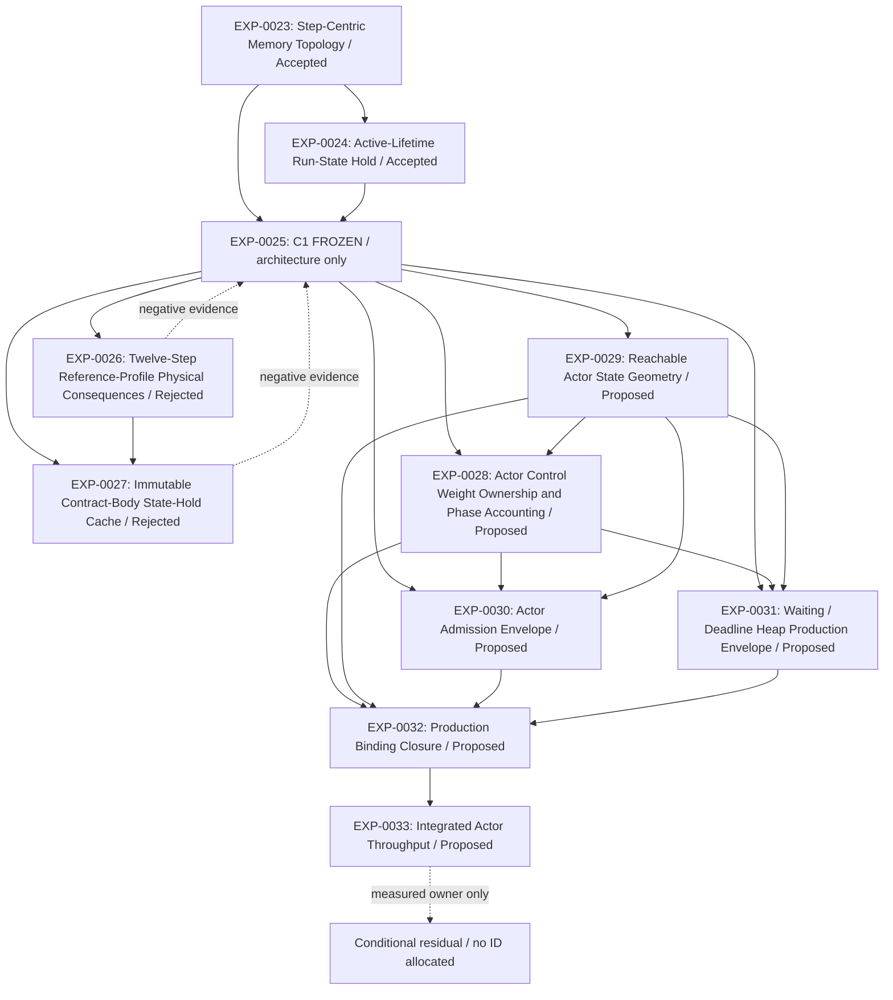

# Actors Experiments

This is the sole Actors experiment entrypoint and owner of shared track metadata, navigation, dependency overview and conditional research portfolio. Individual EXP records own one question, decision and its necessary evidence; do not create separate track maps or retrospective archives.

| Field | Value |
| --- | --- |
| Track ID | actors |
| Status | Active |
| Scope owner | DEOS Actors physical execution, storage, scheduling, and control topology |
| Depends on tracks | None |

## Scope and Boundary

- `Owns`: Actor Contract and Step representation, hot/cold state, run state, FIFO and temporal topology, detector/fanout geometry, block service, resource allocation, and executor lowering.
- `Excludes`: Normative Actor semantics, adapter-internal execution architecture, Router-internal route selection, open work, and experiment results.

## Governing Invariants

- Preserve deterministic semantics, strict FIFO, one causal hop per block, atomic Step effects, User/System neutrality, bounded state, component-wise Weight, No Ceiling Tax, and production Weight soundness.
- Governing contracts remain in `template/pallets/actors/docs/specification.en.md`, `docs/actors-resource-policy.specification.en.md`, and `docs/actors-performance-assurance.specification.en.md`.

## Accepted Physical Baseline

- Current 0.7.25 physical baseline: [EXP-0025](./EXP-0025.md), Accepted with decision scope physical architecture only; **C1 PHYSICAL GEOMETRY: FROZEN**. Production Weight, bindings, throughput and release Geometry Freeze remain separate gates.
- The 0.7.24 Actors baseline combines [EXP-0016](./EXP-0016.md) C6 Contract geometry, [EXP-0013](./EXP-0013.md) loaded-state reuse through one-Step planning and commit, and [EXP-0010](./EXP-0010.md) compact Observation activation. Complete renewed evidence binds the P32 runtime profile; [EXP-0001](./EXP-0001.md) preserves the rejected 0.7.23 throughput hypothesis as historical evidence.

## Research Portfolio

- Contract ceiling, body geometry, Step representation, and minimal active state.
- Actor control allocation, Economic Zipper, one-Step proof/overhead, and specification-gated service-quantum Pareto research.
- Crossing, observation fanout, cadence/wakeup, and aggregate FIFO geometry.
- Generic versus specialized executor lowering after structural convergence.
- Sealed Ready payload versus compact per-page or directory liveness, including physical-write flattening and independent committed-prefix durability, only after sole-owner C1 production Weight and W0–W9 expose Ready rewrite cost.
- Trie/StorageProof/PoV anatomy, truthful storage cardinality, proof-oriented pages, canonical-byte compression, shared immutable Contract authority, safe runtime-generated key locality and actual-PoV-aware Weight reclaim require a material measured owner from EXP-0033 or a prerequisite production experiment and a dedicated smallest falsifier.

## Cross-Track Dependencies

- Actors may consume bounded effect-Weight and failure evidence from the [Adapters track](../adapters/experiments.md) and route envelopes from the [Router track](../router/experiments.md).
- Router does not depend on Actor queue geometry. Cyclic questions must be split at their evidence boundary.

## Entry and Exit Conditions

- `Entry`: The decision changes Actor-owned storage, scheduling, control allocation, lifecycle geometry, or execution lowering without changing semantics.
- `Exit`: Adapter-internal or route-internal choices transfer to their owning track; this track becomes Dormant when no decision-relevant Actor question remains.

## Experiment Index

IDs are immutable monotonic identities within this track, not execution-order numbers. Status and decision navigation is canonical here; evidence remains in each record. Current logical order belongs to `Current Decision Critical Path` because evidence may reorder, eliminate, merge, or defer Proposed questions without changing historical identities.

| ID | Release | Status | Question | Baseline | Result / decision | Successor |
| --- | --- | --- | --- | --- | --- | --- |
| [EXP-0001](./EXP-0001.md) | 0.7.23 | Rejected | Does released 0.7.23 meet 100 one-Step-like cycles/block with stable service? | Tag `de498bf`; template `00f8044e` | 32.24–40.99 cycles/block; target missed | EXP-0013 |
| [EXP-0002](./EXP-0002.md) | 0.7.24 | Invalidated | Can 32 replace the 8-Step runtime without lifecycle/state failure or short-Contract ceiling tax? | C6 B8 manifest `4c461bd9`; P16/P32 tuple-only candidates | P32 control fits, but observation fanout proof `300,510 → 331,998` cuts fixed service `3 → 2` pages | Compact activation authority |
| [EXP-0003](./EXP-0003.md) | 0.7.24 | Rejected | Which Contract body geometry minimizes current-Step proof and lifecycle cost without ceiling tax? | Shared B0/C1 manifest `45c43626`; Wasm `23c83b9f` | Reject C1; naive fragmentation loses every branch; inline Step 0 is earned | EXP-0016 |
| [EXP-0004](./EXP-0004.md) | 0.7.25 | Invalidated | Which unique-owner Step-tail representation clears the nonterminal current-Step proof gate? | B0/C1/C2/C3 manifests `fbbcbae9` / `8fedf45e` / `45a93afa` / `a00c4ab9` | P32 measurements remain valid; W1 criterion ownership and runtime `12/24/48` assumptions changed | EXP-0026 owns the new baseline |
| [EXP-0005](./EXP-0005.md) | 0.7.24 | Accepted | Which single-owner current execution authority minimizes Q1 control cost? | Final C6 Hot/Contract/Run/FIFO with accepted EXP-0022 equal thirds | Retain A0; reject A1 bound, reverted A2 +3.2%, and non-conforming A3 | Advance EXP-0021 |
| [EXP-0006](./EXP-0006.md) | 0.7.24 | Accepted | Which fixed 20/80, 25/75, or 30/70 allocation wins? | Production 20/80 and effectful 10k profiles | Select 30/70: W1/W2 +34.0%, W3 +29.8%, zero mixed failures | EXP-0005 continues from 30/70 |
| EXP-0007 | 0.7.24 | Proposed | Is symmetric base-turn allocation work-conserving? | Current service pending | Not measured | Pending |
| [EXP-0008](./EXP-0008.md) | 0.7.24 | Accepted | Which Crossing membership page geometry wins? | Focused candidates plus full split-page production regeneration | P128 Crossing is independent from P64 broad fanout | EXP-0009 |
| [EXP-0009](./EXP-0009.md) | 0.7.24 | Accepted | Does C128-P128 fit every complete Crossing branch? | Full split-page production Weight plus H0 C128/N64 evidence | P128/C128/N64 Crossing with independent P64 fanout is shipped | Shipped baseline |
| [EXP-0010](./EXP-0010.md) | 0.7.24 | Accepted | Which compact activation authority removes P32 fanout ceiling tax without semantic or short-FIFO loss? | EXP-0002 B8/P32 fanout proof `300,510 / 331,998` | Candidate A restores P32 service 2 → 3; complete renewed Weight/metadata/ABI/Wasm evidence binds production P32 | Shipped P32 baseline |
| EXP-0011 | 0.7.24 | Proposed | Which cadence/wakeup cohort serves bounded herds? | Current temporal topology pending | Not measured | Pending |
| EXP-0012 | 0.7.24 | Proposed | Which canonical FIFO-internal geometry reduces queue work? | Current direct FIFO | External block-bound successor staging excluded by interleaved-order proof; no candidate measured | Dormant pending measured canonical-FIFO pressure |
| [EXP-0013](./EXP-0013.md) | 0.7.24 | Accepted | Which causal owners bind one-Step Weight and throughput? | Exact B1 manifest `5dc3631c`; Wasm `7efed56e` | Reuse accepted: marginal RefTime `167,553,076 → 137,612,859` (`-17.87%`), ProofSize unchanged | EXP-0016 closure, then EXP-0002 |
| EXP-0014 | 0.7.24 | Proposed | What is Actor overhead over an equivalent external operation? | External baseline pending | Not measured | Pending |
| EXP-0015 | 0.7.24 | Proposed | Does specialized lowering beat the generic executor? | Structural baseline unavailable | Conditional | Pending |
| [EXP-0016](./EXP-0016.md) | 0.7.24 | Accepted | Does inline Step 0 plus a lazy tail beat monolithic B0 without ceiling tax? | Shared B0/C5 manifest `4cc1dd50`; Wasm `c9c09e3f` | C6 preserves Step-0 win and cuts C5 state 56.84% with material lifecycle gains | C6 selected for generic production implementation |
| [EXP-0017](./EXP-0017.md) | 0.7.24 | Proposed | Under what explicit Q1 failure may Q2/Q4 service quantum research reopen over C6 Chunk4? | EXP-0013 reuse + EXP-0016 C6; converged I4 identity pending | Explicitly dormant; Q1 remains authoritative and Q2/Q4 reopen only after measured binding context/persistence overhead | EXP-0018 owns Fresh timing |
| [EXP-0018](./EXP-0018.md) | 0.7.24 | Rejected | Can bounded same-block Fresh Step-0 service improve causal latency without recursion or continuation starvation? | fixed-timing cleanup tree `9fe556b4`; Weight `6a1d68bc`; benchmark Wasm `12e502e2`; production Wasm `674022f0`; metadata `1b74078e` | T0 lowers best-effort latency but adds a consensus timing branch without guaranteeing herd execution; T+1 remains FIFO eligibility, not an N+1 SLA | Retain `NextBlock`; delete candidate/snapshot surfaces |
| [EXP-0019](./EXP-0019.md) | 0.7.24 | Invalidated | Which paid-coalescence Trigger/Pipeline Machine strategy preserves Q1 control while Actions remain pay-as-attempted and activation failure cleans process only? | A0 `31927940`/`fe3ff004`; W5 source `aaeb0ab`, complete Weight `afdb03bb`; formatted W8 Wasm `364ba474`, 3/39/79 lifecycle/event/error variants | Trigger latching invalidated paid redundancy; W5/W8 close reusable P0 Pipeline/Action evidence inherited by EXP-0020 | EXP-0020 |
| [EXP-0020](./EXP-0020.md) | 0.7.24 | Accepted | Which detector disable/re-arm topology enforces useful-transition Trigger charging while retaining inherited P0 Pipeline Machine evidence? | Source `95ac8fe5`; tree `677dae5d`; Weight `929d8151`; metadata `56c992d2` | Hybrid A1 direct/Cadenced detach plus A2 indexed disabled authority; eager indexed removal rejected by traversal races | Final release identity only |
| [EXP-0021](./EXP-0021.md) | 0.7.24 | Superseded | Do 24 or 16 Steps materially beat the 32-Step ceiling under final C6? | 32-Step C6/tiered production baseline | Lower ceilings save 18–41% only at maximum geometry | Later 12-Step reference-profile decision supersedes the expressiveness premise; EXP-0026 |
| [EXP-0022](./EXP-0022.md) | 0.7.24 | Invalidated | Does exact one-third Control beat accepted 30/35/35? | EXP-0006 accepted 30/70 | Historical W1/W2 never finalized; repaired baseline is 9.1075 Steps/block and Actor-Control-bound | Bind exact identity, saturate users, then EXP-0025 |
| [EXP-0023](./EXP-0023.md) | 0.7.24 | Accepted | Can a Step-centric hot path materially reduce ordinary Running Q1 machine cost? | A0 Actor-centric topology retained | Complete A1: -14.9% RefTime, -17.2% estimated proof | A1 reverted; A2 not admitted |
| [EXP-0024](./EXP-0024.md) | 0.7.24 | Accepted | Should run-state hold be Cycle-local or reserved for the active installed lifetime? | H0 Cycle-local exact hold | Select H1: 0.001805 units/Actor, autonomous Opening, create +8.4%, Opening -2.0% | Full production Weight regenerated |
| [EXP-0025](./EXP-0025.md) | 0.7.25 | Accepted | Did ticket-addressed frame-owned control preserve semantics and bounded ownership sufficiently to replace scalar geometry? | A0 `5c35415`; retained C1 `5b46b19` | Physical architecture only: C1 FROZEN; G1/G2 closed, production acceptance unresolved | EXP-0028–0033 |
| [EXP-0026](./EXP-0026.md) | 0.7.25 | Rejected | How much do a 12-Step reference ceiling and lockstep `24/48` Opening bounds reduce EXP-0025 middle-Step and maximum geometry? | Corrected P12 Wasm `d555298a`; five focused artifacts | P12-only middle claim rejected at unchanged `6,876.52`; product policy retained; maximum lifecycle proof falls about 51% | Baseline of EXP-0027 |
| [EXP-0027](./EXP-0027.md) | 0.7.25 | Rejected | Can the existing immutable Contract-body hold charge replace per-Step whole-body tail rescans? | C1 Wasm `67accb9a`; exact B0/C1 maximum artifacts | W2 proof/read set is identical because execution independently reconstructs the full Contract | B0 restored; no automatic successor |
| [EXP-0028](./EXP-0028.md) | 0.7.25 | Proposed | Does every production Actor Control phase have exactly one sound Weight owner, with no omission and no double charge? | Frozen C1; EXP-0029 for numeric coverage | Inherited findings; independent decision pending | EXP-0030, EXP-0031, EXP-0032 |
| [EXP-0029](./EXP-0029.md) | 0.7.25 | Proposed | What is the actual reachable domain of Actor state under authored Contract semantics and host bounds? | Frozen C1; physical architecture input | Inherited findings; independent decision pending | EXP-0028, EXP-0030, EXP-0031, EXP-0032 |
| [EXP-0030](./EXP-0030.md) | 0.7.25 | Proposed | Can production admission soundly cover every reachable Actor transition inside the configured DEOS resource policy? | Frozen C1; EXP-0028, EXP-0029 | Inherited findings; independent decision pending | EXP-0032 |
| [EXP-0031](./EXP-0031.md) | 0.7.25 | Proposed | What sound Weight envelope covers canonical Waiting publication, reference management, heap insertion/removal and bounded unlink? | Frozen C1; EXP-0028, EXP-0029 | Inherited findings; independent decision pending | EXP-0032 |
| [EXP-0032](./EXP-0032.md) | 0.7.25 | Proposed | Can one exact final source tree generate self-consistent Weight, Wasm, metadata, ABI, client bounds and storage identities? | Frozen C1; EXP-0028, EXP-0029, EXP-0030, EXP-0031 | Exact binding closure deferred | EXP-0033 |
| [EXP-0033](./EXP-0033.md) | 0.7.25 | Proposed | What throughput does frozen C1 achieve under exact production bindings? | Frozen C1; EXP-0032 | No final production measurement | Conditional residual owners |

## Current Decision Critical Path

Solid arrows below are required inputs; dotted arrows preserve negative findings or conditional research triggers. They express causal dependence, not ID chronology. Only prerequisite edges must form a DAG. The private record validator refreshes this block with `--write-index`; no separate dependency-map file is retained.

<!-- experiment-dependencies:start -->

<!-- experiment-dependencies:end -->

- `Production baseline`: The retained 0.7.25 source implements frozen C1 on C6 Contract/head-tail and split Run state. Its complete generated production handoff is EXP-0032's question; the prior 0.7.24 P32 handoff remains historical.
- `User lifecycle semantic baseline`: Trigger latching now charges only useful `pending_signal: false -> true` transitions, suppresses redundant Actor-specific evaluation/fees while latched, and re-arms detectors from current authoritative state after Opening. EXP-0019 is invalidated only for its paid-coalescence assumptions; its Pipeline Machine/Action/apoptosis/custody evidence transfers to EXP-0020.
- `One-Step economics and control`: Valid-actual Task-effect evidence, atomic Step control, upfront Pipeline Machine charging, and current-attempt Action charging remain implemented and regenerated for P0. EXP-0020 accepts useful-only Trigger charging through direct/Cadenced detach and indexed disabled authority; only final release identity remains external to the experiment. EXP-0022 production-throughput evidence is invalidated because saturated W1/W2 blocks halt optional Actor work before Drain/finalization telemetry, while the specification-owned equal-thirds ceiling remains normative.
- `Service quantum`: EXP-0017 remains dormant. Its historical cost-based Q2/Q4 trigger cannot reopen frozen C1; only the new invariant/impossibility test in EXP-0025 permits a new reopen experiment. Q1 and the causal floor stay fixed.
- `Fresh Step 0`: EXP-0018 rejected same-block execution and selected one protocol-fixed next-block eligibility floor. Readiness observed in N cannot execute before N+1, receives no class/market/provenance priority, and may execute later under strict FIFO and available `on_idle` Weight.
- `Step representation`: EXP-0004 is Invalidated by corrected W1 criterion ownership and the P12 profile. Its P32 measurements remain historical evidence. EXP-0026 confirms P12 leaves middle proof `6,876.52`; EXP-0027 confirms state-hold caching alone leaves exact maximum-middle reads/proof unchanged because execution independently reconstructs the full Contract. Both candidates are closed and B0 is restored.
- `Measured residual pressure`: EXP-0005 and EXP-0023 retained Actor-centric execution authority, EXP-0022 selected equal thirds, and EXP-0021's P32 expressiveness decision is superseded by P12. EXP-0026 measures lockstep `12/24/48`; EXP-0027 closes the only admitted hold-cache successor as a null result. Keep EXP-0007 and EXP-0014 dormant unless renewed evidence exposes a separate allocation or external-overhead decision. Exact cumulative outcomes remain semantic because completion policy, cancellation, suspension, simulation, and boundary events consume them; they are not removable telemetry under the accepted specification.
- `Runnable topology boundary`: EXP-0012 is restricted to canonical FIFO-internal geometry. Ordinary exact-`N+1` successors already append directly to canonical FIFO. Never stage them in a separate block-bound page: it cannot preserve interleaved order with later Manual, Trigger, or wakeup admission unless it becomes a second ordering authority, expands staging to every readiness source, inserts ahead of the FIFO head, or reserves the canonical FIFO position at source. Only source-time canonical reservation conforms, and that is the retained owner.
- `Research injection reconciliation`: Current-Step block-Weight admission remains Q1-local. A ready User activation charges Trigger plus complete Pipeline Machine control upfront from one fixed hot projection; future Actions pay valid actual effects per attempt. No mid-pipeline economic death, funding-wait/run-ledger topology, lifetime rent, or lifecycle Transfer privilege exists; activation-only apoptosis preserves custody and exact-slot recovery. Zero-Step temporal service, cause-time Triggers, causal mixed-length first reaction, class-neutral FIFO, and the EXP-0022-selected equal-thirds Control/Actor-effect/user-dispatch policy remain canonical. Shared Contract-code deduplication and `PercentageOfLastFunding` removal remain unearned without measured binding pressure or real-family usage evidence.
- `0.7.25 architecture decision`: EXP-0025 is Accepted, physical architecture only. C1 Architecture Freeze, G1 boundedness and G2 cutover are complete; the immutable A0 oracle is unchanged. Historical direct C1 branches and P12/hold-cache negatives remain provenance, not final production performance.
- `0.7.25 production evidence`: EXP-0028 phase ownership and EXP-0029 reachable domain feed EXP-0030 admission; EXP-0031 closes Waiting/heap branches. Their accepted outputs feed EXP-0032 exact bindings, whose acceptance unlocks EXP-0033 integrated W0–W9. These are evidence dependencies, not ID chronology.
- `0.7.25 residual gate`: EXP-0033 or a prerequisite production experiment must identify a material owner before a dedicated residual record is prepared. G7 audits and G8 evidence-selected convergence may invalidate affected downstream evidence, not silently reopen C1. No EXP-0034+ is allocated.
- `Topology evidence`: EXP-0008/0009 accepted independent Crossing and broad-fanout geometry. EXP-0011/0012 remain dormant unless a new production owner supplies a distinct question within frozen invariants; resolved experiments are not reopened by their portfolio position.
- `Executor lowering`: Open EXP-0015 last and only if structural convergence leaves a material generic-versus-specialized lowering decision.

This is a decision path, not a promise to execute every portfolio question. A Proposed row may be rejected, superseded, merged, or left unopened when stronger evidence removes its decision pressure. The release objective is the highest-performing conforming final design, not experiment-count completion.

## Conditional Residual Entry Contracts

These are future triggers, not experiments or release work items. BACKLOG owns the release gates. Create only the next earned record, with an exact measured owner and distinct hypothesis; a prerequisite production experiment may expose the owner before EXP-0033, but plausibility never suffices.

| Possible question | Entry condition / blocking evidence | Smallest falsifier |
| --- | --- | --- |
| Ready payload/liveness separation | Complete production proof/write attribution isolates mutable Ready payload cost | Mutable C32 versus bounded sealed payload/mask on partial/cross-page prefixes with committed-prefix failure |
| Proof anatomy / proof-oriented pages | Recorded/compact/PoV versus charged proof reveals a specific binding owner | Exact key/value/trie-node decomposition on 1/4/8/16/32/64/100 complete Transfer-P0 paths; compare avoided bytes against extra paths/writes |
| Truthful storage cardinality | Measured estimate excess is caused by a provably overconservative cardinality | Enforced admission/cleanup/TryRuntime bound versus storage annotation and complete production proof |
| Canonical cell compression | Complete proof identifies redundant encoded bytes with a unique derivation owner | Round-trip/corruption witness plus complete-path proof and read/write comparison |
| Shared immutable Contract body | Repeated identical bodies measurably bind proof/state after attribution | Exact-hash/reference-count lifecycle and short/divergent Contract comparison without another mutable owner |
| Storage-key locality | Production compact-proof anatomy isolates navigation cost after stable layout | Collision-resistant key comparison under sequential, randomized and adversarial population |
| Actual-PoV reclaim | Recorded/compact proof and SDK reclaim identify safely reclaimable unused capacity | Complete Prepass/Drain/extension/finalization comparison, fail-closed meters and unchanged FIFO/Q1 |

## Index-Only Proposed Relations

These unprepared questions retain their IDs without new record scaffolding. None has a selected implementation or new measurement. The common negative boundary is frozen C1 in EXP-0025; an unmet cost target is not a macrogeometry reopen trigger.

| ID | Depends on | Uses evidence from | Refines | Confirms | Invalidates | Supersedes | Transfers question to | Produces input for | Reopen trigger |
| --- | --- | --- | --- | --- | --- | --- | --- | --- | --- | --- |
| EXP-0007 | Resource specification | EXP-0022 invalidation | None | None | None | None | None | None until prepared | EXP-0033 isolates a distinct allocation question within fixed policy |
| EXP-0011 | EXP-0025 | EXP-0031 when decided | None | None | None | None | EXP-0031 for current heap envelope | None until prepared | Measured cadence owner outside the current heap question |
| EXP-0012 | EXP-0025 | EXP-0023, EXP-0033 when measured | Canonical FIFO only | No external successor staging | None | None | EXP-0025 physical choice already closed | Conditional residual | A measured FIFO owner and qualifying within-C1 falsifier |
| EXP-0014 | EXP-0033 | EXP-0013 | None | None | None | None | None | None until prepared | Equivalent external-operation comparison changes an evidenced decision |
| EXP-0015 | EXP-0033 | EXP-0027 negative result | None | None | None | None | None | None until prepared | Structural convergence leaves measured generic-lowering overhead |

## Maintenance

- Allocate the next ID from the highest ID in this track index; IDs may repeat in another track because the canonical identity is `<track>/EXP-NNNN`.
- Create `EXP-NNNN.md` before Proposed becomes Prepared, and update this row with every lifecycle or relation change.
- Keep measurements, interpretation, decisions, and artifacts in the record rather than this index.
