# Actors Experiments

This is the sole Actors experiment entrypoint and owner of shared track metadata, navigation, dependency overview and conditional research portfolio. Individual EXP records own one question, decision and its necessary evidence; do not create separate track maps or retrospective archives.

| Field | Value |
| --- | --- |
| Track ID | actors |
| Status | Active |
| Scope owner | DEOS Actors physical execution, storage, scheduling, and control topology |
| Depends on tracks | None |

## Scope and Boundary

- `Owns`: Actor Contract and Step representation, hot/cold state, run state, FIFO and temporal topology, detector/fanout geometry, block service, resource allocation, and executor lowering.
- `Excludes`: Normative Actor semantics, adapter-internal execution architecture, Router-internal route selection, open work, and experiment results.

## Governing Invariants

- Preserve deterministic semantics, strict FIFO, one causal hop per block, atomic Step effects, User/System neutrality, bounded state, component-wise Weight, No Ceiling Tax, and production Weight soundness.
- Governing contracts remain in `template/pallets/actors/docs/specification.en.md`, `docs/actors-resource-policy.specification.en.md`, and `docs/actors-performance-assurance.specification.en.md`.

## Accepted Physical Baseline

- Current 0.7.25 physical baseline: [EXP-0025](./EXP-0025.md), Accepted with decision scope physical architecture only; **C1 PHYSICAL GEOMETRY: FROZEN**. Production Weight, bindings, throughput and release Geometry Freeze remain separate gates.
- The 0.7.24 Actors baseline combines [EXP-0016](./EXP-0016.md) C6 Contract geometry, [EXP-0013](./EXP-0013.md) loaded-state reuse through one-Step planning and commit, and [EXP-0010](./EXP-0010.md) compact Observation activation. Complete renewed evidence binds the P32 runtime profile; [EXP-0001](./EXP-0001.md) preserves the rejected 0.7.23 throughput hypothesis as historical evidence.

## Research Portfolio

- Contract ceiling, body geometry, Step representation, and minimal active state.
- Actor control allocation, Economic Zipper, one-Step proof/overhead, and specification-gated service-quantum Pareto research.
- Crossing, observation fanout, cadence/wakeup, and aggregate FIFO geometry.
- Generic versus specialized executor lowering after structural convergence.
- Sealed Ready payload versus compact per-page or directory liveness, including physical-write flattening and independent committed-prefix durability, only after sole-owner C1 production Weight and W0–W9 expose Ready rewrite cost.
- Trie/StorageProof/PoV anatomy, truthful storage cardinality, proof-oriented pages, canonical-byte compression, shared immutable Contract authority, safe runtime-generated key locality and actual-PoV-aware Weight reclaim require a material measured owner from EXP-0066 or a prerequisite production experiment and a dedicated smallest falsifier.

## Cross-Track Dependencies

- Actors may consume bounded effect-Weight and failure evidence from the [Adapters track](../adapters/experiments.md) and route envelopes from the [Router track](../router/experiments.md).
- Router does not depend on Actor queue geometry. Cyclic questions must be split at their evidence boundary.

## Entry and Exit Conditions

- `Entry`: The decision changes Actor-owned storage, scheduling, control allocation, lifecycle geometry, or execution lowering without changing semantics.
- `Exit`: Adapter-internal or route-internal choices transfer to their owning track; this track becomes Dormant when no decision-relevant Actor question remains.

## Experiment Index

Sealed historical decision IDs are stable. Provisional IDs may change only in an explicit provenance-preserving graph normalization. Former provisional navigation IDs are qualified by their exact Git baseline in the migrated records and manifest; explicit compaction gives the active campaign a continuous numeric sequence. The three projections below distinguish decomposition, hard prerequisite ordering and evidence reuse.

| ID | Release | Status | Question | Baseline | Result / decision | Successor |
| --- | --- | --- | --- | --- | --- | --- |
| [EXP-0001](./EXP-0001.md) | 0.7.23 | Rejected | Does released 0.7.23 meet 100 one-Step-like cycles/block with stable service? | Tag `de498bf`; template `00f8044e` | 32.24–40.99 cycles/block; target missed | EXP-0013 |
| [EXP-0002](./EXP-0002.md) | 0.7.24 | Invalidated | Can 32 replace the 8-Step runtime without lifecycle/state failure or short-Contract ceiling tax? | C6 B8 manifest `4c461bd9`; P16/P32 tuple-only candidates | P32 control fits, but observation fanout proof `300,510 → 331,998` cuts fixed service `3 → 2` pages | Compact activation authority |
| [EXP-0003](./EXP-0003.md) | 0.7.24 | Rejected | Which Contract body geometry minimizes current-Step proof and lifecycle cost without ceiling tax? | Shared B0/C1 manifest `45c43626`; Wasm `23c83b9f` | Reject C1; naive fragmentation loses every branch; inline Step 0 is earned | EXP-0016 |
| [EXP-0004](./EXP-0004.md) | 0.7.25 | Invalidated | Which unique-owner Step-tail representation clears the nonterminal current-Step proof gate? | B0/C1/C2/C3 manifests `fbbcbae9` / `8fedf45e` / `45a93afa` / `a00c4ab9` | P32 measurements remain valid; W1 criterion ownership and runtime `12/24/48` assumptions changed | EXP-0026 owns the new baseline |
| [EXP-0005](./EXP-0005.md) | 0.7.24 | Accepted | Which single-owner current execution authority minimizes Q1 control cost? | Final C6 Hot/Contract/Run/FIFO with accepted EXP-0022 equal thirds | Retain A0; reject A1 bound, reverted A2 +3.2%, and non-conforming A3 | Advance EXP-0021 |
| [EXP-0006](./EXP-0006.md) | 0.7.24 | Accepted | Which fixed 20/80, 25/75, or 30/70 allocation wins? | Production 20/80 and effectful 10k profiles | Select 30/70: W1/W2 +34.0%, W3 +29.8%, zero mixed failures | EXP-0005 continues from 30/70 |
| EXP-0007 | 0.7.24 | Proposed | Is symmetric base-turn allocation work-conserving? | Current service pending | Not measured | Pending |
| [EXP-0008](./EXP-0008.md) | 0.7.24 | Accepted | Which Crossing membership page geometry wins? | Focused candidates plus full split-page production regeneration | P128 Crossing is independent from P64 broad fanout | EXP-0009 |
| [EXP-0009](./EXP-0009.md) | 0.7.24 | Accepted | Does C128-P128 fit every complete Crossing branch? | Full split-page production Weight plus H0 C128/N64 evidence | P128/C128/N64 Crossing with independent P64 fanout is shipped | Shipped baseline |
| [EXP-0010](./EXP-0010.md) | 0.7.24 | Accepted | Which compact activation authority removes P32 fanout ceiling tax without semantic or short-FIFO loss? | EXP-0002 B8/P32 fanout proof `300,510 / 331,998` | Candidate A restores P32 service 2 → 3; complete renewed Weight/metadata/ABI/Wasm evidence binds production P32 | Shipped P32 baseline |
| EXP-0011 | 0.7.24 | Proposed | Which cadence/wakeup cohort serves bounded herds? | Current temporal topology pending | Not measured | Pending |
| EXP-0012 | 0.7.24 | Proposed | Which canonical FIFO-internal geometry reduces queue work? | Current direct FIFO | External block-bound successor staging excluded by interleaved-order proof; no candidate measured | Dormant pending measured canonical-FIFO pressure |
| [EXP-0013](./EXP-0013.md) | 0.7.24 | Accepted | Which causal owners bind one-Step Weight and throughput? | Exact B1 manifest `5dc3631c`; Wasm `7efed56e` | Reuse accepted: marginal RefTime `167,553,076 → 137,612,859` (`-17.87%`), ProofSize unchanged | EXP-0016 closure, then EXP-0002 |
| EXP-0014 | 0.7.24 | Proposed | What is Actor overhead over an equivalent external operation? | External baseline pending | Not measured | Pending |
| EXP-0015 | 0.7.24 | Proposed | Does specialized lowering beat the generic executor? | Structural baseline unavailable | Conditional | Pending |
| [EXP-0016](./EXP-0016.md) | 0.7.24 | Accepted | Does inline Step 0 plus a lazy tail beat monolithic B0 without ceiling tax? | Shared B0/C5 manifest `4cc1dd50`; Wasm `c9c09e3f` | C6 preserves Step-0 win and cuts C5 state 56.84% with material lifecycle gains | C6 selected for generic production implementation |
| [EXP-0017](./EXP-0017.md) | 0.7.24 | Proposed | Under what explicit Q1 failure may Q2/Q4 service quantum research reopen over C6 Chunk4? | EXP-0013 reuse + EXP-0016 C6; converged I4 identity pending | Explicitly dormant; Q1 remains authoritative and Q2/Q4 reopen only after measured binding context/persistence overhead | EXP-0018 owns Fresh timing |
| [EXP-0018](./EXP-0018.md) | 0.7.24 | Rejected | Can bounded same-block Fresh Step-0 service improve causal latency without recursion or continuation starvation? | fixed-timing cleanup tree `9fe556b4`; Weight `6a1d68bc`; benchmark Wasm `12e502e2`; production Wasm `674022f0`; metadata `1b74078e` | T0 lowers best-effort latency but adds a consensus timing branch without guaranteeing herd execution; T+1 remains FIFO eligibility, not an N+1 SLA | Retain `NextBlock`; delete candidate/snapshot surfaces |
| [EXP-0019](./EXP-0019.md) | 0.7.24 | Invalidated | Which paid-coalescence Trigger/Pipeline Machine strategy preserves Q1 control while Actions remain pay-as-attempted and activation failure cleans process only? | A0 `31927940`/`fe3ff004`; W5 source `aaeb0ab`, complete Weight `afdb03bb`; formatted W8 Wasm `364ba474`, 3/39/79 lifecycle/event/error variants | Trigger latching invalidated paid redundancy; W5/W8 close reusable P0 Pipeline/Action evidence inherited by EXP-0020 | EXP-0020 |
| [EXP-0020](./EXP-0020.md) | 0.7.24 | Accepted | Which detector disable/re-arm topology enforces useful-transition Trigger charging while retaining inherited P0 Pipeline Machine evidence? | Source `95ac8fe5`; tree `677dae5d`; Weight `929d8151`; metadata `56c992d2` | Hybrid A1 direct/Cadenced detach plus A2 indexed disabled authority; eager indexed removal rejected by traversal races | Final release identity only |
| [EXP-0021](./EXP-0021.md) | 0.7.24 | Superseded | Do 24 or 16 Steps materially beat the 32-Step ceiling under final C6? | 32-Step C6/tiered production baseline | Lower ceilings save 18–41% only at maximum geometry | Later 12-Step reference-profile decision supersedes the expressiveness premise; EXP-0026 |
| [EXP-0022](./EXP-0022.md) | 0.7.24 | Invalidated | Does exact one-third Control beat accepted 30/35/35? | EXP-0006 accepted 30/70 | Historical W1/W2 never finalized; repaired baseline is 9.1075 Steps/block and Actor-Control-bound | Bind exact identity, saturate users, then EXP-0025 |
| [EXP-0023](./EXP-0023.md) | 0.7.24 | Accepted | Can a Step-centric hot path materially reduce ordinary Running Q1 machine cost? | A0 Actor-centric topology retained | Complete A1: -14.9% RefTime, -17.2% estimated proof | A1 reverted; A2 not admitted |
| [EXP-0024](./EXP-0024.md) | 0.7.24 | Accepted | Should run-state hold be Cycle-local or reserved for the active installed lifetime? | H0 Cycle-local exact hold | Select H1: 0.001805 units/Actor, autonomous Opening, create +8.4%, Opening -2.0% | Full production Weight regenerated |
| [EXP-0025](./EXP-0025.md) | 0.7.25 | Accepted | Did ticket-addressed frame-owned control preserve semantics and bounded ownership sufficiently to replace scalar geometry? | A0 `5c35415`; retained C1 `5b46b19` | Physical architecture only: C1 FROZEN; G1/G2 closed, production acceptance unresolved | EXP-0028, EXP-0029 and EXP-0063 through EXP-0066 |
| [EXP-0026](./EXP-0026.md) | 0.7.25 | Rejected | How much do a 12-Step reference ceiling and lockstep `24/48` Opening bounds reduce EXP-0025 middle-Step and maximum geometry? | Corrected P12 Wasm `d555298a`; five focused artifacts | P12-only middle claim rejected at unchanged `6,876.52`; product policy retained; maximum lifecycle proof falls about 51% | Baseline of EXP-0027 |
| [EXP-0027](./EXP-0027.md) | 0.7.25 | Rejected | Can the existing immutable Contract-body hold charge replace per-Step whole-body tail rescans? | C1 Wasm `67accb9a`; exact B0/C1 maximum artifacts | W2 proof/read set is identical because execution independently reconstructs the full Contract | B0 restored; no automatic successor |
| [EXP-0028](./EXP-0028.md) | 0.7.25 | Accepted | Synthesis: Actor Control Weight Ownership and Phase Accounting | EXP-0025; accepted finite child map | Phase ownership, no-double-charge composition and settlement containment accepted; numeric admission and exact artifacts remain downstream | EXP-0064 |
| [EXP-0029](./EXP-0029.md) | 0.7.25 | Accepted | Synthesis: Reachable Actor State Geometry | EXP-0025; O1–O9 child composition | Constrained mock/reference reachable domain accepted; numeric admission and exact artifacts remain downstream | EXP-0064 |
| [EXP-0030](./EXP-0030.md) | 0.7.25 | Accepted | Leaf: Action Invocation Receipt Ownership | EXP-0025; isolated owner and admitted reference-Wasm CompleteMax | Exactly one Control owner; inclusive CompleteMax and zero-fee System selection accepted in scope | EXP-0028 |
| [EXP-0031](./EXP-0031.md) | 0.7.25 | Accepted | Leaf: Pipeline Opening Collection Ownership | EXP-0025; reference-Wasm large-head and complete User Opening witnesses | Exactly one inclusive Pipeline collection owner for admitted User Opening | EXP-0028 |
| [EXP-0032](./EXP-0032.md) | 0.7.25 | Accepted | Leaf: Current Predicate Component Bound | EXP-0025; generated three-input envelope and V10 composed selector | Reference Current component and maximum/actual selector accepted in scope | EXP-0028 |
| [EXP-0033](./EXP-0033.md) | 0.7.25 | Accepted | Leaf: Opening Predicate Capture Bound | EXP-0025; exhaustive reference-Wasm allocation domain and V10 composed selector | Reference Opening predicate capture component and maximum/actual selector accepted in scope | EXP-0028 |
| [EXP-0034](./EXP-0034.md) | 0.7.25 | Accepted | Leaf: Opening Amount Capture Bound | EXP-0025; complete typed reference allocation/host-state evidence and V9 selector | Reference Opening amount capture component and maximum/actual selector accepted in scope | EXP-0028 |
| [EXP-0035](./EXP-0035.md) | 0.7.25 | Accepted | Leaf: Zero-Result Predicate Traversal Ownership | EXP-0025; generated fixed full-Contract traversal and composed selector | One zero-result predicate owner selected mutually exclusively from nonzero and inclusive paths | EXP-0028 |
| [EXP-0036](./EXP-0036.md) | 0.7.25 | Accepted | Leaf: Zero-Result Amount Traversal Ownership | EXP-0025; generated fixed full-Contract traversal and composed selector | One zero-result amount owner selected mutually exclusively from nonzero and inclusive paths | EXP-0028 |
| [EXP-0037](./EXP-0037.md) | 0.7.25 | Accepted | Leaf: User and System Zero-Step Base Ownership | EXP-0025; controlled System/User comparison and exact maximum-head reference-Wasm witness | Manual actor-class partition and maximum-head User owner accepted in scope | EXP-0028 |
| [EXP-0038](./EXP-0038.md) | 0.7.25 | Accepted | Leaf: Temporal Zero-Step Opening Ownership | EXP-0025; retained four-branch reference-Wasm evidence | AtTime/Cadenced persistence and authored-close owners accepted in scope | EXP-0028 |
| [EXP-0039](./EXP-0039.md) | 0.7.25 | Accepted | Leaf: Crossing Opening Rearm Ownership | EXP-0025; retained membership/cursor/availability reference-Wasm evidence | Available persistence/close envelopes and unavailable refusal accepted in scope | EXP-0028 |
| [EXP-0040](./EXP-0040.md) | 0.7.25 | Accepted | Leaf: Observation Subscription Cleanup Ownership | EXP-0025; retained dense/sparse unlink, dirty-cursor and free-page reference-Wasm evidence | One component-wise Observation authored-close cleanup owner accepted in scope | EXP-0028 |
| [EXP-0041](./EXP-0041.md) | 0.7.25 | Accepted | Leaf: Pipeline Admission Apoptosis Ownership | EXP-0025; maximum-Contract Crossing/future-window reference-Wasm witness | One inclusive custody-neutral apoptosis owner accepted in scope | EXP-0028 |
| [EXP-0042](./EXP-0042.md) | 0.7.25 | Accepted | Leaf: Public Close Cleanup Ownership | EXP-0025; admitted joint maximum-Step retry/Crossing reference-Wasm witness | One inclusive public-close owner accepted in scope | EXP-0028 |
| [EXP-0043](./EXP-0043.md) | 0.7.25 | Accepted | Leaf: Window Expiry Close Ownership | EXP-0025; singleton-Block unsignaled Immutable zero-Step User reference-Wasm witness | One inclusive source-consumption and custody-neutral expiry owner accepted in scope | EXP-0028 |
| [EXP-0044](./EXP-0044.md) | 0.7.25 | Accepted | Leaf: User State-Hold Reconciliation Bound | EXP-0025; complete User Opening reference-Wasm witness | Inclusive post-publication User hold owner accepted in scope | EXP-0028 |
| [EXP-0045](./EXP-0045.md) | 0.7.25 | Measured | Leaf: Authored Amount and LastFunding Algebra | EXP-0025; exact child/source provenance | Scoped evidence retained; complete release acceptance open | EXP-0029 |
| [EXP-0046](./EXP-0046.md) | 0.7.25 | Measured | Leaf: Predicate and DNF Reachable Geometry | EXP-0025; exact child/source provenance | Scoped evidence retained; complete release acceptance open | EXP-0029 |
| [EXP-0047](./EXP-0047.md) | 0.7.25 | Accepted | Leaf: Funding Snapshot Consumption Bound | EXP-0025; reference-Wasm 1..24 authored-source component and certified Signed ingress | Reference funding-consumption component accepted in scope | EXP-0028 |
| [EXP-0048](./EXP-0048.md) | 0.7.25 | Accepted | Leaf: Run and Contract Head-Tail Reachability | EXP-0025; public mock/reference constructors | Admitted zero-Step/head/tail/cursor/Run geometry accepted; refused dense maxima excluded | EXP-0029 |
| [EXP-0049](./EXP-0049.md) | 0.7.25 | Accepted | Leaf: Host Active Identity and Sovereign Population | EXP-0025; retained-genesis host histories | Joint active/identity/sovereign additional-System bound accepted in scope | EXP-0029 |
| [EXP-0050](./EXP-0050.md) | 0.7.25 | Accepted | Leaf: Legal Waiting Primary Population | EXP-0025; ordinary saturated lifecycle histories | Existing/new/full-page publication and upward/tail removal populations accepted | EXP-0029 |
| [EXP-0051](./EXP-0051.md) | 0.7.25 | Accepted | Leaf: Legal Waiting Reference Population | EXP-0025; ordinary Cadenced/close histories | Mixed-page unlink and saturated final-Tick removal populations accepted | EXP-0029 |
| [EXP-0052](./EXP-0052.md) | 0.7.25 | Accepted | Leaf: Joint Suspended and User Close Geometry | EXP-0025; admitted reference User-close probes | Real suspension/capture/detector/hold geometry accepted for admitted subdomain | EXP-0029 |
| [EXP-0053](./EXP-0053.md) | 0.7.25 | Measured | Leaf: V10 Admission Refusal Lower Bound | EXP-0025; exact child/source provenance | Scoped evidence retained; complete release acceptance open | EXP-0029 |
| [EXP-0054](./EXP-0054.md) | 0.7.25 | Measured | Leaf: Native Admission Refusal and Precedence | EXP-0025; exact child/source provenance | Scoped evidence retained; complete release acceptance open | EXP-0064 |
| [EXP-0055](./EXP-0055.md) | 0.7.25 | Accepted | Leaf: Waiting Publication Production Bound | EXP-0025; common-Wasm complete branch and 334-byte cell evidence | Component-wise publication envelope accepted for current reference binding | EXP-0063 |
| [EXP-0056](./EXP-0056.md) | 0.7.25 | Accepted | Leaf: Waiting Removal and Heap Repair Production Bound | EXP-0025; common-Wasm complete public-close removal family | Inclusive final-Tick/downward-repair bound accepted in scope | EXP-0063 |
| [EXP-0057](./EXP-0057.md) | 0.7.25 | Accepted | Leaf: Useful Trigger Detection Weight Coverage | EXP-0020/EXP-0025; six current-source reference-Wasm occurrence owners | Six-family useful-only ownership and redundant-latch exclusion accepted in scope | EXP-0028 |
| [EXP-0058](./EXP-0058.md) | 0.7.25 | Accepted | Leaf: Scheduler Source and Destination Weight Coverage | EXP-0025, EXP-0039, EXP-0041–0043; complete-owner settlement | Source/destination and Waiting overlap matrix accepted; EXP-0063 supplies numeric envelopes | EXP-0028 |
| [EXP-0059](./EXP-0059.md) | 0.7.25 | Accepted | Leaf: Running and Suspended Control Weight Coverage | EXP-0025; admitted extrema, trace audit and exact successors | Exact finite successor envelope accepted; low-capture Continued→Wakeup contains dense `S=3` | EXP-0028 |
| [EXP-0060](./EXP-0060.md) | 0.7.25 | Accepted | Leaf: Control and Effect Settlement Containment | EXP-0025; production provider audit, finite selector matrix and one-unit rollback witnesses | Typed effect/control actuals and transactional component-wise containment accepted in scope | EXP-0028 |
| [EXP-0061](./EXP-0061.md) | 0.7.25 | Accepted | Leaf: Joint Encoded Actor Control Cell Reachability | EXP-0025; pre-fission uncovered owner | Satisfied: reference-binding 334-byte maximum with public Wasm attainment | EXP-0029 |
| [EXP-0062](./EXP-0062.md) | 0.7.25 | Accepted | Leaf: Nonzero Action Fee Collection Ownership | EXP-0025; reference-Wasm isolated ledger transfer and phase selector | One native-ledger Control owner selected independently of receipt and Pipeline collection | EXP-0028 |
| [EXP-0063](./EXP-0063.md) | 0.7.25 | Accepted | Synthesis: Waiting / Deadline Heap Production Envelope | EXP-0025; accepted publication/removal children and phase attribution | Mutually exclusive current-binding publication and removal envelopes accepted | EXP-0064 |
| [EXP-0064](./EXP-0064.md) | 0.7.25 | Accepted | Synthesis: Actor Admission Envelope | EXP-0025; all four required child scopes satisfied | Contract-level product admission, finite Waiting selector containment and pre-G5 genesis fit accepted | EXP-0065 |
| [EXP-0065](./EXP-0065.md) | 0.7.25 | Invalidated | Leaf: Production Binding Closure | EXP-0025; accepted G4 inputs and pinned exact-tree artifact cohort | Exact Weight/Wasm/live metadata/PAPI/ABI/bounds/vector bundle and finalized browser/staking consumers converge | EXP-0066 |
| [EXP-0066](./EXP-0066.md) | 0.7.25 | Accepted | Synthesis: Integrated Actor Throughput | EXP-0025/EXP-0065; User coverage prerequisite EXP-0067 | Finite child-obligation map; primary evidence relocated without remeasurement; targets and integrated acceptance remain open | Child decisions and G4 qualification |
| [EXP-0067](./EXP-0067.md) | 0.7.25 | Accepted | Leaf: User Opening Settlement Binding | Accepted EXP-0069/0094 inclusive owners and EXP-0095 exact binding | Zero-tail H16 and positive-tail T16 are shared by admission/actual settlement without overlap or new context | Invalidated/current G6 owners |
| [EXP-0068](./EXP-0068.md) | 0.7.25 | Accepted | Leaf: User Opening Completion Inner Owner | EXP-0067 classification; existing System inner completion boundary | Partitioned single/positive-tail models match all 447 DB samples and fee/hold postconditions; attained reference domain only; unsplit fit rejected | EXP-0067 live geometry/selection qualification |
| [EXP-0069](./EXP-0069.md) | 0.7.25 | Accepted | Leaf: User Completion Header Envelope | EXP-0067 native 157/670-byte alias; EXP-0068 scoped inner models | Same-Wasm H16 retains 9/5 I/O, adds exact 513-byte proof and dominates H0 at `893,949,000 / 7,990` | EXP-0067 live selector composition |
| [EXP-0070](./EXP-0070.md) | 0.7.25 | Accepted | Leaf: System Schedule Throughput and Censored Service | EXP-0066 W0–W2; EXP-0095 current binding | Current W1/Cadenced W2 retain 132 successes, Manual W2 1,694; zero failures and all targets missed | EXP-0066 O1 |
| [EXP-0071](./EXP-0071.md) | 0.7.25 | Accepted | Leaf: Contract Geometry Service | EXP-0066 W3; EXP-0095 current binding | 126 Cycles/252 ordered Steps complete across all nine cells; maximum bounded Running gap 15 | EXP-0066 O2 |
| [EXP-0072](./EXP-0072.md) | 0.7.25 | Accepted | Leaf: Heterogeneous Task Service | EXP-0066 W4; EXP-0095 current binding | Each demand mode: 123 Transfer, six SwapOut, three StopCycle; 132 total successes, zero failures, target missed | EXP-0066 O3 |
| [EXP-0073](./EXP-0073.md) | 0.7.25 | Accepted | Leaf: Lifecycle Outcome and Prefix Durability | EXP-0066 pre-fission W5 | Bounded event/Run chronology and retained prefix | EXP-0066 O4 |
| [EXP-0074](./EXP-0074.md) | 0.7.25 | Accepted | Leaf: Arrival Eligibility and Generation | EXP-0066 pre-fission W6 | Block/tick, pause/window and generation boundaries | EXP-0066 O5 |
| [EXP-0075](./EXP-0075.md) | 0.7.25 | Accepted | Leaf: Due-Frontier Population Isolation | EXP-0066 pre-fission W7 | Matched due service despite non-due population | EXP-0066 O6 |
| [EXP-0076](./EXP-0076.md) | 0.7.25 | Accepted | Leaf: Ready Tombstone Prefix Pressure | EXP-0066 pre-fission W8 | Bounded reclaim and chronological live prefix | EXP-0066 O7 |
| [EXP-0077](./EXP-0077.md) | 0.7.25 | Accepted | Leaf: User Resource Independence | EXP-0066 pre-fission W9 | Separate Actor accounting; RefTime-heavy fallback only | EXP-0066 O8 |
| [EXP-0078](./EXP-0078.md) | 0.7.25 | Accepted | Leaf: Temporal Materialization Phase Ownership | EXP-0066 matched phase cohort | Materialization/service phase and captured-cutoff deferral | EXP-0066 O9 |
| [EXP-0079](./EXP-0079.md) | 0.7.25 | Accepted | Leaf: Temporal Generated Charge and Admission Ownership | EXP-0066 production-selector ledger | Component-wise charged/admitted owners; not physical I/O | EXP-0066 O10 |
| [EXP-0080](./EXP-0080.md) | 0.7.25 | Accepted | Leaf: Matched-Phase StorageProof Node Coverage | EXP-0066 repeated key/root cohort | Closed raw-node coverage in retained 18-block domain only | EXP-0066 O11 |
| [EXP-0081](./EXP-0081.md) | 0.7.25 | Accepted | Leaf: Manual Service Stop Reconstruction | EXP-0066 native prefix diagnostics | Eligible live heads and phase-local budgets; no universal stop trace | EXP-0066 O12 |
| [EXP-0082](./EXP-0082.md) | 0.7.25 | Accepted | Leaf: Successful System Transfer Charge Ownership | EXP-0066 preparation ledger | Separated successful-Step and no-progress charge delta | EXP-0066 O13 |
| [EXP-0083](./EXP-0083.md) | 0.7.25 | Accepted | Leaf: No-Due and Genesis Control Baseline | EXP-0066 baseline ledger | Fixed coordination separate from genesis anchoring | EXP-0066 O14 |
| [EXP-0084](./EXP-0084.md) | 0.7.25 | Accepted | Leaf: System Schedule Charged-Owner Accounting | EXP-0066 native worker/retained-Wasm cohorts | Bounded and full Actor-only schedule equations and linkage | EXP-0066 O15 |
| [EXP-0085](./EXP-0085.md) | 0.7.25 | Accepted | Leaf: Signed-Demand Accounting Evidence Linkage | EXP-0066 signed native ledger plus EXP-0095 exact binding | 100 signed native-authored blocks replay the same bodies/state through exact Wasm with matching headers, roots and proofs | EXP-0066 O16 |
| [EXP-0086](./EXP-0086.md) | 0.7.25 | Accepted | Leaf: Lifecycle Charged-Owner Accounting | EXP-0066 W5 resource ledger | Bounded nonduplicated lifecycle/effect settlement | EXP-0066 O17 |
| [EXP-0087](./EXP-0087.md) | 0.7.25 | Accepted | Leaf: User and Reactive Target Population Coverage | EXP-0067 qualification before execution | Existing open target-domain obligation; no new measurement | EXP-0066 O18 |
| [EXP-0088](./EXP-0088.md) | 0.7.25 | Accepted | Leaf: Funded User Fee-Path Resource Coverage | Current funded StopCycle pair and completion-header alias | Bounded Trigger/Pipeline monetary and resource separation; Action transferred to EXP-0097 | EXP-0066 O19 |
| [EXP-0089](./EXP-0089.md) | 0.7.25 | Accepted | Leaf: Reactive Executed-Path Resource Coverage | Qualified binding and EXP-0074 outcomes | Existing open detector/fanout/service accounting obligation | EXP-0066 O20 |
| [EXP-0090](./EXP-0090.md) | 0.7.25 | Accepted | Leaf: Heavy Economic Task Resource Coverage | EXP-0072 bounded Task mix | Existing open liquidity-heavy/Shared Economic coverage | EXP-0066 O21 |
| [EXP-0091](./EXP-0091.md) | 0.7.25 | Accepted | Leaf: Sustained Service Evidence Sufficiency | EXP-0070–EXP-0077 bounded observations | Existing open fairness obligation; censoring is not a service bound | EXP-0066 O22 |
| [EXP-0092](./EXP-0092.md) | 0.7.25 | Accepted | Leaf: Remaining Service-Stop Evidence | EXP-0081 bounded Manual proof | Existing open phase-local stop obligation; no extrapolated proof | EXP-0066 O23 |
| [EXP-0093](./EXP-0093.md) | 0.7.25 | Accepted | Leaf: Long Retry Resource Placement | EXP-0073/EXP-0086 short Ready retry | Existing open longer retry/wakeup accounting | EXP-0066 O24 |
| [EXP-0094](./EXP-0094.md) | 0.7.25 | Accepted | Leaf: Combined User Completion Header and Tail Envelope | Accepted EXP-0068 tail and EXP-0069 header axes | Same-Wasm T16 covers every DB sample and adds exact 513-byte proof over T across `t=1..3` | EXP-0067 live selector composition |
| [EXP-0095](./EXP-0095.md) | 0.7.25 | Accepted | Leaf: Production Binding Refresh | EXP-0067 selector correction plus EXP-0096 cadence fix invalidated prior candidates | Weight `9ce37a…`, Wasm `25b969…`, unchanged metadata/client identities, refreshed observation evidence and full exact-tree gate converge | EXP-0067 decision |
| [EXP-0096](./EXP-0096.md) | 0.7.25 | Accepted | Leaf: Cadenced Latch Authority Under Ready Backpressure | EXP-0095 package-heavy breaker failure | Detector invalidation before activation preserves one loadable deferred authority; focused maximum profile passes twice | EXP-0095 artifact regeneration |
| [EXP-0097](./EXP-0097.md) | 0.7.25 | Accepted | Leaf: Funded User Action Fee-Path Coverage | EXP-0088 bounded Pipeline closure | Existing open successful Action monetary/resource mapping | EXP-0066 O25 |
| [EXP-0098](./EXP-0098.md) | 0.7.25 | Accepted | Leaf: Crossing Executed-Path Resource Coverage |
| [EXP-0099](./EXP-0099.md) | 0.7.25 | Accepted | Leaf: Continuation Authority Ownership Audit |
| [EXP-0100](./EXP-0100.md) | 0.7.25 | Accepted | Leaf: Existing-Path Backpressure Safety Audit |
| [EXP-0101](./EXP-0101.md) | 0.7.25 | Accepted | Leaf: Reactive Target Residual Convergence |
| [EXP-0102](./EXP-0102.md) | 0.7.25 | Accepted | Leaf: Production Constraint Disposition | EXP-0074 accepted W6 chronology | Independent Crossing detector/latch and service accounting | EXP-0066 O26 |

## Current Decision Critical Path

The three projections have separate meanings: Synthesis-to-child decomposition, required-input dependency, and scoped evidence reuse. Decomposition and hard prerequisites are independently acyclic; a parent link alone does not create a prerequisite. The private validator regenerates this canonical projection with `--write-index`.

<!-- experiment-graph-campaign: 0.7.25 frozen C1 production evidence -->
<!-- experiment-dependencies:start -->
Scope: the declared campaign and directly related external inputs/consumers. Decomposition means constituent proofs; hard dependencies mean required input; dotted evidence flow means scoped reuse, not ordering.

**Decomposition**

```mermaid
flowchart TD
  actors_EXP_0028["actors/EXP-0028: Synthesis / Accepted"]
  actors_EXP_0029["actors/EXP-0029: Synthesis / Accepted"]
  actors_EXP_0030["actors/EXP-0030: Leaf / Accepted"]
  actors_EXP_0031["actors/EXP-0031: Leaf / Accepted"]
  actors_EXP_0032["actors/EXP-0032: Leaf / Accepted"]
  actors_EXP_0033["actors/EXP-0033: Leaf / Accepted"]
  actors_EXP_0034["actors/EXP-0034: Leaf / Accepted"]
  actors_EXP_0035["actors/EXP-0035: Leaf / Accepted"]
  actors_EXP_0036["actors/EXP-0036: Leaf / Accepted"]
  actors_EXP_0037["actors/EXP-0037: Leaf / Accepted"]
  actors_EXP_0038["actors/EXP-0038: Leaf / Accepted"]
  actors_EXP_0039["actors/EXP-0039: Leaf / Accepted"]
  actors_EXP_0040["actors/EXP-0040: Leaf / Accepted"]
  actors_EXP_0041["actors/EXP-0041: Leaf / Accepted"]
  actors_EXP_0042["actors/EXP-0042: Leaf / Accepted"]
  actors_EXP_0043["actors/EXP-0043: Leaf / Accepted"]
  actors_EXP_0044["actors/EXP-0044: Leaf / Accepted"]
  actors_EXP_0045["actors/EXP-0045: Leaf / Measured"]
  actors_EXP_0046["actors/EXP-0046: Leaf / Measured"]
  actors_EXP_0047["actors/EXP-0047: Leaf / Accepted"]
  actors_EXP_0048["actors/EXP-0048: Leaf / Accepted"]
  actors_EXP_0049["actors/EXP-0049: Leaf / Accepted"]
  actors_EXP_0050["actors/EXP-0050: Leaf / Accepted"]
  actors_EXP_0051["actors/EXP-0051: Leaf / Accepted"]
  actors_EXP_0052["actors/EXP-0052: Leaf / Accepted"]
  actors_EXP_0053["actors/EXP-0053: Leaf / Measured"]
  actors_EXP_0054["actors/EXP-0054: Leaf / Measured"]
  actors_EXP_0055["actors/EXP-0055: Leaf / Accepted"]
  actors_EXP_0056["actors/EXP-0056: Leaf / Accepted"]
  actors_EXP_0057["actors/EXP-0057: Leaf / Accepted"]
  actors_EXP_0058["actors/EXP-0058: Leaf / Accepted"]
  actors_EXP_0059["actors/EXP-0059: Leaf / Accepted"]
  actors_EXP_0060["actors/EXP-0060: Leaf / Accepted"]
  actors_EXP_0061["actors/EXP-0061: Leaf / Accepted"]
  actors_EXP_0062["actors/EXP-0062: Leaf / Accepted"]
  actors_EXP_0063["actors/EXP-0063: Synthesis / Accepted"]
  actors_EXP_0064["actors/EXP-0064: Synthesis / Accepted"]
  actors_EXP_0066["actors/EXP-0066: Synthesis / Accepted"]
  actors_EXP_0070["actors/EXP-0070: Leaf / Accepted"]
  actors_EXP_0071["actors/EXP-0071: Leaf / Accepted"]
  actors_EXP_0072["actors/EXP-0072: Leaf / Accepted"]
  actors_EXP_0073["actors/EXP-0073: Leaf / Accepted"]
  actors_EXP_0074["actors/EXP-0074: Leaf / Accepted"]
  actors_EXP_0075["actors/EXP-0075: Leaf / Accepted"]
  actors_EXP_0076["actors/EXP-0076: Leaf / Accepted"]
  actors_EXP_0077["actors/EXP-0077: Leaf / Accepted"]
  actors_EXP_0078["actors/EXP-0078: Leaf / Accepted"]
  actors_EXP_0079["actors/EXP-0079: Leaf / Accepted"]
  actors_EXP_0080["actors/EXP-0080: Leaf / Accepted"]
  actors_EXP_0081["actors/EXP-0081: Leaf / Accepted"]
  actors_EXP_0082["actors/EXP-0082: Leaf / Accepted"]
  actors_EXP_0083["actors/EXP-0083: Leaf / Accepted"]
  actors_EXP_0084["actors/EXP-0084: Leaf / Accepted"]
  actors_EXP_0085["actors/EXP-0085: Leaf / Accepted"]
  actors_EXP_0086["actors/EXP-0086: Leaf / Accepted"]
  actors_EXP_0087["actors/EXP-0087: Leaf / Accepted"]
  actors_EXP_0088["actors/EXP-0088: Leaf / Accepted"]
  actors_EXP_0089["actors/EXP-0089: Leaf / Accepted"]
  actors_EXP_0090["actors/EXP-0090: Leaf / Accepted"]
  actors_EXP_0091["actors/EXP-0091: Leaf / Accepted"]
  actors_EXP_0092["actors/EXP-0092: Leaf / Accepted"]
  actors_EXP_0093["actors/EXP-0093: Leaf / Accepted"]
  actors_EXP_0097["actors/EXP-0097: Leaf / Accepted"]
  actors_EXP_0098["actors/EXP-0098: Leaf / Accepted"]
  actors_EXP_0028 --> actors_EXP_0030
  actors_EXP_0028 --> actors_EXP_0031
  actors_EXP_0028 --> actors_EXP_0032
  actors_EXP_0028 --> actors_EXP_0033
  actors_EXP_0028 --> actors_EXP_0034
  actors_EXP_0028 --> actors_EXP_0035
  actors_EXP_0028 --> actors_EXP_0036
  actors_EXP_0028 --> actors_EXP_0037
  actors_EXP_0028 --> actors_EXP_0038
  actors_EXP_0028 --> actors_EXP_0039
  actors_EXP_0028 --> actors_EXP_0040
  actors_EXP_0028 --> actors_EXP_0041
  actors_EXP_0028 --> actors_EXP_0042
  actors_EXP_0028 --> actors_EXP_0043
  actors_EXP_0028 --> actors_EXP_0044
  actors_EXP_0028 --> actors_EXP_0047
  actors_EXP_0028 --> actors_EXP_0057
  actors_EXP_0028 --> actors_EXP_0058
  actors_EXP_0028 --> actors_EXP_0059
  actors_EXP_0028 --> actors_EXP_0060
  actors_EXP_0028 --> actors_EXP_0062
  actors_EXP_0029 --> actors_EXP_0045
  actors_EXP_0029 --> actors_EXP_0046
  actors_EXP_0029 --> actors_EXP_0048
  actors_EXP_0029 --> actors_EXP_0049
  actors_EXP_0029 --> actors_EXP_0050
  actors_EXP_0029 --> actors_EXP_0051
  actors_EXP_0029 --> actors_EXP_0052
  actors_EXP_0029 --> actors_EXP_0053
  actors_EXP_0029 --> actors_EXP_0061
  actors_EXP_0063 --> actors_EXP_0055
  actors_EXP_0063 --> actors_EXP_0056
  actors_EXP_0064 --> actors_EXP_0028
  actors_EXP_0064 --> actors_EXP_0029
  actors_EXP_0064 --> actors_EXP_0054
  actors_EXP_0064 --> actors_EXP_0063
  actors_EXP_0066 --> actors_EXP_0070
  actors_EXP_0066 --> actors_EXP_0071
  actors_EXP_0066 --> actors_EXP_0072
  actors_EXP_0066 --> actors_EXP_0073
  actors_EXP_0066 --> actors_EXP_0074
  actors_EXP_0066 --> actors_EXP_0075
  actors_EXP_0066 --> actors_EXP_0076
  actors_EXP_0066 --> actors_EXP_0077
  actors_EXP_0066 --> actors_EXP_0078
  actors_EXP_0066 --> actors_EXP_0079
  actors_EXP_0066 --> actors_EXP_0080
  actors_EXP_0066 --> actors_EXP_0081
  actors_EXP_0066 --> actors_EXP_0082
  actors_EXP_0066 --> actors_EXP_0083
  actors_EXP_0066 --> actors_EXP_0084
  actors_EXP_0066 --> actors_EXP_0085
  actors_EXP_0066 --> actors_EXP_0086
  actors_EXP_0066 --> actors_EXP_0087
  actors_EXP_0066 --> actors_EXP_0088
  actors_EXP_0066 --> actors_EXP_0089
  actors_EXP_0066 --> actors_EXP_0090
  actors_EXP_0066 --> actors_EXP_0091
  actors_EXP_0066 --> actors_EXP_0092
  actors_EXP_0066 --> actors_EXP_0093
  actors_EXP_0066 --> actors_EXP_0097
  actors_EXP_0066 --> actors_EXP_0098
```



**Hard dependencies**

```mermaid
flowchart TD
  actors_EXP_0014["actors/EXP-0014: external"]
  actors_EXP_0015["actors/EXP-0015: external"]
  actors_EXP_0020["actors/EXP-0020: external"]
  actors_EXP_0025["actors/EXP-0025: external"]
  actors_EXP_0028["actors/EXP-0028: Synthesis / Accepted"]
  actors_EXP_0029["actors/EXP-0029: Synthesis / Accepted"]
  actors_EXP_0030["actors/EXP-0030: Leaf / Accepted"]
  actors_EXP_0031["actors/EXP-0031: Leaf / Accepted"]
  actors_EXP_0032["actors/EXP-0032: Leaf / Accepted"]
  actors_EXP_0033["actors/EXP-0033: Leaf / Accepted"]
  actors_EXP_0034["actors/EXP-0034: Leaf / Accepted"]
  actors_EXP_0035["actors/EXP-0035: Leaf / Accepted"]
  actors_EXP_0036["actors/EXP-0036: Leaf / Accepted"]
  actors_EXP_0037["actors/EXP-0037: Leaf / Accepted"]
  actors_EXP_0038["actors/EXP-0038: Leaf / Accepted"]
  actors_EXP_0039["actors/EXP-0039: Leaf / Accepted"]
  actors_EXP_0040["actors/EXP-0040: Leaf / Accepted"]
  actors_EXP_0041["actors/EXP-0041: Leaf / Accepted"]
  actors_EXP_0042["actors/EXP-0042: Leaf / Accepted"]
  actors_EXP_0043["actors/EXP-0043: Leaf / Accepted"]
  actors_EXP_0044["actors/EXP-0044: Leaf / Accepted"]
  actors_EXP_0045["actors/EXP-0045: Leaf / Measured"]
  actors_EXP_0046["actors/EXP-0046: Leaf / Measured"]
  actors_EXP_0047["actors/EXP-0047: Leaf / Accepted"]
  actors_EXP_0048["actors/EXP-0048: Leaf / Accepted"]
  actors_EXP_0049["actors/EXP-0049: Leaf / Accepted"]
  actors_EXP_0050["actors/EXP-0050: Leaf / Accepted"]
  actors_EXP_0051["actors/EXP-0051: Leaf / Accepted"]
  actors_EXP_0052["actors/EXP-0052: Leaf / Accepted"]
  actors_EXP_0053["actors/EXP-0053: Leaf / Measured"]
  actors_EXP_0054["actors/EXP-0054: Leaf / Measured"]
  actors_EXP_0055["actors/EXP-0055: Leaf / Accepted"]
  actors_EXP_0056["actors/EXP-0056: Leaf / Accepted"]
  actors_EXP_0057["actors/EXP-0057: Leaf / Accepted"]
  actors_EXP_0058["actors/EXP-0058: Leaf / Accepted"]
  actors_EXP_0059["actors/EXP-0059: Leaf / Accepted"]
  actors_EXP_0060["actors/EXP-0060: Leaf / Accepted"]
  actors_EXP_0061["actors/EXP-0061: Leaf / Accepted"]
  actors_EXP_0062["actors/EXP-0062: Leaf / Accepted"]
  actors_EXP_0063["actors/EXP-0063: Synthesis / Accepted"]
  actors_EXP_0064["actors/EXP-0064: Synthesis / Accepted"]
  actors_EXP_0065["actors/EXP-0065: Leaf / Invalidated"]
  actors_EXP_0066["actors/EXP-0066: Synthesis / Accepted"]
  actors_EXP_0067["actors/EXP-0067: Leaf / Accepted"]
  actors_EXP_0068["actors/EXP-0068: Leaf / Accepted"]
  actors_EXP_0069["actors/EXP-0069: Leaf / Accepted"]
  actors_EXP_0070["actors/EXP-0070: Leaf / Accepted"]
  actors_EXP_0071["actors/EXP-0071: Leaf / Accepted"]
  actors_EXP_0072["actors/EXP-0072: Leaf / Accepted"]
  actors_EXP_0073["actors/EXP-0073: Leaf / Accepted"]
  actors_EXP_0074["actors/EXP-0074: Leaf / Accepted"]
  actors_EXP_0075["actors/EXP-0075: Leaf / Accepted"]
  actors_EXP_0076["actors/EXP-0076: Leaf / Accepted"]
  actors_EXP_0077["actors/EXP-0077: Leaf / Accepted"]
  actors_EXP_0078["actors/EXP-0078: Leaf / Accepted"]
  actors_EXP_0079["actors/EXP-0079: Leaf / Accepted"]
  actors_EXP_0080["actors/EXP-0080: Leaf / Accepted"]
  actors_EXP_0081["actors/EXP-0081: Leaf / Accepted"]
  actors_EXP_0082["actors/EXP-0082: Leaf / Accepted"]
  actors_EXP_0083["actors/EXP-0083: Leaf / Accepted"]
  actors_EXP_0084["actors/EXP-0084: Leaf / Accepted"]
  actors_EXP_0085["actors/EXP-0085: Leaf / Accepted"]
  actors_EXP_0086["actors/EXP-0086: Leaf / Accepted"]
  actors_EXP_0087["actors/EXP-0087: Leaf / Accepted"]
  actors_EXP_0088["actors/EXP-0088: Leaf / Accepted"]
  actors_EXP_0089["actors/EXP-0089: Leaf / Accepted"]
  actors_EXP_0090["actors/EXP-0090: Leaf / Accepted"]
  actors_EXP_0091["actors/EXP-0091: Leaf / Accepted"]
  actors_EXP_0092["actors/EXP-0092: Leaf / Accepted"]
  actors_EXP_0093["actors/EXP-0093: Leaf / Accepted"]
  actors_EXP_0094["actors/EXP-0094: Leaf / Accepted"]
  actors_EXP_0095["actors/EXP-0095: Leaf / Accepted"]
  actors_EXP_0096["actors/EXP-0096: external"]
  actors_EXP_0097["actors/EXP-0097: Leaf / Accepted"]
  actors_EXP_0098["actors/EXP-0098: Leaf / Accepted"]
  actors_EXP_0099["actors/EXP-0099: Leaf / Accepted"]
  actors_EXP_0100["actors/EXP-0100: Leaf / Accepted"]
  actors_EXP_0101["actors/EXP-0101: Leaf / Accepted"]
  actors_EXP_0102["actors/EXP-0102: Leaf / Accepted"]
  actors_EXP_0020 --> actors_EXP_0057
  actors_EXP_0025 --> actors_EXP_0028
  actors_EXP_0025 --> actors_EXP_0029
  actors_EXP_0025 --> actors_EXP_0030
  actors_EXP_0025 --> actors_EXP_0031
  actors_EXP_0025 --> actors_EXP_0032
  actors_EXP_0025 --> actors_EXP_0033
  actors_EXP_0025 --> actors_EXP_0034
  actors_EXP_0025 --> actors_EXP_0035
  actors_EXP_0025 --> actors_EXP_0036
  actors_EXP_0025 --> actors_EXP_0037
  actors_EXP_0025 --> actors_EXP_0038
  actors_EXP_0025 --> actors_EXP_0039
  actors_EXP_0025 --> actors_EXP_0040
  actors_EXP_0025 --> actors_EXP_0041
  actors_EXP_0025 --> actors_EXP_0042
  actors_EXP_0025 --> actors_EXP_0043
  actors_EXP_0025 --> actors_EXP_0044
  actors_EXP_0025 --> actors_EXP_0045
  actors_EXP_0025 --> actors_EXP_0046
  actors_EXP_0025 --> actors_EXP_0047
  actors_EXP_0025 --> actors_EXP_0048
  actors_EXP_0025 --> actors_EXP_0049
  actors_EXP_0025 --> actors_EXP_0050
  actors_EXP_0025 --> actors_EXP_0051
  actors_EXP_0025 --> actors_EXP_0052
  actors_EXP_0025 --> actors_EXP_0054
  actors_EXP_0025 --> actors_EXP_0057
  actors_EXP_0025 --> actors_EXP_0058
  actors_EXP_0025 --> actors_EXP_0059
  actors_EXP_0025 --> actors_EXP_0060
  actors_EXP_0025 --> actors_EXP_0061
  actors_EXP_0025 --> actors_EXP_0062
  actors_EXP_0025 --> actors_EXP_0063
  actors_EXP_0025 --> actors_EXP_0067
  actors_EXP_0025 --> actors_EXP_0068
  actors_EXP_0025 --> actors_EXP_0075
  actors_EXP_0025 --> actors_EXP_0076
  actors_EXP_0025 --> actors_EXP_0077
  actors_EXP_0025 --> actors_EXP_0078
  actors_EXP_0025 --> actors_EXP_0079
  actors_EXP_0028 --> actors_EXP_0064
  actors_EXP_0028 --> actors_EXP_0065
  actors_EXP_0029 --> actors_EXP_0028
  actors_EXP_0029 --> actors_EXP_0063
  actors_EXP_0029 --> actors_EXP_0064
  actors_EXP_0029 --> actors_EXP_0065
  actors_EXP_0030 --> actors_EXP_0028
  actors_EXP_0031 --> actors_EXP_0028
  actors_EXP_0031 --> actors_EXP_0067
  actors_EXP_0031 --> actors_EXP_0068
  actors_EXP_0032 --> actors_EXP_0028
  actors_EXP_0032 --> actors_EXP_0053
  actors_EXP_0033 --> actors_EXP_0028
  actors_EXP_0033 --> actors_EXP_0053
  actors_EXP_0034 --> actors_EXP_0028
  actors_EXP_0034 --> actors_EXP_0053
  actors_EXP_0035 --> actors_EXP_0028
  actors_EXP_0035 --> actors_EXP_0053
  actors_EXP_0036 --> actors_EXP_0028
  actors_EXP_0036 --> actors_EXP_0053
  actors_EXP_0037 --> actors_EXP_0028
  actors_EXP_0038 --> actors_EXP_0028
  actors_EXP_0039 --> actors_EXP_0028
  actors_EXP_0039 --> actors_EXP_0058
  actors_EXP_0040 --> actors_EXP_0028
  actors_EXP_0041 --> actors_EXP_0028
  actors_EXP_0041 --> actors_EXP_0058
  actors_EXP_0042 --> actors_EXP_0028
  actors_EXP_0042 --> actors_EXP_0058
  actors_EXP_0043 --> actors_EXP_0028
  actors_EXP_0043 --> actors_EXP_0058
  actors_EXP_0044 --> actors_EXP_0028
  actors_EXP_0044 --> actors_EXP_0068
  actors_EXP_0045 --> actors_EXP_0029
  actors_EXP_0045 --> actors_EXP_0047
  actors_EXP_0046 --> actors_EXP_0029
  actors_EXP_0047 --> actors_EXP_0028
  actors_EXP_0048 --> actors_EXP_0029
  actors_EXP_0049 --> actors_EXP_0029
  actors_EXP_0049 --> actors_EXP_0050
  actors_EXP_0049 --> actors_EXP_0055
  actors_EXP_0049 --> actors_EXP_0056
  actors_EXP_0050 --> actors_EXP_0029
  actors_EXP_0050 --> actors_EXP_0055
  actors_EXP_0050 --> actors_EXP_0056
  actors_EXP_0051 --> actors_EXP_0029
  actors_EXP_0051 --> actors_EXP_0055
  actors_EXP_0051 --> actors_EXP_0056
  actors_EXP_0052 --> actors_EXP_0029
  actors_EXP_0053 --> actors_EXP_0029
  actors_EXP_0053 --> actors_EXP_0064
  actors_EXP_0054 --> actors_EXP_0064
  actors_EXP_0055 --> actors_EXP_0063
  actors_EXP_0056 --> actors_EXP_0063
  actors_EXP_0057 --> actors_EXP_0028
  actors_EXP_0058 --> actors_EXP_0028
  actors_EXP_0059 --> actors_EXP_0028
  actors_EXP_0060 --> actors_EXP_0028
  actors_EXP_0061 --> actors_EXP_0029
  actors_EXP_0062 --> actors_EXP_0028
  actors_EXP_0063 --> actors_EXP_0028
  actors_EXP_0063 --> actors_EXP_0064
  actors_EXP_0063 --> actors_EXP_0065
  actors_EXP_0064 --> actors_EXP_0065
  actors_EXP_0064 --> actors_EXP_0066
  actors_EXP_0066 --> actors_EXP_0014
  actors_EXP_0066 --> actors_EXP_0015
  actors_EXP_0066 --> actors_EXP_0099
  actors_EXP_0066 --> actors_EXP_0101
  actors_EXP_0066 --> actors_EXP_0102
  actors_EXP_0067 --> actors_EXP_0066
  actors_EXP_0067 --> actors_EXP_0087
  actors_EXP_0067 --> actors_EXP_0088
  actors_EXP_0067 --> actors_EXP_0089
  actors_EXP_0067 --> actors_EXP_0090
  actors_EXP_0067 --> actors_EXP_0091
  actors_EXP_0067 --> actors_EXP_0092
  actors_EXP_0067 --> actors_EXP_0093
  actors_EXP_0067 --> actors_EXP_0095
  actors_EXP_0067 --> actors_EXP_0097
  actors_EXP_0068 --> actors_EXP_0067
  actors_EXP_0068 --> actors_EXP_0069
  actors_EXP_0068 --> actors_EXP_0094
  actors_EXP_0069 --> actors_EXP_0067
  actors_EXP_0069 --> actors_EXP_0094
  actors_EXP_0069 --> actors_EXP_0095
  actors_EXP_0070 --> actors_EXP_0066
  actors_EXP_0071 --> actors_EXP_0066
  actors_EXP_0072 --> actors_EXP_0066
  actors_EXP_0073 --> actors_EXP_0066
  actors_EXP_0074 --> actors_EXP_0066
  actors_EXP_0074 --> actors_EXP_0098
  actors_EXP_0075 --> actors_EXP_0066
  actors_EXP_0076 --> actors_EXP_0066
  actors_EXP_0077 --> actors_EXP_0066
  actors_EXP_0078 --> actors_EXP_0066
  actors_EXP_0079 --> actors_EXP_0066
  actors_EXP_0080 --> actors_EXP_0066
  actors_EXP_0081 --> actors_EXP_0066
  actors_EXP_0082 --> actors_EXP_0066
  actors_EXP_0083 --> actors_EXP_0066
  actors_EXP_0084 --> actors_EXP_0066
  actors_EXP_0085 --> actors_EXP_0066
  actors_EXP_0086 --> actors_EXP_0066
  actors_EXP_0087 --> actors_EXP_0066
  actors_EXP_0087 --> actors_EXP_0101
  actors_EXP_0087 --> actors_EXP_0102
  actors_EXP_0088 --> actors_EXP_0066
  actors_EXP_0088 --> actors_EXP_0097
  actors_EXP_0089 --> actors_EXP_0066
  actors_EXP_0090 --> actors_EXP_0066
  actors_EXP_0091 --> actors_EXP_0066
  actors_EXP_0091 --> actors_EXP_0102
  actors_EXP_0092 --> actors_EXP_0066
  actors_EXP_0093 --> actors_EXP_0066
  actors_EXP_0094 --> actors_EXP_0067
  actors_EXP_0094 --> actors_EXP_0095
  actors_EXP_0095 --> actors_EXP_0066
  actors_EXP_0095 --> actors_EXP_0097
  actors_EXP_0095 --> actors_EXP_0098
  actors_EXP_0095 --> actors_EXP_0099
  actors_EXP_0095 --> actors_EXP_0100
  actors_EXP_0096 --> actors_EXP_0095
  actors_EXP_0097 --> actors_EXP_0066
  actors_EXP_0098 --> actors_EXP_0066
  actors_EXP_0099 --> actors_EXP_0100
  actors_EXP_0100 --> actors_EXP_0101
  actors_EXP_0101 --> actors_EXP_0102
```



**Evidence flow**

```mermaid
flowchart TD
  actors_EXP_0011["actors/EXP-0011: external"]
  actors_EXP_0012["actors/EXP-0012: external"]
  actors_EXP_0020["actors/EXP-0020: external"]
  actors_EXP_0024["actors/EXP-0024: external"]
  actors_EXP_0025["actors/EXP-0025: external"]
  actors_EXP_0026["actors/EXP-0026: external"]
  actors_EXP_0027["actors/EXP-0027: external"]
  actors_EXP_0028["actors/EXP-0028: Synthesis / Accepted"]
  actors_EXP_0029["actors/EXP-0029: Synthesis / Accepted"]
  actors_EXP_0030["actors/EXP-0030: Leaf / Accepted"]
  actors_EXP_0031["actors/EXP-0031: Leaf / Accepted"]
  actors_EXP_0032["actors/EXP-0032: Leaf / Accepted"]
  actors_EXP_0033["actors/EXP-0033: Leaf / Accepted"]
  actors_EXP_0034["actors/EXP-0034: Leaf / Accepted"]
  actors_EXP_0035["actors/EXP-0035: Leaf / Accepted"]
  actors_EXP_0036["actors/EXP-0036: Leaf / Accepted"]
  actors_EXP_0037["actors/EXP-0037: Leaf / Accepted"]
  actors_EXP_0038["actors/EXP-0038: Leaf / Accepted"]
  actors_EXP_0039["actors/EXP-0039: Leaf / Accepted"]
  actors_EXP_0040["actors/EXP-0040: Leaf / Accepted"]
  actors_EXP_0041["actors/EXP-0041: Leaf / Accepted"]
  actors_EXP_0042["actors/EXP-0042: Leaf / Accepted"]
  actors_EXP_0043["actors/EXP-0043: Leaf / Accepted"]
  actors_EXP_0044["actors/EXP-0044: Leaf / Accepted"]
  actors_EXP_0045["actors/EXP-0045: Leaf / Measured"]
  actors_EXP_0046["actors/EXP-0046: Leaf / Measured"]
  actors_EXP_0047["actors/EXP-0047: Leaf / Accepted"]
  actors_EXP_0048["actors/EXP-0048: Leaf / Accepted"]
  actors_EXP_0049["actors/EXP-0049: Leaf / Accepted"]
  actors_EXP_0050["actors/EXP-0050: Leaf / Accepted"]
  actors_EXP_0051["actors/EXP-0051: Leaf / Accepted"]
  actors_EXP_0052["actors/EXP-0052: Leaf / Accepted"]
  actors_EXP_0053["actors/EXP-0053: Leaf / Measured"]
  actors_EXP_0054["actors/EXP-0054: Leaf / Measured"]
  actors_EXP_0055["actors/EXP-0055: Leaf / Accepted"]
  actors_EXP_0056["actors/EXP-0056: Leaf / Accepted"]
  actors_EXP_0057["actors/EXP-0057: Leaf / Accepted"]
  actors_EXP_0058["actors/EXP-0058: Leaf / Accepted"]
  actors_EXP_0059["actors/EXP-0059: Leaf / Accepted"]
  actors_EXP_0060["actors/EXP-0060: Leaf / Accepted"]
  actors_EXP_0061["actors/EXP-0061: Leaf / Accepted"]
  actors_EXP_0062["actors/EXP-0062: Leaf / Accepted"]
  actors_EXP_0063["actors/EXP-0063: Synthesis / Accepted"]
  actors_EXP_0064["actors/EXP-0064: Synthesis / Accepted"]
  actors_EXP_0065["actors/EXP-0065: Leaf / Invalidated"]
  actors_EXP_0066["actors/EXP-0066: Synthesis / Accepted"]
  actors_EXP_0067["actors/EXP-0067: Leaf / Accepted"]
  actors_EXP_0068["actors/EXP-0068: Leaf / Accepted"]
  actors_EXP_0069["actors/EXP-0069: Leaf / Accepted"]
  actors_EXP_0070["actors/EXP-0070: Leaf / Accepted"]
  actors_EXP_0071["actors/EXP-0071: Leaf / Accepted"]
  actors_EXP_0072["actors/EXP-0072: Leaf / Accepted"]
  actors_EXP_0073["actors/EXP-0073: Leaf / Accepted"]
  actors_EXP_0074["actors/EXP-0074: Leaf / Accepted"]
  actors_EXP_0075["actors/EXP-0075: Leaf / Accepted"]
  actors_EXP_0076["actors/EXP-0076: Leaf / Accepted"]
  actors_EXP_0077["actors/EXP-0077: Leaf / Accepted"]
  actors_EXP_0078["actors/EXP-0078: Leaf / Accepted"]
  actors_EXP_0079["actors/EXP-0079: Leaf / Accepted"]
  actors_EXP_0080["actors/EXP-0080: Leaf / Accepted"]
  actors_EXP_0081["actors/EXP-0081: Leaf / Accepted"]
  actors_EXP_0082["actors/EXP-0082: Leaf / Accepted"]
  actors_EXP_0083["actors/EXP-0083: Leaf / Accepted"]
  actors_EXP_0084["actors/EXP-0084: Leaf / Accepted"]
  actors_EXP_0085["actors/EXP-0085: Leaf / Accepted"]
  actors_EXP_0086["actors/EXP-0086: Leaf / Accepted"]
  actors_EXP_0087["actors/EXP-0087: Leaf / Accepted"]
  actors_EXP_0088["actors/EXP-0088: Leaf / Accepted"]
  actors_EXP_0089["actors/EXP-0089: Leaf / Accepted"]
  actors_EXP_0090["actors/EXP-0090: Leaf / Accepted"]
  actors_EXP_0091["actors/EXP-0091: Leaf / Accepted"]
  actors_EXP_0092["actors/EXP-0092: Leaf / Accepted"]
  actors_EXP_0093["actors/EXP-0093: Leaf / Accepted"]
  actors_EXP_0094["actors/EXP-0094: Leaf / Accepted"]
  actors_EXP_0095["actors/EXP-0095: Leaf / Accepted"]
  actors_EXP_0096["actors/EXP-0096: external"]
  actors_EXP_0097["actors/EXP-0097: Leaf / Accepted"]
  actors_EXP_0098["actors/EXP-0098: Leaf / Accepted"]
  actors_EXP_0099["actors/EXP-0099: Leaf / Accepted"]
  actors_EXP_0100["actors/EXP-0100: Leaf / Accepted"]
  actors_EXP_0101["actors/EXP-0101: Leaf / Accepted"]
  actors_EXP_0102["actors/EXP-0102: Leaf / Accepted"]
  actors_EXP_0020 -. uses .-> actors_EXP_0057
  actors_EXP_0024 -. produces .-> actors_EXP_0028
  actors_EXP_0024 -. produces .-> actors_EXP_0029
  actors_EXP_0025 -. produces .-> actors_EXP_0028
  actors_EXP_0025 -. produces .-> actors_EXP_0029
  actors_EXP_0025 -. produces .-> actors_EXP_0063
  actors_EXP_0025 -. produces .-> actors_EXP_0064
  actors_EXP_0025 -. produces .-> actors_EXP_0065
  actors_EXP_0025 -. produces .-> actors_EXP_0066
  actors_EXP_0025 -. uses .-> actors_EXP_0070
  actors_EXP_0025 -. uses .-> actors_EXP_0071
  actors_EXP_0025 -. uses .-> actors_EXP_0072
  actors_EXP_0025 -. uses .-> actors_EXP_0073
  actors_EXP_0025 -. uses .-> actors_EXP_0074
  actors_EXP_0026 -. produces .-> actors_EXP_0028
  actors_EXP_0026 -. produces .-> actors_EXP_0029
  actors_EXP_0026 -. produces .-> actors_EXP_0064
  actors_EXP_0026 -. produces .-> actors_EXP_0065
  actors_EXP_0026 -. produces .-> actors_EXP_0066
  actors_EXP_0027 -. produces .-> actors_EXP_0028
  actors_EXP_0027 -. produces .-> actors_EXP_0029
  actors_EXP_0027 -. produces .-> actors_EXP_0064
  actors_EXP_0027 -. produces .-> actors_EXP_0065
  actors_EXP_0027 -. produces .-> actors_EXP_0066
  actors_EXP_0028 -. produces .-> actors_EXP_0064
  actors_EXP_0028 -. uses .-> actors_EXP_0064
  actors_EXP_0028 -. uses .-> actors_EXP_0065
  actors_EXP_0028 -. uses .-> actors_EXP_0099
  actors_EXP_0029 -. produces .-> actors_EXP_0064
  actors_EXP_0029 -. uses .-> actors_EXP_0064
  actors_EXP_0029 -. uses .-> actors_EXP_0065
  actors_EXP_0030 -. produces .-> actors_EXP_0028
  actors_EXP_0030 -. uses .-> actors_EXP_0028
  actors_EXP_0030 -. uses .-> actors_EXP_0062
  actors_EXP_0031 -. produces .-> actors_EXP_0028
  actors_EXP_0031 -. uses .-> actors_EXP_0028
  actors_EXP_0031 -. uses .-> actors_EXP_0037
  actors_EXP_0031 -. uses .-> actors_EXP_0044
  actors_EXP_0031 -. produces .-> actors_EXP_0067
  actors_EXP_0031 -. uses .-> actors_EXP_0067
  actors_EXP_0031 -. produces .-> actors_EXP_0068
  actors_EXP_0032 -. produces .-> actors_EXP_0028
  actors_EXP_0032 -. uses .-> actors_EXP_0028
  actors_EXP_0033 -. produces .-> actors_EXP_0028
  actors_EXP_0033 -. uses .-> actors_EXP_0028
  actors_EXP_0034 -. produces .-> actors_EXP_0028
  actors_EXP_0034 -. uses .-> actors_EXP_0028
  actors_EXP_0035 -. produces .-> actors_EXP_0028
  actors_EXP_0035 -. uses .-> actors_EXP_0028
  actors_EXP_0036 -. produces .-> actors_EXP_0028
  actors_EXP_0036 -. uses .-> actors_EXP_0028
  actors_EXP_0037 -. produces .-> actors_EXP_0028
  actors_EXP_0037 -. uses .-> actors_EXP_0028
  actors_EXP_0038 -. produces .-> actors_EXP_0028
  actors_EXP_0038 -. uses .-> actors_EXP_0028
  actors_EXP_0039 -. produces .-> actors_EXP_0028
  actors_EXP_0039 -. uses .-> actors_EXP_0028
  actors_EXP_0039 -. uses .-> actors_EXP_0058
  actors_EXP_0040 -. produces .-> actors_EXP_0028
  actors_EXP_0040 -. uses .-> actors_EXP_0028
  actors_EXP_0041 -. produces .-> actors_EXP_0028
  actors_EXP_0041 -. uses .-> actors_EXP_0028
  actors_EXP_0041 -. uses .-> actors_EXP_0058
  actors_EXP_0042 -. produces .-> actors_EXP_0028
  actors_EXP_0042 -. uses .-> actors_EXP_0028
  actors_EXP_0042 -. uses .-> actors_EXP_0056
  actors_EXP_0042 -. uses .-> actors_EXP_0058
  actors_EXP_0043 -. produces .-> actors_EXP_0028
  actors_EXP_0043 -. uses .-> actors_EXP_0028
  actors_EXP_0043 -. uses .-> actors_EXP_0058
  actors_EXP_0044 -. produces .-> actors_EXP_0028
  actors_EXP_0044 -. uses .-> actors_EXP_0028
  actors_EXP_0044 -. produces .-> actors_EXP_0068
  actors_EXP_0045 -. produces .-> actors_EXP_0029
  actors_EXP_0045 -. uses .-> actors_EXP_0029
  actors_EXP_0045 -. uses .-> actors_EXP_0047
  actors_EXP_0046 -. produces .-> actors_EXP_0029
  actors_EXP_0046 -. uses .-> actors_EXP_0029
  actors_EXP_0047 -. produces .-> actors_EXP_0028
  actors_EXP_0047 -. uses .-> actors_EXP_0028
  actors_EXP_0048 -. produces .-> actors_EXP_0029
  actors_EXP_0048 -. uses .-> actors_EXP_0029
  actors_EXP_0048 -. uses .-> actors_EXP_0061
  actors_EXP_0049 -. produces .-> actors_EXP_0029
  actors_EXP_0049 -. uses .-> actors_EXP_0029
  actors_EXP_0049 -. produces .-> actors_EXP_0050
  actors_EXP_0049 -. uses .-> actors_EXP_0050
  actors_EXP_0050 -. produces .-> actors_EXP_0029
  actors_EXP_0050 -. uses .-> actors_EXP_0029
  actors_EXP_0050 -. produces .-> actors_EXP_0055
  actors_EXP_0050 -. produces .-> actors_EXP_0056
  actors_EXP_0050 -. uses .-> actors_EXP_0056
  actors_EXP_0051 -. produces .-> actors_EXP_0029
  actors_EXP_0051 -. uses .-> actors_EXP_0029
  actors_EXP_0051 -. produces .-> actors_EXP_0055
  actors_EXP_0051 -. produces .-> actors_EXP_0056
  actors_EXP_0051 -. uses .-> actors_EXP_0056
  actors_EXP_0052 -. produces .-> actors_EXP_0029
  actors_EXP_0052 -. uses .-> actors_EXP_0029
  actors_EXP_0052 -. uses .-> actors_EXP_0042
  actors_EXP_0053 -. produces .-> actors_EXP_0029
  actors_EXP_0053 -. uses .-> actors_EXP_0029
  actors_EXP_0054 -. produces .-> actors_EXP_0064
  actors_EXP_0054 -. uses .-> actors_EXP_0064
  actors_EXP_0055 -. uses .-> actors_EXP_0058
  actors_EXP_0055 -. produces .-> actors_EXP_0063
  actors_EXP_0055 -. uses .-> actors_EXP_0063
  actors_EXP_0056 -. uses .-> actors_EXP_0058
  actors_EXP_0056 -. produces .-> actors_EXP_0063
  actors_EXP_0056 -. uses .-> actors_EXP_0063
  actors_EXP_0057 -. produces .-> actors_EXP_0028
  actors_EXP_0057 -. uses .-> actors_EXP_0028
  actors_EXP_0057 -. produces .-> actors_EXP_0064
  actors_EXP_0057 -. produces .-> actors_EXP_0065
  actors_EXP_0058 -. produces .-> actors_EXP_0028
  actors_EXP_0058 -. uses .-> actors_EXP_0028
  actors_EXP_0058 -. uses .-> actors_EXP_0059
  actors_EXP_0058 -. uses .-> actors_EXP_0063
  actors_EXP_0058 -. produces .-> actors_EXP_0064
  actors_EXP_0058 -. produces .-> actors_EXP_0065
  actors_EXP_0059 -. produces .-> actors_EXP_0028
  actors_EXP_0059 -. uses .-> actors_EXP_0028
  actors_EXP_0059 -. produces .-> actors_EXP_0058
  actors_EXP_0059 -. produces .-> actors_EXP_0065
  actors_EXP_0060 -. produces .-> actors_EXP_0028
  actors_EXP_0060 -. uses .-> actors_EXP_0028
  actors_EXP_0061 -. produces .-> actors_EXP_0029
  actors_EXP_0061 -. uses .-> actors_EXP_0029
  actors_EXP_0062 -. produces .-> actors_EXP_0028
  actors_EXP_0062 -. uses .-> actors_EXP_0028
  actors_EXP_0062 -. produces .-> actors_EXP_0067
  actors_EXP_0062 -. uses .-> actors_EXP_0067
  actors_EXP_0063 -. uses .-> actors_EXP_0011
  actors_EXP_0063 -. uses .-> actors_EXP_0042
  actors_EXP_0063 -. uses .-> actors_EXP_0059
  actors_EXP_0063 -. produces .-> actors_EXP_0064
  actors_EXP_0063 -. uses .-> actors_EXP_0064
  actors_EXP_0063 -. uses .-> actors_EXP_0065
  actors_EXP_0063 -. uses .-> actors_EXP_0100
  actors_EXP_0064 -. produces .-> actors_EXP_0065
  actors_EXP_0064 -. uses .-> actors_EXP_0065
  actors_EXP_0064 -. uses .-> actors_EXP_0100
  actors_EXP_0065 -. produces .-> actors_EXP_0066
  actors_EXP_0065 -. uses .-> actors_EXP_0066
  actors_EXP_0065 -. uses .-> actors_EXP_0070
  actors_EXP_0065 -. uses .-> actors_EXP_0071
  actors_EXP_0065 -. uses .-> actors_EXP_0073
  actors_EXP_0065 -. uses .-> actors_EXP_0074
  actors_EXP_0065 -. uses .-> actors_EXP_0075
  actors_EXP_0065 -. uses .-> actors_EXP_0076
  actors_EXP_0065 -. uses .-> actors_EXP_0077
  actors_EXP_0065 -. uses .-> actors_EXP_0078
  actors_EXP_0065 -. uses .-> actors_EXP_0079
  actors_EXP_0065 -. uses .-> actors_EXP_0080
  actors_EXP_0065 -. uses .-> actors_EXP_0081
  actors_EXP_0065 -. uses .-> actors_EXP_0082
  actors_EXP_0065 -. uses .-> actors_EXP_0083
  actors_EXP_0065 -. uses .-> actors_EXP_0084
  actors_EXP_0065 -. uses .-> actors_EXP_0086
  actors_EXP_0065 -. invalidates .-> actors_EXP_0095
  actors_EXP_0065 -. produces .-> actors_EXP_0095
  actors_EXP_0065 -. uses .-> actors_EXP_0095
  actors_EXP_0066 -. uses .-> actors_EXP_0012
  actors_EXP_0066 -. uses .-> actors_EXP_0067
  actors_EXP_0066 -. uses .-> actors_EXP_0102
  actors_EXP_0067 -. produces .-> actors_EXP_0066
  actors_EXP_0067 -. uses .-> actors_EXP_0068
  actors_EXP_0067 -. uses .-> actors_EXP_0069
  actors_EXP_0068 -. produces .-> actors_EXP_0067
  actors_EXP_0068 -. uses .-> actors_EXP_0069
  actors_EXP_0068 -. uses .-> actors_EXP_0094
  actors_EXP_0069 -. produces .-> actors_EXP_0066
  actors_EXP_0069 -. produces .-> actors_EXP_0067
  actors_EXP_0069 -. produces .-> actors_EXP_0094
  actors_EXP_0069 -. uses .-> actors_EXP_0094
  actors_EXP_0069 -. uses .-> actors_EXP_0095
  actors_EXP_0070 -. produces .-> actors_EXP_0066
  actors_EXP_0070 -. uses .-> actors_EXP_0066
  actors_EXP_0070 -. uses .-> actors_EXP_0072
  actors_EXP_0070 -. uses .-> actors_EXP_0084
  actors_EXP_0070 -. uses .-> actors_EXP_0085
  actors_EXP_0070 -. uses .-> actors_EXP_0087
  actors_EXP_0070 -. uses .-> actors_EXP_0091
  actors_EXP_0071 -. produces .-> actors_EXP_0066
  actors_EXP_0071 -. uses .-> actors_EXP_0066
  actors_EXP_0071 -. uses .-> actors_EXP_0087
  actors_EXP_0071 -. uses .-> actors_EXP_0091
  actors_EXP_0072 -. produces .-> actors_EXP_0066
  actors_EXP_0072 -. uses .-> actors_EXP_0066
  actors_EXP_0072 -. uses .-> actors_EXP_0090
  actors_EXP_0072 -. uses .-> actors_EXP_0091
  actors_EXP_0073 -. produces .-> actors_EXP_0066
  actors_EXP_0073 -. uses .-> actors_EXP_0066
  actors_EXP_0073 -. uses .-> actors_EXP_0074
  actors_EXP_0073 -. uses .-> actors_EXP_0086
  actors_EXP_0073 -. uses .-> actors_EXP_0093
  actors_EXP_0073 -. uses .-> actors_EXP_0099
  actors_EXP_0074 -. produces .-> actors_EXP_0066
  actors_EXP_0074 -. uses .-> actors_EXP_0066
  actors_EXP_0074 -. uses .-> actors_EXP_0087
  actors_EXP_0074 -. uses .-> actors_EXP_0091
  actors_EXP_0074 -. uses .-> actors_EXP_0098
  actors_EXP_0075 -. produces .-> actors_EXP_0066
  actors_EXP_0075 -. uses .-> actors_EXP_0066
  actors_EXP_0075 -. uses .-> actors_EXP_0076
  actors_EXP_0075 -. uses .-> actors_EXP_0077
  actors_EXP_0075 -. uses .-> actors_EXP_0078
  actors_EXP_0076 -. produces .-> actors_EXP_0066
  actors_EXP_0076 -. uses .-> actors_EXP_0066
  actors_EXP_0076 -. uses .-> actors_EXP_0091
  actors_EXP_0077 -. produces .-> actors_EXP_0066
  actors_EXP_0077 -. uses .-> actors_EXP_0066
  actors_EXP_0077 -. uses .-> actors_EXP_0087
  actors_EXP_0078 -. produces .-> actors_EXP_0066
  actors_EXP_0078 -. uses .-> actors_EXP_0066
  actors_EXP_0078 -. uses .-> actors_EXP_0079
  actors_EXP_0078 -. uses .-> actors_EXP_0080
  actors_EXP_0078 -. uses .-> actors_EXP_0081
  actors_EXP_0078 -. uses .-> actors_EXP_0083
  actors_EXP_0078 -. uses .-> actors_EXP_0084
  actors_EXP_0078 -. uses .-> actors_EXP_0089
  actors_EXP_0079 -. produces .-> actors_EXP_0066
  actors_EXP_0079 -. uses .-> actors_EXP_0066
  actors_EXP_0079 -. uses .-> actors_EXP_0083
  actors_EXP_0079 -. uses .-> actors_EXP_0084
  actors_EXP_0079 -. uses .-> actors_EXP_0089
  actors_EXP_0079 -. uses .-> actors_EXP_0092
  actors_EXP_0079 -. uses .-> actors_EXP_0093
  actors_EXP_0080 -. produces .-> actors_EXP_0066
  actors_EXP_0080 -. uses .-> actors_EXP_0066
  actors_EXP_0080 -. uses .-> actors_EXP_0079
  actors_EXP_0080 -. uses .-> actors_EXP_0084
  actors_EXP_0080 -. uses .-> actors_EXP_0089
  actors_EXP_0080 -. uses .-> actors_EXP_0092
  actors_EXP_0081 -. produces .-> actors_EXP_0066
  actors_EXP_0081 -. uses .-> actors_EXP_0066
  actors_EXP_0081 -. uses .-> actors_EXP_0092
  actors_EXP_0082 -. produces .-> actors_EXP_0066
  actors_EXP_0082 -. uses .-> actors_EXP_0066
  actors_EXP_0082 -. uses .-> actors_EXP_0081
  actors_EXP_0082 -. uses .-> actors_EXP_0084
  actors_EXP_0082 -. uses .-> actors_EXP_0086
  actors_EXP_0082 -. uses .-> actors_EXP_0088
  actors_EXP_0082 -. uses .-> actors_EXP_0090
  actors_EXP_0083 -. produces .-> actors_EXP_0066
  actors_EXP_0083 -. uses .-> actors_EXP_0066
  actors_EXP_0083 -. uses .-> actors_EXP_0081
  actors_EXP_0083 -. uses .-> actors_EXP_0084
  actors_EXP_0083 -. uses .-> actors_EXP_0086
  actors_EXP_0084 -. produces .-> actors_EXP_0066
  actors_EXP_0084 -. uses .-> actors_EXP_0066
  actors_EXP_0084 -. uses .-> actors_EXP_0079
  actors_EXP_0084 -. produces .-> actors_EXP_0085
  actors_EXP_0084 -. uses .-> actors_EXP_0085
  actors_EXP_0084 -. uses .-> actors_EXP_0088
  actors_EXP_0085 -. produces .-> actors_EXP_0066
  actors_EXP_0085 -. uses .-> actors_EXP_0066
  actors_EXP_0085 -. uses .-> actors_EXP_0088
  actors_EXP_0086 -. produces .-> actors_EXP_0066
  actors_EXP_0086 -. uses .-> actors_EXP_0066
  actors_EXP_0086 -. uses .-> actors_EXP_0090
  actors_EXP_0086 -. uses .-> actors_EXP_0093
  actors_EXP_0087 -. produces .-> actors_EXP_0066
  actors_EXP_0087 -. uses .-> actors_EXP_0101
  actors_EXP_0087 -. uses .-> actors_EXP_0102
  actors_EXP_0088 -. produces .-> actors_EXP_0066
  actors_EXP_0089 -. produces .-> actors_EXP_0066
  actors_EXP_0090 -. produces .-> actors_EXP_0066
  actors_EXP_0091 -. produces .-> actors_EXP_0066
  actors_EXP_0091 -. uses .-> actors_EXP_0102
  actors_EXP_0092 -. produces .-> actors_EXP_0066
  actors_EXP_0093 -. produces .-> actors_EXP_0066
  actors_EXP_0093 -. uses .-> actors_EXP_0099
  actors_EXP_0093 -. uses .-> actors_EXP_0100
  actors_EXP_0094 -. produces .-> actors_EXP_0066
  actors_EXP_0094 -. produces .-> actors_EXP_0067
  actors_EXP_0094 -. uses .-> actors_EXP_0095
  actors_EXP_0095 -. invalidates .-> actors_EXP_0065
  actors_EXP_0095 -. produces .-> actors_EXP_0066
  actors_EXP_0095 -. produces .-> actors_EXP_0067
  actors_EXP_0095 -. uses .-> actors_EXP_0067
  actors_EXP_0095 -. invalidates .-> actors_EXP_0070
  actors_EXP_0095 -. invalidates .-> actors_EXP_0071
  actors_EXP_0095 -. invalidates .-> actors_EXP_0072
  actors_EXP_0095 -. uses .-> actors_EXP_0072
  actors_EXP_0095 -. invalidates .-> actors_EXP_0073
  actors_EXP_0095 -. invalidates .-> actors_EXP_0074
  actors_EXP_0095 -. invalidates .-> actors_EXP_0075
  actors_EXP_0095 -. invalidates .-> actors_EXP_0076
  actors_EXP_0095 -. invalidates .-> actors_EXP_0077
  actors_EXP_0095 -. invalidates .-> actors_EXP_0078
  actors_EXP_0095 -. invalidates .-> actors_EXP_0079
  actors_EXP_0095 -. invalidates .-> actors_EXP_0081
  actors_EXP_0095 -. invalidates .-> actors_EXP_0082
  actors_EXP_0095 -. invalidates .-> actors_EXP_0083
  actors_EXP_0095 -. invalidates .-> actors_EXP_0084
  actors_EXP_0095 -. uses .-> actors_EXP_0085
  actors_EXP_0095 -. invalidates .-> actors_EXP_0086
  actors_EXP_0095 -. uses .-> actors_EXP_0096
  actors_EXP_0096 -. produces .-> actors_EXP_0095
  actors_EXP_0097 -. produces .-> actors_EXP_0066
  actors_EXP_0098 -. produces .-> actors_EXP_0066
  actors_EXP_0101 -. uses .-> actors_EXP_0102
  actors_EXP_0102 -. confirms .-> actors_EXP_0101
```

Conditional residual experiments remain unallocated until a measured owner and changed assumption earn a distinct proof question.
<!-- experiment-dependencies:end -->


- `Frozen decision`: EXP-0025 remains Accepted for C1 physical architecture only. A0, Q1, FIFO and the causal floor remain unchanged; EXP-0026/0027 remain sealed negative evidence.
- `Current proof owners`: EXP-0028 and EXP-0029 are accepted finite Weight/reachability syntheses; EXP-0063 composes Waiting publication/removal bounds, Accepted EXP-0064 composes Contract-level product admission, and EXP-0065 retains the invalidated prior exact binding; Prepared EXP-0095 owns current generated binding and consumer reconvergence.
- `Production decisions`: [EXP-0065](./EXP-0065.md) owns historical production binding identities; [EXP-0095](./EXP-0095.md) owns the current refresh after EXP-0067's selector correction. [EXP-0066](./EXP-0066.md) is the integrated Synthesis; EXP-0070–EXP-0086 own extracted primary evidence and independent statuses, while Proposed EXP-0087–EXP-0093 name already-open coverage obligations without inventing measurement readiness. EXP-0067 gates wider User execution. Numerical claims cite their Leaf; release gates stay in BACKLOG.
- `Integrated fission`: The validated migration manifest is archived at Git commit `7cd1ee69244e44f92794aba8c913a6d74a31c478`, repository path `.agents/skills/architecture-experiments/migrations/actors-integrated-fission-2026-09-08.json`. It distinguishes the original Git baseline from then-uncommitted evidence and binds exact extraction payloads; Git now owns the retired working manifest. Primary evidence remains in its Leaves. Existing IDs and sealed decisions are unchanged; no measurement was rerun.
- `Identity migration`: Former provisional actors/EXP-0030@a60de7748132211d9e58cecd5be82b41f76ce230 → EXP-0064, former actors/EXP-0031@a60de7748132211d9e58cecd5be82b41f76ce230 → EXP-0063, former actors/EXP-0032@a60de7748132211d9e58cecd5be82b41f76ce230 → EXP-0065, former actors/EXP-0033@a60de7748132211d9e58cecd5be82b41f76ce230 → EXP-0066. Former numbers are baseline-qualified; no alias records or sealed renumberings exist. The completed migration manifest is archived at Git commit `6c650695568a6e5d05437351ef014e8ee950c484`, repository path `.agents/skills/architecture-experiments/migrations/actors-proof-graph-2026-09-06.json`; it preserves the exact Git baseline and extraction coverage.
- `Conditional work`: Index-only historical portfolio questions remain dormant until their stated trigger is met. No residual optimization experiment is allocated by this migration. G7/G8 correctness or residual findings confirm/invalidate the affected proof, or earn a new independent node; they never turn a Synthesis into a debugging notebook.

## Conditional Residual Entry Contracts

These are future triggers, not experiments or release work items. BACKLOG owns the release gates. Create only the next earned record, with an exact measured owner and distinct hypothesis; a prerequisite production experiment may expose the owner before EXP-0066, but plausibility never suffices.

| Possible question | Entry condition / blocking evidence | Smallest falsifier |
| --- | --- | --- |
| Ready payload/liveness separation | Complete production proof/write attribution isolates mutable Ready payload cost | Mutable C32 versus bounded sealed payload/mask on partial/cross-page prefixes with committed-prefix failure |
| Proof anatomy / proof-oriented pages | Recorded/compact/PoV versus charged proof reveals a specific binding owner | Exact key/value/trie-node decomposition on 1/4/8/16/32/64/100 complete Transfer-P0 paths; compare avoided bytes against extra paths/writes |
| Truthful storage cardinality | Measured estimate excess is caused by a provably overconservative cardinality | Enforced admission/cleanup/TryRuntime bound versus storage annotation and complete production proof |
| Canonical cell compression | Complete proof identifies redundant encoded bytes with a unique derivation owner | Round-trip/corruption witness plus complete-path proof and read/write comparison |
| Shared immutable Contract body | Repeated identical bodies measurably bind proof/state after attribution | Exact-hash/reference-count lifecycle and short/divergent Contract comparison without another mutable owner |
| Storage-key locality | Production compact-proof anatomy isolates navigation cost after stable layout | Collision-resistant key comparison under sequential, randomized and adversarial population |
| Actual-PoV reclaim | Recorded/compact proof and SDK reclaim identify safely reclaimable unused capacity | Complete Prepass/Drain/extension/finalization comparison, fail-closed meters and unchanged FIFO/Q1 |

## Index-Only Proposed Relations

These unprepared questions retain their IDs without new record scaffolding. None has a selected implementation or new measurement. The common negative boundary is frozen C1 in EXP-0025; an unmet cost target is not a macrogeometry reopen trigger.

| ID | Depends on | Uses evidence from | Refines | Confirms | Invalidates | Supersedes | Transfers question to | Produces input for | Reopen trigger |
| --- | --- | --- | --- | --- | --- | --- | --- | --- | --- | --- |
| EXP-0007 | Resource specification | EXP-0022 invalidation | None | None | None | None | None | None until prepared | EXP-0066 isolates a distinct allocation question within fixed policy |
| EXP-0011 | EXP-0025 | EXP-0063 when decided | None | None | None | None | EXP-0063 for current heap envelope | None until prepared | Measured cadence owner outside the current heap question |
| EXP-0012 | EXP-0025 | EXP-0023, EXP-0066 when measured | Canonical FIFO only | No external successor staging | None | None | EXP-0025 physical choice already closed | Conditional residual | A measured FIFO owner and qualifying within-C1 falsifier |
| EXP-0014 | EXP-0066 | EXP-0013 | None | None | None | None | None | None until prepared | Equivalent external-operation comparison changes an evidenced decision |
| EXP-0015 | EXP-0066 | EXP-0027 negative result | None | None | None | None | None | None until prepared | Structural convergence leaves measured generic-lowering overhead |

## Maintenance

- Allocate IDs from the single sequence across all tracks under [Record Identity and Layout](../../SKILL.md#record-identity-and-layout); retain this track as the ownership path and never restart numbering here.
- Create `EXP-NNNN.md` before Proposed becomes Prepared, and update this row with every lifecycle or relation change.
- Keep measurements, interpretation, decisions, and artifacts in the record rather than this index.
