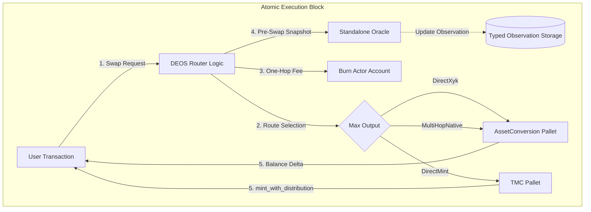

# DEOS Router: Minimalist Multi-Token Routing Architecture

> **On-Chain Account** (PalletId: `axialrt0`)
>
> - SS58: `5EYCAe5fjMgntj8Tch49FZ3RXMR1XiQbrSA1z2oYgQAiXukN`
> - Hex: `0x6d6f646c617869616c7274300000000000000000000000000000000000000000`

## Executive Summary

DEOS Router is a specialized `Deterministic Economic Automaton` designed for TMC (Token Minting Curve) ecosystems. Unlike general-purpose aggregators, it operates as a strict `Decision Engine` atop the parachain's internal liquidity. Its Cargo package is `pallet-deos-router` at `template/pallets/router`; the Rust crate and runtime API retain the stable `pallet_axial_router` identity.

It enforces a `Mechanism-Over-Policy` routing rule: it evaluates every viable path and always selects the route that delivers the most output to the recipient, arbitrating between Market Liquidity (XYK pools) and Protocol Liquidity (TMC curves), using the Native token as the sole multi-hop anchor.

## Architecture Overview

### Design Philosophy

1.  `Stateless Execution` - Zero intermediate buffers; logic operates purely on input balances.
2.  `Pre-Execution Observation` - EMA inputs snapshot pool reserves before the current execution; they do not prove an external fair price or unmanipulated prior state.
3.  `Balance-Delta Verification` - Execution results are verified via physical balance deltas rather than theoretical quotes.
4.  `Native-Only Anchor` - Reduces graph complexity by using Native token as the universal hub.
5.  `Anti-Self-Taxation` - Router's own account is exempt from fees to prevent recursive deductions during system operations.

### System Architecture



### Swap Execution Flow

The `swap` extrinsic delegates to `execute_swap_for()`, the shared entry point for both user and system swaps:

1. `Extrinsic Validation`: `amount_in >= MinSwapForeign`, `block <= deadline`.
2. `Core Validation`: `from != to`, `amount_in > 0`.
3. `Fee Calculation`: Zero for fee-exempt system accounts (Burn Actor, liquidity actors, Router); `Perbill`-based for users.
4. `Gross-Debit Preflight`: Users must be able to pay the full `amount_in` under the selected preservation policy before any state-mutating swap path begins.
5. `Route Selection`: `find_optimal_route()` evaluates all candidates and selects the route with the highest `expected_output` (pure mechanism: best price to the user).
6. `Price Protection`: Validate recipient output against local EMA-reference and slippage bounds; neither proves an external fair price.
7. `Fee Collection`: One-hop transfer from user to the Burn Actor via `FeeAdapter::route_fee()`, inside the same transactional flow as the swap.
8. `Pre-Swap Oracle Update`: Snapshot pool reserves and update EMA prices _before_ trade execution.
9. `Execution`: Dispatch to XYK adapter or TMC `mint_with_distribution`. System accounts use `keep_alive=false` (can drain balances); users use `keep_alive=true`.
10. `Event Emission`: `SwapExecuted { who, from, to, amount_in, amount_out }`, where `amount_out` is the amount delivered to `recipient` (for DirectMint, excluding protocol/sink allocation).

`Public API`: `execute_swap_for(who, from, to, amount_in, min_amount_out, recipient)` — callable by other pallets or System AAA adapters for burn/liquidity actor swaps with automatic fee exemption and keep-alive awareness.

`Native Exact-Output Boundary`: `AssetConversionApi` exposes one-pool reverse quotes plus path execution returning actual input spent. `quote_exact_out` evaluates at most direct XYK and one reverse-quoted Native-anchored path, selects minimum required post-fee input, and adds the caller-aware router fee. `execute_exact_out_for` enforces the total-input cap transactionally and reports actual total spend. Direct TMC mint remains exact-input only because it cannot promise an exact recipient amount.

`Authoritative View Surfaces`: `quote_exact_input(who, from, to, amount_in)` returns `RouterQuote`; `quote_exact_out(who, from, to, amount_out)` returns `ExactOutputQuote`. Both expose input, router fee, post-fee input, recipient output, mechanism, bounded path, price impact, and known fees without mutating state. Exact input compares maximum recipient output across XYK, TMC, and Native-anchored candidates; exact output compares minimum required input across its two native XYK candidates.

## Core Components

### Path Discovery & Route Selection

The router utilizes a `Lazy Discovery` algorithm via `find_optimal_route()`. It evaluates up to 3 candidate routes and selects the one that delivers the most output (pure mechanism selection, per the project `Mechanism-Over-Policy` rule):

- `Direct XYK`: `DirectXyk { pool_id }`; pool exists for `(from, to)` pair
- `Direct Mint`: `DirectMint { foreign_asset }`; TMC curve exists for `to` and accepts `from` as collateral
- `Multi-Hop`: `MultiHopNative { hops }`; non-native pair routed through both native pools

### Route Selection Policy

The router is a pure execution mechanism: it always picks the candidate route with the highest `expected_output`, i.e. the best price for the user. This is a deliberate `Mechanism-Over-Policy` choice — the router does not impose a quality/impact-weighted policy on top of price.

`RouteComparison` still carries `price_impact` and `total_fees` fields, but only as informational quote fields surfaced to clients via `RouterQuote`. Price impact is approximated against EMA oracle prices for direct routes, or against a hypothetical direct quote for multi-hop routes. TMC routes report zero price impact (deterministic pricing). These fields do not influence route selection.

### Fee Architecture

| Property | Value |
| --- | --- |
| `Default Fee` | `0.5%` (`Perbill::from_parts(5_000_000)`) |
| `Math` | `Perbill::mul_floor(amount_in)` — overflow-safe |
| `Routing` | One-hop: `User → Burn Actor` (no intermediate buffer) |
| `Governance` | Updatable via `update_router_fee` within `MaxRouterFee` |
| `Self-Taxation` | Router and System AAA actor accounts are fee-exempt via `is_fee_exempt()` |

The `FeeRoutingAdapter` trait provides the transfer interface:

```rust
pub trait FeeRoutingAdapter<AccountId, Balance> {
  fn route_fee(who: &AccountId, asset: AssetKind, amount: Balance) -> DispatchResult;
}
```

Runtime implementation (`FeeManagerImpl`) dispatches to `Currency::transfer` for Native or `Assets::transfer` with `Preservation::Protect` for Local/Foreign assets.

## Trait Interfaces

The pallet is fully decoupled from concrete implementations through 4 trait boundaries:

### AssetConversionApi

```rust
pub trait AssetConversionApi<AccountId, Balance> {
  fn get_pool_id(asset_a: AssetKind, asset_b: AssetKind) -> Option<(AssetKind, AssetKind)>;
  fn get_pool_reserves(pool_id: (AssetKind, AssetKind)) -> Option<(Balance, Balance)>;
  fn quote_price_exact_tokens_for_tokens(
    asset_in: AssetKind, asset_out: AssetKind, amount_in: Balance, include_fee: bool,
  ) -> Option<Balance>;
  fn swap_exact_tokens_for_tokens(
    who: AccountId, path: Vec<AssetKind>, amount_in: Balance,
    min_amount_out: Balance, recipient: AccountId, keep_alive: bool,
  ) -> Result<Balance, DispatchError>;
}
```

Runtime `AssetConversionAdapter` wraps `pallet_asset_conversion` with `Balance-Delta Verification`: it snapshots recipient balance before swap, executes, and returns `balance_after - balance_before` instead of theoretical quotes.

### TmcInterface

```rust
pub trait TmcInterface<AccountId, Balance> {
  fn has_curve(asset: AssetKind) -> bool;
  fn supports_collateral(token_asset: AssetKind, foreign_asset: AssetKind) -> bool;
  fn calculate_recipient_receives(token_asset: AssetKind, foreign_amount: Balance) -> Result<Balance, DispatchError>;
  fn mint_with_distribution(
    who: &AccountId, recipient: &AccountId, token_asset: AssetKind,
    foreign_asset: AssetKind, foreign_amount: Balance,
  ) -> Result<Balance, DispatchError>;
}
```

Runtime `TmcPalletAdapter` delegates mint execution to `pallet_tmc::Pallet::<T>` but exposes router-facing quote/return values as recipient allocation rather than total curve emission.

### PriceOracle

```rust
pub trait PriceOracle<Balance> {
  fn update_ema_price(asset_in: AssetKind, asset_out: AssetKind, price: Balance) -> Result<(), DispatchError>;
  fn get_ema_price(asset_in: AssetKind, asset_out: AssetKind) -> Option<Balance>;
  fn validate_price_deviation(asset_in: AssetKind, asset_out: AssetKind, current_price: Balance) -> Result<(), DispatchError>;
}
```

Runtime `PriceOracleImpl` maps the Router interface to pre-admitted directional `pallet-oracle` feeds. Missing feeds preserve the valid User-swap baseline without implicit registration; initialized observations provide deviation and price-impact references.

### FeeRoutingAdapter

```rust
pub trait FeeRoutingAdapter<AccountId, Balance> {
  fn route_fee(who: &AccountId, asset: AssetKind, amount: Balance) -> DispatchResult;
}
```

Runtime `FeeManagerImpl` performs direct `Currency::transfer` (Native) or `Assets::transfer` with `Preservation::Protect` (Local/Foreign) to the Burn Actor account.

## DEOS Oracle Integration

### Storage

`pallet-oracle::Observations` owns current EMA value, update block, and revision under the typed directional feed ID. `Feeds` owns immutable method, aggregation, scale, producer, provenance, zero policy, and lifecycle.

The Router no longer declares local EMA value or update-block storage. Oracle metadata and observations own the complete typed price-observation state.

Canonical local-pool indexing admits two initially uninitialized `pallet-oracle` identities: ordered forward and reverse feeds at scale `12`, `PreExecutionSpot`, EMA half-life `100`, and DEOS Router pallet-account provenance. Re-indexing requires an exact immutable match and adds no duplicate. The LP index plus both feed registrations share one transaction, and top-level pool calls declare two worst-case oracle registration Weight envelopes.

`PriceOracleImpl<Runtime>` publishes pre-execution samples through the DEOS Router pallet account and reads current standalone EMA truth. The System AAA reference guard consumes Fresh observations and otherwise falls back to direct reserves.

TVL is not oracle-smoothed — it is read directly from pool reserves via `get_pool_reserves()` during route selection, always reflecting the current on-chain state.

### EMA Update Logic (Runtime Adapter)

The oracle package applies the Router-compatible time-weighted smoothing formula:

```
EMA_new = α × spot_price + (1 - α) × EMA_previous
```

Where `α = elapsed_blocks / (EmaHalfLife + elapsed_blocks)` uses `Perbill` floor arithmetic and `elapsed_blocks = max(current - updated_at, 1)`. Presence of an observation distinguishes initialization; the first sample becomes the value directly.

### Pre-Swap DEOS Oracle Invariant

Oracle updates execute before the current swap modifies reserves and record that pre-execution pool ratio. Prior transactions may already have moved or manipulated the pool, so this snapshot is not a fair-price or ordering guarantee:

```rust
fn update_oracle_from_reserves(from: AssetKind, to: AssetKind) -> Result<(), Error<T>> {
  if let Some(pool_id) = T::AssetConversion::get_pool_id(from, to) {
    if let Some((res_a, res_b)) = T::AssetConversion::get_pool_reserves(pool_id) {
      let (reserve_in, reserve_out) = if pool_id.0 == from {
        (res_a, res_b)
      } else {
        (res_b, res_a)
      };
      if !reserve_in.is_zero() {
        let spot_price = reserve_out
          .saturating_mul(T::Precision::get())
          .saturating_div(reserve_in);
        T::PriceOracle::update_ema_price(from, to, spot_price)?;
      }
    }
  }
  Ok(())
}
```

### Price Deviation Validation

`validate_price_deviation` computes `|current_price - ema_price| / ema_price` as `Perbill` and rejects if it exceeds `MaxPriceDeviation` (default 20%). When no EMA data exists yet, validation is skipped.

## Price-Observation Ownership Decision

The historical `0.7.6` extraction gate remained a no-go. The current `0.7.9` line provides bounded pair admission, typed status/provenance, Router publication, current-value reads, and System-AAA freshness semantics. This remains local-pool observation rather than generalized market truth.

| Dimension | Current owner and contract |
| --- | --- |
| Values | Oracle `Observations`, directional typed feed ID, `u128`, absence as Uninitialized |
| Time | Oracle observation `updated_at`, same directional feed identity |
| Cardinality | Canonical pool admission permits at most 500 complete bidirectional pairs under the 1,001-feed producer bound |
| Initialization | First nonzero observation replaces zero EMA directly |
| Update | `elapsed = max(current - last, 1)`; `alpha = elapsed / (EmaHalfLife + elapsed)`; spot ratio uses saturating `Balance` multiplication and division |
| Ordering | Direct route validates against the previous EMA, collects fee, snapshots pre-execution reserves into EMA, then executes; transaction rollback covers failure |
| Direction | Only the executed `from -> to` key updates; reverse state remains independent |
| Router consumers | Direct-route deviation and informational direct-route price impact; multi-hop deviation uses slippage rather than EMA |
| AAA consumer | System reference guard accepts a Fresh nonzero standalone observation through age 100, otherwise direct-reserve fallback, then fails Temporary if neither exists |
| Governance | Canonical pool indexing admits exact immutable feed configurations; Router governance controls only the bounded fee rate |
| History | Changed values emit bounded current-revision events; archive/history remains materialized-provider work |

Router-local observation storage, tracking calls, metadata, and generated weights have been removed. The non-noop AAA dirty hook binds at Oracle publication. The composed failed-swap regression installs a real subscriber and preserves pre-execution ordering, directional math, Router outcomes, System-AAA freshness behavior, and whole-swap rollback including exact AAA dirty-map and active-list state. General feeds, arbitrary bytes, callbacks, off-chain correctness, multi-source quorum, and AAA oracle predicates remain outside that price-only candidate.

## Storage Summary

| Storage | Type | Description |
| --- | --- | --- |
| `RouterFee<T>` | `StorageValue<Perbill>` | Current bounded governance fee rate |
| `LpPairByTokenId<T>` | `StorageMap` | Reverse index from LP token ID to canonical pool pair |

## Extrinsics

| Call Index | Extrinsic | Origin | Weight |
| --- | --- | --- | --- |
| `0` | `swap(from, to, amount_in, min_amount_out, recipient, deadline)` | Signed | Benchmarked |
| `1` | `update_router_fee(new_fee)` | AdminOrigin (Root) | Benchmarked |

## Events

| Event | Fields | Trigger |
| --- | --- | --- |
| `SwapExecuted` | `who, from, to, amount_in, amount_out` | Successful swap; `amount_out` is recipient output |
| `FeeCollected` | `asset, amount, source, collector` | Fee routed to Burn Actor |
| `RouterFeeUpdated` | `old_fee, new_fee` | Governance updates fee |

## Errors

| Error | Trigger |
| --- | --- |
| `NoRouteFound` | No pool or TMC curve available for the pair |
| `IdenticalAssets` | `from == to` |
| `ZeroAmount` | `amount_in == 0` |
| `AmountTooLow` | `amount_in < MinSwapForeign` |
| `SlippageExceeded` | recipient output < `min_amount_out` |
| `DeadlinePassed` | `current_block > deadline` |
| `FeeRoutingFailed` | Fee transfer to Burn Actor failed |
| `PriceDeviationExceeded` | Spot price deviates from EMA beyond threshold |
| `RouterFeeTooHigh` | New router fee exceeds `MaxRouterFee` |

## Configuration Constants

All constants are sourced from `primitives::ecosystem` — single source of truth:

| Constant | Value | Source |
| --- | --- | --- |
| `PalletId` | `*b"axialrt0"` | `ecosystem::pallet_ids::AXIAL_ROUTER_PALLET_ID` |
| `DefaultRouterFee` | `Perbill::from_parts(5_000_000)` (0.5%) | `ecosystem::params::AXIAL_ROUTER_FEE` |
| `MaxRouterFee` | `Perbill::from_percent(1)` | `ecosystem::params::MAX_AXIAL_ROUTER_FEE` |
| `Precision` | `1_000_000_000_000` (10¹²) | `ecosystem::params::PRECISION` |
| `EmaHalfLife` | `100` blocks (~10 min @ 6s/block) | `ecosystem::params::EMA_HALF_LIFE_BLOCKS` |
| `MaxPriceDeviation` | `Perbill::from_percent(20)` | `ecosystem::params::MAX_PRICE_DEVIATION` |
| `MaxHops` | `3` | `ecosystem::params::MAX_HOPS` |
| `MinSwapForeign` | `1_000_000_000_000` (1.0 token) | `ecosystem::params::MIN_SWAP_FOREIGN` |

## Genesis Configuration

```rust
pub struct GenesisConfig<T: Config> {
  pub _marker: PhantomData<T>,
}
```

Genesis calls `inc_providers` on the pallet account so the account survives zero native balance without Router-owned economic state.

## DEOS Router Read-Model Contract

This subsystem follows the project-wide [`read-model.contract.en.md`](../../../../docs/read-model.contract.en.md) split.

### Canonical on-chain router projections

The current runtime already provides chain-native bounded reads for live routing truth through:

- `RouterFee` and `LpPairByTokenId`
- Typed Oracle feed metadata and current observations for known directional pairs
- Current pool reserves / LP state from `pallet-asset-conversion` for known pools
- Current TMC curve existence for the direct-mint branch on known assets
- Direct swap execution outcome via events and live balance changes

These are the authoritative bounded surfaces for current fee policy, tracked-pair oracle state, and execution-time liquidity truth.

### Indexed / materialized router views

The router intentionally does **not** promise these as canonical on-chain surfaces:

- Volume charts and TVL history
- Fee-revenue time series
- Route-quality dashboards and historical execution comparisons
- Long-range per-pair analytics or leaderboard-style market views

Those belong to events plus external indexing/materialization rather than extra runtime storage.

### Current launch-line decision for quote and route discovery

For the current launch line, exact-input and exact-output XYK route discovery are bounded canonical on-chain projections through `quote_exact_input(who, from, to, amount_in)` and `quote_exact_out(who, from, to, amount_out)`.

Why:

- The runtime owns the canonical routing and execution policy
- The view function mirrors caller-aware fee handling and current route selection without mutating oracle state
- Consumers should use this bounded view instead of duplicating router math or reconstructing route truth from raw storage

So the current product contract is:

- `actual swap execution result` -> canonical on-chain
- `current exact-input quote / route preview` -> canonical bounded on-chain projection
- `history, trends, route-quality analytics, and broad discovery` -> indexed/materialized surface

If a future launch line wants wider quote families, multi-scenario simulation, or historical route comparison, it SHOULD add explicit bounded projections or materialized provider contracts rather than letting ad-hoc client math become the de facto standard.

## Runtime Adapters

The runtime (`axial_router_config.rs`) provides 4 concrete adapter implementations:

| Adapter | Trait | Strategy |
| --- | --- | --- |
| `AssetConversionAdapter` | `AssetConversionApi` | Wraps `pallet_asset_conversion` with Balance-Delta Verification |
| `TmcPalletAdapter<T>` | `TmcInterface` | Direct delegation to `pallet_tmc` |
| `PriceOracleImpl<Runtime>` | `PriceOracle` | Typed publish/read delegation to standalone Oracle feeds |
| `FeeManagerImpl<T>` | `FeeRoutingAdapter` | Direct transfer to Burn Actor (`Preservation::Protect`) |

## Test Coverage

### Unit Tests

- `Fee Math`: `router_fee_calculation_logic`, `large_amount_fee_calculation`, `zero_amount_fee_calculation`, `updated_fee_is_used_in_calculations`.
- `Route Intelligence`: `router_intelligence_test` — verifies XYK preferred when output > TMC, TMC preferred when output > XYK.
- `Protection`: `circular_swap_protection_test`, `slippage_protection_test`, `round_trip_buy_sell_is_net_negative_test` — characterizes round-trip execution cost (router fees both legs plus AMM curvature). This is an execution-cost check, not a sandwich/MEV-resistance guarantee; this launch line has no commit/reveal or frontrunning-ordering protection.
- `Governance`: `governance_can_update_router_fee`, `only_governance_can_update_router_fee`.
- `Adapter Contracts`: `fee_routing_adapter_test`, `price_oracle_test`, `tmc_interface_test`, `asset_conversion_api_test`.
- `Integration Math`: `tmctol_integration_flow`, `tmctol_parameter_validation`, `precision_constant_validation`.
- `Multi-Hop Routing` (8 tests):
  - `multi_hop_swap_dot_native_usdc` — end-to-end DOT → Native → USDC via multi-hop.
  - `multi_hop_output_matches_sequential_hops` — verifies output equals manual two-hop XYK math.
  - `multi_hop_slippage_protection` — unreachable min_amount_out triggers `SlippageExceeded`.
  - `multi_hop_not_used_when_direct_pool_exists` — direct route wins when it gives better output.
  - `multi_hop_no_route_when_intermediate_pool_missing` — fails with `NoRouteFound` when a leg is missing.
  - `multi_hop_skipped_when_one_leg_is_native` — DOT → Native uses `DirectXyk`, not multi-hop.
  - `multi_hop_fee_collected_once` — fee charged once at entry, not per hop.
  - `multi_hop_pool_reserves_update_correctly` — verifies both pools' reserves reflect the two-hop trade.

### Integration Tests

Located in `runtime/src/tests/axial_router_integration_tests.rs`:

- Basic swap, fee processing, anti-self-taxation, error handling, native token swaps, fee calculation accuracy, minimum amount protection, direct fee processing, consistent fee burning, multiple accumulation cycles, fee collection only on success, path validation, empty pools, events.
- `Multi-Hop` (3 tests): real ASSET_A → Native → ASSET_B swap with balance verification, fee-collected-once across hops, NoRouteFound when second pool is missing.

### Benchmarks

`swap` and `update_router_fee` use generated V2 runtime weights. The swap benchmark includes standalone Oracle publication and the subscriber-independent AAA change hook through admitted directional pool feeds.

Production `50 × 20` generation measures `swap` at `323,020,000 / 10,609`, 22 reads, and 11 writes. `update_router_fee` measures `11,244,000 / 1,489`, one read, and one write. Accepted Router weights SHA-256 is `7b5eaef584f58154ff3aebb3d247ca1ad2c8763c221ebf11a8cdcefd3e5e1b0a`; these fixed paths imply no route or actor throughput.

## Conclusion

DEOS Router is the central execution gateway of the TMCTOL economic model. `Pre-Swap Oracle Updates` provide bounded local observations, and `One-Hop Fee Routing` keeps fee collection atomic. Viable routes compete by maximum recipient output. The EMA snapshot and deviation guard do not establish external fair price, prevent prior pool manipulation, or protect transaction ordering; user slippage and authored output/input bounds remain independent controls.

---

- `Last Updated`: July 2026
