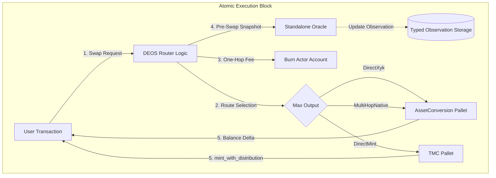

# DEOS Router: Minimalist Multi-Token Routing Architecture

> **On-Chain Account** (PalletId: `router00`)
>
> - SS58: `5EYCAe5j8X3dxkxG3NE9Yzf561FKmh4XYPRgrjz26bNojgZ6`
> - Hex: `0x6d6f646c726f7574657230300000000000000000000000000000000000000000`

## Executive Summary

DEOS Router is a specialized `Deterministic Economic Automaton` designed for TMC (Token Minting Curve) ecosystems. Unlike general-purpose aggregators, it operates as a strict `Decision Engine` atop the parachain's internal liquidity. Its Cargo package is `pallet-deos-router` at `template/pallets/router`; the Rust crate and runtime API retain the stable `pallet_deos_router` identity.

It enforces a `Mechanism-Over-Policy` routing rule: it evaluates every viable path and always selects the route that delivers the most output to the recipient, arbitrating between Market Liquidity (XYK pools) and Protocol Liquidity (TMC curves), using the Native token as the sole multi-hop anchor.

## Architecture Overview

### Design Philosophy

1.  `Stateless Execution` - Zero intermediate buffers; logic operates purely on input balances.
2.  `Pre-Execution Observation` - EMA inputs snapshot pool reserves before the current execution; they do not prove an external fair price or unmanipulated prior state.
3.  `Balance-Delta Verification` - Execution results are verified via physical balance deltas rather than theoretical quotes.
4.  `Native-Only Anchor` - Reduces graph complexity by using Native token as the universal hub.
5.  `Anti-Self-Taxation` - Router's own account is exempt from fees to prevent recursive deductions during system operations.

### System Architecture



### Swap Execution Flow

The `swap` extrinsic delegates to `execute_swap_for()`, the shared entry point for both user and system swaps:

1. `Extrinsic Validation`: `amount_in >= MinSwapForeign`, `block <= deadline`.
2. `Core Validation`: Both endpoints are canonical, their `LedgerAssetKey`s differ, and `amount_in > 0`.
3. `Fee Calculation`: Zero for fee-exempt system accounts (Burn Actor, liquidity actors, Router); `Perbill`-based for users.
4. `Gross-Debit Preflight`: Users must be able to pay the full `amount_in` under the selected preservation policy before any state-mutating swap path begins.
5. `Route Selection`: `find_optimal_route()` evaluates all candidates and selects the route with the highest `expected_output` (pure mechanism: best price to the user).
6. `Price Protection`: Validate recipient output against local EMA-reference and slippage bounds; neither proves an external fair price.
7. `Fee Collection`: One-hop transfer from user to the Burn Actor via `FeeAdapter::route_fee()`, inside the same transactional flow as the swap.
8. `Pre-Swap Oracle Update`: Snapshot pool reserves and update EMA prices _before_ trade execution.
9. `Execution`: Dispatch to XYK adapter or TMC `mint_with_distribution`. System accounts use `keep_alive=false` (can drain balances); users use `keep_alive=true`.
10. `Outcome`: Execution constructs `RouterOutcome` from committed actual facts. `SwapExecuted` carries caller, request endpoints, and that complete outcome directly, so route family, prepared legs, amounts, fee, and Weight class retain one meaning.

`Public API`: Signed calls expose exact input at index `0` and exact output at index `2`; both delegate to `execute_swap_for(...)` or `execute_exact_out_for(...)` and emit one `RouterOutcome`. Exact output applies `max_amount_in` to Router fee plus routed XYK input. The outcome carries selected family, prepared legs, actual total/routed input, fee, recipient output, and route Weight class.

`PreparedRoute` remains a public Rust package type solely for the deterministic conformance-vector example and independent consumer tooling. No call, event, storage item, or runtime API exposes it, so it does not form part of runtime metadata ABI; execution constructs it only inside the transaction.

System Actor adapters preserve actual input/output facts in `DexSwapOutcome`. They derive authored slippage bounds and retain System-only reference policy, but they do not call a second Router path validator or own route preparation. The guard first reads its independent Fresh Oracle observation and lazily reads direct reserves only when that observation is absent, stale, uninitialized, or zero; it never treats the selected execution quote as its own reference.

Router owns economic execution Weight and returns the committed route class and actual outcome; it does not own Actor Control, FIFO service, or block-share policy. A host Actors adapter reserves the Router maximum from Shared Economic capacity before dispatch, then reports the canonical generated Router effect Weight as valid actual evidence for transactional reclaim. Failed or inconsistent actual evidence rolls back the Actor attempt. The DEOS equal-thirds split is runtime composition in `docs/actors.integration.en.md`, not Router package semantics.

`Native Exact-Output Boundary`: `AssetConversionApi` exposes one-pool reverse quotes and execution returning `ExactOutputExecution { amount_in, recipient_amount_out }` from measured caller and recipient deltas.

`quote_exact_out` evaluates at most direct XYK and one reverse-quoted Native-anchored path, selects minimum required post-fee input, and adds the caller-aware Router fee. Execution enforces total-input and recipient-output bounds against actual deltas. Direct TMC mint remains exact-input only because it cannot promise an exact recipient amount.

`Authoritative View Surfaces`: bounded FRAME view functions `quote_exact_input(...)` and `quote_exact_out(...)` return `RouterQuote` and `ExactOutputQuote`. RPC consumers invoke them at an explicit block hash; that transport `at` hash supplies state identity outside the SCALE payload.

Both expose input, Router fee, routed input, recipient output, canonical `RouteFamily`, bounded path and legs, price impact, and known fees without mutation. Exact input maximizes recipient output across three candidates. Exact output minimizes required input across its two XYK candidates.

## Core Components

### Path Discovery & Route Selection

The router utilizes a `Lazy Discovery` algorithm via `find_optimal_route()`. It evaluates up to 3 candidate routes and selects the one that delivers the most output (pure mechanism selection, per the project `Mechanism-Over-Policy` rule):

- `Direct XYK`: `RouteFamily::DirectXyk` with one prepared XYK leg
- `Direct Mint`: `RouteFamily::DirectMint` with one prepared TMC mint leg
- `Native-Anchored XYK`: `RouteFamily::NativeAnchoredXyk` with two prepared XYK legs

### Route Selection Policy

The router is a pure execution mechanism: it always picks the candidate route with the highest `expected_output`, i.e. the best price for the user. This is a deliberate `Mechanism-Over-Policy` choice — the router does not impose a quality/impact-weighted policy on top of price.

Both selectors construct `PreparedRoute` with canonical family, bounded legs, total input, Router fee, routed input, recipient output, and Weight class. Quote paths derive from leg order. Price impact and known fees exist only on quote projections and do not enter prepared identity or comparison.

`PreparedLegs` records canonical pool, ordered assets, and quoted input/output in execution order. No parallel object duplicates pool, collateral, or Native-anchor identity. Preparation rejects any mismatch among family, leg order, Native anchor, or adapter-supplied pool ID.

Execution consumes `PreparedRoute` directly. Native-anchored exact-input preparation quotes each actual leg once and derives output from the final leg. It performs no separate availability or route-output quote pass.

Price impact remains informational and TMC reports zero. Protection validates every prepared XYK leg against its directional reference. TMC bypasses XYK checks; System Actor reference policy remains outside Router ownership.

### Fee Architecture

| Property | Value |
| --- | --- |
| `Default Fee` | `0.5%` (`Perbill::from_parts(5_000_000)`) |
| `Math` | `Perbill::mul_floor(amount_in)` — overflow-safe |
| `Routing` | One-hop: `User → Burn Actor` (no intermediate buffer) |
| `Governance` | Updatable via `update_router_fee` within `MaxRouterFee` |
| `Self-Taxation` | Router and System Actor accounts are fee-exempt via `is_fee_exempt()` |

Exact-output gross-up uses checked `U256` ceiling division against the retained Perbill and narrows exactly; route fee additions, fee subtraction, LP cardinality narrowing, and leg indexing return typed invariant/arithmetic errors instead of saturation. Informational impact uses shared `checked_scaled_ratio`; an unrepresentable product reports maximum impact rather than false zero. Runtime integrity requires nonzero precision, nonzero LP capacity, and a maximum fee strictly below one.

The `FeeRoutingAdapter` trait provides the transfer interface:

```rust
pub trait FeeRoutingAdapter<AccountId, Balance> {
  fn route_fee(who: &AccountId, asset: AssetKind, amount: Balance) -> Result<(), AdapterFailure>;
}
```

Runtime implementation (`FeeManagerImpl`) dispatches to `Currency::transfer` for Native or `Assets::transfer` with `Preservation::Protect` for Local/Foreign assets.

## Trait Interfaces

The pallet is fully decoupled from concrete implementations through 4 trait boundaries:

### AssetConversionApi

```rust
pub trait AssetConversionApi<AccountId, Balance> {
  fn single_pool_id(asset_a: AssetKind, asset_b: AssetKind) -> Option<(AssetKind, AssetKind)>;
  fn single_pool_reserves(pool_id: (AssetKind, AssetKind)) -> Option<(Balance, Balance)>;
  fn quote_single_pool_exact_input(
    asset_in: AssetKind, asset_out: AssetKind, amount_in: Balance, include_fee: bool,
  ) -> Option<Balance>;
  fn quote_single_pool_exact_output(
    asset_in: AssetKind, asset_out: AssetKind, amount_out: Balance, include_fee: bool,
  ) -> Option<Balance>;
  fn execute_single_pool_exact_input(
    who: AccountId, asset_in: AssetKind, asset_out: AssetKind, amount_in: Balance,
    min_amount_out: Balance, recipient: AccountId, keep_alive: bool,
  ) -> Result<Balance, AdapterFailure>;
  fn execute_single_pool_exact_output(
    who: AccountId, asset_in: AssetKind, asset_out: AssetKind, amount_out: Balance,
    max_amount_in: Balance, recipient: AccountId, keep_alive: bool,
  ) -> Result<ExactOutputExecution, AdapterFailure>;
}
```

Runtime `AssetConversionAdapter` wraps `pallet_asset_conversion` with `Balance-Delta Verification`: it snapshots recipient balance before swap, executes, and returns `balance_after - balance_before` instead of theoretical quotes. Known pool absence, empty-liquidity, capacity, and protection errors remain state-dependent typed failures; unknown market errors fail closed as permanent invariants.

### TmcInterface

```rust
pub trait TmcInterface<AccountId, Balance> {
  fn has_curve(asset: AssetKind) -> bool;
  fn supports_collateral(token_asset: AssetKind, foreign_asset: AssetKind) -> bool;
  fn calculate_recipient_receives(token_asset: AssetKind, foreign_amount: Balance) -> Result<Balance, AdapterFailure>;
  fn mint_with_distribution(
    who: &AccountId, recipient: &AccountId, token_asset: AssetKind,
    foreign_asset: AssetKind, foreign_amount: Balance,
  ) -> Result<Balance, AdapterFailure>;
}
```

Runtime `TmcPalletAdapter` delegates mint execution to `pallet_tmc::Pallet::<T>` but exposes router-facing quote/return values as recipient allocation rather than total curve emission.

### PriceOracle

```rust
pub trait PriceOracle<Balance> {
  fn update_ema_price(asset_in: AssetKind, asset_out: AssetKind, price: Balance) -> Result<(), AdapterFailure>;
  fn get_ema_price(asset_in: AssetKind, asset_out: AssetKind) -> Option<Balance>;
  fn validate_price_deviation(asset_in: AssetKind, asset_out: AssetKind, current_price: Balance) -> Result<(), AdapterFailure>;
}
```

Runtime `PriceOracleImpl` maps the Router interface to pre-admitted directional `pallet-oracle` feeds. Missing feeds preserve the valid User-swap baseline without implicit registration; initialized observations provide deviation and price-impact references. Paused publication and bounded dirty-ingress capacity remain retryable, while producer, feed, arithmetic, and dirty-topology errors remain permanent.

### FeeRoutingAdapter

```rust
pub trait FeeRoutingAdapter<AccountId, Balance> {
  fn route_fee(who: &AccountId, asset: AssetKind, amount: Balance) -> Result<(), AdapterFailure>;
}
```

Runtime `FeeManagerImpl` performs direct `Currency::transfer` (Native) or `Assets::transfer` with `Preservation::Protect` (Local/Foreign) to the Burn Actor account.

## DEOS Oracle Integration

### Storage

`pallet-oracle::Observations` owns current EMA value, update block, and revision under the typed directional feed ID. `Feeds` owns immutable method, aggregation, scale, producer, provenance, zero policy, and lifecycle.

The Router no longer declares local EMA value or update-block storage. Oracle metadata and observations own the complete typed price-observation state.

Canonical local-pool indexing admits two initially uninitialized `pallet-oracle` identities: ordered forward and reverse feeds at scale `12`, `PreExecutionSpot`, EMA half-life `100`, and DEOS Router pallet-account provenance. Re-indexing requires an exact immutable match and adds no duplicate. The LP index plus both feed registrations share one transaction, and top-level pool calls declare two worst-case oracle registration Weight envelopes.

`PriceOracleImpl<Runtime>` publishes pre-execution samples through the DEOS Router pallet account and reads current standalone EMA truth. The System Actors reference guard consumes Fresh observations and only then falls back to direct reserves, avoiding the duplicate reserve lookup on the normal Fresh path while retaining an independently sourced safety reference.

TVL is not oracle-smoothed — it is read directly from pool reserves via `get_pool_reserves()` during route selection, always reflecting the current on-chain state.

### EMA Update Logic (Runtime Adapter)

The oracle package applies the Router-compatible time-weighted smoothing formula:

```
EMA_new = α × spot_price + (1 - α) × EMA_previous
```

Where `α = elapsed_blocks / (EmaHalfLife + elapsed_blocks)` uses `Perbill` floor arithmetic and `elapsed_blocks = max(current - updated_at, 1)`. Presence of an observation distinguishes initialization; the first sample becomes the value directly.

### Pre-Swap DEOS Oracle Invariant

Both intents traverse `PreparedLegs`, publish each directional pre-execution pool ratio, and execute that exact leg before advancing. Direct XYK publishes one ratio, Native-anchored XYK publishes two in execution order, and direct TMC mint publishes none. Both pallet-facing execution owners carry `#[transactional]`; fee routing, publication and Actors dirty ingress, every market leg, actual-bound verification, and success-event emission share that transaction. Prior transactions may already have moved or manipulated the pool, so this snapshot is not a fair-price or ordering guarantee:

```rust
fn update_oracle_from_reserves(from: AssetKind, to: AssetKind) -> Result<(), Error<T>> {
  if let Some(pool_id) = T::AssetConversion::get_pool_id(from, to) {
    if let Some((res_a, res_b)) = T::AssetConversion::get_pool_reserves(pool_id) {
      let (reserve_in, reserve_out) = if pool_id.0 == from {
        (res_a, res_b)
      } else {
        (res_b, res_a)
      };
      let spot_price = primitives::checked_scaled_ratio(
        reserve_out,
        reserve_in,
        T::Precision::get(),
      ).ok_or(Error::<T>::InvalidOracleData)?;
      T::PriceOracle::update_ema_price(from, to, spot_price)?;
    }
  }
  Ok(())
}
```

Package fault tests keep mock pool reserves, Oracle publication state, and fee receipts inside externalities-backed storage rather than non-transactional thread-local maps. A second-leg execution fault or second-publication fault therefore proves exact storage-root restoration across both pools, both directional publication attempts, routed fees, balances, issuance, and events; call-trace switches remain outside consensus state only to prove the fault checkpoint was reached.

### Price Deviation Validation

`validate_price_deviation` computes `|current_price - ema_price| / ema_price` as `Perbill` and rejects if it exceeds `MaxPriceDeviation` (default 20%). When no EMA data exists yet, validation is skipped.

## Price-Observation Ownership Decision

The standalone Oracle provides bounded pair admission, typed status/provenance, Router publication, current-value reads, and System Actor freshness semantics. This remains local-pool observation rather than generalized market truth.

| Dimension | Current owner and contract |
| --- | --- |
| Values | Oracle `Observations`, directional typed feed ID, `u128`, absence as Uninitialized |
| Time | Oracle observation `updated_at`, same directional feed identity |
| Cardinality | Canonical pool admission permits at most 500 complete bidirectional pairs under the 1,001-feed producer bound |
| Initialization | First nonzero observation replaces zero EMA directly |
| Update | `elapsed = max(current - last, 1)`; `alpha = elapsed / (EmaHalfLife + elapsed)`; spot and quoted ratios use shared `checked_scaled_ratio` with `U256` intermediates, exact narrowing, and fail-closed zero-denominator or overflow handling |
| Ordering | Direct route validates against the previous EMA, collects fee, snapshots pre-execution reserves into EMA, then executes; transaction rollback covers failure |
| Direction | Every prepared XYK leg updates its ordered `asset_in -> asset_out` key in execution order; reverse state remains independent |
| Router consumers | Per-leg XYK deviation and informational price impact; direct TMC mint has no XYK reference or publication |
| Actors consumer | System reference guard accepts a Fresh nonzero standalone observation through age 100; only an unavailable Fresh value triggers direct-reserve fallback, and absence of both fails Temporary |
| Governance | Canonical pool indexing admits exact immutable feed configurations; Router governance controls only the bounded fee rate |
| History | Changed values emit bounded current-revision events; archive/history remains materialized-provider work |

Router-local observation storage, tracking calls, metadata, and generated weights have been removed. The non-noop Actors dirty hook binds at Oracle publication. The composed failed-swap regression installs a real subscriber and preserves pre-execution ordering, directional math, Router outcomes, System-Actors freshness behavior, and whole-swap rollback including exact Actors dirty-map and active-list state. General feeds, arbitrary bytes, callbacks, off-chain correctness, multi-source quorum, and Actors oracle predicates remain outside that price-only candidate.

## Storage Summary

| Storage | Type | Description |
| --- | --- | --- |
| `RouterFee<T>` | `StorageValue<Perbill>` | Current bounded governance fee rate |
| `LpPairByTokenId<T>` | `StorageValue<BoundedBTreeMap<..., MaxLpPairs>>` | Bounded reverse index from LP token ID to canonical pool pair |

LP registration canonicalizes pair order through canonical physical-ledger admission and rejects aliases, duplicate LP ownership in either direction, and capacity overflow at `MAX_ROUTER_LP_PAIRS`. `PoolLifecycleApi` owns preflight, underlying creation, actual LP verification, reverse binding, required observation topology, and rollback. Package `try_state` verifies the fee ceiling, strict pair order, and one-to-one LP/pair ownership. Optional `LpPairIntegrity` host reconciliation additionally validates both pool/index directions, LP assets, physical-pair uniqueness, observation topology, and complete cardinality; `()` retains internal-only checks for independent hosts.

## Extrinsics

| Call Index | Extrinsic | Origin | Weight |
| --- | --- | --- | --- |
| `0` | `swap(from, to, amount_in, min_amount_out, recipient, deadline)` | Signed | Benchmarked |
| `1` | `update_router_fee(new_fee)` | AdminOrigin (Root) | Benchmarked |
| `2` | `swap_exact_output(from, to, amount_out, max_amount_in, recipient, deadline)` | Signed | Component-wise Router swap maximum |
| `3` | `create_pool(asset_a, asset_b)` | Signed, permissionless | `144,923,000 / 34,255`, 13 reads, 10 writes |

## Events

| Event | Fields | Trigger |
| --- | --- | --- |
| `SwapExecuted` | `who, from, to, amount_in, amount_out` | Successful swap; `amount_out` is recipient output |
| `FeeCollected` | `asset, amount, source, collector` | Fee routed to Burn Actor |
| `RouterFeeUpdated` | `old_fee, new_fee` | Governance updates fee |

## Errors

| Error | Trigger |
| --- | --- |
| `NoRouteFound` | No pool or TMC curve available for the pair |
| `IdenticalAssets` | `from == to` |
| `ZeroAmount` | `amount_in == 0` |
| `AmountTooLow` | `amount_in < MinSwapForeign` |
| `SlippageExceeded` | recipient output < `min_amount_out` |
| `DeadlinePassed` | `current_block > deadline` |
| `FeeRoutingFailed` | Fee transfer to Burn Actor failed |
| `PriceDeviationExceeded` | Spot price deviates from EMA beyond threshold |
| `RouterFeeTooHigh` | New router fee exceeds `MaxRouterFee` |

Every public error maps exhaustively through independent `Error::failure_class()` and `Error::retry_disposition()` authorities. Missing direct or Native-anchored candidates share the reachable `NoRouteFound` semantic core; no route-family-specific duplicate remains. `ExecutionError` exposes only `Router(Error)` or the genuinely host-interface-specific `Adapter(AdapterFailure)` boundary.

Signed dispatch converts only at the extrinsic boundary; the System Actor adapter consumes the typed retry value directly. Host adapters classify known market, publication, ingress, fee, and protection causes before returning. Explicit fallback conversion treats unknown errors as invariant/permanent rather than a temporary wildcard.

## Configuration Constants

All constants are sourced from `primitives::ecosystem` — single source of truth:

| Constant | Value | Source |
| --- | --- | --- |
| `PalletId` | `*b"router00"` | `ecosystem::pallet_ids::ROUTER_PALLET_ID` |
| `DefaultRouterFee` | `Perbill::from_parts(5_000_000)` (0.5%) | `ecosystem::params::DEOS_ROUTER_FEE` |
| `MaxRouterFee` | `Perbill::from_percent(1)` | `ecosystem::params::MAX_DEOS_ROUTER_FEE` |
| `Precision` | `1_000_000_000_000` (10¹²) | `ecosystem::params::PRECISION` |
| `EmaHalfLife` | `100` blocks (~10 min @ 6s/block) | `ecosystem::params::EMA_HALF_LIFE_BLOCKS` |
| `MaxPriceDeviation` | `Perbill::from_percent(20)` | `ecosystem::params::MAX_PRICE_DEVIATION` |
| `MaxHops` | `3` | `ecosystem::params::MAX_HOPS` |
| `MinSwapForeign` | `1_000_000_000_000` (1.0 token) | `ecosystem::params::MIN_SWAP_FOREIGN` |

## Genesis Configuration

```rust
pub struct GenesisConfig<T: Config> {
  pub _marker: PhantomData<T>,
}
```

Genesis calls `inc_providers` on the pallet account so the account survives zero native balance without Router-owned economic state.

## DEOS Router Read-Model Contract

This subsystem follows the project-wide [`read-model.contract.en.md`](../../../../docs/read-model.contract.en.md) split.

### Canonical on-chain router projections

The current runtime already provides chain-native bounded reads for live routing truth through:

- `RouterFee` and `LpPairByTokenId`
- Typed Oracle feed metadata and current observations for known directional pairs
- Current pool reserves / LP state from `pallet-asset-conversion` for known pools
- Current TMC curve existence for the direct-mint branch on known assets
- Direct swap execution outcome via events and live balance changes

These are the authoritative bounded surfaces for current fee policy, tracked-pair oracle state, and execution-time liquidity truth.

### Indexed / materialized router views

The router intentionally does **not** promise these as canonical on-chain surfaces:

- Volume charts and TVL history
- Fee-revenue time series
- Route-quality dashboards and historical execution comparisons
- Long-range per-pair analytics or leaderboard-style market views

Those belong to events plus external indexing/materialization rather than extra runtime storage.

### Current launch-line decision for quote and route discovery

For the current launch line, exact-input and exact-output XYK route discovery are bounded canonical on-chain projections through `quote_exact_input(who, from, to, amount_in)` and `quote_exact_out(who, from, to, amount_out)`.

Why:

- The runtime owns the canonical routing and execution policy
- The view function mirrors caller-aware fee handling and current route selection without mutating oracle state
- Consumers should use this bounded view instead of duplicating router math or reconstructing route truth from raw storage

So the current product contract is:

- `actual swap execution result` -> canonical on-chain
- `current exact-input quote / route preview` -> canonical bounded on-chain projection
- `history, trends, route-quality analytics, and broad discovery` -> indexed/materialized surface

If a future launch line wants wider quote families, multi-scenario simulation, or historical route comparison, it SHOULD add explicit bounded projections or materialized provider contracts rather than letting ad-hoc client math become the de facto standard.

## Runtime Adapters

The runtime (`deos_router_config.rs`) provides 4 concrete adapter implementations:

| Adapter | Trait | Strategy |
| --- | --- | --- |
| `AssetConversionAdapter` | `AssetConversionApi` | Wraps `pallet_asset_conversion` with Balance-Delta Verification |
| `TmcPalletAdapter<T>` | `TmcInterface` | Direct delegation to `pallet_tmc` |
| `PriceOracleImpl<Runtime>` | `PriceOracle` | Typed publish/read delegation to standalone Oracle feeds |
| `FeeManagerImpl<T>` | `FeeRoutingAdapter` | Direct transfer to Burn Actor (`Preservation::Protect`) |

## Generated Conformance Vectors

`examples/conformance_vectors.rs` emits and freshness-checks `tests/fixtures/router-conformance-vectors.v1.json`. The five vectors cover every supported family/intent combination, bind the specification, V16 metadata, Router weights, and Actors weights by SHA-256, encode prepared routes and outcomes as SCALE, and assert field-for-field cross-domain equality for every successful case.

## Adversarial Corpus

`tests/fixtures/router-adversarial-corpus.v1.json` binds 19 deterministic failure and stale-state scenarios to executable package/runtime anchors. The corpus includes runtime-classified temporary pool loss and direct Burn Actor ingress rejection in addition to route, publication, protection, and rollback cases. Each case declares pre-state, request, injected fault, expected class, events, publications, balances, storage, Weight class, and anchor. Package validation rejects missing fields, duplicate names, or corpus cardinality drift.

## Portability Evidence

`embedding-runtime` compiles the public Config and adapter traits in an independent host with no DEOS runtime or Actors dependency. The fixture owns compile-time portability; package tests own reusable behavior and DEOS runtime tests own concrete composition.

## Test Coverage

### Unit Tests

- `Fee Math`: `router_fee_calculation_logic`, `large_amount_fee_calculation`, `zero_amount_fee_calculation`, `updated_fee_is_used_in_calculations`.
- `Route Intelligence`: `router_intelligence_test` — verifies XYK preferred when output > TMC, TMC preferred when output > XYK.
- `Protection`: `circular_swap_protection_test`, `slippage_protection_test`, `round_trip_buy_sell_is_net_negative_test` — characterizes round-trip execution cost (router fees both legs plus AMM curvature). This is an execution-cost check, not a sandwich/MEV-resistance guarantee; this launch line has no commit/reveal or frontrunning-ordering protection.
- `Rollback`: Deterministic fixture switches cover fee rejection across all families, first/later publication and XYK-leg rejection, post-debit TMC rejection, prepared mismatch, and both actual-bound rejections. Runtime post-market injections prove first- and second-leg Native-anchored rollback across both pools, both Oracle observations, caller assets, intermediate Native, fee recipient, and events. The composed corrupt-Actors-ingress case additionally proves exact Actors dirty state and active-list rollback.
- `Governance`: `governance_can_update_router_fee`, `only_governance_can_update_router_fee`.
- `Adapter Contracts`: `fee_routing_adapter_test`, `price_oracle_test`, `tmc_interface_test`, `asset_conversion_api_test`.
- `Integration Math`: `tmctol_integration_flow`, `tmctol_parameter_validation`, `precision_constant_validation`.
- `Multi-Hop Routing` (8 tests):
  - `multi_hop_swap_dot_native_usdc` — end-to-end DOT → Native → USDC via multi-hop.
  - `multi_hop_output_matches_sequential_hops` — verifies output equals manual two-hop XYK math.
  - `multi_hop_slippage_protection` — unreachable min_amount_out triggers `SlippageExceeded`.
  - `multi_hop_not_used_when_direct_pool_exists` — direct route wins when it gives better output.
  - `multi_hop_no_route_when_intermediate_pool_missing` — fails with `NoRouteFound` when a leg is missing.
  - `multi_hop_skipped_when_one_leg_is_native` — DOT → Native uses `DirectXyk`, not multi-hop.
  - `multi_hop_fee_collected_once` — fee charged once at entry, not per hop.
  - `multi_hop_pool_reserves_update_correctly` — verifies both pools' reserves reflect the two-hop trade.

### Integration Tests

Located in `runtime/src/tests/deos_router_integration_tests.rs`:

- Basic swap, fee processing, anti-self-taxation, error handling, native token swaps, fee calculation accuracy, minimum amount protection, direct fee processing, consistent fee burning, multiple accumulation cycles, fee collection only on success, path validation, empty pools, events.
- `Multi-Hop` (3 tests): real ASSET_A → Native → ASSET_B swap with balance verification, fee-collected-once across hops, NoRouteFound when second pool is missing.

### Benchmarks

Router calls use generated V2 runtime weights. The public swap envelope takes the component-wise maximum across exact-input and exact-output route classes. Each XYK route seeds a nearby valid safety reference, then measures changed Oracle publication with combined broad and Crossing ingress on every committed directional pool feed. Canonical `create_pool` measures the complete host pool, LP reverse identity, and two-feed Oracle topology at 50 steps × 20 repeats.

Production `50 × 20` generation measures every semantic route class independently:

| Class | RefTime / ProofSize | Reads / Writes |
| --- | --- | --- |
| Exact-input direct XYK | `343,205,000 / 12,200` | `30 / 18` |
| Exact-input direct mint | `321,275,000 / 23,410` | `33 / 14` |
| Exact-input Native-anchored XYK | `500,770,000 / 19,253` | `44 / 27` |
| Exact-output direct XYK | `332,170,000 / 12,200` | `29 / 18` |
| Exact-output Native-anchored XYK | `506,427,000 / 19,253` | `43 / 27` |

The public exact-input extrinsic takes the component-wise maximum across its three measured classes, preserving the direct-mint proof bound and Native-anchored RefTime bound. Direct mint's additional read obtains an independent safety reference rather than self-certifying from its execution quote. `update_router_fee` measures `8,591,000 / 1,489`, one read, and one write.

## Conclusion

DEOS Router is the central execution gateway of the TMCTOL economic model. `Pre-Swap Oracle Updates` provide bounded local observations, and `One-Hop Fee Routing` keeps fee collection atomic. Viable routes compete by maximum recipient output. The EMA snapshot and deviation guard do not establish external fair price, prevent prior pool manipulation, or protect transaction ordering; user slippage and authored output/input bounds remain independent controls.

---

- `Last Updated`: July 2026
